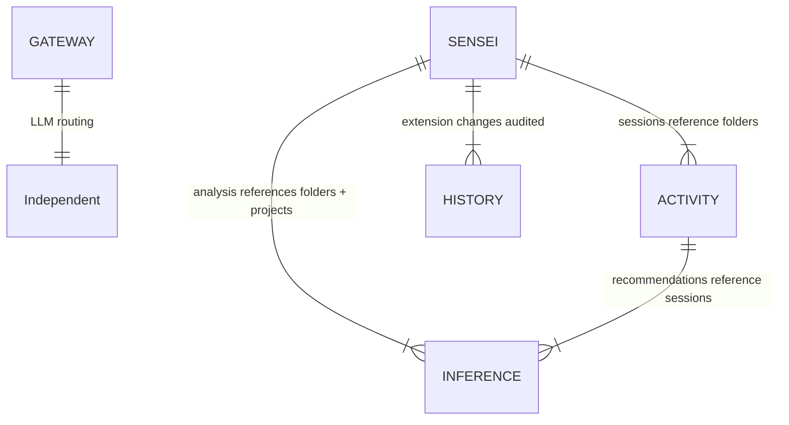

# Database Schema

> Complete schema reference for the sensei PostgreSQL database. 5 schemas, 39 tables.

## Schema overview

```
gateway   (6)  — LLM routing engine (independent library)
sensei    (18) — structural data, config, extensions
inference (10) — derived analysis, insights, recommendations
activity   (4) — session tracking, unified events
history    (1) — audit trail for extensions
staging    (9) — import buffers for seed data
```



---

## gateway (6 tables)

LLM routing engine — providers, models, routers, fallback chains. Designed as an independent library (future: separate repo as subtree).

| Table | Purpose |
|-------|---------|
| `providers` | AI model organizations (Google, Anthropic, OpenAI, Meta, etc.) |
| `models` | Model definitions — capabilities (enum array), context window, memory_gb |
| `routers` | API endpoints — direct (anthropic), aggregator (openrouter), local (ollama) |
| `models_in_router` | Junction: which models available on which router, with pricing |
| `fallback_chains` | Ordered model sequences per capability (reasoning, embed, classify, etc.) |
| `fallback_chain_models` | Chain members with sequence_order and max_retries |

**Key enums:** `model_capability` (chat, reasoning, embed, classify, summarize, vision, audio), `router_type` (direct, aggregator, local)

**Seed data:** 6 providers, 11 models, 3 routers, 11 router bindings, 7 chains, 17 chain entries. Focus on Ollama models with good reasoning + low memory footprint.

---

## sensei (18 tables)

Structural data — what exists on disk, how it's organized, what tools/skills are configured.

### Folder model

| Table | Purpose |
|-------|---------|
| `folders_to_watch` | **Config:** watched root directories + exclusion patterns. Status: scanning → watching → paused |
| `folders` | **Content:** discovered filesystem tree. `folder_kind`: parent, folder, git, subtree. Self-ref `parent_id` for hierarchy |
| `projects` | **Content:** independent grouping entity. `project_maturity`: discovery → active → maintenance → archived. Carries icon, stack, commands, links, guidelines, preferred_acp |
| `tags` | Controlled vocabulary for tag arrays used across tables |

### Code graph

| Table | Purpose |
|-------|---------|
| `nodes` | **Unified node table.** Every structural element: files, code symbols, doc sections, rationale comments. `node_kind`: 16 values. Self-ref `parent_id` for containment hierarchy. Carries `embedding vector(384)` with HNSW index. |
| `edges` | **Typed relationships.** `edge_kind`: calls, implements, extends, imports, depends_on, traces_to, references, covers, rationale_for, duplicates, similar_to. `edge_confidence`: extracted, inferred, ambiguous |

### Libraries

| Table | Purpose |
|-------|---------|
| `libraries` | Known packages and doc sources. `library_kind`: detected, imported. `library_ecosystem`: npm, pypi, cargo, go, docs |
| `library_pages` | Documentation pages/sections per library with `embedding vector(768)` |
| `referenced_libraries` | Junction: which folders use which libraries, with version_used |

### Extensions

| Table | Purpose |
|-------|---------|
| `extensions` | Skills, commands, agents, hooks, plugins. Self-ref `plugin_id`. `extension_kind`, `extension_scope`, `extension_source` enums. Carries `revision` for historize trigger. Content is markdown body, props is parsed frontmatter |
| `services` | External service registry. `service_kind`: data, api, devtool, service, inference. `service_protocol`: mcp, ollama, anthropic, openai |

### Config & other

| Table | Purpose |
|-------|---------|
| `config` | Key-value app settings (setup_complete, active_project, etc.) |
| `workflow_state` | Per-project workflow state (active_phase, active_task, etc.) |
| `scan_state` | Per-file indexing fingerprint (mtime + content_hash) |
| `index_errors` | Files that failed during indexing |
| `memory_items` | Project-scoped persistent knowledge (decisions, patterns, questions). Will be replaced by contextual memory system (idea 30) |
| `benchmark_reports` | Benchmark strategy comparison results |
| `benchmark_runs` | Benchmark execution records (paired A/B runs) |

### Views

| View | Source | Purpose |
|------|--------|---------|
| `repositories` | `folders` where kind in (git, subtree) | Backward-compatible repo surface |
| `parent_folders` | `folders` where kind = parent | Organizational groupings |
| `libraries_in_project` | `referenced_libraries` → `folders` → `libraries` | Unique library set per project |

---

## inference (10 tables)

Derived analysis — patterns, communities, recommendations, reasoning, drift, insights. Everything computed by the intelligence pipeline.

### Analysis

| Table | Purpose |
|-------|---------|
| `detected_patterns` | Patterns + anti-patterns. `pattern_lifecycle`: suggested → gap → rule. `pattern_severity`: low, medium, high. Self-ref `fix_pattern_id` for anti-pattern → constructive fix cross-link |
| `communities` | Leiden algorithm clusters with labels, descriptions, god_node_ids |
| `hyperedges` | Multi-node relationships (3+ nodes). `hyperedge_kind`: flow, group, co_change, addressed_by |
| `hyperedge_members` | Members of a hyperedge with optional position ordering |
| `drift_items` | Doc-to-code traceability drift. `drift_status`: current, drifted, broken |

### Recommendation pipeline

| Table | Purpose |
|-------|---------|
| `recommendations` | Full lifecycle: insight → recommendation → action → measurement. `recommendation_urgency`, `recommendation_status`, `recommendation_verdict` enums. Tracks `baseline_ftr` at `acted_at` timestamp vs `current_ftr` rolling |
| `reasoning_traces` | MOE consensus panel debates — models_used, exchanges, consensus, action_proposed |

### Learning

| Table | Purpose |
|-------|---------|
| `preferences` | Learned coding style preferences. Will be absorbed into contextual memory system (idea 30) |

### Collective intelligence

| Table | Purpose |
|-------|---------|
| `insights` | References to local insights shared with the network. Links to source records via `source_table` + `source_id` |
| `insight_batches` | Send batches with external reference (git commit SHA, PostHog batch ID) |

---

## activity (4 tables)

Session tracking — everything that happens during AI coding sessions.

| Table | Purpose |
|-------|---------|
| `sessions` | Session records. `session_outcome` enum. Carries ftr boolean, corrections, tokens_in/out, duration_ms, module |
| `events` | **Unified activity log.** `event_type` enum (12 values): tool_call, api_request, correction, turn, phase_transition, checkpoint, task_start, task_end, context_loaded, edit, test, error. Payload in `data` jsonb |
| `task_sessions` | Task boundaries within sessions. `task_type_kind`, `task_status` enums |
| `snapshots` | Point-in-time session state for crash recovery. `snapshot_kind`: manual, checkpoint |

---

## history (1 table)

| Table | Purpose |
|-------|---------|
| `past_extensions` | Audit trail for extensions. Auto-populated by `historize_extensions()` trigger on INSERT/UPDATE/DELETE. Tracks `recommendation_id` to link changes to recommendations. `dml_operation` enum |

**Trigger:** `historize_extensions()` — BEFORE INSERT/UPDATE/DELETE on `sensei.extensions`. Bumps revision, closes previous history record, inserts new snapshot.

---

## staging (9 tables)

Import buffers for seed data loading. No PKs, no FKs — natural keys resolved by import procedures.

| Table | Target schema |
|-------|-------------|
| `providers`, `models`, `routers`, `models_in_router`, `fallback_chains`, `fallback_chain_models` | gateway |
| `libraries`, `benchmark_reports`, `events` | sensei / activity |

**Import procedures:** 11 procedures in `database/ddl/procedure/staging/`. Upsert with freshness gate (`modified_at`).

**Seed data:** JSONL files in `database/import/staging/`. Loaded via import procedures.

---

## Enum reference

All check constraints have been converted to proper PostgreSQL enums.

| Enum | Values | Used by |
|------|--------|---------|
| `folder_kind` | parent, folder, git, subtree | folders |
| `watch_status` | scanning, watching, paused | folders_to_watch |
| `project_maturity` | discovery, active, maintenance, archived | projects |
| `node_kind` | file, module, package, class, interface, function, method, property, field, parameter, type, const, enum, enum_variant, section, rationale | nodes |
| `edge_kind` | calls, implements, extends, imports, depends_on, traces_to, references, covers, rationale_for, duplicates, similar_to | edges |
| `edge_confidence` | extracted, inferred, ambiguous | edges, hyperedges |
| `library_kind` | detected, imported | libraries |
| `library_ecosystem` | npm, pypi, cargo, go, docs | libraries |
| `library_source_type` | llms.txt, http, local | libraries, library_pages |
| `extension_kind` | plugin, skill, command, agent, hook | extensions |
| `extension_scope` | global, project, folder | extensions |
| `extension_source` | builtin, marketplace, local | extensions |
| `service_kind` | data, api, devtool, service, inference | services |
| `service_protocol` | mcp, ollama, anthropic, openai | services |
| `model_capability` | chat, reasoning, embed, classify, summarize, vision, audio | models, fallback_chains |
| `router_type` | direct, aggregator, local | routers |
| `auth_type` | api_key, none | routers |
| `pattern_lifecycle` | suggested, gap, rule | detected_patterns |
| `pattern_severity` | low, medium, high | detected_patterns |
| `drift_status` | current, drifted, broken | drift_items |
| `recommendation_urgency` | low, medium, high | recommendations |
| `recommendation_status` | pending, accepted, dismissed, superseded | recommendations |
| `recommendation_verdict` | pending, positive, negative, neutral | recommendations |
| `preference_confidence` | low, medium, high | preferences |
| `hyperedge_kind` | flow, group, co_change, addressed_by | hyperedges |
| `session_outcome` | completed, corrected, blocked, partial, abandoned | sessions |
| `event_type` | tool_call, api_request, correction, turn, phase_transition, checkpoint, task_start, task_end, context_loaded, edit, test, error | events |
| `snapshot_kind` | manual, checkpoint | snapshots |
| `task_type_kind` | feat, fix, refactor, docs, test, chore, unknown | task_sessions |
| `task_status` | in_progress, completed, abandoned | task_sessions |
| `memory_type` | decision, pattern, question | memory_items |
| `memory_status` | open, closed | memory_items |
| `dml_operation` | INSERT, UPDATE, DELETE | past_extensions |

---

## Pending design

| Item | Status | Idea |
|------|--------|------|
| Contextual memory system | Idea documented, data model TBD | [30 — Contextual Memory](../../ideas/30-contextual-memory.md) |
| `memory_items` replacement | Pending memory design | 30 |
| `preferences` absorption into memory | Pending memory design | 30 |
