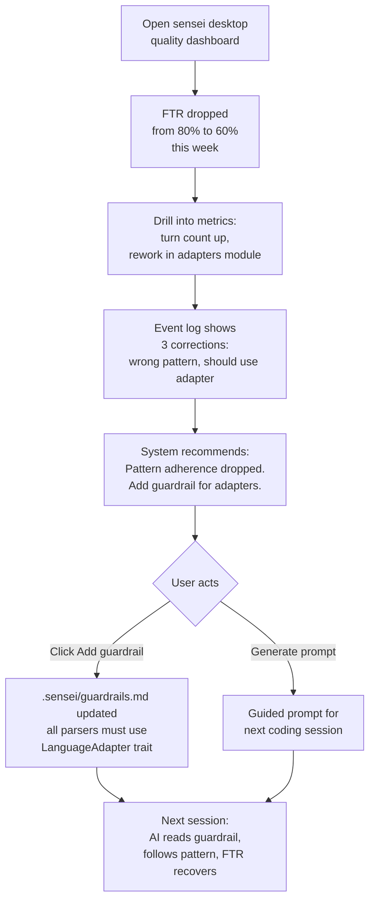
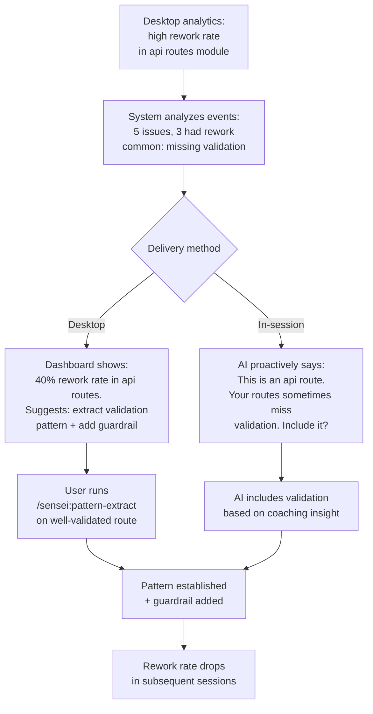

# Sensei

## What is sensei?

Sensei is a **developer intelligence platform** that makes AI-assisted development more efficient, more consistent, and more measurable. It sits between the developer, the AI coding assistant (Claude Code, Cursor, etc.), and the codebase — providing the context, patterns, and guardrails that prevent rework.

---

## Why another tool?

The AI coding space has tools for indexing (Graphify, CocoIndex), memory (MemPalace, Redis LangCache), documentation (Chub), and context delivery. Each solves a slice. None solves the **feedback loop** — the cycle of: understand the code → apply the right patterns → build with discipline → measure quality → learn from mistakes → improve next time.

Sensei is not a better indexer or a better memory store. It's the **connective tissue** between all of these concerns:

- **Indexers** (Graphify, CocoIndex) tell you what's in the code. Sensei tells you what **patterns** the code follows, which ones the AI should use, and flags when it doesn't.
- **Memory tools** (MemPalace, Redis LangCache) persist facts across sessions. Sensei persists **guardrails** — enforceable rules that grow from corrections, not just recalled facts.
- **Doc tools** (Chub) fetch library documentation. Sensei extracts **usage patterns** from those docs — not just "what's the API" but "how should I use this library in this project's style."
- **Context delivery** gives the AI code to read. Sensei gives the AI **the right code at the right depth** — function shape, call graph, pattern membership — so it makes better decisions, not just reads more files.

The quantitative case: without a feedback loop, you can't answer "is my AI-assisted development getting better?" With sensei, you can measure FTR (first-time-right), turn count per task, rework rate, pattern adherence, and see trends over time. You can trace a quality drop to a specific module and generate a guided prompt to fix it.

---

## Key problems we're solving

### 1. The AI starts cold every session

Decisions, patterns, and constraints evaporate between conversations. The AI rebuilds understanding from scratch, makes the same mistakes, ignores established patterns.

- Phase documents survive between sessions — the AI reads, it doesn't need to remember
- Guardrails persist enforceable rules that grow from corrections
- Session state tracks where you left off — phase, task, issue, checkpoint
- The workflow state file (`.sensei/state.yaml`) is the "where am I" that every session reads on start

### 2. No phase discipline

Ideation, design, and implementation blur together. Auto-mode amplifies this — the AI jumps to code before the design is clear, producing throwaway work.

- Workflow commands set intent — `/sensei:brainstorm` for exploration, `/sensei:build` for implementation
- Soft gates nudge when details are insufficient — "should we experiment first?"
- Content finds its natural depth level — a brainstorm can produce ideas, analysis, and design docs in one conversation
- Phase commands are independent tools, not a rigid pipeline — use any command at any time

### 3. The AI reinvents structure

Ignores existing patterns, creates duplicates, doesn't follow conventions. An adapter pattern exists but the AI writes a standalone parser. A task worker pattern exists but the AI writes a monolith.

- The indexer detects design patterns from code structure (adapter, factory, observer, etc.)
- The locate step in `/sensei:build` calls `get_patterns()` before writing code
- Pattern enforcement during `/sensei:review` catches violations after the fact
- Guardrails capture established conventions — "always use adapter pattern for parsers"
- Library-specific patterns (rokkit component conventions), industry patterns (patterns.dev), and architectural options (i18n, SSR data separation) are all surfaced as choices

### 4. No testability guidance

AI writes monolithic functions. TDD is stated but not enforced. Tests written after implementation validate what was built, not what should be built.

- Decomposition step before coding — pure functions + thin orchestrator
- Tests presented to user for approval **before** implementation — the human verifies the right behavior is being tested
- Testability scoring from graph node shape (params, side effects, complexity)
- The function is the unit of testability — its shape determines what can be tested

### 5. Context decays in long conversations

Guardrails, tool awareness, and task focus disappear after compaction. The AI forgets constraints, uses grep instead of MCP, ignores guardrails it was given 50 turns ago.

- PreCompact hook auto-reloads guardrails and state before context compression
- Refocus commands (`/sensei:refocus`, `/sensei:guardrails`, `/sensei:tools`) re-anchor manually
- State file persists across compaction — phase, task, issue survive
- UserPromptSubmit hook tracks turns and detects corrections automatically

### 6. No way to measure quality

FTR, turn count, rework rate are invisible. No feedback loop. Can't tell if development quality is improving or which patterns cause rework.

- Event capture via hooks (automatic, high-frequency) and commands (semantic, intent-driven)
- 16 event types covering tool usage, phase transitions, corrections, pattern checks, file modifications
- Daemon computes metrics: FTR, turn count, rework rate, tool adherence, locate accuracy, pattern adherence
- Desktop dashboard shows trends — drill into a quality drop, find the root cause, generate a guided prompt

### 7. Code intelligence is shallow

The indexer knows symbol names but not function shape, patterns, or relationships. The AI can't detect "this should be an adapter" or "this function has too many dependencies."

- Rich graph nodes: params, return types, implements/extends, docstrings, decorators, visibility
- Hierarchy: solution → repo → package → module → file → class → function → param
- Design pattern detection from structural analysis (not just naming)
- Duplicate and similarity detection via external tools (semgrep, qlty) or AST hashing
- Testability score computable from node shape

### 8. Documentation drifts from code

Design docs go stale. The AI trusts outdated information. Requirements change but docs don't follow.

- Doc nodes store full frontmatter (status, date, origin, description)
- TRACES_TO edges link docs across phases (idea → analysis → blueprint → code)
- Drift detection: when code changes, linked docs are flagged for review
- Freshness scoring: how recently was this doc updated relative to its linked code?
- `/sensei:validate` includes drift check as part of end-to-end verification

---

## User journeys

### Journey 1: Starting a new project

```mermaid
flowchart TD
    A[Install sensei<br/>senseid start] --> B[Open project in Claude Code<br/>session-start hook injects context]
    B --> C[/sensei:brainstorm<br/>AI asks clarifying questions<br/>produces docs/ideas/task-scheduler.md]
    C --> D[/sensei:analyze<br/>AI scans codebase, finds patterns<br/>produces docs/analysis/]
    D --> E[/sensei:blueprint<br/>AI designs architecture<br/>presents options, user picks]
    E --> F[/sensei:plan<br/>Decomposes into GitHub issues<br/>with acceptance criteria]
    F --> G[/sensei:build on first issue<br/>locate → decompose → tests → implement]
    G --> H[Desktop shows:<br/>phase timeline, quality metrics,<br/>pattern coverage]
```

### Journey 2: Daily development workflow

```mermaid
flowchart TD
    A[/sensei:session<br/>loads last checkpoint,<br/>open decisions] --> B[/sensei:status<br/>current phase, active issue,<br/>guardrails loaded]
    B --> C[Pick next issue<br/>or /sensei:build picks<br/>highest priority]
    C --> D[Locate step<br/>search, get_patterns,<br/>get_callers via MCP]
    D --> E[Propose decomposition<br/>pure functions +<br/>orchestrator]
    E --> F[Write tests first<br/>present for user approval]
    F --> G{User approves?}
    G -->|Yes| H[Implement to pass tests]
    G -->|Adjust| F
    H --> I[/sensei:review auto-triggers<br/>patterns, duplicates, quality]
    I --> J[/sensei:commit<br/>zero-errors check<br/>closes issue with reference]
    J --> C
```

### Journey 3: Mid-conversation course correction

```mermaid
flowchart TD
    A[AI implementing feature<br/>going off track] --> B{How detected?}
    B -->|User notices| C[/sensei:refocus<br/>re-reads state, plan,<br/>task, guardrails]
    B -->|Context compacts| D[PreCompact hook fires<br/>saves guardrails + state<br/>auto-refocus]
    C --> E[AI re-anchors:<br/>current task, constraints,<br/>tool preferences]
    D --> E
    E --> F[Continues focused work<br/>on the correct task]
```

### Journey 4: Quality investigation on desktop



### Journey 5: Pattern discovery and enforcement

```mermaid
flowchart TD
    A[Developer notices<br/>AI creating similar files<br/>differently] --> B[/sensei:patterns<br/>shows detected patterns<br/>+ coverage]
    B --> C[4 adapters follow pattern<br/>2 parsers don't conform]
    C --> D[/sensei:pattern-extract<br/>on best adapter implementation]
    D --> E[AI extracts:<br/>interface, invariants,<br/>registration, file structure]
    E --> F[Added to PATTERNS.md]
    F --> G[/sensei:guardrails<br/>all new parsers must<br/>follow adapter pattern]
    G --> H[Next /sensei:build<br/>AI automatically<br/>follows the pattern]
    H --> I[/sensei:review<br/>flags any violation]
```

### Journey 6: Exploring before committing

```mermaid
flowchart TD
    A[Vague idea:<br/>maybe use RxJS for<br/>real-time updates] --> B[/sensei:experiment<br/>creates branch,<br/>builds minimal prototype]
    B --> C[Produces<br/>docs/experiments/rxjs-realtime.md<br/>what worked, what didn't]
    C --> D{User decides}
    D -->|Viable| E[Feed into /sensei:analyze<br/>then blueprint, plan, build]
    D -->|Not viable| F[Branch discarded<br/>findings doc preserved]
    F --> G[Next time RxJS suggested:<br/>experiment doc shows<br/>why polling was chosen]
```

### Journey 7: Guided prompts from analysis



---

## Documentation

| # | Folder | Description |
|---|--------|-------------|
| 1 | [ideas/](./ideas/) | Problem statements, concepts, and early-stage thinking. 20 idea files across 6 core concepts. |
| 2 | [analysis/](./analysis/) | Feasibility assessments and gap analyses. Skills/command mapping, graph node gaps. |
| 3 | [blueprints/](./blueprints/) | High-level architecture. Workflow engine, system architecture. |
| 4 | [experiments/](./experiments/) | Findings from trying options. What worked, what didn't, recommendations. |
| 5 | [plans/](./plans/) | Task breakdowns with acceptance criteria and test scenarios. |
| 6 | [design/](./design/) | Technical design docs organized by system layer — daemon, MCP, marketplace, desktop, platform, CLI, configuration. |
| 7 | [features/](./features/) | User-facing feature specs with Gherkin scenarios. Reference, needs refresh. |
| 8 | [reference/](./reference/) | Historical docs — gap analysis, blocking gaps from prior roadmap. |

## Core concepts

| # | Concept | Ideas | Description |
|---|---------|-------|-------------|
| 1 | **Workflow** | 01–06 | Phased development workflow — commands, configuration, quality gates |
| 2 | **Logging & Qualitative Analysis** | 07, 11 | Interaction tracking, session recovery, coaching feedback |
| 3 | **Metrics & Quantitative Analysis** | 07, 10 | FTR, turn count, rework rate, trend visualization |
| 4 | **Assistive Tooling** | 08, 09, 14, 15, 17, 18, 20 | Code intelligence, library knowledge, patterns, testability, local inference |
| 5 | **Knowledge Integrity** | 13 | Doc traceability, drift detection, freshness |
| 6 | **Platform & Adoption** | 12, 16, 19 | Multi-coordinator, multi-repo, workspaces, benchmarking |

## Decisions log

All design decisions: [ideas/05-decisions.md](./ideas/05-decisions.md) (D1–D17)
