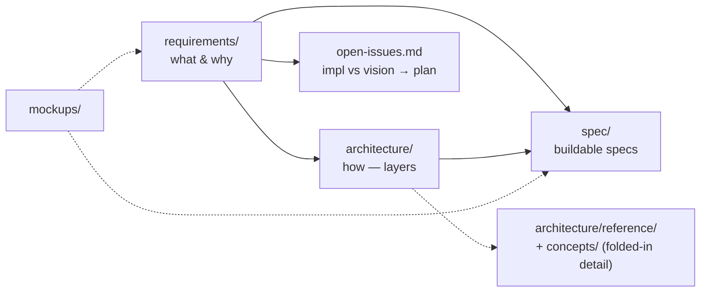

# Sensei documentation

> **Observe. Learn. Improve.** Sensei is the retrospective loop for a pair
> (you + your AI assistant) that otherwise never gets one. North-star: **FTR**
> — first-turn resolution.

## Start here

Read in this order — each layer answers a narrower question:

1. **[`requirements/`](requirements/README.md)** — the **WHAT &amp; WHY**.
   [vision](requirements/vision.md) → [objectives](requirements/objectives.md) →
   [open-issues](plan/README.md) (the living gap-analysis → plan).
2. **[`architecture/`](architecture/README.md)** — the **HOW**, per layer
   (data · daemon · cli · app · mcp · marketplace · dojo · website). Refers back
   to requirements.
3. **[`spec/`](spec/README.md)** — the **buildable contract**: per-screen
   and per-pipeline specs with a five-section "done" definition. The
   source-of-truth for implementation.

Supporting:

| Path | Purpose |
|---|---|
| [`decisions.md`](plan/decisions.md) | Decision log — adopted · **discarded** (don't re-propose) · **deferred** (revisit-when) |
| [`mockups/`](mockups/) | Visual source of truth — HTML mockups, journey maps, design system |
| [`backlog.md`](backlog.md) | GitHub-issue index (the tracked work) |
| [`analysis/`](analysis/) · [`plans/`](plans/) · [`blueprints/`](blueprints/) | Dated working docs (research, plans) |
| [`archive/`](archive/) | Superseded docs kept for history (incl. the old `ideas/` product narrative) |

```mermaid
flowchart LR
    R["requirements/<br/>what &amp; why"] --> A["architecture/<br/>how — layers"]
    R --> S["spec/<br/>buildable specs"]
    A --> S
    M["mockups/"] -.-> R
    M -.-> S
    R --> O["open-issues.md<br/>impl vs vision → plan"]
    A -.-> RF["architecture/reference/<br/>+ concepts/ (folded-in detail)"]
```

## Monorepo structure

| Directory | Language | Purpose |
|---|---|---|
| `app/` | SvelteKit + Tauri | Desktop app (observatory + project window) |
| `crates/` | Rust | `senseid` · `cli` · `mcp` · `bootstrap` · `dojo-mind` · `logger` |
| `console/` | SvelteKit | Dōjō SaaS console (maintainer · admin · lead) |
| `website/` | SvelteKit | Marketing site |
| `database/` | SQL (dbd) | DDL definitions — one DB `sensei`, port 7744 |
| `homebrew/` | Ruby | Homebrew tap (subtree → `sensei-hq/homebrew-tap`) |
| `marketplace/` | Markdown | Skills · commands · plugins · agents (subtree → `sensei-hq/marketplace`) |
| `docs/` | Markdown | This documentation |

> **Sibling repo:** the LLM router is `sensei-hq/gateway`, consumed as the
> `gateway-embedded` git dependency (formerly the in-tree `crates/gateway/`).
