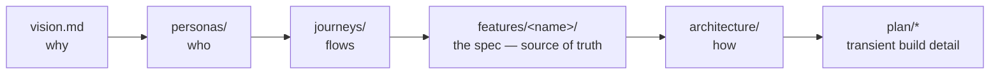

# Sensei documentation

> sensei is the OS for AI-assisted work: it **observes** the pair (you + your AI
> assistant), **learns** from what happens, and helps you **improve**. The
> north-star is **FTR** — first-turn resolution. These docs are organised by
> *stage* (why → who → how → what's built) and each stage names its primary
> audience, so you read only the stages your role needs.

## The stages, and who reads them

A stage is a folder (or a top-level file for the vision tier). Purpose says what
belongs there; audience says who it's written for.

| Folder / file | Purpose | Primary audience |
|---|---|---|
| **`vision.md` + `objectives.md`** | why sensei exists + measurable objectives — top-level files | product owner, all |
| **[`personas/`](personas/)** | who we serve + their goals | PO, designer |
| **[`journeys/`](journeys/README.md)** | end-to-end flows | PO, designer, dev |
| **[`roadmap/`](roadmap/)** | phases, sequencing, status | PO |
| **[`design/`](design/)** | design system + cross-cutting UX | designer, dev |
| **[`mockups/`](mockups/)** | system-wide mockup bundle | designer, dev |
| **[`features/<name>/`](features/README.md)** | the complete per-feature spec — **the source of truth** | PO validates + agent grounds + dev builds |
| **[`architecture/`](architecture/README.md)** | technical "how," per surface | dev, agent |
| **[`spec/`](spec/README.md)** | legacy per-screen build specs (**transitional** — folds into `features/*/design.md` or `architecture/` as touched) | dev |
| **[`plan/*`](plan/README.md)** | dated **transient** build plans | dev/agent |

```mermaid
flowchart LR
    V[vision.md<br/>why] --> P[personas/<br/>who]
    P --> J[journeys/<br/>flows]
    J --> F[features/&lt;name&gt;/<br/>the spec — source of truth]
    F --> A[architecture/<br/>how]
    A --> PL[plan/*<br/>transient build detail]
```

Loose at the top level: this `README.md`, `vision.md`, `objectives.md`,
[`backlog.md`](backlog.md) (the GitHub-issue index — start there for tracked
work), and the [`decisions.md`](decisions.md) log.

### Reading paths

Read only the stages your role needs:

- **Product owner** → `vision.md` + `objectives.md` → `features/<name>/{brief,design}` (validate) → `journeys/`.
- **Designer** → `personas/` → `journeys/` → `mockups/` + `design/` → `features/<name>/mockup-ref.md`.
- **Developer / agent** → `features/<name>/` (the complete truth) → `architecture/` → `plan/*` (current build).

### Source of truth

A feature's truth lives in its `features/<name>/` dossier. `plan/operating-model.md`
is the strategy (why + system); dated `plan/*` docs are transient build detail;
`spec/` is transitional (its content folds into the relevant `features/*/design.md`
or `architecture/` as each screen is next worked). Superseded docs and full
engineering history live in **git history** (`git log --follow`, or
`git show <rev>:docs/…`) — there is no `archive/`.

## Migration policy

The canonical structure above is adopted. Migration is **feature-by-feature,
as each is next touched** — not a one-shot rewrite.

- `requirements/` is fully absorbed: vision + objectives moved to top-level
  `vision.md` / `objectives.md`; `front-door.md` moved to
  `features/front-door/`. The folder is left in place as redirects.
- `spec/` folds into the relevant `features/*/design.md` or `architecture/`
  as each screen is next worked — it is not migrated wholesale.
- Dated `plan/*` docs are transient build detail; they are not migrated, they
  age out.

Nothing is deleted until its content is migrated — history is in git.

## Monorepo structure

| Directory | Language | Purpose |
|---|---|---|
| `app/` | SvelteKit + Tauri | Desktop app (observatory + project window) |
| `crates/` | Rust | `senseid` · `cli` · `mcp` · `bootstrap` · `dojo-protocol` · `logger` |
| `dojo/` | SvelteKit | Dōjō web app — developer · maintainer · admin · lead consoles (SSO-gated) |
| `website/` | SvelteKit | Marketing site |
| `database/` | SQL (dbd) | DDL definitions — one DB `sensei`, port 7744 |
| `homebrew/` | Ruby | Homebrew tap (subtree → `sensei-hq/homebrew-tap`) |
| `marketplace/` | Markdown | Skills · commands · plugins · agents (subtree → `sensei-hq/marketplace`) |
| `docs/` | Markdown | This documentation |

> **Sibling repo:** the LLM router is `sensei-hq/gateway`, consumed as the
> `gateway-embedded` git dependency (formerly the in-tree `crates/gateway/`).
