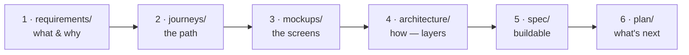

# Sensei documentation

> **Observe. Learn. Improve.** Sensei is the retrospective loop for a pair
> (you + your AI assistant) that otherwise never gets one. North-star: **FTR** —
> first-turn resolution.

## The six folders

A reading flow — each answers a narrower question. Not strictly linear, but this
order works:

```mermaid
flowchart LR
    R[1 · requirements/<br/>what &amp; why] --> J[2 · journeys/<br/>the path]
    J --> M[3 · mockups/<br/>the screens]
    M --> A[4 · architecture/<br/>how — layers]
    A --> S[5 · spec/<br/>buildable]
    S --> P[6 · plan/<br/>what's next]
```

| # | Folder | What's in it |
|---|---|---|
| 1 | **[requirements/](requirements/README.md)** | The **WHAT &amp; WHY** — [vision](requirements/vision.md) (north-star FTR, the core loop, the six themes) → [objectives](requirements/objectives.md) (measurable "met when" per segment + Dōjō). |
| 2 | **[journeys/](journeys/README.md)** | The **visual path** — the [personal](journeys/sensei.md) + [Dōjō](journeys/dojo.md) journeys as Mermaid, distilled from the mockup journey maps. |
| 3 | **[mockups/](mockups/)** | The **screens** — HTML mockups, journey maps, the design system. The visual source of truth. |
| 4 | **[architecture/](architecture/README.md)** | The **HOW** — a layered system view + per-layer docs (data · daemon · cli · app · mcp · marketplace · dojo · website), plus `concepts/` (shared vocabulary) and the enforced `frontend-svelte-guidelines.md`. |
| 5 | **[spec/](spec/README.md)** | The **buildable contract** — per-screen and per-pipeline specs with a five-section "done" definition. The implementation source-of-truth. |
| 6 | **[plan/](plan/README.md)** | **What's next** — the living gap-analysis → phased roadmap ([plan/README](plan/README.md)) and the [decision log](plan/decisions.md) (adopted · **discarded**, don't re-propose · **deferred**, revisit-when). |

Loose at the top level: this `README.md` and [`backlog.md`](backlog.md) (the
GitHub-issue index — start there for tracked work).

> Everything is folded into these six; there is no `archive/`. Superseded docs and
> full engineering history live in **git history** (`git log --follow`, or
> `git show <rev>:docs/…`).

## Monorepo structure

| Directory | Language | Purpose |
|---|---|---|
| `app/` | SvelteKit + Tauri | Desktop app (observatory + project window) |
| `crates/` | Rust | `senseid` · `cli` · `mcp` · `bootstrap` · `dojo-mind` · `logger` |
| `console/` | SvelteKit | Dōjō SaaS console (maintainer · admin · lead) |
| `website/` | SvelteKit | Marketing site |
| `database/` | SQL (dbd) | DDL definitions — one DB `sensei`, port 7744 |
| `homebrew/` | Ruby | Homebrew tap (subtree → `sensei-hq/homebrew-tap`) |
| `marketplace/` | Markdown | Skills · commands · plugins · agents (subtree → `sensei-hq/marketplace`) |
| `docs/` | Markdown | This documentation |

> **Sibling repo:** the LLM router is `sensei-hq/gateway`, consumed as the
> `gateway-embedded` git dependency (formerly the in-tree `crates/gateway/`).
