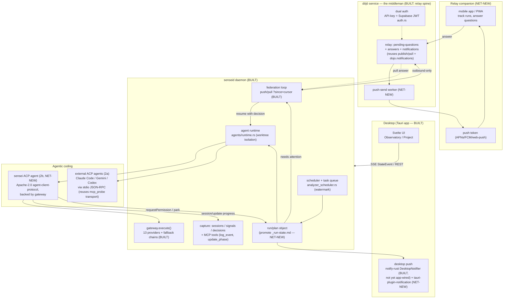

# Zed-embed + relay control-plane — feasibility research

> **Status:** phase-2/3 exploration (Jerry, 2026-07-13, "on the side"). READ-ONLY research.
> No code, nothing to build now. Informs a future phase.
> Anchored in `docs/llm-spec/park/_run-state.md` (PHASE 2/3 RESEARCH note).

## The question

What would it take to **reuse/embed Zed's in-app agentic coding assistant into sensei**, and
how does that serve two phase-2/3 features:

1. **Control plane** — sensei as an agentic-execution planner that maps phases/features/spec
   activity (the autonomous "vacation run" made permanent), with progress + emergent-decision
   capture via the mcp/daemon.
2. **Relay companion** — a mobile app for remote track/interact on multi-day runs. Push on
   desktop **and** mobile when attention is needed or a reply arrived; sensei/dōjō as the
   **middleman** relaying instructions between the user and the LLM. Kills the
   terminal+termius+tailscale setup.

---

## TL;DR (the honest version)

- **Do not embed Zed's agent crate.** Zed's assistant (`agent` + `agent2` crates) is **GPL**
  and welded to GPUI + Zed's editor entity system. Pulling it in would (a) force sensei's
  currently-permissive code to GPL and (b) drag in the whole editor. Non-starter for a product
  that ships a closed desktop app and a SaaS dōjō.
- **The reusable, license-clean piece is the protocol, not the editor.** The **Agent Client
  Protocol (ACP)** and its Rust crate `agent-client-protocol` are **Apache-2.0**, maintained
  independently of Zed. It is JSON-RPC 2.0 over stdio (with a remote HTTP/WebSocket transport
  in RFD). It lets you implement **both** an ACP *client* (drive external agents) and an ACP
  *agent* (be driven).
- **Most viable path = speak ACP, backed by sensei's own gateway.** Two complementary moves:
  - **client mode** — sensei drives existing ACP agents (Claude Code, Gemini CLI, Codex — 50+
    in the registry) as subprocesses, embedding "in-app agentic coding" fast, reusing others'
    agent loops.
  - **agent mode** — sensei implements the ACP `Agent` trait over its own gateway, so a
    sensei-native assistant can be driven by sensei's UI *and* by Zed/other editors. This is
    the durable asset and the one that couples cleanly to the control plane + relay.
- **sensei already owns ~70% of the substrate.** JSON-RPC-over-stdio client, a 13-provider
  gateway with fallback chains, session/transcript/signal capture, a 40-tool MCP surface, a
  task-queue + scheduler that is a working control-plane prototype, a dual-auth multi-tenant
  federation service (dōjō) that is a ready-made relay spine, and daemon-side desktop
  notifications. The **net-new** is concentrated in the **mobile client + push + remote
  transport + an interactive human-in-the-loop question channel**.

---

# Part A — Zed's assistant: what is actually reusable

## A.1 License reality (the deciding factor)

| Component | What it is | License | Embeddable in sensei? |
|---|---|---|---|
| Zed editor (`zed`, `agent`, `agent2`, `acp_thread`, `agent_servers`) | The editor + its native agent loop, ACP wrapper, thread UI, external-agent connectors | **GPL** (editor); server-side collab is **AGPL** | **No.** GPL is copyleft; linking it forces sensei to GPL. Also GPUI-coupled. |
| GPUI (Zed's UI framework) | The UI toolkit under Zed | **Apache-2.0** | Yes legally, but irrelevant — sensei is Tauri + Svelte, not GPUI. |
| **Agent Client Protocol** (`agent-client-protocol` crate, `@agentclientprotocol/sdk`) | The open protocol + reference libs that Zed *speaks* to external agents | **Apache-2.0**, maintained by the independent `agentclientprotocol` org | **Yes.** This is the piece to reuse. |

The important distinction: **Zed's agent loop is GPL; the protocol Zed uses to talk to agents
is Apache-2.0 and lives in a separate org.** The value ("in-app agentic coding, editor-agnostic")
is carried by the *protocol*, which is exactly the part sensei can legally adopt.

`agent`/`agent2` internally separate "core agent loop" (`agent`) from "ACP wrapper" (`agent2`,
which is literally `pub use agent::*` + ACP glue). That separation is real but academic for
sensei — both crates are GPL and both assume GPUI entities, worktree management, and Zed's
file-system tool security model. Reading them as a *design reference* is fine; linking them is not.

## A.2 What ACP gives you

- **Wire:** JSON-RPC 2.0. Local transport = stdio subprocess (how Zed runs Claude Code / Gemini
  CLI today). Remote transport (HTTP + WebSocket) is an active RFD — same lifecycle
  (`initialize → session/new → session/prompt → session/update → close`), an `Acp-Connection-Id`
  binding requests to a connection, cookie-based sticky sessions for load-balanced deploys.
- **Roles:** the crate lets you implement the **`Client`** side (an editor/host that owns the
  thread UI, file access, permission prompts) **and** the **`Agent`** side (responds to prompts,
  runs tools, streams updates, calls the client back for `requestPermission`).
- **Registry:** 50+ agents installable (Claude Code, Gemini CLI, Codex, Copilot, Goose…). A
  sensei ACP *client* inherits that ecosystem for free.

## A.3 The three approaches (and why one wins)

**1. Embed Zed's agent crate.** Reuse Zed's actual agent loop + tool framework.
*Verdict: rejected.* GPL contamination + GPUI coupling + you'd import an editor to get a loop.

**2. Speak ACP (Apache-2.0 crate).** Two sub-modes, not mutually exclusive:
   - **2a — sensei as ACP client.** sensei spawns/streams external ACP agents as subprocesses
     and renders the thread in the Tauri app. Fastest route to "in-app agentic coding": you reuse
     *someone else's* agent loop (Claude Code etc.) and just host the thread + tools + capture.
   - **2b — sensei as ACP agent.** sensei implements the `Agent` trait over its own gateway
     (`state.gateway.execute()`), exposing a sensei-native assistant that its own UI drives —
     and that Zed/Cursor/any ACP client can also drive. This is the piece that unifies the
     control plane (the agent *is* the executor) and the relay (the agent's `requestPermission`
     / `session/update` callbacks are exactly the human-in-the-loop hooks).

**3. Reimplement the agent loop on the gateway (no ACP).** A bespoke loop:
   `gateway.execute()` + MCP tool dispatch + sensei's own event stream.
*Verdict: viable as the fallback / the *inside* of 2b.* Full control, no interop, most surface
to own. Realistically 2b **is** this loop with an ACP-shaped skin — so do the loop once and put
an ACP face on it rather than inventing a private protocol.

### Options table

| Approach | Reuses | Effort | Risk | License viability |
|---|---|---|---|---|
| **1. Embed Zed `agent`/`agent2` crate** | Zed's full agent loop + tool framework | Very high (extract from GPUI, fork, track upstream) | Very high (GPL contamination, editor coupling, upstream churn) | **Blocked** — GPL vs sensei's permissive/closed product |
| **2a. sensei as ACP *client*** (drive external agents) | `agent-client-protocol` (Apache-2.0); the 50-agent registry; others' agent loops; sensei's JSON-RPC-stdio client, Tauri app, MCP tools, capture | Medium | Low–med (protocol still <1.0; you depend on external agent binaries + their auth) | **Clean** (Apache-2.0) |
| **2b. sensei as ACP *agent*** (gateway-backed, driveable by sensei UI + editors) | `agent-client-protocol` (Apache-2.0); sensei gateway, MCP tools, session capture, notifier | Medium–high | Medium (you own the loop + tool-permission model + streaming) | **Clean** (Apache-2.0) |
| **3. Reimplement loop on gateway, no protocol** | sensei gateway + MCP only | High | Medium (no interop, private protocol to maintain) | **Clean** (first-party) |

**Recommendation:** **2b as the strategic core, seeded by 2a for speed.** Ship 2a first to get
agentic coding in-app immediately by hosting existing agents; build 2b as the sensei-native
assistant that the control plane and relay actually plug into. Treat approach 3 as "the insides
of 2b" — one gateway-backed loop, wearing an ACP face.

---

# Part B — what sensei already has to reuse

Grouped by the role each piece would play. All paths absolute-from-repo-root
(`/Users/Jerry/Developer/sensei-hq/sensei/`).

## B.1 Already understands Zed + ACP-shaped transport

| Asset | File:line | Note |
|---|---|---|
| `assistant_family` enum incl. `zed` | `database/ddl/enum/sensei/assistant_family.ddl:3-13` | Harness identity (not provider); `zed` is a first-class value |
| Zed transcript adapter (**capture-only**) | `crates/senseid/src/transcript/zed.rs` (`ZedAdapter`, 48-141) | Reads Zed `threads.db` SQLite, zstd-JSON, both schema versions; synthesizes `UserPromptSubmit`/`PostToolUse`/`Stop`. Read-only — does **not** speak ACP |
| `AcpFamily` enum | `crates/senseid/src/tasks/mcp_discovery.rs:35-46` | `Claude/Zed/Cursor/Codex/OpenCode`; routes config discovery |
| Per-assistant `ToolDiscovery` (`ZedDiscovery`) | `crates/senseid/src/tool_discovery.rs:58-62` | Parses Zed `context_servers` from `~/.config/zed/settings.json` |
| **MCP JSON-RPC-over-stdio client** | `crates/senseid/src/tasks/mcp_probe.rs:53-67` | `probe_tools()` spawns a subprocess, does `initialize → tools/list` over newline-delimited JSON-RPC. **This is the exact transport ACP local mode needs** — the stdio JSON-RPC plumbing already exists |
| Hook-event ingest | `crates/senseid/src/api/handlers/sessions.rs:245-295` | `POST /api/sessions/hook-event` → `activity.assistant_events`; the sink an interactive agent would feed live |

**Reuse insight:** sensei already parses Zed passively and already speaks JSON-RPC over stdio to
MCP servers. Going from "MCP client" to "ACP client/agent" is a protocol *sibling*, not a new
transport stack.

## B.2 The gateway (models already routed)

| Asset | File:line | Note |
|---|---|---|
| Inference API | `crates/senseid/src/api/handlers/gateway.rs` | `/api/gateway/infer` (`state.gateway.execute()`, ~116), `/embed`, `/consensus` (3-model debate) |
| Router + model registry + named chains | `crates/senseid/src/api/gateway_init.rs:238-542` | 13 providers (openai, anthropic, ollama, embedded-llama, openrouter, gemini, bedrock, grok…); named chains incl. **local-only `insight-copy`** |
| API-key storage | `crates/senseid/src/api/gateway_keys/mod.rs:12-76` | macOS Keychain, `com.sensei.gateway.router.<id>` |
| Gateway dependency | `crates/senseid/Cargo.toml:85,88` | `gateway` + `gateway-embedded` = **first-party** git dep `sensei-hq/gateway@01d0ab2` (symlink `../strategos/gateway`) — sensei controls its license |

**Reuse insight:** an ACP *agent* (approach 2b) does not need a new model layer — it backs onto
`gateway.execute()` with existing fallback chains and keys. The agent loop is "gateway + tools",
both of which exist.

## B.3 Progress + decision capture (the control-plane data model)

| Asset | File:line | Note |
|---|---|---|
| Sessions / turns / events DDL | `database/ddl/table/activity/{sessions,transcript_turns,assistant_events,turns}.ddl` | outcome, ftr, corrections, provider/model, summary |
| Transcript ingest | `crates/senseid/src/transcript/mod.rs` | ingest from `.claude` transcripts + Zed |
| Enrich + derive signals | `crates/senseid/src/tasks/handlers/analyze.rs` | `enrich_session` (L0), `derive_signals` (L1, ~300-400) |
| Signals / patterns / corrections / recommendations | `database/ddl/table/inference/{detected_patterns,corrections,recommendations}.ddl`, `database/ddl/table/sensei/tool_insights.ddl` | verdicts, urgency, baseline vs current ftr |
| Decision capture | `database/ddl/table/dojo/decisions.ddl:3-18` | approve/revise/decline, `automated` flag, `distribution_scope`, `maintainer_id` — a **decision-record primitive** already exists |
| Memory lifecycle | `database/ddl/table/sensei/memories.ddl`, `crates/senseid/src/api/handlers/knowledge.rs` | active→reinforced→battle_tested→challenged→rejected/archived |

## B.4 MCP surface (the control-plane API)

| Asset | File:line | Note |
|---|---|---|
| MCP server + 40-tool catalog | `crates/mcp/src/lib.rs` (`handle_list_tools` 275-472, `daemon_request_for` 82-208) | stdio JSON-RPC ↔ daemon HTTP proxy (`crates/mcp/src/main.rs`) |
| MCP proxy into daemon | `crates/senseid/src/api/handlers/mcp.rs`; `crates/senseid/src/api/routes.rs:180-182` | `GET /api/mcp/tools`, `POST /api/mcp/call` |
| Control-plane-shaped tools already present | (in catalog) | `update_phase`, `get_workflow_state`, `log_event` (phase_transition/command_invoked/issue_started…), `propose_memory`/`save_memory`/`promote_memory`, `create_session`/`update_session` |

**Reuse insight:** the "progress + decision capture via mcp/daemon" the control plane needs is
**partly already the MCP tool surface** — `update_phase`, `get_workflow_state`, `log_event`, and
the memory/decision tables. A planner would *drive* these, not invent them.

## B.5 Autonomous-run loop = working control-plane prototype

| Asset | File:line | Note |
|---|---|---|
| Analyzer scheduler | `crates/senseid/src/tasks/analyzer_scheduler.rs:1-200` | tick loop (3600s), daily full-refresh (86400s), **watermark persisted to `sensei.config`** for restart-safe resume |
| Task queue + executor | `crates/senseid/src/tasks/{queue.rs,executor.rs,mod.rs}` | `TaskKind` enum: AnalyzeProject, GenerateRecommendations, MeasureVerdicts, ClassifyPendingVerdicts… |
| Agent runtime + reporting | `crates/senseid/src/agents/runtime.rs`, `report.rs`; `crates/mcp/src/tools/agent_run.rs`; `sensei.agent_runs` table | dispatch focused specialist agents (isolation: in-place / worktree), reports persisted |
| Contribute scheduler | `crates/senseid/src/tasks/contribute_scheduler.rs` | daily/weekly cadence, mirrors analyzer scheduler |
| The live "vacation run" | `docs/llm-spec/EXECUTION-PLAN.md`, `docs/llm-spec/park/_run-state.md` | cron `30218bd9` (`13,43 * * * *`, every 30m) reads `_run-state.md`, no-ops if a subagent is in flight, else advances the next chunk; gate loop `spec-doc-reviewer → implement → done-gate-verifier + wrong-gate-hunter → sensei-persona-reviewer → commit`; **3-try-then-park** with `AWAITS: Jerry` |

**Reuse insight:** the control plane is **not greenfield.** The vacation run is a hand-driven
prototype of exactly it: a plan (`EXECUTION-PLAN.md`), durable state (`_run-state.md`), a loop
driver (cron), gated execution (agents), and a park-decision mechanism. Productising it means
promoting `_run-state.md` from a markdown file into a first-class daemon-managed run object with
MCP tools around it — the scheduler + task-queue + agent-runtime are already the engine.

## B.6 App, transport, notifications, and the relay spine

| Asset | File:line | Note |
|---|---|---|
| Tauri desktop app | `app/src-tauri/`, `app/src/routes/` (`(config)/(health)/(observatory)/(project)`) | plugins configured: **shell, opener, playwright only** — **no notification plugin** (`tauri.conf.json:47-51`, `Cargo.toml:19-27`) |
| **Daemon desktop notifications** | `crates/senseid/src/notifications.rs` (`Notifier` trait, `DesktopNotifier` via `notify-rust`) | wired to the assistant health watchdog (`assistants/watchdog.rs:10`) + instantiated in `api/server.rs:317-318`. **Exists but not surfaced through the app** |
| Daemon→app SSE transport | `crates/senseid/src/api/events.rs`, `handlers/scan_events.rs`; consumed `app/src/lib/repos.svelte.ts:102-125` | `StateEvent` (Add/Update/Remove/Set); `/api/scan/events`, `/api/tasks/progress`; EventSource, 3s reconnect backoff |
| **Federation loop (relay substrate)** | `crates/senseid/src/federation/mod.rs` | `push_promoted` (42), `pull_source` polling `?since={cursor}` (99-102), `run_pull_loop` spawned on daemon start (187); also pulls downstream artifacts into a local inbox (207-216). **Poll-only, webhook-ready** |
| **Dōjō federation service** | `crates/dojo-mind/` (binary `sensei-dojo`), `crates/dojo-protocol/` | embedded Postgres + axum; **dual-auth**: sha256 API-key (`auth.rs:73`) **+ Supabase JWT HS256** (`verify_supabase_jwt` 144, `authenticate_dojo` 246); multi-tenant `provision.rs`; artifact publish/pull with seq cursor; triage/promote engine; **has a `dojo.notifications` table already** (per `_dojo-build-plan.md` state map). MIT-licensed |
| Registry config | `crates/sensei-config/src/lib.rs:15,24` | `dojo_registry_url()` / `SENSEI_DOJO_URL` (default `http://localhost:8787`) |

**Reuse insight for the relay:** the dōjō is a **ready-made middleman.** It is already a
multi-tenant, dual-authenticated HTTP service with a publish/pull spine, a downstream-inbox
pattern, seq-cursor deltas, and a notifications table. A "relay message" (agent asks a question →
user answers) is structurally the same as an artifact flowing through publish → inbox-pull. The
federation `pull_source` loop is the exact pattern a mobile client would use to poll for pending
questions.

---

# Part C — the two phase-2/3 features

## C.1 Control plane (the planner + capture)

**What it is:** promote the vacation run into a product surface — sensei plans a body of work
(phases → features → spec docs), dispatches agentic execution, and captures clear/concise
progress + the decisions the agent parked-or-took.

**Reuse map:**

- *Planner state* → promote `_run-state.md` into a daemon-managed **run object** (plan, current
  slot/gate, watermark). The scheduler (`analyzer_scheduler.rs`) + task queue are the engine;
  the watermark-persist pattern is already there.
- *Executor* → the agent runtime (`agents/runtime.rs`, worktree isolation) + `agent_run` MCP
  tool. In approach 2b, the **ACP agent is the executor** and its `session/update` stream is the
  live progress feed.
- *Progress capture* → `log_event`, `update_phase`, `get_workflow_state` MCP tools + the
  sessions/turns tables already exist; the SSE `StateEvent` stream already ships progress to the
  app.
- *Decision capture* → `dojo.decisions` (approve/revise/decline + `automated` flag) is a decision
  primitive; the "3-try-then-park + AWAITS: Jerry" convention is the emergent-decision model.
  Net-new is a small **decision/park table in the `sensei` scope** (distinct from dōjō governance
  decisions) that records: what was decided, taken-vs-parked, reversible?, who needs to answer.

**Net-new for the control plane:** a run/plan object + its MCP tools; a `sensei`-scope
park/decision table; a planner prompt-chain (decompose spec → phases/features → gates) — sensei
already has `sensei:plan`/`sensei:blueprint` commands to lean on.

## C.2 Relay companion (mobile + push + human-in-the-loop)

**What it is:** a mobile app to track/interact with multi-day runs; push on desktop + mobile when
attention is needed or a reply landed; sensei/dōjō relays instructions between user and LLM.

**The middleman shape (reusing the dōjō):**

```
running agent (ACP agent / vacation run)
      │  parks a question / needs permission  (ACP requestPermission, or a park event)
      ▼
  daemon  ── writes a "pending question" ──►  dōjō service (relay)  ──► push (APNs/FCM) ──► mobile
      ▲                                              │
      │  relays the answer back to the agent ◄── mobile posts the answer ◄── user taps
      ▼
 agent resumes with the human's decision
```

- The daemon already **pushes/pulls** through the federation loop and the dōjō already
  authenticates humans (Supabase JWT) *and* daemons (API-key). A pending-question is a new
  message kind on the **same spine**.
- Desktop push is *half-built*: `DesktopNotifier` (`notify-rust`) exists in the daemon; it just
  isn't surfaced in the Tauri app and doesn't fire on "agent needs you." Wiring the notifier to
  run-state park events + adding `tauri-plugin-notification` closes the desktop side cheaply.

**Net-new for the relay (this is where the real work is):**

1. **Mobile app.** None today — no iOS/Android, no mobile code. Options: a thin native/RN/Flutter
   client, or (cheaper) a mobile-responsive web view of the dōjō relay served as a PWA with web
   push. A PWA reuses the existing web stack and sidesteps app-store + native-push work for v1.
2. **Push infrastructure.** No APNs/FCM, no device registration, no token store. Needs: device
   registration table + endpoint on the dōjō, a push-send worker, provider credentials. (Web-push
   / PWA is the lowest-lift path; native APNs/FCM is the phase-3 upgrade.)
3. **Remote transport.** Today app↔daemon is **localhost-only**. Two routes: (a) expose the daemon
   remotely (tailscale/tunnel — the setup Jerry wants to *kill*), or (b) **route through the
   dōjō** so the daemon stays outbound-only (matches the existing "daemon owns all outbound
   federation calls" model — no inbound holes). **(b) is the strategic answer** and reuses the
   federation posture.
4. **Interactive human-in-the-loop channel.** The vacation run's park is *asynchronous file
   markdown*. The relay needs a live request/response: a pending-question record, a notify, a
   mobile answer, and a resume-the-agent hook. In approach 2b this maps directly onto ACP's
   `requestPermission` / `session/update` callbacks — the agent's own protocol already models
   "ask the human, wait, continue."

---

# Architecture sketch (control plane + relay, reusing what exists)



Legend: **BUILT** = exists today (file:line in Part B); **NET-NEW** = to build.

---

# Already-built vs net-new (the ledger)

## Already built (reuse directly)

- JSON-RPC-over-stdio subprocess client — `crates/senseid/src/tasks/mcp_probe.rs` (ACP local
  transport is the same shape).
- Gateway with 13 providers + fallback chains + Keychain keys — `gateway_init.rs`,
  `handlers/gateway.rs` (backs an ACP agent's loop; first-party licensed).
- Session / transcript / signal / decision capture + 40-tool MCP surface — `transcript/`,
  `tasks/handlers/analyze.rs`, `crates/mcp/src/lib.rs`, inference DDL.
- Scheduler + task queue + agent runtime (worktree isolation) + watermark resume — the
  control-plane engine.
- Vacation-run loop (cron + `_run-state.md` + gate agents + park) — the control-plane prototype.
- Dōjō federation service: dual-auth, multi-tenant, publish/pull + inbox + notifications table —
  the relay spine.
- Daemon desktop notifications (`notify-rust`) — half the desktop-push story.
- Tauri app + SSE StateEvent stream — the desktop client + live progress transport.
- Zed comprehension: `assistant_family`/`AcpFamily` enums, Zed transcript adapter, per-assistant
  tool discovery.

## Net-new (build)

- **ACP integration (Apache-2.0 crate):** client mode (2a) to host external agents; agent mode
  (2b) backing sensei's gateway. Includes a tool-permission model + streaming glue.
- **Control-plane run object:** promote `_run-state.md` → daemon-managed plan/run with MCP tools;
  a `sensei`-scope park/decision table (taken-vs-parked, reversible?, who-answers).
- **Mobile app / PWA** (none today).
- **Push infrastructure:** device-registration + token store on the dōjō, push-send worker,
  APNs/FCM (or web-push for v1 PWA).
- **Remote transport via the dōjō relay:** a pending-question/answer message kind on the existing
  spine, keeping the daemon outbound-only.
- **Interactive human-in-the-loop channel:** live ask→notify→answer→resume (maps to ACP
  `requestPermission` in 2b).
- **Desktop push wiring:** `tauri-plugin-notification` + fire `DesktopNotifier` on park/attention
  events.

---

# Phasing, effort, risk

## Phase 2 (foundation — mostly reuse, license-clean, local-first)

| Work | Reuses | Effort | Risk |
|---|---|---|---|
| **Adopt ACP as a client (2a)** — host one external agent (e.g. Claude Code) in-app | `mcp_probe` stdio transport, Tauri app, MCP tools, capture | M | Low–med (protocol <1.0; external binary + its auth) |
| **Promote the vacation run to a control-plane run object** + MCP tools + `sensei` park/decision table | scheduler, task queue, agent runtime, `_run-state.md` semantics | M | Low (engine exists) |
| **Wire desktop push** (`tauri-plugin-notification` + `DesktopNotifier` on attention events) | `notifications.rs`, SSE stream | S | Low |
| **Design the dōjō relay message kind** (pending-question/answer) on the existing spine | federation loop, dōjō dual-auth, notifications table | M | Med (protocol + auth-scoping design) |

Phase-2 outcome: agentic coding in-app (hosting an existing agent), the control plane as a real
run object with progress + park/decision capture, desktop push, and a relay design ready to carry
mobile — all local-first and license-clean.

## Phase 3 (the sensei-native assistant + the mobile companion)

| Work | Reuses | Effort | Risk |
|---|---|---|---|
| **sensei as an ACP agent (2b)** — gateway-backed loop, driveable by sensei UI + editors | gateway, MCP tools, capture, ACP crate | M–H | Med (own the loop, tool-permission, streaming) |
| **Mobile companion (PWA first, native later)** | dōjō relay, web stack | H | Med–high (net-new client) |
| **Push infra (web-push → APNs/FCM) + device registration** | dōjō service, federation posture | M–H | Med (creds, delivery reliability) |
| **Interactive HITL over the relay** (ask→push→answer→resume) | ACP `requestPermission`, dōjō relay, run object | M | Med (correctness of resume + auth) |
| **Remote reach fully through the dōjō** (retire tailscale/termius) | dōjō, outbound-only daemon | M | Med (NAT/latency, session continuity) |

Phase-3 outcome: a sensei-native assistant that the control plane drives and that editors can
also drive; a mobile companion that relays instructions to a multi-day run through the dōjō, with
push on both ends — the terminal+termius+tailscale setup retired.

---

# Open questions / decisions for Jerry

1. **ACP client vs agent first?** Recommendation: 2a (client, host an external agent) for speed
   in phase 2, 2b (sensei-native agent) as the phase-3 strategic core. Confirm the ordering, or
   go straight to 2b if the sensei-native assistant is the point and hosting others is a
   distraction.
2. **Relay through the dōjō vs expose the daemon?** Recommendation: route through the dōjō
   (daemon stays outbound-only, matches today's federation posture, retires tailscale). Confirm —
   this is the load-bearing architectural call for the relay.
3. **Mobile: PWA vs native?** PWA + web-push is far cheaper for v1 and reuses the web stack;
   native APNs/FCM is a phase-3 upgrade. Acceptable to start PWA?
4. **Decision capture scope:** `dojo.decisions` is org-governance; the control plane's
   park/taken decisions are *personal run state*. Confirm a separate `sensei`-scope
   park/decision table (don't overload dōjō governance).
5. **ACP maturity risk:** the protocol is pre-1.0 and the remote (HTTP/WS) transport is still an
   RFD. Acceptable to build on it now (local stdio is stable; remote can lag), or wait?
6. **Where does the agent run for a multi-day mobile run?** On the desktop daemon (laptop must
   stay awake/reachable) or a hosted runner? This decides whether "remote" means "reach my
   laptop through the dōjō" or "the dōjō hosts the run." Big scope fork — likely phase-3+.
7. **Gateway keys on multi-day unattended runs:** keys live in the desktop Keychain
   (`gateway_keys`). A hosted runner would need a key-custody model. Defer unless Q6 picks hosted.

---

## Sources (Zed / ACP web research)

- Zed — Agent Client Protocol: https://zed.dev/acp
- External Agents | Zed: https://zed.dev/docs/ai/external-agents
- The ACP Registry is Live — Zed's Blog: https://zed.dev/blog/acp-registry
- Zed is now open source (license structure — GPL editor, AGPL server, GPUI Apache-2.0): https://zed.dev/blog/zed-is-now-open-source
- zed/LICENSE-GPL: https://github.com/zed-industries/zed/blob/main/LICENSE-GPL
- agent-client-protocol crate (Apache-2.0): https://crates.io/crates/agent-client-protocol
- agent-client-protocol repo: https://github.com/agentclientprotocol/agent-client-protocol
- ACP Streamable HTTP & WebSocket Transport RFD: https://agentclientprotocol.com/rfds/streamable-http-websocket-transport
- Deep dive: Zed's agent2 wraps agent for ACP: https://www.advanced-eschatonics.com/journal/2025/oct/oct18
- ACP protocol & connection (DeepWiki): https://deepwiki.com/zed-industries/zed/8.2-acp-protocol-and-connection
