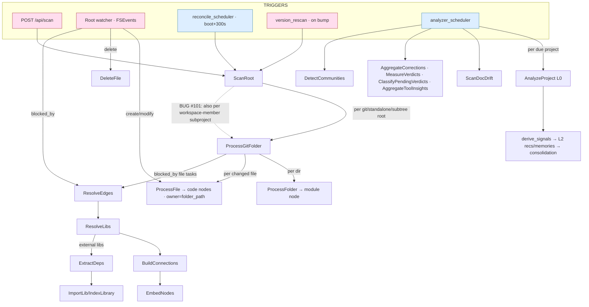

# Indexing task system — audit + gap map (2026-07-14)

> Maps the full task system (triggers → cascade → post-processing), the three
> indexing modes (full / incremental / watcher), and the gaps. Drives the
> one-task-one-owner refactor for #101 (double-index) + #29 / #62.

## 1. The task system (26 kinds)

`TaskKind` (`tasks/mod.rs:33`), dispatched in `tasks/executor.rs:84`. Grouped:

| Group | Kinds |
|---|---|
| **Discover** | `ScanRoot` |
| **Index (walk/owner)** | `ProcessGitFolder`, `ProcessFolder`, `ProcessFile` |
| **Delete** | `DeleteFile`, `DeleteFolder` |
| **Post-process (barriers)** | `ResolveEdges`, `ResolveLibs`, `BuildConnections`, `ReconcileConnections`, `EmbedNodes`, `ExtractDeps`, `DetectCommunities` |
| **Libraries** | `ImportLib`, `IndexLibrary`, `IndexLibraryPage` |
| **Branch/identity** | `BranchSwitch`, `ReconcileIdentity` |
| **Analyzer (scheduled)** | `AnalyzeProject`, `ScanDocDrift`, `AggregateCorrections`, `AggregateToolInsights`, `ClassifyPendingVerdicts`, `MeasureVerdicts` |
| **Transcripts** | `BackfillTranscripts`, `BackfillTranscriptFile` |

Every task runs under a per-kind watchdog (`watchdog_timeout`, mod.rs:126) — a
hung task is abandoned, the worker freed, work retried/backfilled.

## 2. Triggers — scheduled vs event-driven

| Trigger | Kind | Cadence / event | Enqueues |
|---|---|---|---|
| `POST /api/scan`, root add | event | user | `ScanRoot` |
| **Root watcher** (FSEvents) | event | file create/modify/delete | `ProcessFile` / `DeleteFile` → `ResolveEdges` |
| **reconcile_scheduler** | scheduled | boot + 300s | `ScanRoot` (mtime-gated re-walk) |
| **version_rescan** | event | daemon version bump | `ScanRoot` (full) |
| **analyzer_scheduler** | scheduled | interval + daily refresh | per-project `AnalyzeProject`+`ScanDocDrift`; global `AggregateCorrections`,`MeasureVerdicts`,`ClassifyPendingVerdicts`,`AggregateToolInsights`; `DetectCommunities` |
| log/activity pruner, contribute, mcp_discovery, index_audit | scheduled | interval | self-contained (no graph tasks) |

## 3. The cascade

- **`ProcessFile` is the sole intended indexer** (`process.rs:666`): parses one
  file, upserts code nodes with `folder_id` = `get_repo_by_path(task.folder_path)`
  (process.rs:683), records `scan_state` (mtime,hash) at process.rs:828.
- **`ProcessFolder`** makes only a `module` node (process.rs:655) — no file index.
- **Barrier chain** enqueued at process.rs:363–384, each `blocked_by` the file tasks.
- **Dedup** (`get_duplicates`) is **on-demand** (MCP/API), not a task; `index_audit`
  flags `duplicate_name_phantoms` (index_audit.rs:238) as a consistency check.

## 4. The three modes

- **Full** (`ScanRoot` → `ProcessGitFolder`): walk (`build_walker`, process.rs:196)
  enumerates dirs+files, enqueues `ProcessFolder`+`ProcessFile` per changed, then the
  barrier chain. scan_state empty → everything is "changed" → full index.
- **Incremental** (re-`ScanRoot` via reconcile/version, or `ProcessGitFolder` resume):
  loads prior `scan_state` (process.rs:183), two-tier gate (`plan_reindex`: mtime pass
  → re-hash drifted) → only `plan.changed` → `ProcessFile`; `plan.removed` → delete
  nodes+scan_state; `plan.touched` → refresh mtime only.
- **Watcher** (`root_watcher::process_batch`, root_watcher.rs:438): FSEvents batch →
  `ProcessFile` (create/modify) / `DeleteFile` (delete) → one `ResolveEdges` barrier.

## 5. Gaps + issues

1. **★ DOUBLE-INDEX (#101), CONFIRMED CURRENT.** A workspace repo's members
   (`crates/*`) are indexed by BOTH the top git-root's `ProcessGitFolder` (repo-relative
   paths, owner=git-root) AND their own `ProcessGitFolder`/index (crate-relative paths,
   owner=`crates/senseid` folder). Proof: `extract_deps` has 2 nodes under 2 folder_ids
   indexed **1s apart in the same scan** (git 21:11:34 / folder 21:11:33, both today); the
   `crates/senseid` `folder`-kind row holds 1078 fns/666 methods/286 classes (full code,
   not modules). Globally: `git` folders 508k nodes vs `folder`-kind 52k (the dup, concentrated
   in monorepos). **Also doubles `scan_state`** (2 fingerprint rows per file). Violates
   one-task-one-owner: a file must have exactly one owning folder. FIRST refactor step: pin
   the exact enqueue site (subproject/workspace-member detection promoting members to indexed
   roots while the parent also walks them) — likely `scan_logic::find_subprojects_walk` +
   `scan.rs` classification enqueuing `ProcessGitFolder` for members.
2. **Incremental post-processing is partial.** The watcher enqueues only `ResolveEdges`
   after a file change — NOT `BuildConnections` / `EmbedNodes` / `DetectCommunities`. So
   cross-folder edges, embeddings, and communities go stale between full scans. Consistency gap.
3. **Watcher ↔ reconcile overlap.** A change can be enqueued by both the watcher and a
   reconcile `ScanRoot`. Node writes are gated by scan_state (no dup write), but the
   `ResolveEdges` barrier can run redundantly. Minor; the reconcile overlap-guard
   (`has_pending_kind(ScanRoot)`) helps but doesn't cover watcher-vs-reconcile.
4. **Barrier runs on partial input under watchdog abandon.** If a `ProcessFile` is abandoned
   (watchdog), its `blocked_by` barrier still fires with incomplete nodes → transient
   inconsistency until the next reconcile re-indexes. Acceptable if reconcile always converges.
5. **`scan_state` keyed by (folder_id, file_path).** Correct for one-owner, but under the
   #101 dup it stores two rows per physical file — so the incremental gate is per-owner, and
   the fix must also collapse scan_state to one owner.

## 6. Refactor direction (one task, one owner)

**Invariant:** every physical file is owned by exactly one folder (the nearest project
root) and indexed by exactly one `ProcessFile`. Folder processors *identify + enqueue*
only; `ProcessFile` is the sole indexer; delete/add/modify = one enqueue-by-path.

- **Pin + fix the double-owner:** either (A) the top git-root walk STOPS at member/subproject
  boundaries (members own their files), or (B) members are NOT separately indexed inside an
  already-indexed root (root owns all; members are `folder`-kind structure only). (A) matches
  "nearest root owns"; (B) is the smaller change. Decide per the monorepo UX (do we want
  per-crate project rollups? → (A)).
- **Make incremental post-processing complete:** after a watcher/incremental batch, enqueue
  the same barrier chain (Resolve→Build→Embed, and Communities on a debounce), not just
  ResolveEdges — so incremental stays consistent with full.
- **Verification (mandatory, over the live index):** full rescan → assert `extract_deps`→1,
  sensei fn count ≈ halves, zero `folder`-kind rows carry code nodes (only modules), one
  scan_state row per physical file; then an incremental edit (add/modify/delete one file) →
  assert exactly one ProcessFile + a converged graph; then a watcher event → same. Robust +
  auto-recoverable: kill mid-scan → reconcile boot-run converges to the same state.

## 7. Refactor plan — decision (B) + TDD strategy

**DECISION (Jerry, 2026-07-14): one repo = one project = one owner.** Crates and
packages are structural **members with a kind/role** (`library`/`tool`/`website`),
NOT separate index owners. The folder hierarchy is structural; the repo (git-root)
owns and indexes every file exactly once. Genuine nested **git subtrees** (their own
`.git`) remain separate repos/owners — a subtree ≠ a workspace member.

Candidate bug sites (to confirm via the failing test, not by eye):
- `process.rs:416` enqueues `ProcessGitFolder` per detected "subtree" — if workspace
  members (no own `.git`) are caught by that subtree detection, each self-indexes
  (member-relative paths, owner=member) while the git-root also indexes them.
- The git-root `build_walker` (process.rs:196) may not exclude member/subtree dirs,
  so it indexes them too → the second owner.
- `process.rs:589` (member role classification) is CORRECT already — structural
  `upsert_subfolder` + `update_folder_role`, no re-index. Keep it.

### TDD strategy — lock the ENQUEUE GRAPH + TRIGGERS so #101 can't recur

Tests assert *what gets enqueued* (task kind + folder_path/owner per trigger), not
just the final DB — a future change that re-promotes a member fails a test.

1. **Reproduction/regression (monorepo fixture).** Build a temp git repo with
   `Cargo.toml [workspace] members=["crates/*"]` + `crates/a/src/lib.rs` (a real fn).
   Run the scan (scan_root → process_git_folder) against a test TaskQueue. Assert the
   enqueue graph:
   - exactly ONE `ProcessGitFolder` (the repo root) — none for `crates/a`;
   - `crates/a` becomes a `folder`-kind row WITH a role, NO member-owned `ProcessFile`;
   - every `ProcessFile.folder_path` == repo root; every code node's `folder_id` == the
     repo-root folder; `crates/a/src/lib.rs` indexed exactly once (repo-relative path).
   This FAILS today (reproduces #101) → pins the exact site → PASSES post-fix → guards recurrence.
2. **Subtree-vs-member distinction.** A nested dir WITH its own `.git` → its own
   repo + `ProcessGitFolder` (kept). A workspace member WITHOUT `.git` → structural only.
3. **Trigger tests (one-owner per entry):**
   - `scan_root`: enqueues one `ProcessGitFolder` per real root (repo/standalone/subtree), none per member.
   - watcher `process_batch`: a change under `crates/a` → one `ProcessFile` owned by the repo (not the member).
   - `reconcile_tick`: re-scan of the monorepo enqueues no member-owned indexing.
   - incremental `process_git_folder` resume: `scan_state` diff → one `ProcessFile` per changed file, one owner.
4. **DB-invariant guard (post-scan):** no `folder`-kind row carries code nodes (module nodes only);
   exactly one `scan_state` row per physical file.

### Fix → verify sequence
Write tests 1–4 (red) → gate the member promotion so only genuine `.git` subtrees become
owners; ensure the git-root walk owns member files once → tests green → then a **supervised
live rescan** of `~/Developer/sensei-hq/sensei`: assert `extract_deps`→1 node, sensei fn
count ≈ halves, zero `folder`-kind code nodes, one `scan_state` per file; then edit one file
(add/modify/delete) → one `ProcessFile` + converged graph; then a watcher event → same; then
kill mid-scan → reconcile boot converges identically (robust/auto-recoverable/consistent).

## Related
- #101 (double-index), #29 (subfolders auto-promoted), #62 (multi-folder repo misclassified).
- [[reference_scan_reconcile_ops]] · [[project_stale_folder_reconcile]] · [[project_incremental_indexing]].
