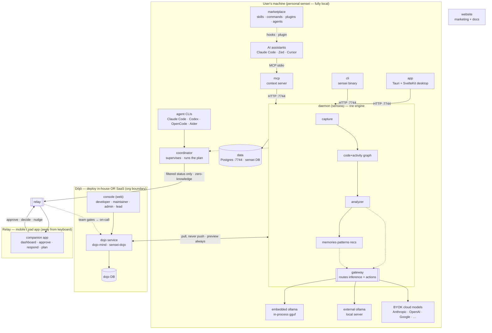

# Architecture

> **The HOW — at a design level.** How the layers realise the
> [requirements](../requirements/README.md). Start with this high-level view,
> then read the per-layer doc for the part you're changing. Buildable
> per-screen/per-pipeline contracts live in [`../spec/`](../spec/README.md);
> this folder owns component boundaries, data flow, and the rationale behind them.

Every layer doc opens by naming the [objectives](../requirements/objectives.md)
it serves, then describes structure and flow. Where a design decision pushes
against a [vision theme](../requirements/vision.md#the-six-non-negotiable-themes),
it says so.

## The system at a glance

**Ecosystem components.** On the developer's machine: the **desktop app**, **cli**,
**mcp**, and **daemon** (+ its **Postgres DB**), plus the **coordinator** that
supervises agent CLIs. The **gateway** routes inference + actions to **embedded
ollama**, an **external ollama**, or **BYOK cloud models** (Anthropic · OpenAI ·
Google · …). The coordinator publishes filtered status through the **zero-knowledge
relay** to the **mobile / pad Relay app**. The **Dōjō** (service + web console)
runs **in-house or as SaaS**; the daemon reaches it pull-only, preview-always. The
**website** is the public front door.

## The layers

Each links to its detailed design. The order is data-up (foundation first).

| Layer | Doc | Owns | Serves objectives |
|---|---|---|---|
| **data** | [`data.md`](data.md) | DDL schema, the code+activity+inference+dojo models, DB conventions (dbd, port 7744) | all (the substrate) |
| **daemon** | [`daemon.md`](daemon.md) | `senseid` — task system, capture, scan, analyzer, the pipelines | B*, O*, P*, the core loop |
| **cli** | [`cli.md`](cli.md) | `sensei` binary — commands, config merge, hook script | B3, O4 |
| **app** | [`app.md`](app.md) | Tauri sidecar + SvelteKit UI (24-token rokkit, state layers) | F1–F3, O*, P* |
| **mcp** | [`mcp.md`](mcp.md) | context server — the tools an assistant calls mid-task | the core loop's *deliver* step |
| **marketplace** | [`marketplace.md`](marketplace.md) | skills · commands · plugins · agents (hooks, phase chains, mindsets) | capture + delivery into the assistant |
| **dojo** | [`dojo.md`](dojo.md) | the SaaS console + `dojo-mind` service — memberships, contribute/triage/distribute, anonymization | DJ1–DJ5, theme 5 |
| **relay** | [`relay.md`](relay.md) | coordinator (supervise agent CLIs + run the plan) · zero-knowledge relay · mobile companion · the modular planner | R1–R8 |
| **website** | [`website.md`](website.md) | marketing site + docs surface | adoption |

## Cross-cutting concerns

- [`concepts/`](concepts/) — vocabulary the layers share: mindsets, personas,
  agents, governance.
- **Gateway** is an in-process LLM router consumed by the daemon as the
  `gateway-embedded` git dependency (sibling repo `sensei-hq/gateway`); it is no
  longer an in-tree crate. See [`daemon.md`](daemon.md#gateway).
- **Single mode.** One binary, one DB, port **7744** — no dev/prod split.

## Read next

- Foundation: [`data.md`](data.md) → [`daemon.md`](daemon.md).
- Where the gaps are: [the plan](../plan/README.md).
