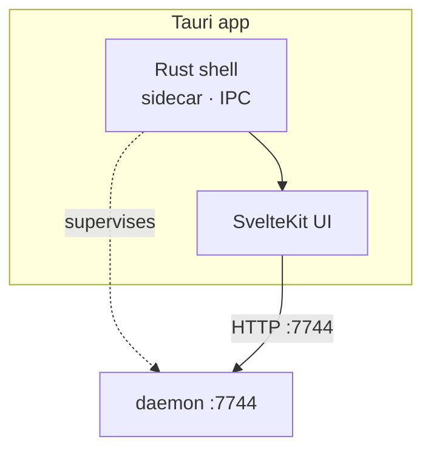

# Layer · app

> **Serves:** the first-run (F1–F3), Observatory (O*), and project-window (P*)
> objectives — the surface where the user meets their own knowledge.

## What it is

`app/` — a **Tauri** desktop shell (native window + sidecar lifecycle) wrapping a
**SvelteKit** UI. The Rust sidecar supervises the daemon; the UI talks to the
daemon over HTTP :7744 (and Tauri IPC for native concerns). It runs as a bundled
`.app`, not bare Vite — the UI depends on Tauri IPC.

## UI conventions (non-negotiable)

- **Rokkit, 24 named tokens only.** Style with rokkit named-token utilities
  (`bg-paper`/`text-ink`/`bg-primary`…) — never hand-rolled CSS vars or `zs-*`.
  Map accents to roles.
- **State layers.** Pure logic in `*.ts`, reactive state in `*.svelte.ts`,
  presentation in `*.svelte`; each with spec tests. Svelte 5.
- **Mockup fidelity.** Build to the mockup; read `docs/mockups/Sensei/MOCKUP-INDEX.md`
  first (many superseded variants). Inline literal OKLCH from the mockup tokens.
- **Theme adherence.** One-decision-one-default verb set (Apply·Review·Dismiss);
  value-before-setup (projects first, not a wizard); insight strings come from
  the model, action labels stay deterministic.

## Structure

Routes cluster by segment: `(observatory)/*` (today, projects, sessions,
learnings, instruments, libraries, impact, traceability, upgrades, dojo,
settings), `(project)/project/[id]/*` (overview, sessions, memories, patterns,
libraries, impact, traceability, about, instruments), `(config)/setup/*`
(first-run scan), `(health)/*` (logs). Name-or-UUID resolves everywhere.

## State

**25 screens shipped**, essentially completing Observatory + the project window.
The gaps are *upstream* — thin/empty data (memory promotion, doc-drift noise,
insight-copy not wired on some screens), not missing UI. Not-built surfaces:
Solution segment, Bootstrap splash, consolidation, insights-reasoning drawer
(Phase 3). See [`../requirements/open-issues.md`](../requirements/open-issues.md).

## Source detail

Sidecar lifecycle + 3-layer state rationale in
[`reference/01-app.md`](reference/01-app.md); UI rules in
[`reference/frontend-svelte-guidelines.md`](reference/frontend-svelte-guidelines.md)
(kept as the enforced house style).
