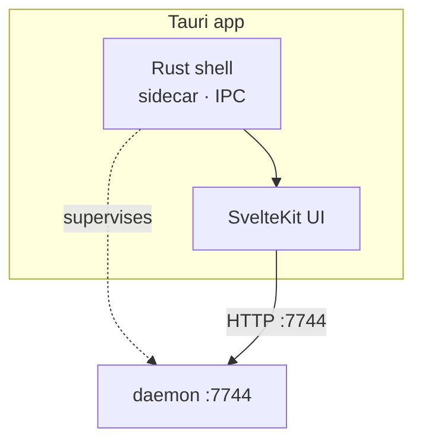

# Layer · app

> **Serves:** the first-run (F1–F3), Observatory (O*), and project-window (P*)
> objectives — the surface where the user meets their own knowledge.

## What it is

`app/` — a **Tauri** desktop shell (native window + sidecar lifecycle) wrapping a
**SvelteKit** UI. The Rust sidecar supervises the daemon; the UI talks to the
daemon over HTTP :7744 (and Tauri IPC for native concerns). It runs as a bundled
`.app`, not bare Vite — the UI depends on Tauri IPC.

## UI conventions (non-negotiable)

- **Rokkit, 24 named tokens only.** Style with rokkit named-token utilities
  (`bg-paper`/`text-ink`/`bg-primary`…) — never hand-rolled CSS vars or `zs-*`.
  Map accents to roles.
- **State layers.** Pure logic in `*.ts`, reactive state in `*.svelte.ts`,
  presentation in `*.svelte`; each with spec tests. Svelte 5.
- **Mockup fidelity.** Build to the mockup; read `docs/mockups/Sensei/MOCKUP-INDEX.md`
  first (many superseded variants). Inline literal OKLCH from the mockup tokens.
- **Theme adherence.** One-decision-one-default verb set (Apply·Review·Dismiss);
  value-before-setup (projects first, not a wizard); insight strings come from
  the model, action labels stay deterministic.

## Structure

Routes cluster by segment: `(observatory)/*` (today, projects, sessions,
learnings, instruments, libraries, impact, traceability, upgrades, dojo,
settings), `(project)/project/[id]/*` (overview, sessions, memories, patterns,
libraries, impact, traceability, about, instruments), `(config)/setup/*`
(first-run scan), `(health)/*` (logs). Name-or-UUID resolves everywhere.

## State

**25 screens shipped**, essentially completing Observatory + the project window.
The gaps are *upstream* — thin/empty data (memory promotion, doc-drift noise,
narration-cache not wired on some screens), not missing UI. Not-built surfaces:
Solution segment, Bootstrap splash, consolidation, insights-reasoning drawer
(Phase 3). See [`../requirements/open-issues.md`](../plan/README.md).

## Design rationale

- **Sidecar owns the daemon lifecycle.** On launch the shell probes `GET /health`;
  if unreachable it runs bootstrap then starts services, polling up to 30s at
  500ms. On a daemon crash mid-use the app **falls back to the health screen and
  restarts the daemon** — never an error modal. The daemon does *not*
  self-daemonize (the sidecar owns start/stop/health/restart).
- **IPC vs HTTP boundary:** Tauri `invoke` is used **only during bootstrap**
  (daemon not up yet → in-process `sensei-bootstrap` crate); after bootstrap all
  data flows over daemon HTTP `/api/*`. The health screen is the transition point.
- **Bootstrap is a parallel gate system** — all prerequisite checks run
  concurrently with **isolated per-component resolvers**, so one failed prereq
  doesn't block the others.
- **Why the 3-layer state split:** components render only, `*.svelte.ts` owns all
  derivations + explicit transitions (no side effects), API functions are pure.
  SSE always flows through an `EventManager<T>` (owns subscription, parses,
  auto-reconnects ~3s) — never a raw `EventSource` in a component. Progress events
  are throttled (~300ms flush) and the flush must **skip any key already in a
  terminal state**, or a stale 99% overwrites `completed`.
- **`PlatformProvider` trait** fronts Homebrew (mac) / winget·apt (Win/Linux);
  only `MacOSProvider` is implemented — the trait exists so mac code never
  hardcodes `brew`.

UI rules (24 named tokens, state layers, mockup fidelity, voice) are the enforced
house style: [`frontend-svelte-guidelines.md`](frontend-svelte-guidelines.md).
