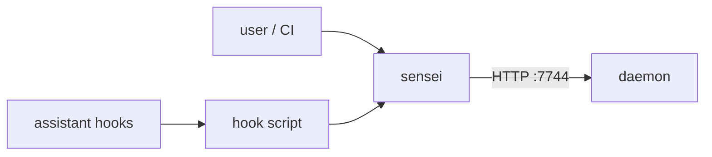

# Layer · cli

> **Serves:** control + safety objectives (B3, O4) — the scriptable, headless way
> to drive sensei and to wire it into the assistant.

## What it is

`crates/cli` — the `sensei` binary. A thin client of the daemon's HTTP API plus
the local config/hook plumbing. Where the [app](app.md) is the visual surface,
the CLI is the automatable one (CI, scripts, power users).

## Responsibilities

- **Commands** over the daemon — scan roots, project queries, status, and the
  operational verbs. `sensei scan <PATH>` forces a full reconcile past the
  watermark.
- **Config merge** — reconciles user + project config without clobbering
  hand-edits (JSONC comment-preservation is a known rough edge, #51).
- **Hook script** — the capture entry point installed into the assistant
  (Claude Code hooks etc.); forwards hook events to the daemon `/hook/event`,
  feeding [capture](daemon.md#the-pipelines-the-learning-half-of-the-loop).

## Conventions

- **Don't guess commands.** Test/build/lint scripts come from the manifest, not
  assumption; the daemon's `get_commands` is the eventual source of truth.
- Flag naming stays consistent with sibling commands (UX theme 2).

## Source detail

Command list + config-merge + hook-script design in
[`../design/05-cli.md`](../design/05-cli.md).
