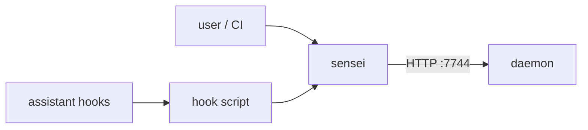

# Layer · cli

> **Serves:** control + safety objectives (B3, O4) — the scriptable, headless way
> to drive sensei and to wire it into the assistant.

## What it is

`crates/cli` — the `sensei` binary. A thin client of the daemon's HTTP API plus
the local config/hook plumbing. Where the [app](app.md) is the visual surface,
the CLI is the automatable one (CI, scripts, power users).

## Responsibilities

- **Commands** over the daemon — scan roots, project queries, status, and the
  operational verbs. `sensei scan <PATH>` forces a full reconcile past the
  watermark.
- **Config merge** — reconciles user + project config without clobbering
  hand-edits (JSONC comment-preservation is a known rough edge, #51).
- **Hook script** — the capture entry point installed into the assistant
  (Claude Code hooks etc.); forwards hook events to the daemon `/hook/event`,
  feeding [capture](daemon.md#the-pipelines-the-learning-half-of-the-loop).

## Conventions

- **Don't guess commands.** Test/build/lint scripts come from the manifest, not
  assumption; the daemon's `get_commands` is the eventual source of truth.
- Flag naming stays consistent with sibling commands (UX theme 2).

## Design rationale

- **Two-layer config merge:** project overrides global at key level, nested
  objects merge recursively, **lists replace (not append)**, project wins on
  conflict (`~/.sensei/config.yaml` global; `<repo>/.sensei/config.yaml` project).
- **`.sensei/state.yaml` is a cache, not the source of truth** — a fast read for
  hooks (bash, no MCP); recreated from the daemon if missing; if the daemon is
  down, commands run degraded from it. The daemon's `get_commands` is the eventual
  authority.
- **The pre-commit drift hook is teammate-safe:** the installed hook exits 0 if
  `sensei` isn't on PATH, so it never breaks a contributor without sensei; with
  sensei, `drift --fail-on-drift` blocks the commit on drift.
- **Issue/diagnostic export is path-anonymized** — replaces `/Users/<name>/` → `~/`
  and includes **no** code/file/project data, only system diagnostics + sensei's
  own logs.
- **UX invariants:** every prompt handles Ctrl+C without orphaned state; all
  commands idempotent; `init` completes in ≤3 prompts; typical commands respond
  <2s.
