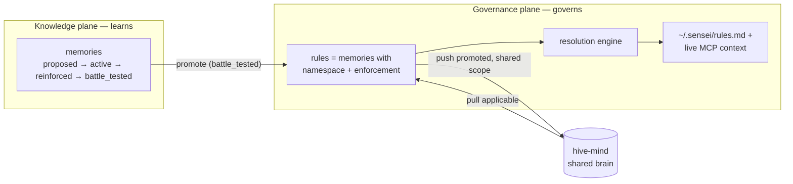
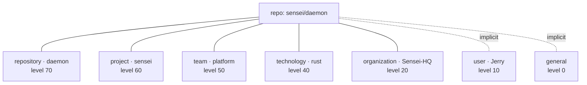
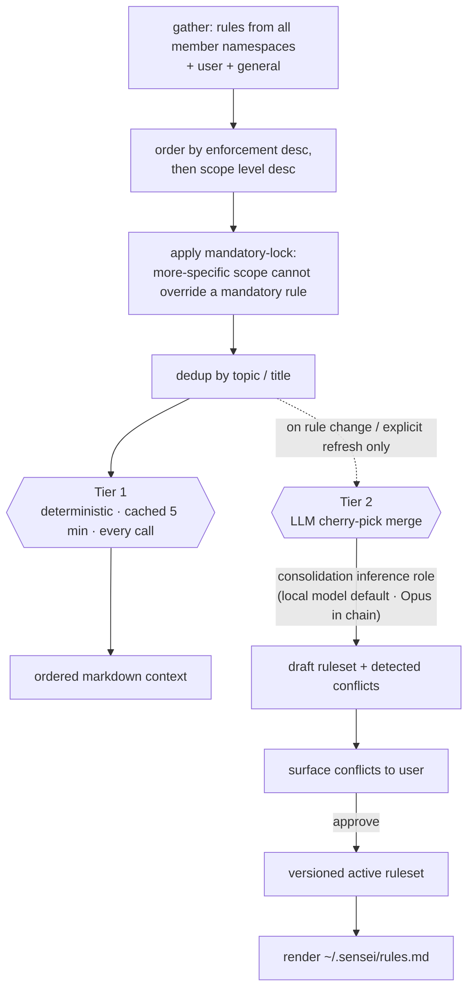
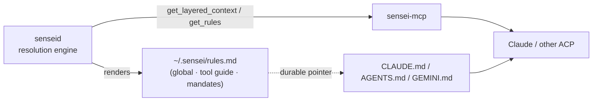
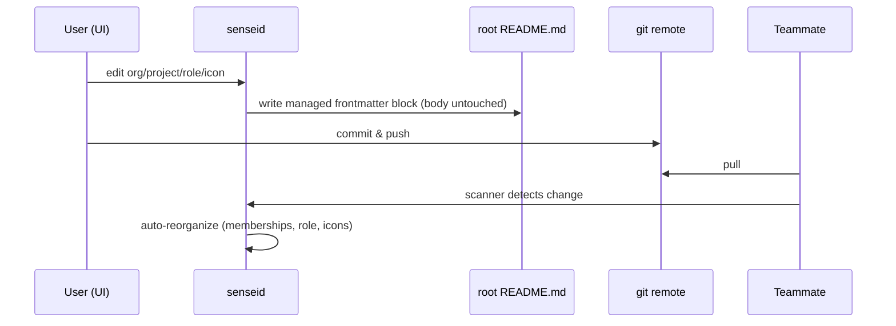
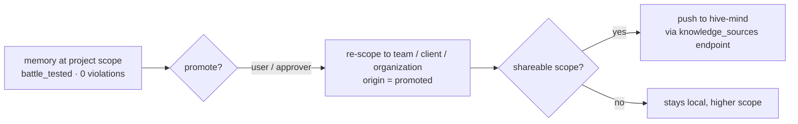
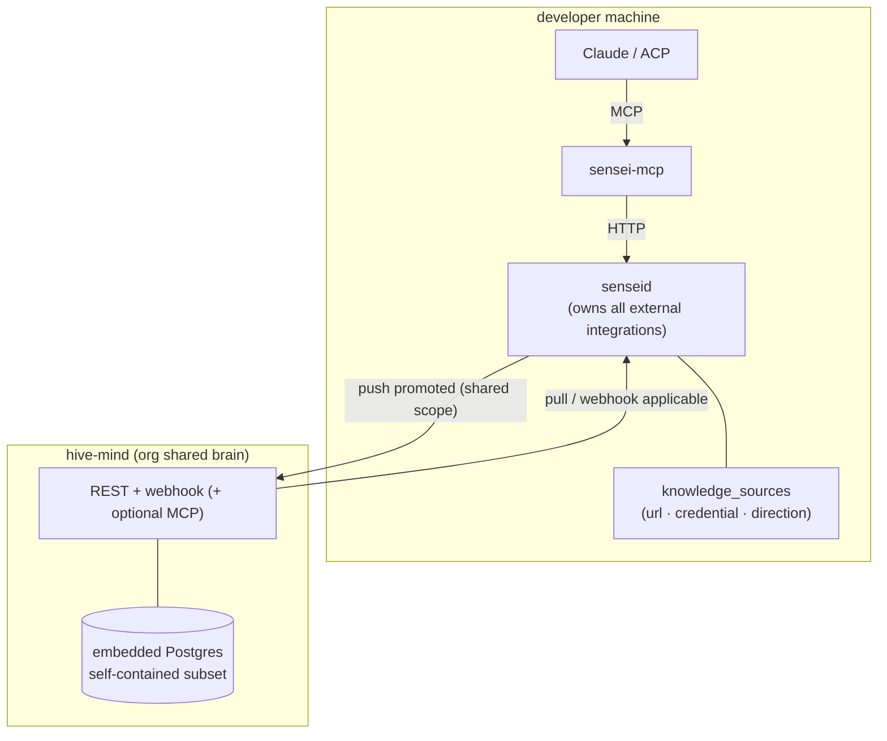

# Governance

How Sensei decides **which rules apply** to a coding session, **whose authority** they carry, and how a learning in one repo becomes shared knowledge across a team, client, or organization.

The [knowledge plane](../superpowers/specs/2026-05-27-knowledge-plane-design.md) captures *emergent* learnings — memories the assistant proposes, that gain or lose strength as they're applied or violated. The **governance plane** is the layer above it: *scoped, authored-or-promoted, enforceable* guidance that resolves into the context every session starts with. Governance is the concrete shape of the knowledge plane's deferred "Phase 1" — promotion ladder, remote sharing, constitution tier, RBAC.

> One line: **the knowledge plane learns; the governance plane governs.** Promotion is the bridge — a battle-tested memory becomes a candidate rule at a higher scope.

---

## The problem

A `CLAUDE.md` (or `AGENTS.md`, `GEMINI.md`) is flat and per-repo. It can't express the reality of a working developer:

- **Personal** habits and preferences that follow you across every repo.
- **Organization** architecture principles and **security/compliance** constraints that *must not* be overridden downstream.
- **Client** standards that apply to a subset of projects.
- **Technology/language** conventions (Rust error handling, Svelte 5 runes) that cut across projects.
- **Team** decisions, **project** rules, and **repository**-specific exceptions.

These overlap and sometimes conflict. A personal preference and an org mandate can both apply to the same file. The narrower rule should usually win — *except* when a higher authority has declared something non-negotiable. Sensei needs a model that expresses both **where a rule applies** and **how much authority it carries**, then resolves the set deterministically.

---

## Two axes

Every governed rule is positioned on two independent axes.

| Axis | Question it answers | Values |
|------|--------------------|--------|
| **Scope** | *Where does this apply, and how specific is it?* | `general` < `user` < `organization` < `client` < `technology` < `team` < `project` < `repository` |
| **Enforcement** | *How much authority does it carry?* | `advisory` < `recommended` < `required` < `mandatory` |

**Scope** drives default precedence: the **most specific applicable scope wins** on conflict. A `repository` rule beats a `project` rule beats a `technology` convention. For a personal repo with no org/client/team membership, those scopes simply resolve to nothing.

**Enforcement** is the override brake. A `mandatory` rule (the "constitution" tier — typically org security/compliance) **cannot be overridden by a more specific scope**. A team or repo can refine a `recommended` org rule, but cannot weaken a `mandatory` one. This is why the two axes must be independent: precedence alone would let a repo silently override a security mandate just by being more specific.



---

## Scopes and namespaces

Rather than hard-coding an `organizations` table, a `clients` table, a `teams` table and so on, the hierarchy is **data**, expressed with two small tables. Adding a new level is an insert, not a migration.

- **`scopes`** — the *ladder itself*. One row per level, carrying its precedence `level` and whether it federates.
- **`namespaces`** — *instances* of a scope. `(organization, "Sensei-HQ")`, `(project, "sensei")`, `(repository, "daemon")`, `(technology, "rust")`.

```text
scopes
  key        text  PK     -- 'general','user','organization','client','technology','team','project','repository'
  name       text
  level      int          -- precedence; higher = more specific = wins (general=0 … repository=70)
  shareable  bool         -- does this scope federate to a hive-mind? (organization/client/team = true)

namespaces
  id         uuid  PK
  scope_key  text  → scopes(key)
  name       text         -- 'Sensei-HQ', 'sensei', 'daemon', 'rust'
  slug       text
  level      int  NULL    -- optional per-namespace override of scope.level
  props      jsonb        -- icons / logo url / variants / metadata
```

### Level, not parent — why set-membership beats a tree

An early design used a `parent_id` to chain namespaces into a tree. It was dropped because **a repo lives on more than one path at once**: it has *both* a personal (`user`) rule source *and* an organization rule source, and those are not parent and child — they are independent. A single-parent tree can't represent that.

Instead, a repo is a **member of a set** of namespaces, and precedence is a plain `level` number:



Membership is explicit (a `folder_namespaces` join), plus the always-present `user` and `general` namespaces. Resolution unions the rules from every member namespace and orders them by `level` — no tree-walking, multi-path falls out for free, and a repo can belong to two clients or two technology namespaces without special cases.

---

## Rules as extended memories

Governance does **not** introduce a parallel `rules` table. A rule *is* a memory — Sensei reuses the entire knowledge-plane lifecycle (strength, outcomes, `proposed → active → battle_tested`, the `history.past_memories` audit trail). Three columns are added:

```text
memories  (additions)
  namespace_id  uuid → namespaces(id)  NULL     -- NULL = general; replaces scope + scope_filter + project_id
  enforcement   enum advisory|recommended|required|mandatory   default 'recommended'
  origin        enum authored|promoted|remote                  default 'authored'
  source_id     uuid → knowledge_sources(id)    NULL           -- set when origin = 'remote'
```

- A memory the assistant proposes and the user accepts → `origin = authored`, at whatever namespace it was captured in.
- A `battle_tested` memory elevated to a higher scope → `origin = promoted`.
- A rule pulled down from a hive-mind → `origin = remote`, tagged with its `source_id`.

The existing `scope` / `scope_filter` / `project_id` columns are migrated into `namespace_id` (`global` → general namespace, `stack` → a `technology` namespace, `project` → a `project` namespace).

---

## The resolution engine

Resolution turns the scattered set of applicable rules into one coherent, ordered document. It runs in **two tiers** so the session-start hot path stays fast.



**Tier 1 — deterministic, always.** Gather → order by `enforcement` then `level` → apply the mandatory-lock → dedup → emit ordered markdown. Cheap, runs on every `get_layered_context` call, cached with the existing `cache_until` (5 min). This is what a session sees by default.

**Tier 2 — LLM consolidation, on change only.** When rules across scopes overlap in prose, a deterministic concat reads badly. A "cherry-pick" merge synthesizes them into one coherent document. This is **not** run on the hot path — it fires only when a rule changes or the user requests a refresh, and routes through the **existing `consolidation` inference role** (`enum/sensei/inference_role.ddl`, documented as "memory merge/conflict") → its `gateway.fallback_chains` entry. Default to a small local model via `gateway-embedded`; Opus sits later in the chain. No new model-routing plumbing — governance is one more consumer of the established role→chain mechanism.

**Versioned + approval-gated.** The Tier-2 output is a *draft*. Detected conflicts (two rules contradicting at the same topic) are surfaced for the user to resolve. Only on **approval** does the draft become the active ruleset; the prior version is archived. This mirrors the established **current-table + `history.past_*` + `historize_*` trigger** convention (see `history.past_memories`): `operation`, `effective_from`, `effective_to`, and no FK on the logical id so history survives hard deletes.

---

## Where rules live, and tool routing

Sensei centralizes on **one global file**: `~/.sensei/rules.md`. It is the durable, ACP-agnostic anchor — the rendered active ruleset for the user/general/mandatory scopes, plus the **tool decision-guide** (when to use the indexed code graph vs. grep, `match_pattern` before building, `get_layered_context` at session start). Per-repo specifics are delivered **live through the MCP** at session time, resolved for whatever repo the assistant is in — so there's no per-project `.sensei/rules.md` to drift or maintain.



Two changes make this real:

- A **durable one-line pointer** in `CLAUDE.md`/`AGENTS.md` at install, referencing `~/.sensei/rules.md`. The SessionStart hook still injects live context for Claude Code, but the pointer survives across ACPs and post-compaction states where the hook doesn't run.
- The eight **mindset agents** (`marketplace/plugins/sensei/agents/*.md`) — which today list only `Read, Grep, Glob, Bash` — are granted the sensei MCP tools and rewritten MCP-first, so the agents doing the deepest reasoning use the indexed graph (`search`, `get_callers`, `get_patterns`, `get_layered_context`) instead of blind grep. Commands and skills are already MCP-first; this closes the gap.

---

## Identity from the repo: README frontmatter

How does a repo know it belongs to `Sensei-HQ`, the `sensei` project, and plays the `daemon` role? Sensei reads it from **root `README.md` frontmatter** — git-tracked, travels with the repo, requires no central coordination.

```yaml
---
organization: Sensei HQ
project: sensei
team: platform
role: daemon            # desktop · daemon · marketplace · gateway …
stack: [rust, postgres]
icon:
  default: ./assets/daemon.svg          # repo-relative path (resolved against repo root); absolute URL also allowed
  variants: { dark: ./assets/daemon-dark.svg }
---
```

This is a **two-way sync**, with the README as source of truth for identity:



- On **scan or pull**, the daemon parses frontmatter and reconciles `projects`, `folder_namespaces`, role and icons **from** the README — silently and automatically. Because the no-tree membership model means a reorg only adjusts membership/role/icon *metadata* (never destructive tree surgery), auto-apply is safe and reversible via the versioned history.
- On **UI edit**, the daemon writes back into a **fenced managed block** within the frontmatter — never touching the README body — for the user to commit. Push it, teammates pull, their scanners re-derive. The whole team converges on the same project organization, icons, and namespace membership without anyone configuring it twice.
- When a repo can't declare frontmatter, the user configures namespaced tags in the UI and Sensei offers to write them back.

---

## Promotion

Promotion is how a local learning climbs the scope ladder and becomes shared.



- A memory that reaches `battle_tested` at `project` scope with zero violations becomes a **promotion candidate**, surfaced in the Learnings UI.
- Promotion re-scopes it to a higher namespace (`team`/`client`/`organization`) and sets `origin = promoted`. An approval gate guards it — the user in personal mode, an approver role in org mode (RBAC, designed here, enforced when the hive-mind lands).
- If the target scope is `shareable`, the daemon **pushes** it to the registered hive-mind. The reverse path **pulls** applicable shared rules down as `origin = remote`, where they re-enter resolution like any other rule (the stray, never-wired `pending_share` status becomes the real signal here, and the dormant `insights`/`insight_batches` tables become the emit point).

---

## Federation: the hive-mind

Sharing across machines and teammates needs a central store. That store is the **hive-mind** — a slim, separate service, deliberately *not* a full `senseid`.



**Boundary.** The ACP never talks to the hive-mind. The flow is always `ACP → sensei tool → senseid → external integration`. The daemon owns every outbound call; a `knowledge_sources` table on the daemon holds each endpoint (`kind` = `hive_mind | mcp | rest | webhook`, `url`, `namespace_id`, `credential_ref` in Keychain, `direction`), registered the same way a gateway router is.

**Self-contained schema.** The hive-mind reuses the *concepts* of `scopes`, `namespaces`, and promoted rules, but its tables **carry no foreign keys to `projects`, `folders`, `sessions`, or the code graph** — provenance travels as denormalized text/jsonb. Its world is small: shared namespaces, the rules promoted into them, members/API keys, and an audit log. That self-containment is why an **embedded Postgres** (managed binary via `postgresql_embedded`, keeping pgvector + DDL parity with the daemon) is enough — the schema is genuinely simple.

**Deployment.** It can be *referenced remotely* (point several developers at one shared brain) or *installed centrally* as the org's canonical knowledge repo. An optional MCP-server interface lets the hive-mind itself be registered as a federated source — "external shared MCP servers" as first-class knowledge providers.

---

## Why this matters: FTR

Governance exists to raise **FTR — First-Time-Right**, the same hero metric mindsets and personas serve.

- **Layered rules** mean the assistant starts every session already knowing the org's architecture principles, the client's standards, the language's conventions, and this repo's exceptions — instead of rediscovering (and violating) them turn by turn.
- **Enforcement** stops a more-specific scope from silently weakening a security mandate, so the costly class of "correct-looking code that breaks a compliance rule" is caught before it's written.
- **Promotion + the hive-mind** mean a lesson learned painfully in one repo is paid for once: it propagates to every teammate and project where it applies, so the same correction never has to be made twice across a team.

Fewer corrections, fewer rediscovered constraints, fewer repeated mistakes — exactly what FTR measures.

---

*Related: [mindsets](./mindsets.md) · [personas](./personas.md) · [agents](./agents.md) · [knowledge plane spec](../superpowers/specs/2026-05-27-knowledge-plane-design.md). Implementation is tracked in [`docs/backlog.md`](../backlog.md) under "Governance plane."*
