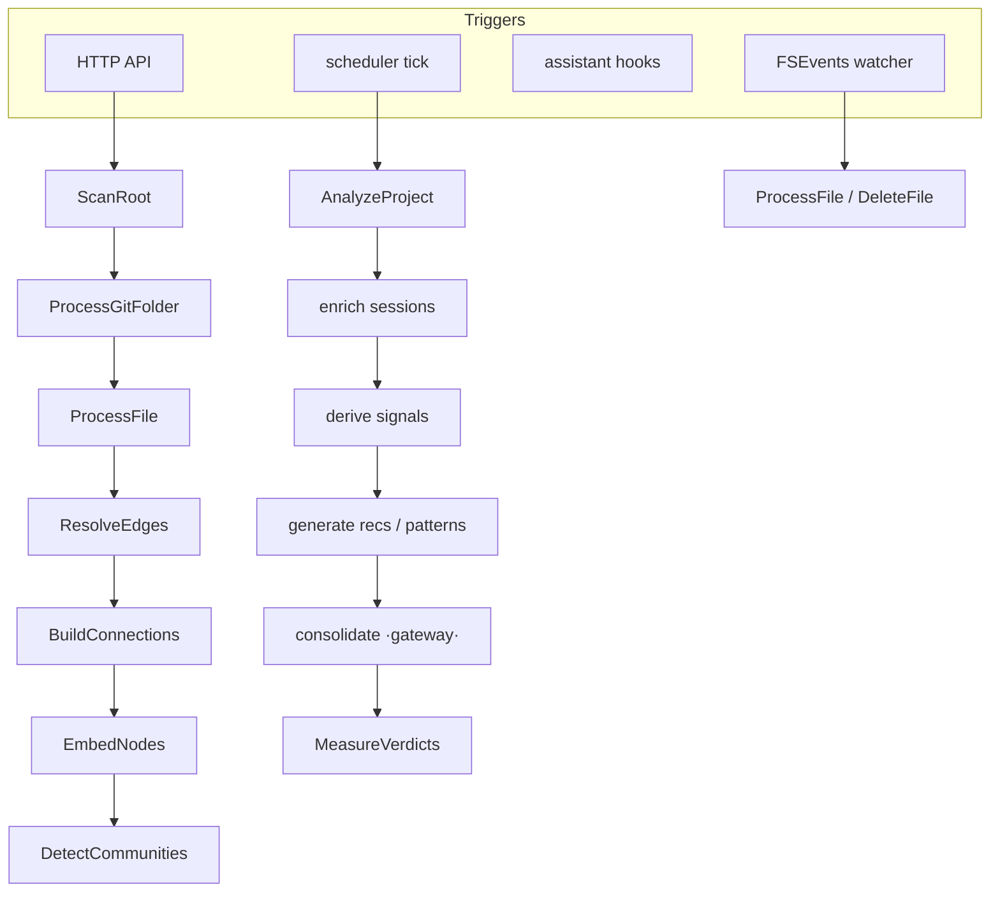

# Layer · daemon (senseid)

> **Serves:** the core loop end-to-end, and Observatory/Project objectives (O*,
> P*, B*). The daemon is the engine — everything else (app, cli, mcp) is a client
> of its HTTP API on port **7744**.

## What it is

`crates/senseid` — an Axum HTTP server over a Postgres pool, plus a background
**task system** that runs capture, scan, analysis, and the learning pipelines.
One binary, one DB. It consumes the **gateway** for LLM calls (see below).

## The task system

Work is modelled as `TaskKind`s dispatched by an executor, some **scheduled**
(analyzer ticks) and some **event-triggered** (file-watcher, hooks, API). Tasks
form a hierarchy with **barriers** (a parent waits for its children) so
post-processing (edges, connections, embeddings, communities) runs only after
indexing settles.

Key properties: **incremental** (content-hash `scan_state` diff — re-scans and
branch switches touch only changed files), **auto-recoverable** (scan reconcile
self-heals stale roots, ghost folders, and duplicate ownership), and
**consistent** (the one-owner invariant, enforced + regression-locked).

## Scan — the code graph

`ScanRoot` classifies folders into project roots (git repos + quasi-repos);
subfolders are never promoted. `ProcessGitFolder` walks a repo and attributes
every file to the **git-root owner**; structural members are recorded but own no
code nodes. Language adapters parse files into an **adapter IR** → nodes/edges.
The **one repo = one project = one owner** invariant is the backbone; it is
enforced at classification and by a self-healing `dedup_structural_folder_nodes`
reconcile (see [`../requirements/open-issues.md`](../requirements/open-issues.md)
history: #101).

## The pipelines (the learning half of the loop)

Driven by the analyzer scheduler (per-project `AnalyzeProject` + global passes):

| Pipeline | Produces | Spec |
|---|---|---|
| capture | `sessions`, `assistant_events`, `tool_calls` | [pipeline/capture](../spec/pipeline/capture.md) |
| analyzer (L0 enrich) | enriched sessions | [pipeline/analyzer](../spec/pipeline/analyzer.md) |
| FTR | `ftr_daily`, `project_ftr_metrics` | [pipeline/ftr](../spec/pipeline/ftr.md) |
| signals (L1) | behavioural signals (churn, correction-prone, rule-candidates) | [pipeline/signals](../spec/pipeline/signals.md) |
| patterns | `detected_patterns` | [pipeline/patterns](../spec/pipeline/patterns.md) |
| inferencing (L2) | `recommendations` + consolidation `reasoning_traces` | [pipeline/inferencing](../spec/pipeline/inferencing.md) |
| memory | promoted `memories` | [pipeline/memory](../spec/pipeline/memory.md) |
| insight-copy | mentor-voice strings (`insight_copy`) | [pipeline/insight-copy](../spec/pipeline/insight-copy.md) |
| traceability | doc-drift | [pipeline/traceability](../spec/pipeline/traceability.md) |

**The loop's open link:** recommendations generate but are never acted on →
`MeasureVerdicts` has no input → no FTR delta. Memory promotion barely fires.
These are Phase 1 (see open-issues G1/G2).

## Gateway

LLM routing is an **in-process** capability the daemon consumes as the
`gateway-embedded` git dependency (sibling repo `sensei-hq/gateway`; formerly the
in-tree `crates/gateway/`, moved out to release independently). Config is
**table-driven** from the `gateway.*` schema, loaded at boot: routers → models →
named chains (`classify`, `reasoning`, `embed`, `insight-copy`, `image`). Chains
are local-first (embedded gemma / all-minilm) with cloud legs router-gated, so
**offline works**. Callers pin named chains.

## API surface (clients: app, cli, mcp)

Bootstrap · setup · observatory · project · workflow (MCP-facing) endpoints.
The [mcp](mcp.md) layer proxies most code-navigation calls here; the [app](app.md)
and [cli](cli.md) call the observatory/project/setup endpoints.

## No silent errors

Every discarded error is logged (`tracing::warn!`), never swallowed with `.ok()`
— a hard rule after a `node_kind` drop hid behind `.ok()`. A codebase-wide
silent-error audit is a standing follow-up (open-issues D).

## Source detail

Deeper internals (crate structure, adapter IR, compression L0–L3, context
manager) currently in [`reference/02-daemon.md`](reference/02-daemon.md) — folds
into this doc + [data.md](data.md) as the restructure completes.
