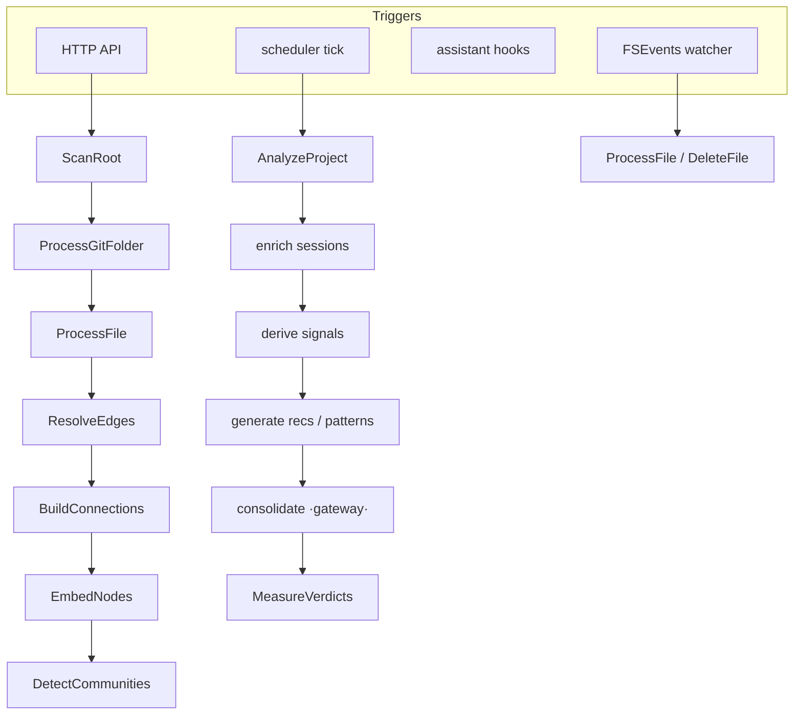

# Layer · daemon (senseid)

> **Serves:** the core loop end-to-end, and Observatory/Project objectives (O*,
> P*, B*). The daemon is the engine — everything else (app, cli, mcp) is a client
> of its HTTP API on port **7744**.

## What it is

`crates/senseid` — an Axum HTTP server over a Postgres pool, plus a background
**task system** that runs capture, scan, analysis, and the learning pipelines.
One binary, one DB. It consumes the **gateway** for LLM calls (see below).

## The task system

Work is modelled as `TaskKind`s dispatched by an executor, some **scheduled**
(analyzer ticks) and some **event-triggered** (file-watcher, hooks, API). Tasks
form a hierarchy with **barriers** (a parent waits for its children) so
post-processing (edges, connections, embeddings, communities) runs only after
indexing settles.

Key properties: **incremental** (content-hash `scan_state` diff — re-scans and
branch switches touch only changed files), **auto-recoverable** (scan reconcile
self-heals stale roots, ghost folders, and duplicate ownership), and
**consistent** (the one-owner invariant, enforced + regression-locked).

## Scan — the code graph

`ScanRoot` classifies folders into project roots (git repos + quasi-repos);
subfolders are never promoted. `ProcessGitFolder` walks a repo and attributes
every file to the **git-root owner**; structural members are recorded but own no
code nodes. Language adapters parse files into an **adapter IR** → nodes/edges.
The **one repo = one project = one owner** invariant is the backbone; it is
enforced at classification and by a self-healing `dedup_structural_folder_nodes`
reconcile (see [`../requirements/open-issues.md`](../plan/README.md)
history: #101).

## The pipelines (the learning half of the loop)

Driven by the analyzer scheduler (per-project `AnalyzeProject` + global passes):

| Pipeline | Produces | Spec |
|---|---|---|
| capture | `sessions`, `assistant_events`, `tool_calls` | [pipeline/capture](../spec/pipeline/capture.md) |
| analyzer (L0 enrich) | enriched sessions | [pipeline/analyzer](../spec/pipeline/analyzer.md) |
| FTR | `ftr_daily`, `project_ftr_metrics` | [pipeline/ftr](../spec/pipeline/ftr.md) |
| signals (L1) | behavioural signals (churn, correction-prone, rule-candidates) | [pipeline/signals](../spec/pipeline/signals.md) |
| patterns | `detected_patterns` | [pipeline/patterns](../spec/pipeline/patterns.md) |
| inferencing (L2) | `recommendations` + consolidation `reasoning_traces` | [pipeline/inferencing](../spec/pipeline/inferencing.md) |
| memory | promoted `memories` | [pipeline/memory](../spec/pipeline/memory.md) |
| narration-cache | mentor-voice strings (`narration_cache`) | [pipeline/narration-cache](../spec/pipeline/narration-cache.md) |
| traceability | doc-drift | [pipeline/traceability](../spec/pipeline/traceability.md) |

**The loop's open link:** recommendations generate but are never acted on →
`MeasureVerdicts` has no input → no FTR delta. Memory promotion barely fires.
These are Phase 1 (see open-issues G1/G2).

## Gateway

LLM routing is an **in-process** capability the daemon consumes as the
`gateway-embedded` git dependency (sibling repo `sensei-hq/gateway`; formerly the
in-tree `crates/gateway/`, moved out to release independently). Config is
**table-driven** from the `gateway.*` schema, loaded at boot: routers → models →
named chains (`classify`, `reasoning`, `embed`, `narration-cache`, `image`). Chains
are local-first (embedded gemma / all-minilm) with cloud legs router-gated, so
**offline works**. Callers pin named chains.

## API surface (clients: app, cli, mcp)

Bootstrap · setup · observatory · project · workflow (MCP-facing) endpoints.
The [mcp](mcp.md) layer proxies most code-navigation calls here; the [app](app.md)
and [cli](cli.md) call the observatory/project/setup endpoints.

## No silent errors

Every discarded error is logged (`tracing::warn!`), never swallowed with `.ok()`
— a hard rule after a `node_kind` drop hid behind `.ok()`. A codebase-wide
silent-error audit is a standing follow-up (open-issues D).

## Design rationale (why the internals are shaped this way)

- **Adapters fail safely.** A crash in one language/doc adapter must never abort
  the pipeline for other files — wrap, log, skip (a broken Python adapter must
  not abort a TypeScript repo). Pairs with *no silent errors*.
- **Adapter-IR = three node types**, `Option<>` everywhere, complexity computed
  *during* parse (AST in memory); per-file parse is worker-parallel, **edge/parent
  resolution is a separate batch phase**.
- **`ResolveEdges` and `BuildConnections` are separate phases on purpose:** edge
  resolution (refs→edges) runs after all file-tasks settle; connection-building
  (doc↔code traceability, cross-repo links, drift) runs only after edges resolve.
  Barriers inherit parent priority; **watcher file-tasks outrank bulk-scan** so
  real-time edits jump the queue.
- **Folder-discovery depth:** git repos at any depth; plain folders only to depth
  2; gitignored + dot-dirs never enter `folders`; a git repo's sub-dirs aren't
  added unless they're a subtree.
- **Compression tiers:** L0/L1 deterministic, L2 optional inference, **L3 never
  stored**; token budgets are flat regardless of project age. The context manager's
  `context_pack(task, max_tokens)` ranks by DiffFirstBFS → TraceabilityBoost →
  Semantic → BM25 → RelevanceLearning (this is *spec* — see [mcp](mcp.md) G4).
- **FTR classification is 2-phase:** regex correction-keyword heuristics first,
  local-model second; rolling 14-day window.
- **Recommendation lifecycle:** signal → threshold → consensus panel (persisted to
  `reasoning_traces`) → verdict tracking (`baseline_ftr` at act-time vs rolling
  `current_ftr`). **Drift algorithm:** `git diff <lastIndexed>..HEAD` × the
  traceability matrix → flag docs whose covered files changed (non-git fallback
  compares mtime/size vs `scan_state`).

## Gateway internals

Model selection is **3-tier** (exact `adapter+model` → named chain → capability),
each candidate passing 4 gates (router-enabled+key → supports-capability →
breaker-not-open → within-budget) with a `SkipReason` recorded in the execution
trace. The **circuit breaker** is per-`{adapter}:{model}`, in-memory (restart =
all Closed). The **budget rule is "never block, always degrade"** — at a limit,
drop external providers → local-only → Noop only if nothing local. Config
**hot-reloads** (`Arc<RwLock<GatewayConfig>>`, no restart); persistence is via a
`GatewayStore` trait the daemon implements on Postgres (`gateway.inference_calls`
+ `gateway.execution_traces`). Consensus (MOE) is a *caller* of the gateway, not
part of the routing engine.
