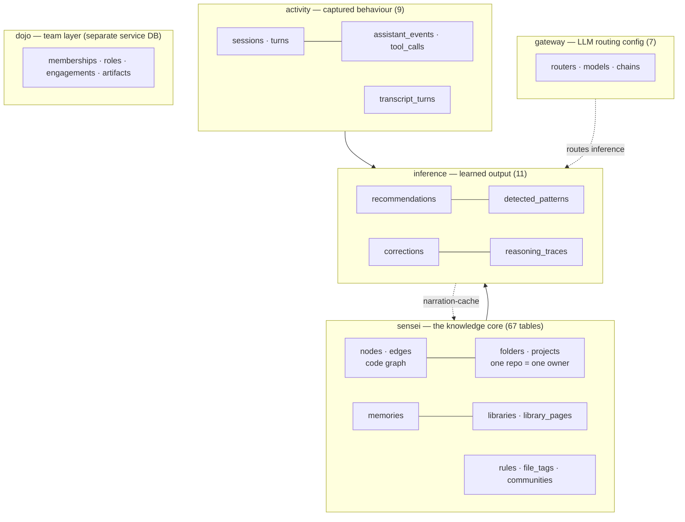

# Layer · data

> **Serves:** every objective — the data layer is the substrate the whole
> [core loop](../vision.md#the-core-loop) turns on. Owns the schema,
> the model, and the DB conventions.

## What it is

One PostgreSQL database, `sensei`, on port **7744** (single mode — no dev/prod
split). The daemon owns runtime migrations; the DDL under
[`database/ddl/`](../../database/ddl/) is the declarative source of truth
(applied with **dbd**). DDL is organised by object type (`enum/`, `table/`,
`function/`, `procedure/`, `view/`) then by schema.

## The schemas

| Schema | Owns | Notes |
|---|---|---|
| **sensei** | code graph (`nodes`/`edges`), `folders`/`projects`, `memories`, `libraries`, `rules`, `communities`, `file_tags`, `narration_cache` | the knowledge core; **one repo = one project = one owner** (see [daemon](daemon.md)) |
| **activity** | `sessions`, `turns`, `assistant_events`, `tool_calls`, `transcript_turns` | the captured pair-behaviour — raw material for FTR |
| **inference** | `recommendations`, `detected_patterns`, `corrections`, `reasoning_traces` | what the analyzer learns |
| **gateway** | `routers`, `models`, `chains` | table-driven LLM routing config the daemon loads at boot |
| **dojo** | `memberships`, `roles`, `engagements`, `artifacts`, `incidents`, `audit_events` | the team layer — lives in the cloud **`dojo.*`** schema (Supabase), served by the dojo Worker's `/v1`, not the local `sensei` DB |
| public | `logs` (TTL-pruned) | structured-log sink |
| history / staging | change history · seed import staging | seeding uses timestamp-guarded import procedures |

## Conventions (the rules that keep the schema honest)

- **DDL-source-first.** Edit the `.ddl` first, then apply — otherwise the
  daemon's boot auto-apply recreates the old object. The daemon reads the
  *released* DDL bundle (`database@vVERSION`); to see local DDL changes use
  `make bump` or `SENSEI_DDL_DIR`.
- **Apply via dbd** (`dbd deploy`/`apply`/`graph`), never `dbd combine`'s dump.
  Pre-release additive columns go through **`dbd reconcile`** (incremental);
  `deploy` is a declarative snapshot and won't ALTER-add. Enum variants deploy
  **alphabetically** — never rely on declaration order; rank with a CASE.
- **Full-DDL, no ALTERs** in source — a table's `.ddl` is its whole definition;
  migrations are dbd's job.
- **Seeding is idempotent + guarded** — staging tables + import procedures with
  a timestamp guard so a reseed never overwrites production data.

## One-owner invariant

Every file is owned by exactly one folder — the repo/git-root. Structural
subfolders (`kind='folder'`) are members with a role/kind and own **no** code
nodes. This is enforced at scan-classification + a self-healing reconcile
(`dedup_structural_folder_nodes`); see [daemon](daemon.md#scan--the-code-graph).

## Invariants (why the shape is the shape)

- **Config vs content is separated deliberately.** User *intent*
  (`folders_to_watch`, exclusions) is config and survives a data wipe; discovered
  FS state (`folders`) is content, fully re-derivable by a re-scan. They live in
  separate tables so a content wipe never destroys config — this prevents a whole
  class of "lost my setup" bugs.
- **`hook_events` PK is `bigserial`, not `uuid` — on purpose.** It's an
  append-only, high-write stream; a sequential bigserial avoids the random B-tree
  page splits a uuid PK causes, at 8 vs 16 bytes.
- **Bridge-table scoping uses *partial* unique indexes, not composite PKs.**
  `project_id IS NULL` = global, `= X` = scoped, no row = inactive. Postgres
  treats each NULL as distinct, so a composite PK can't enforce "one global row" —
  a partial unique index can. A `*_resolved` view tags each row a `scope` and
  sorts project rows above global. One pattern, reused across
  libraries/extensions/instruments.
- **The metadata model has four categories:** *Orientation* (`projects`+`folders`),
  *Symbol graph* (`nodes` — 16 kinds, `embedding vector(384)` with an **HNSW**
  index; `library_pages.embedding` is `vector(768)`; `parent_id` self-references
  for containment), *Relationships* (`edges` — 11 kinds, `edge_confidence` ∈
  extracted/inferred/ambiguous), *Fingerprints* (`scan_state` — content_hash +
  mtime). **Semantic search is a single SQL query** (pgvector cosine + relational
  filters) — no separate vector store, no volatile cache outside Postgres.

## Where the gaps are

Orphaned tables (`inference.insights`/`insight_batches` — no writer, superseded
by `narration_cache`) and empty-by-design dojo tables (external-blocked). See
[the plan](../plan/README.md) G7.
