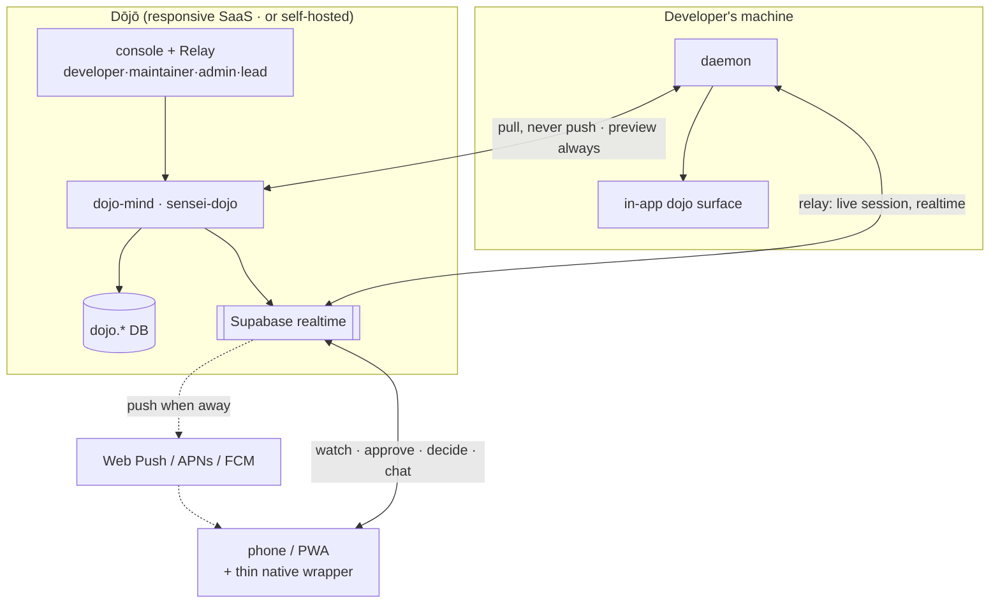
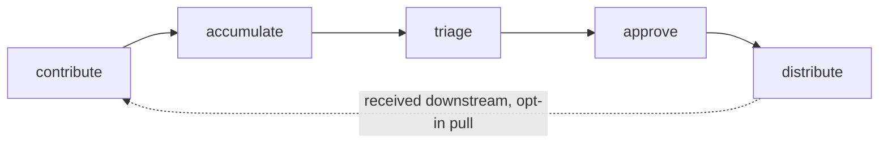

# Layer · dojo (SaaS console + service)

> **Serves:** the team objectives DJ1–DJ5 and theme 5 (the org boundary). Extends
> the same retrospective loop across a team **without leaking client work**. A
> **cross-cutting layer**, not a linear 5th segment — it threads through the
> in-app developer surface and adds an external SaaS console.

## What it is

Two pieces plus the in-app surface:

| Piece | Where | Role |
|---|---|---|
| **dojo-mind service** | `crates/dojo-mind` (binary `sensei-dojo`) | the federation server — memberships, contribute/triage/distribute, anonymization, its own DB (`dojo.*` schema) |
| **dojo web app** | `dojo/` (SvelteKit) | a **responsive SaaS site** (installable PWA) — **developer** · maintainer · admin · **lead** consoles + **Relay** (phone & console), SSO-gated |
| **in-app developer flows** | in the **[Observatory](app.md)** (`(observatory)/dojo/*`) | discover · connect · bind · share · watch · receive — these are Observatory flows, not a separate app |

## The roles

**Every user logs into the Dōjō SaaS.** The team/org benefit is the primary
value, but a developer is often in **multiple** teams — so *developer* is a
first-class role with its own console view (my teams, my contributions, what I've
received), on top of the in-app Observatory flows.

Authority inside a Dōjō (`dojo.member_role`): **contributor** / *developer* (pull +
contribute; in-app flows + a personal console view) · **maintainer** (triage /
approve / distribute on owned scopes) · **lead** (guards confidentiality on
**client engagements** — audit, incidents; *renamed from `client_lead`*) ·
**admin** (runs the server, identity, provisioning, policies). Roles derive from
the git-provider role, admin-overridable.

> **Naming:** the *role* is `lead`; the *engagement* it guards is still a
> **client engagement**. "The lead guards client-engagement confidentiality" is
> correct — only the role token shortened (`client_lead → lead`).

## The lifecycle

## The boundary — memberships, not a rigid hierarchy

One developer, many orgs (Employer · Client orgs · Communities · Personal). The
org boundary is the **membership** (`projects.dojo_id` → membership), with
**client-precedence** as the tiebreaker. Distribution follows **priority
ladders** where **specificity wins conflicts** — not a strict tree.

**Principles (from the journey map):** identity is the discovery · **pull, never
push** · **never blind, always preview** · **one universal strip** (the same
anonymization on every client lesson; a lesson that can't be stripped doesn't
leave) · specificity wins conflicts.

## Global Collective vs Dōjō

The global **Collective** is the public, opt-in commons; the **Dōjō** is the
private org/engagement lane. Anything that must stay inside a company or client
goes through a Dōjō membership, never the Collective (theme 5).

## Identity & discovery

**GitHub is the spine.** Sign-in derives orgs + roles from GitHub org membership
and the highest repo access; org URLs encode origin — `github/<org>`,
`other/<org>` (magic-link, non-GitHub), `personal/<you>`. **One account links
several emails** (GitHub, work SSO, personal); memberships aggregate but never
cross — an org can't see you belong to another. A self-hosted Dōjō keeps its own
URL but **registers on the SaaS registry** so it's discoverable by the same
GitHub-org match. Trust is mutual: the server proves itself (org's TLS domain +
its GitHub/IdP), and the app **pins** the org URL + issuer after first join so a
later impostor at a different host can't hijack the membership.

## Relay — through the Dōjō

Relay (the away-from-keyboard surface: watch · approve · decide · nudge · chat)
is **folded into the Dōjō**. There is **no device pairing and no separate relay
transport** — the daemon already holds an outbound connection to the Dōjō for
knowledge; that same line, over **Supabase realtime**, carries live session
control. Any signed-in phone or console **subscribes** and reaches a running
session. The daemon stays **outbound-only** (no inbound ports, no NAT traversal),
and it remains **zero-knowledge**: only *filtered status* + gate prompts + replies
cross — never code or transcripts.

**Surfaces = one responsive PWA + a thin native wrapper.** The PWA is the whole
app (installable, responsive). Two notification paths, because Realtime only
works while the app is open:

| Need | Mechanism | Works when |
|---|---|---|
| Live session (watch/approve/decide/chat *while looking*) | **Supabase Realtime** (WebSocket) | app/PWA **open** |
| "sensei needs you" while the app is **closed** | **Push** | app **backgrounded/closed** |

- **Web Push** (Push API + Service Worker + VAPID) covers Android/desktop
  directly, even closed. iOS supports web push **only** for an installed PWA
  (16.4+) and less reliably — so a **thin [Capacitor](https://capacitorjs.com)
  wrapper** loads the *same* PWA and adds native **APNs/FCM** push (the map's
  "native app coexists for push + offline"). It's a config app, not a second
  codebase. *(Planning-only for now — no PWA manifest / service worker added to
  `dojo/` yet.)*

**Data model — the Relay additions (new `dojo.*` tables + daemon plumbing):**

| Piece | What it holds |
|---|---|
| `push_subscriptions` | per user × device: platform (`web`/`ios`/`android`), Web-Push `{endpoint, p256dh, auth}` **or** native `{apns/fcm token}`, `enabled`, `last_seen`. RLS: user owns rows. |
| **push dispatch** (service) | on a "needs you" event, look up the user's subscriptions and send via Web Push (VAPID) and/or APNs/FCM. VAPID + APNs/FCM creds are **secrets**, never in git. |
| `relay_sessions` + presence | maps user ↔ daemon ↔ active session with heartbeat — answers "which daemon holds this / is it online" (drives the "needs you" band + offline states). |
| `relay_inbox` | durable rows for approvals / decisions / chat / stalls (survive a closed app; a push deep-links to one). Realtime broadcasts inserts; push notifies. |
| `notification_prefs` | per user: which events push (approvals/decisions/stalls), quiet hours, per-Dōjō mute. |
| **daemon ↔ Dōjō channel** | today: findings up, governance down. Relay adds a **bidirectional** live channel — the daemon publishes session state (phase / gated-action / decision / chat); phone/console send back approve/deny/answer/chat, which the daemon consumes to continue the held session. A new realtime client in the daemon. |

**Metering** follows cost (the [business model](../journeys/dojo.md#business-model--free-where-public-or-personal)):
the individual loop is free; `push_subscriptions` / `relay_sessions` carry the
per-tier limits (device count, concurrency) that the paid tiers meter. Wrapping
Supabase realtime under **kavach** for a unified pub/sub is a candidate (raise
upstream if pursued).

## Status — built, externally blocked

The service + daemon federation module + console are substantially **built**
(anonymize, contribute staging, outbox, memberships, routing, pull loop), but
the flow is **paused by default** (`contribute_scheduler` no-ops until opt-in)
and needs a **remote Dōjō server** that isn't running — so all `dojo.*` tables
are 0 locally. Live activation is **Phase 4** (open-issues), gated on the
SaaS-infra decision; it does not block Phases 1–3.

## Deployment — in-house or SaaS

The Dōjō is one unit: the **service** (`dojo-mind` / `sensei-dojo`) + its **web
console**. It ships two ways:

- **SaaS** — sensei-hosted; an org signs up and connects identity.
- **In-house** — the org runs the same service + console on its own infra (data
  never leaves the company).

Same code, same console, same auth — only where it runs differs.

## Auth

SSO — OIDC / SAML presets (Okta · Entra · Google) — plus a git-provider OAuth app
and device-code for CLI. Intended to use **Supabase** + **kavach**; assume a
localhost Supabase + localhost Dōjō registry for local bring-up.

## Source detail

Federation design + terminology history (the older *hive-mind* / `sensei-hive`
naming → Dōjō / `sensei-dojo`) in [`concepts/governance.md`](concepts/governance.md);
lifecycle + role contracts in [`../spec/pipeline/dojo-lifecycle.md`](../spec/pipeline/dojo-lifecycle.md),
[`collective-intelligence.md`](../spec/pipeline/collective-intelligence.md),
and the `../spec/screen/dojo-*` console specs.
