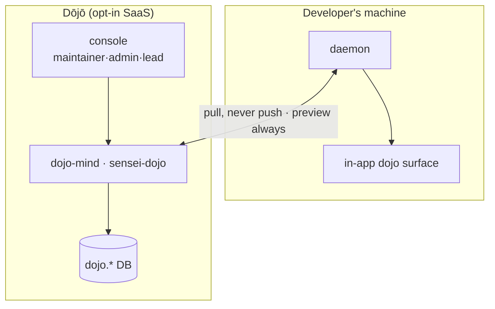
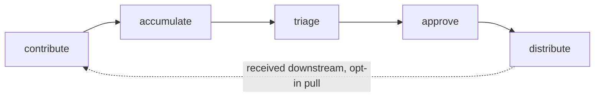

# Layer · dojo (SaaS console + service)

> **Serves:** the team objectives DJ1–DJ5 and theme 5 (the org boundary). Extends
> the same retrospective loop across a team **without leaking client work**. A
> **cross-cutting layer**, not a linear 5th segment — it threads through the
> in-app developer surface and adds an external SaaS console.

## What it is

Two pieces plus the in-app surface:

| Piece | Where | Role |
|---|---|---|
| **dojo-mind service** | `crates/dojo-mind` (binary `sensei-dojo`) | the federation server — memberships, contribute/triage/distribute, anonymization, its own DB (`dojo.*` schema) |
| **console** | `console/` (SvelteKit web app) | **developer** · maintainer · admin · **lead** consoles (SSO-gated) |
| **in-app developer flows** | in the **[Observatory](app.md)** (`(observatory)/dojo/*`) | discover · connect · bind · share · watch · receive — these are Observatory flows, not a separate app |

## The roles

**Every user logs into the Dōjō SaaS.** The team/org benefit is the primary
value, but a developer is often in **multiple** teams — so *developer* is a
first-class role with its own console view (my teams, my contributions, what I've
received), on top of the in-app Observatory flows.

Authority inside a Dōjō (`dojo.member_role`): **contributor** / *developer* (pull +
contribute; in-app flows + a personal console view) · **maintainer** (triage /
approve / distribute on owned scopes) · **lead** (guards confidentiality on
**client engagements** — audit, incidents; *renamed from `client_lead`*) ·
**admin** (runs the server, identity, provisioning, policies). Roles derive from
the git-provider role, admin-overridable.

> **Naming:** the *role* is `lead`; the *engagement* it guards is still a
> **client engagement**. "The lead guards client-engagement confidentiality" is
> correct — only the role token shortened (`client_lead → lead`).

## The lifecycle

## The boundary — memberships, not a rigid hierarchy

One developer, many orgs (Employer · Client orgs · Communities · Personal). The
org boundary is the **membership** (`projects.dojo_id` → membership), with
**client-precedence** as the tiebreaker. Distribution follows **priority
ladders** where **specificity wins conflicts** — not a strict tree.

**Principles (from the journey map):** identity is the discovery · **pull, never
push** · **never blind, always preview** · **one universal strip** (the same
anonymization on every client lesson; a lesson that can't be stripped doesn't
leave) · specificity wins conflicts.

## Global Collective vs Dōjō

The global **Collective** is the public, opt-in commons; the **Dōjō** is the
private org/engagement lane. Anything that must stay inside a company or client
goes through a Dōjō membership, never the Collective (theme 5).

## Status — built, externally blocked

The service + daemon federation module + console are substantially **built**
(anonymize, contribute staging, outbox, memberships, routing, pull loop), but
the flow is **paused by default** (`contribute_scheduler` no-ops until opt-in)
and needs a **remote Dōjō server** that isn't running — so all `dojo.*` tables
are 0 locally. Live activation is **Phase 4** (open-issues), gated on the
SaaS-infra decision; it does not block Phases 1–3.

## Deployment — in-house or SaaS

The Dōjō is one unit: the **service** (`dojo-mind` / `sensei-dojo`) + its **web
console**. It ships two ways:

- **SaaS** — sensei-hosted; an org signs up and connects identity.
- **In-house** — the org runs the same service + console on its own infra (data
  never leaves the company).

Same code, same console, same auth — only where it runs differs.

## Auth

SSO — OIDC / SAML presets (Okta · Entra · Google) — plus a git-provider OAuth app
and device-code for CLI. Intended to use **Supabase** + **kavach**; assume a
localhost Supabase + localhost Dōjō registry for local bring-up.

## Source detail

Federation design + terminology history (the older *hive-mind* / `sensei-hive`
naming → Dōjō / `sensei-dojo`) in [`concepts/governance.md`](concepts/governance.md);
lifecycle + role contracts in [`../spec/pipeline/dojo-lifecycle.md`](../spec/pipeline/dojo-lifecycle.md),
[`collective-intelligence.md`](../spec/pipeline/collective-intelligence.md),
and the `../spec/screen/dojo-*` console specs.
