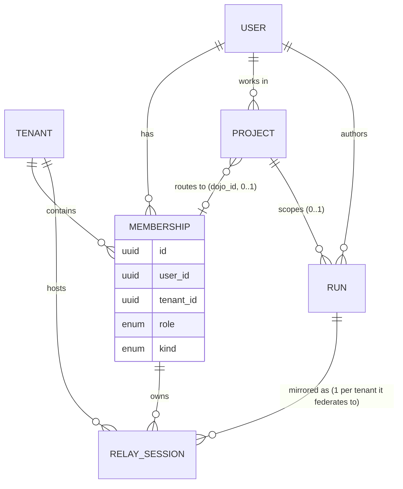

# Entity & access model — the canonical definition

**This is the single source of truth for user · tenant · membership · project · role · run and
which axis governs access.** Any table comment, RLS policy, or design doc that implies a
different primary axis defers to this file. It exists because the model was scattered and
contradictory across DDL comments and design docs, which kept causing rework.

## 1. One-line definitions

| Entity | What it is | Owns / keyed by |
|---|---|---|
| **User** | The person. The Supabase auth subject and the git commit author — the same identity. Sensei's subject. | `auth.uid()` / git `user.email` |
| **Tenant** | A **dōjō** — the isolation boundary + governance scope. Personal (one per user) or org/client. | `dojo.tenants.id` |
| **Membership** | A user's participation in **one** tenant. The **access mediator** — carries `role`, `kind` (personal/employer/client/community), and the device auth. | `dojo.memberships.id` → (`user_id`, `tenant_id`) |
| **Project** | A git folder the user works in. Optionally **bound to one membership** (`dojo_id`) that routes its runs/findings to that dōjō. | `sensei.projects.id`, `dojo_id?` → a membership |
| **Role** | The user's capability level *within a membership* (contributor < maintainer < lead < admin). An attribute of the membership, git-derived, admin-overridable. | `dojo.memberships.role` |
| **Run** | A unit of supervised work (`activity.runs`), owned by the **user** (git author) + optional **project**. Mirrored into dōjō(s) as `relay_sessions`. | `activity.runs.id` (= `relay_sessions.run_id`) |

## 2. Relationships (ER)

Cardinality in words: a **user** has many **memberships**, one per **tenant** (so a user spans
many tenants). A **project** belongs to a user and binds to **at most one** membership. A **run**
is authored by a user, optionally scoped to a project, and **mirrored** into a `relay_session`
per tenant it federates to (usually one; many only in the unbound-broadcast fallback).

## 3. The access axis — which key filters what (THE rule)

Sensei is a **user's** tool. **User/membership is the primary axis; tenant is for governance and
org context.** Do not filter personal work by a single tenant.

| Surface | Primary axis | Filter key | Notes |
|---|---|---|---|
| Personal inbox / runs / asks / plan (`/you`) | **User (via membership)** | `owns_membership(membership_id)` | *"your work across every dōjō"* — spans ALL the user's memberships/tenants |
| Projects, contributions (`/you`) | **User** | user's projects / memberships | project↔membership binding is the routing, not the access filter |
| Governance: rules · ladder/scopes · rule-packs · constitution | **Tenant** | `tenant_id` | the shared dōjō policy — genuinely tenant-scoped |
| Org console (`/org/[slug]`: members · incidents · audit · billing · team runs) | **Tenant** | `tenant_id` | a specific dōjō; P6 team-wide run view is tenant-scoped |
| Run mirror write-identity | composite | `(tenant_id, run_id)` | identity of *a mirror in a dōjō*, not run ownership |

**Corollary that keeps biting us:** `tenants.ddl` says "every dojo.* row carries tenant_id; the
service filters every query by tenant." Read that as scoped to **governance/org reads and
isolation/writes** — NOT as the primary filter for personal work. The personal inbox filtering
by one `tenant_id` (`listRuns(tenantKey)`) is a bug against this model.

## 4. `run_id` clarified

`relay_sessions.run_id` is the daemon-local `activity.runs.id` (plain UUID, no cross-DB FK —
`dojo.*` and the daemon DB are separate). The run is authored by the user + optional project;
`relay_sessions` is a **presence mirror** per tenant. `(tenant_id, run_id)` is unique because the
same run can mirror into several dōjōs (fan-out) — it is the mirror's identity, not proof that a
run is tenant-owned.

## 5. Confidentiality invariant — universal source-dereference (always on)

Orthogonal to access, but a hard rule: **everything that crosses the machine boundary is
source-dereferenced** (repo names, paths, emails, uuids, session ids, project/client names
stripped). **No opt-out; applies to ALL work, not just client** — because all derived output
(inference, memories, patterns) can embed source refs. So:

- **Attribution ≠ dereference.** `attribution_mode` is credit only → should be `named |
  anonymous`. `dereferenced` is NOT an attribution mode; it's an always-on transform on the
  publish path (`crates/senseid/src/dojo/attribution.rs::dereference()`, deterministic +
  fail-closed). No `dereference=false` path exists.
- Cross-boundary only: local data in your own private dōjō isn't self-stripped; the strip runs
  when data leaves to collective/client/upstream. See [[reference_universal_dereference_invariant]].

## 6. How to use this doc

- New RLS / query / table comment: state the surface's axis using §3; if personal work, key off
  the membership (§ the `owns_membership` primitive in
  `docs/design/2026-07-27-dojo-relay-rls-membership-function.md`), not `tenant_id`.
- Conflicting older comments (e.g. `tenants.ddl`) should be updated to defer here as they are
  touched.
- Related: [[reference_sensei_user_primary_model]].
