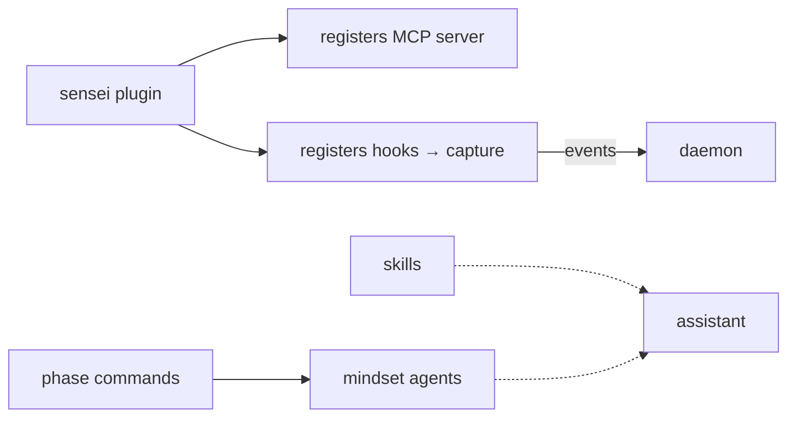

# Layer · marketplace (skills · commands · plugins · agents)

> **Serves:** the *capture* and *deliver* ends of the loop from inside the
> assistant — the packaged behaviours that make sensei present during a session.

## What it is

`marketplace/` — the distributable extension surface, synced as a git subtree to
`sensei-hq/marketplace`. It packages four kinds of assistant extension:

| Kind | What it does |
|---|---|
| **skills** | on-demand capability modules the assistant invokes (e.g. zero-errors-policy) |
| **commands** | slash-commands that drive workflow phases (`/sensei:analyze`, `/sensei:build`, …) |
| **plugins** | the sensei plugin — registers the MCP server + hooks with the assistant |
| **agents** | mindset subagents (analyst · developer · acceptance-tester + specialists) |

## How it threads into the loop

- **Hooks** installed by the plugin are the capture tap — every tool call /
  prompt / outcome flows to the daemon (feeding FTR).
- **Phase commands + mindsets** shape *how* the assistant works (Analyst →
  Developer → Acceptance Tester), which is itself the behaviour sensei observes.
- **Skills** deliver guardrails (e.g. TDD, zero-errors) into the session.

## Conventions

- Subtree: edit in-repo, sync with `make marketplace-push`.
- Mindsets/personas/governance vocabulary is shared with the
  [concepts](concepts/) cross-cutting docs.

## Design rationale

- **The plugin does NOT register the MCP server** — that needs a repo-specific
  `SENSEI_REPO_PATH`, so `sensei init --mcp` writes the project's MCP entry; the
  plugin only registers hooks/skills/commands.
- **Hook capture is fail-open:** hook scripts read stdin, enrich with
  `assistant_family` + `event_type`, and POST to `/hook/event` — which **always
  returns 200 (hooks must never block)**; if the daemon is unreachable the event
  falls back to a local JSONL file. Assistant-agnostic: a new assistant is a new
  hook script only, **zero daemon/DB changes**.
- **Claude Code capture limits shape the design:** `PostToolUse` gives
  tool/result/exit but **no duration or token counts** (→ OTLP needed for cost);
  hooks **cannot call MCP tools**, only inject text via stdout; ~100ms timeout →
  fire-and-forget.
- **Skill token budget** (skills load every session): orientation <150 words,
  frequent <300, reference <500; frontmatter is exactly `name` + `description`.
- **Static vs generated skills:** static ship in the plugin; **generated** are
  produced per-repo by `sensei init` (stack-specific). The SessionStart hook
  self-guards — it injects the session-context reminder only if the sensei MCP
  server is registered, so a global install no-ops on un-init'd repos.
- **Auto-trigger is state-driven, not interruptive** — commands/skills declare
  relevant phases, `get_workflow_state` gates loading; **the agent never
  self-refocuses** (refocus is user-initiated).

Mindsets/personas/governance vocabulary: [`concepts/`](concepts/).
