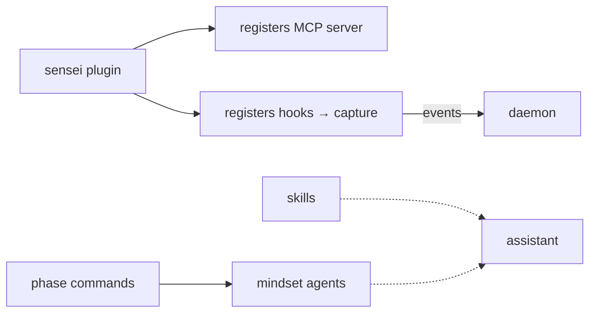

# Layer · marketplace (skills · commands · plugins · agents)

> **Serves:** the *capture* and *deliver* ends of the loop from inside the
> assistant — the packaged behaviours that make sensei present during a session.

## What it is

`marketplace/` — the distributable extension surface, synced as a git subtree to
`sensei-hq/marketplace`. It packages four kinds of assistant extension:

| Kind | What it does |
|---|---|
| **skills** | on-demand capability modules the assistant invokes (e.g. zero-errors-policy) |
| **commands** | slash-commands that drive workflow phases (`/sensei:analyze`, `/sensei:build`, …) |
| **plugins** | the sensei plugin — registers the MCP server + hooks with the assistant |
| **agents** | mindset subagents (analyst · developer · acceptance-tester + specialists) |

## How it threads into the loop

- **Hooks** installed by the plugin are the capture tap — every tool call /
  prompt / outcome flows to the daemon (feeding FTR).
- **Phase commands + mindsets** shape *how* the assistant works (Analyst →
  Developer → Acceptance Tester), which is itself the behaviour sensei observes.
- **Skills** deliver guardrails (e.g. TDD, zero-errors) into the session.

## Conventions

- Subtree: edit in-repo, sync with `make marketplace-push`.
- Mindsets/personas/governance vocabulary is shared with the
  [concepts](concepts/) cross-cutting docs.

## Source detail

Phase-command chains, hook wiring, and skill-budget design in
[`reference/06-marketplace.md`](reference/06-marketplace.md); the plugin
architecture + mindsets in [`concepts/`](concepts/).
