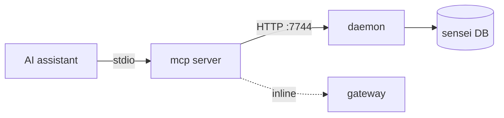

# Layer · mcp

> **Serves:** the *deliver* step of the [core loop](../requirements/vision.md#the-core-loop)
> — getting the right context to the assistant, first try. This is where FTR is
> won or lost in the moment.

## What it is

`crates/mcp` — an MCP (Model Context Protocol) server the assistant runs over
stdio. It is a **thin proxy dispatcher**: most tools forward to the daemon's
HTTP API on :7744; a few (infer/embed/consensus) call the gateway inline. The
assistant (Claude Code · Zed · Cursor) calls these tools mid-task.

## The tool surface

Grouped by what the assistant needs:

| Group | Tools | State |
|---|---|---|
| **Code navigation** | `search`, `get_callers`, `get_callees`, `get_project_summary`, `get_project_conventions`, `get_duplicates`, `get_communities` | mostly **works** (clean post-#101); two bugs ↓ |
| **Patterns / rules** | `get_patterns`, `get_pattern_for`, `match_pattern`, `get_rules`, `get_commands` | `get_patterns` empty (tagger unrun) |
| **Context** | `get_layered_context`, (spec: `context_pack`) | layered context works; `context_pack` **unbuilt** |
| **Libraries** | `get_lib_docs`, `search_lib_docs`, `add_library` | works (text-match, not semantic) |
| **Inference** | `infer`, `embed`, `consensus`, `generate_image`, `gateway_status` | works |
| **Knowledge write** | `propose/save/promote_memory`, `record_outcome`, `accept/reject_proposal` | wired |
| **Session** | `create/update_session`, `log_event`, `update_phase`, `get_workflow_state` | wired (capture) |

## Known gaps (the deliver step is only ~80% real)

- **`search` is substring, not semantic** — plain `ILIKE` over an *embedded*
  corpus (157k nodes). The spec's hybrid semantic layer (`hybrid.rs`,
  `context_pack`, grep-fallback under `crates/mcp/src/tools/`) **does not exist**.
  This is the flagship differentiator — Phase 2 (open-issues G4).
- **`get_communities` returns empty** despite 158 real communities — a
  single-folder scoping bug (`folder_ids_for_project` takes the lowest-UUID leaf
  instead of aggregating all scope folders). Cheap fix — Phase 0/1 (G5a).
- **`get_patterns` returns empty** — `file_tags` has 45,871 rows, all tag-arrays
  empty; the framework-pattern tagger never ran (G5b).
- **Corpus is thin** — the plumbing works end-to-end; there's little captured
  knowledge yet for the assistant to receive (1 project rule). Fills as capture
  + promotion accrue.

## Discovery — a per-assistant trait

Tool discovery differs by assistant (Claude Code `~/.claude/mcp.json` + project
`.mcp.json`; Zed `context_servers`; Cursor `.cursor/mcp.json`). It is (being)
modelled as a `ToolDiscovery` trait with per-assistant impls feeding one unified
inventory (`assistant_tools` / `mcp_servers`).

## Source detail

Multi-coordinator adapter rationale in [`reference/04-mcp.md`](reference/04-mcp.md);
the intended context contract in
[`../llm-spec/pipeline/context-delivery.md`](../llm-spec/pipeline/context-delivery.md)
and [`semantic-search.md`](../llm-spec/pipeline/semantic-search.md).
