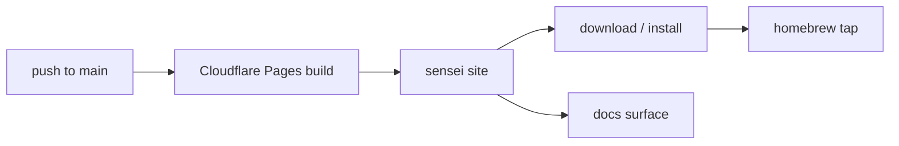

# Layer · website

> **Serves:** adoption — the public face that explains sensei and routes people
> to the download + docs. Not part of the core loop, but the funnel into it.

## What it is

`website/` — a SvelteKit marketing site (+ docs surface), built as a static
bundle. Deploys via Cloudflare Pages from the monorepo on every `main` push
(root dir `website/`). Lives at the public sensei domain.

## Responsibilities

- Landing + product narrative, screens gallery, install path (→ the homebrew
  tap `sensei-hq/homebrew-tap`, synced as a subtree).
- Uses **rokkit** styling — same 24-token discipline as the [app](app.md);
  brand mark is the sensei logo SVG, not a kanji.

## Conventions + known gaps

- **Don't `bun run build` against the live Vite dev server** (reload storm →
  transient partial render).
- Open follow-ups: on-page SEO (canonical, OpenGraph, Twitter cards, sitemap +
  Search Console); one accepted upstream-rokkit `svelte-check` exception (#139).

## Design rationale (site + delivery)

- **Static, no server runtime** — `adapter-static` with `fallback: null`, so every
  route must be pre-renderable; `BASE_PATH` env for non-root deploys. The download
  button detects the OS from `navigator.userAgent` → `.dmg`/`.exe`/`.AppImage`,
  served from GitHub releases.
- **Homebrew delivery:** the formula (`sensei.rb`) installs **3 binaries**
  (`senseid`/`sensei`/`sensei-mcp`), SHA256 placeholders filled by CI post-release,
  a `service` block runs `senseid` under launchd; the **cask depends on the
  formula** so installing the app also installs the CLIs. Prereqs (postgres,
  ollama) are **not** brew-installed — they're lazily installed on first daemon
  boot by the per-component resolvers (a single prereq failure no longer cascades).
  Subtree sync uses a **clean temp-clone copy**, not `git subtree push` (avoids
  squash-merge history sensitivity).
- **Build/release:** `VERSION` is the single source of truth; `make bump` atomically
  updates all manifests, commits, tags, pushes, and syncs the homebrew + marketplace
  subtrees (tag push → CI builds artifacts + real SHA256s). `make crates-all` is the
  pre-bump gate (the Tauri sidecar declares its own workspace, so root
  `cargo build --workspace` skips it). Port **:7744 is hardcoded, not discovered** —
  hooks/CLI/Tauri all need it without a handshake. `install-service` re-codesigns
  binaries with a hardened runtime so the sidecar can spawn them on macOS.

Known follow-ups: on-page SEO (canonical/OG/Twitter/sitemap); the website redesign
(screenshots→flows + a Dōjō section + local-first↔opt-in-Dōjō reconciliation) is in
[`../backlog.md`](../backlog.md) §10.
