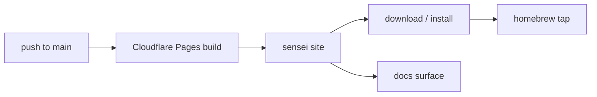

# Layer · website

> **Serves:** adoption — the public face that explains sensei and routes people
> to the download + docs. Not part of the core loop, but the funnel into it.

## What it is

`website/` — a SvelteKit marketing site (+ docs surface), built as a static
bundle. Deploys via Cloudflare Pages from the monorepo on every `main` push
(root dir `website/`). Lives at the public sensei domain.

## Responsibilities

- Landing + product narrative, screens gallery, install path (→ the homebrew
  tap `sensei-hq/homebrew-tap`, synced as a subtree).
- Uses **rokkit** styling — same 24-token discipline as the [app](app.md);
  brand mark is the sensei logo SVG, not a kanji.

## Conventions + known gaps

- **Don't `bun run build` against the live Vite dev server** (reload storm →
  transient partial render).
- Open follow-ups: on-page SEO (canonical, OpenGraph, Twitter cards, sitemap +
  Search Console); one accepted upstream-rokkit `svelte-check` exception (#139).

## Source detail

Landing structure + static-build design in
[`../design/08-website.md`](../design/08-website.md); build/release + homebrew
delivery in [`../design/10-build-and-release.md`](../design/10-build-and-release.md)
and [`09-homebrew.md`](../design/09-homebrew.md).
