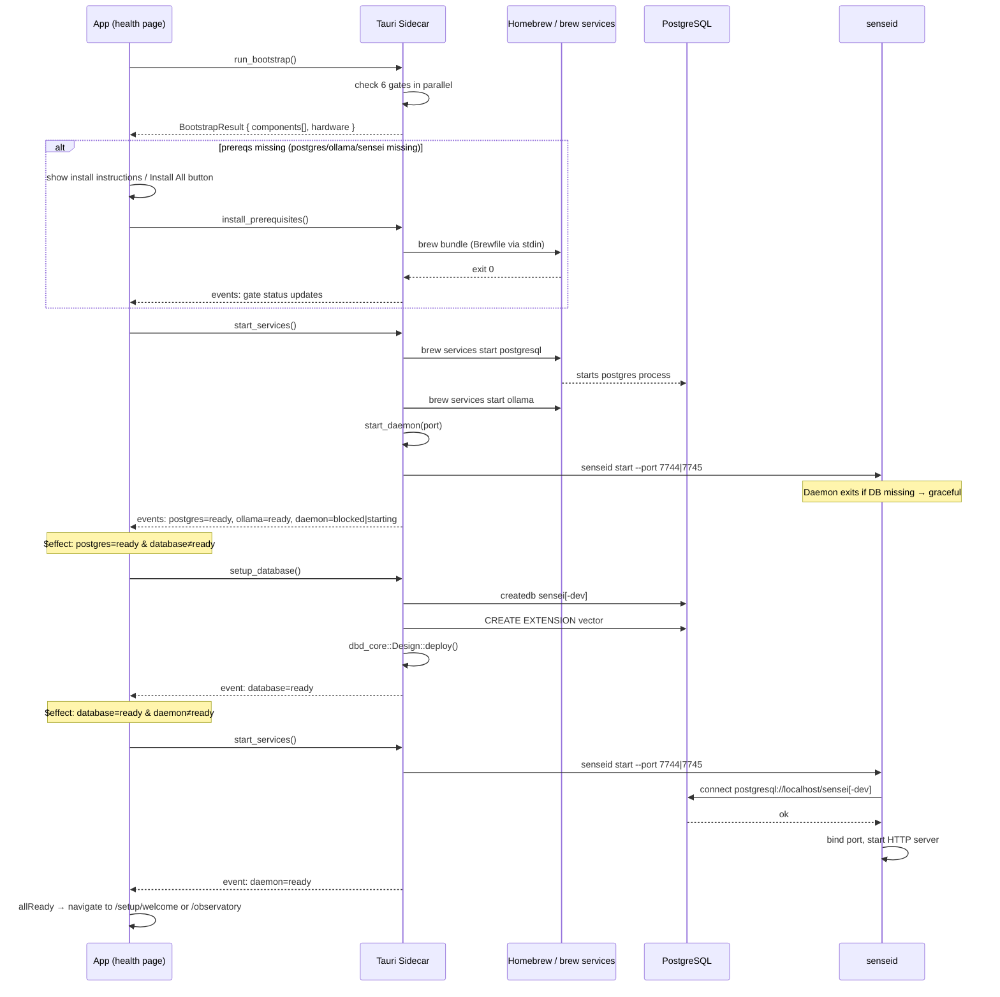
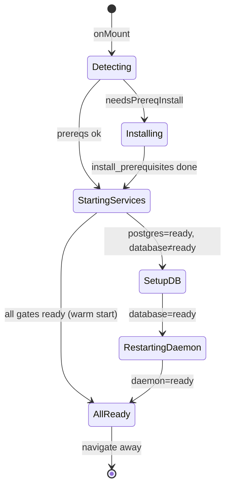

# Bootstrap Design

> How the Sensei desktop app verifies, installs, and starts all dependencies
> on every launch — from a cold start to a running daemon.

---

## Overview

Bootstrap is a **fully automated** sequence that runs every time the app opens.
The Tauri health screen (`/health`) owns all orchestration. Users are only asked
to act when something cannot be fixed automatically (e.g. Homebrew not installed).

**Actors:**
- **App** — SvelteKit UI running inside Tauri
- **Sidecar** — Tauri commands that execute bootstrap Rust logic in-process
- **Daemon** — `senseid` HTTP server (ports 7744 prod / 7745 dev)
- **Platform** — Homebrew, `brew services`, `pg_isready`, `psql`

---

## Sequence



---

## Gates

Six gates are checked in parallel by `bootstrap::run_with_traces()`:

| # | ID | What it checks | Remedy |
|---|----|----------------|--------|
| 一 | `homebrew` | `brew --version` | Manual install → [brew.sh](https://brew.sh) |
| 二 | `postgres` | binary + port 5432 | `brew install postgresql@17` |
| 三 | `ollama` | binary + port 11434 | `brew install ollama` |
| 四 | `sensei` | `sensei --version` matches expected | `brew upgrade/install sensei-hq/tap/sensei` |
| 五 | `database` | DB exists + pgvector + sensei schema | `DatabaseSetupFixer.fix()` |
| 六 | `senseid` | port 7744 (prod) / 7745 (dev) | `ServiceStartFixer.fix()` |

---

## Mode Awareness

Daemon port and DB name are set at **compile time** via the `dev` Cargo feature:

| Mode | Port | Database | How set |
|------|------|----------|---------|
| Production | 7744 | `sensei` | `cargo build` (no features) |
| Development | 7745 | `sensei_dev` | `cargo build --features dev` |

All values derive from `SenseiConfig::from_env()` which reads the compile-time `COMPILE_DEV` const. No runtime env var overrides.

---

## State Machine (Frontend)



Guards:
- `dbPhaseTriggered` — prevents `setupDatabase()` from being called more than once
- `daemonRestartTriggered` — prevents `startServices()` from being called again after the DB restart

---

## Class Model (Rust)

```
BootstrapState
├── components: Vec<ComponentStatus>
│   ├── name: String
│   ├── state: ComponentState (detecting|installing|ready|failed|...)
│   └── version: Option<String>
└── hardware: HardwareInfo

Prerequisite (trait)
├── id()           → &str
├── gate_kind()    → GateKind (Install|Service)
├── check()        → ComponentStatus
└── fix()          → Result<FixResult, String>

GenericPrerequisite implements Prerequisite
├── checker: Box<dyn Checker>
│   ├── BinaryChecker
│   ├── VersionedBinaryChecker
│   ├── PortChecker
│   └── DatabaseChecker
└── fixer: Box<dyn Fixer>
    ├── BrewFixer (brew install <formula>)
    ├── BrewUpgradeFixer (brew upgrade, fallback install)
    ├── ServiceStartFixer (brew services start → poll port)
    ├── DatabaseSetupFixer (create + extensions + deploy)
    └── NoopFixer (show instructions only)

PlatformProvider (trait)
├── MacOSProvider (Homebrew-based)
└── (WindowsProvider — future)
```

---

## Tauri Commands

| Command | Rust function | What it does |
|---------|--------------|--------------|
| `run_bootstrap` | `bootstrap::run_with_traces()` | Parallel gate checks, returns all statuses |
| `install_prerequisites` | `factory::install_prerequisites()` | `brew bundle` Brewfile |
| `start_services` | `factory::start_services()` | Start postgres, ollama, daemon |
| `setup_database` | `factory::setup_database()` | Create DB + extensions + dbd deploy |
| `get_platform` | `provider()` | Returns package manager info + remedies |

All phase commands (install, start, database) spawn a background thread and emit
progress events on the `bootstrap` Tauri channel. The frontend listens via
`listenBootstrapEvents()` → `bs.handleEvent()` → `$state` updates → `$effect` triggers.

---

## Event Protocol

Events arrive on the `"bootstrap"` channel:

```typescript
// Gate progress
{ action: "update", entity: "gate", id: "postgresql", data: { status: "checking" | "ready" | "blocked", version?, detail? } }

// Phase complete
{ action: "set", entity: "phase", id: "services", data: { complete: true, success: true } }
```

ID mapping (backend → frontend):
- `"postgresql"` → `"postgres"`
- `"daemon"` → `"senseid"`

---

## Cold-Start Sequence (Timing)

On a cold start with no DB:

```
T+0s   : onMount → run_bootstrap() → statuses set synchronously
T+1s   : startServices() called → spawns thread
T+1s   : $effect fires → setupDatabase() called → spawns thread
T+3s   : postgres/ollama start (already running → instant)
T+3s   : daemon fails: DB missing → exits → event: senseid=blocked
T+5-30s: setupDatabase thread: createdb + extensions + dbd deploy
T+30s  : event: database=ready
T+30s  : $effect fires → startServices() again
T+32s  : daemon starts → connects to DB → binds port
T+34s  : event: senseid=ready → allReady → navigate
```

---

## Known Constraints

- Bootstrap runs **every launch** — gates that pass quickly on warm start
- The daemon's `senseid start` command daemonizes: spawns itself, exits
- Bootstrap polls port for up to 30 s after starting daemon (`ServiceStartFixer`)
- `dbd deploy` on a schema that's already deployed is idempotent (safe to re-run)
