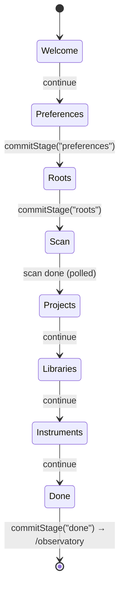
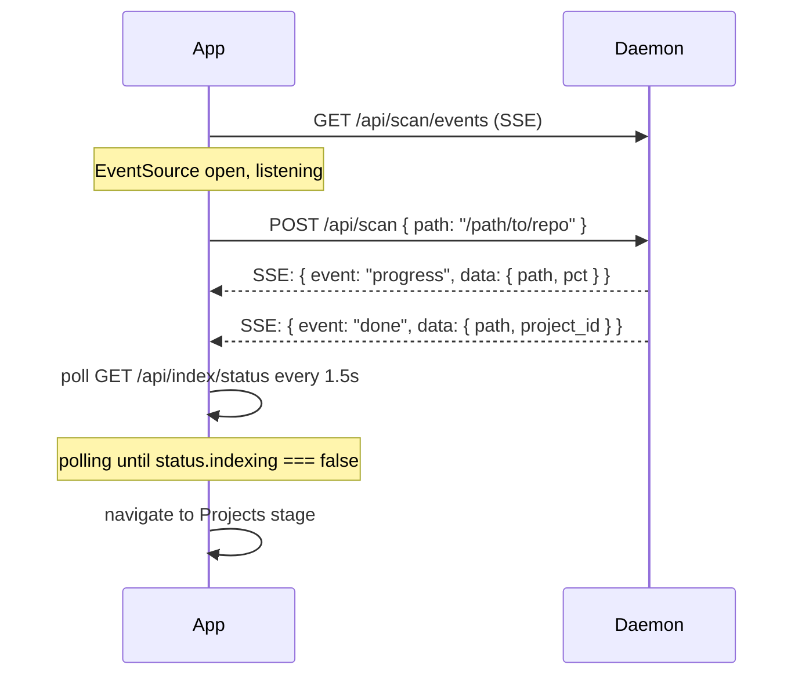
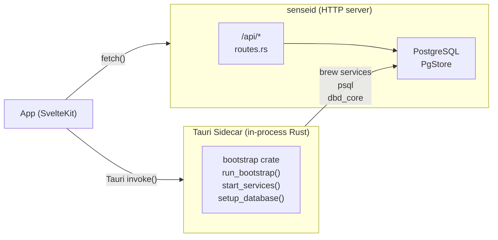

# Configure (Setup Wizard) Design

> The guided first-run experience that takes a user from a freshly bootstrapped
> system to a fully configured Sensei installation with indexed projects.

---

## Overview

The setup wizard runs **once** after bootstrap completes on a fresh install.
`appState.setupComplete` persists across restarts — the wizard is skipped on
subsequent launches.

**Actors:**
- **App** — SvelteKit setup routes (`/setup/*`)
- **Daemon** — `senseid` HTTP server (all API calls go here)
- **Database** — PostgreSQL `sensei` / `sensei_dev` schema

---

## Wizard Stages



---

## Stage Details

### Welcome
Static intro screen. No API calls. User clicks Continue.

### Preferences
User sets:
- Language / locale preference
- Privacy settings (telemetry opt-in)

**Commit:** `commitStage("preferences")`
→ `api.setConfig({ language, telemetry, ... })`
→ `PUT /api/config`

### Roots
User adds scan roots (filesystem directories to index).
Each root is added immediately via API.

**Add root:** `api.addScanRoot(path)`
→ `POST /api/scan/roots` `{ path }`

**Remove root:** `api.removeScanRoot(path)`
→ `DELETE /api/scan/roots` `{ path }`

**Commit:** `commitStage("roots")`
→ scans any `roots.filter(r => !r.scanned)` via `api.scanFolder(root.path)`
→ `POST /api/scan` `{ path }`

### Scan
Real-time SSE stream shows indexing progress.



**SSE is opened BEFORE scan is triggered** — no missed events.

### Projects
Shows indexed projects from the daemon.

`GET /api/projects` → list of `{ id, name, path, language, scanned_at }`

User can deselect projects (marks them ignored — not yet implemented in API).
Continue navigates to Libraries.

### Libraries
User selects which libraries/frameworks the project depends on.

`GET /api/libraries` → available libraries
`PUT /api/libraries/selected` → `{ ids: string[] }` *(future — stub today)*

### Instruments (Assistants)
User selects which AI assistants to configure (Claude Code, etc.).

`GET /api/assistants/detect` → list of `AssistantStatus { id, name, installed, configured }`
`POST /api/assistants/configure` `{ ids: string[] }` → runs `claude plugin install sensei` etc.

**Commit:** `commitStage("assistants")` → `api.configureAssistants(selectedIds)`

### Done
Summary screen. Button: "Enter observatory →"

**Commit:** `commitStage("done")` → `appState.setSetupComplete()`
→ `goto("/observatory")`

---

## API Summary

| Stage | Method | Route | Payload |
|-------|--------|-------|---------|
| Preferences | PUT | `/api/config` | `{ key, value }` pairs |
| Add root | POST | `/api/scan/roots` | `{ path }` |
| Remove root | DELETE | `/api/scan/roots` | `{ path }` |
| List roots | GET | `/api/scan/roots` | — |
| Trigger scan | POST | `/api/scan` | `{ path }` |
| Scan events | GET | `/api/scan/events` | SSE stream |
| Index status | GET | `/api/index/status` | — |
| List projects | GET | `/api/projects` | — |
| Detect assistants | GET | `/api/assistants/detect` | — |
| Configure assistants | POST | `/api/assistants/configure` | `{ ids }` |
| Get config | GET | `/api/config` | — |

---

## Class Model (Frontend)

```
WizardState ($state class)
├── stage: WizardStage  ("welcome" | "preferences" | "roots" | "scan" | ... | "done")
├── roots: ScanRoot[]
│   └── { path, scanned, project_id? }
├── preferences: Preferences
│   └── { language, telemetry }
├── assistants: AssistantStatus[]
│   └── { id, name, installed, configured }
├── commitStage(stage) → calls API, advances stage
└── reset()

AppState ($state singleton)
├── setupComplete: boolean  (persisted via Tauri store)
├── setSetupComplete()
└── setHealthReady()
```

---

## Class Model (Daemon — API handlers)

```
POST /api/scan/roots
├── body: { path: String }
├── inserts into scan_roots table
└── response: { ok: true, root: ScanRoot }

DELETE /api/scan/roots
├── body: { path: String }
├── removes from scan_roots table
└── response: { ok: true }

POST /api/scan
├── body: { path: String }
├── enqueues TaskKind::Scan(path)
└── response: { ok: true, task_id: Uuid }

GET /api/scan/events (SSE)
├── subscribes to broadcast channel
└── streams ScanEvent { path, pct, done, project_id? }

GET /api/assistants/detect
├── checks claude CLI, MCP plugin install status
└── response: AssistantStatus[]

POST /api/assistants/configure
├── body: { ids: String[] }
├── runs claude plugin install sensei for each id
└── response: { ok: true, results: ConfigureResult[] }
```

---

## Sidecar vs Daemon



- **Bootstrap** (before daemon is running): always uses the Tauri sidecar.
- **Setup wizard** (after daemon is running): all calls go to daemon's HTTP API.
- The health screen is the transition point: once `allReady`, the app switches from sidecar to HTTP.

---

## Scan Polling Safeguard

The scan stage polls `/api/index/status` every 1.5 s. A timeout prevents infinite loops:

```typescript
const MAX_POLLS = 1200;   // 30 minutes
let pollCount = 0;
pollTimer = setInterval(async () => {
    if (++pollCount > MAX_POLLS) {
        clearInterval(pollTimer);
        // show "scan taking longer than expected" UI
        return;
    }
    const status = await api.indexStatus();
    if (!status.indexing) {
        clearInterval(pollTimer);
        advance();
    }
}, 1500);
```

---

## State Persistence

| State | Where stored | How |
|-------|-------------|-----|
| `setupComplete` | Tauri store (`app-state.json`) | `appState.setSetupComplete()` |
| Scan roots | PostgreSQL `scan_roots` table | via daemon API |
| Config (preferences) | PostgreSQL `config` table | via daemon API |
| Assistant config | Claude Code plugin state | `claude plugin install sensei` |

---

## Error Handling

| Stage | Error | Recovery |
|-------|-------|---------|
| Add root | Path does not exist | UI shows inline error, don't advance |
| Scan | Daemon unavailable | Show retry button |
| Scan | Scan stuck > MAX_POLLS | Show "scan taking longer" message + skip button |
| Assistants | CLI not installed | Show manual install instructions |
| Assistants | Plugin install fails | Show error detail + retry |
