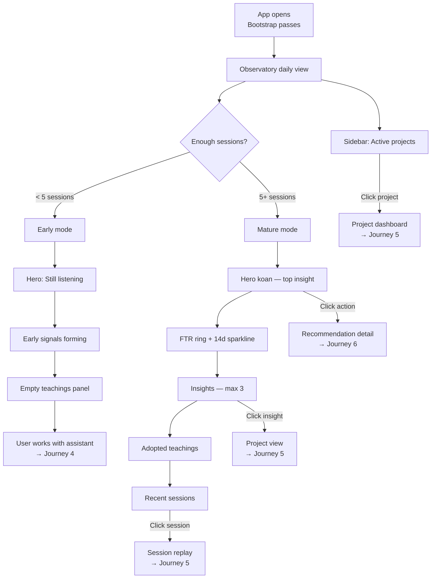

# Journey 3: Observe & Orient

> The daily home screen. Sensei watches sessions quietly, then surfaces what it notices.

## Flow

## Screens

### Observatory — Early mode

Shown when sensei has observed fewer than ~5 sessions. Quiet, unassuming.

**What to show:**
- Date and personal greeting
- An FTR indicator in "building" state (not enough data yet)
- A hero message: sensei is listening. Session count so far. Which repos are showing early signals. Estimated sessions until first lesson.
- Early signals section: nascent observations (e.g., "Watching prompt style in canvas. Early signal: you prefer terse.") with a "listening" status indicator
- Empty teachings panel: explicit message that no teachings have been adopted yet, sensei needs more sessions
- Sidebar: navigation (Today, Sessions, Patterns, Libraries, Settings), active projects (with no FTR scores yet), recent items, daemon health status

**User interaction:**
- Read and understand that sensei is building a baseline.
- Navigate to projects or sessions from the sidebar.

**Why:** Prevent disappointment. The user just set up sensei and sees nothing actionable yet. This screen communicates progress ("4 sessions watched, ~2-3 more until first lesson") so they know the system is working, not broken.

### Observatory — Mature mode

Shown after sensei has enough data to teach. This is the daily-driver screen.

**What to show:**
- Date and personal greeting
- FTR score as a prominent ring/gauge, with a 14-day sparkline trend and delta vs. prior period
- Hero koan card: the single most important insight today. Written as a brief observation (e.g., "The AI does not know your auth.") with supporting context (what happened, where, how often), a call-to-action button (e.g., "Draft a persona"), and impact attribution (FTR change, source session, recency)
- Insights section (max 3): categorized observations — recurring patterns, adopted teachings with FTR impact, drift detection with urgency level
- Adopted teachings: a timeline of recently adopted rules/patterns, showing when adopted, which project, and what changed
- Recent sessions list: last 4-8 sessions with project, title, attempt count, FTR status, and duration
- Sidebar: same navigation as early mode, but active projects now show per-project FTR scores

**User interaction:**
- Read the hero koan and act on it (click the action button to open the action drawer, leading to Journey 6)
- Scan insights for recurring patterns, teaching effectiveness, or drift
- Check FTR trend — overall and per-project
- Click a project in the sidebar to drill into its dashboard (Journey 5)
- Click a session to see its replay with tool calls and corrections (Journey 5)

**Why:** This is the command center. Every morning the user opens sensei and sees the one thing that matters most (hero koan), whether things are improving (FTR trend), what the system has learned (teachings), and where to go deeper (projects, sessions). It drives the feedback loop: observe, orient, act.

## How it works

| Section | Data source | Update frequency |
|---------|------------|-----------------|
| FTR ring | `sessions` table, 14-day window | After each session completes |
| Hero koan | Highest-urgency recommendation from insights engine | Daily or after significant FTR change |
| Insights | Aggregated from session analytics, pattern detection, drift detection | After each session |
| Adopted teachings | `recommendations` where verdict = positive | After impact measurement (7-day window) |
| Recent sessions | Latest 4-8 sessions | Real-time as sessions complete |
| Project FTR | Per-project from `sessions` grouped by `project_id` | After each session |

## How to use

1. **Morning routine:** Open sensei. Read the hero koan. Act on it if urgent. Check FTR trend.
2. **Between sessions:** Glance at insights. Are patterns recurring? Is a teaching working?
3. **End of week:** Review adopted teachings. Is the system getting smarter? FTR trending up?
4. **Drilling down:** Click anything to go deeper — project view, session replay, pattern catalog.

## Data sources

| Data | Source |
|------|--------|
| FTR scores | Computed from `sessions` table (first-try vs. corrected outcomes) |
| Hero koan | Insights engine — highest urgency recommendation |
| Insights | Session analytics, pattern detection pipeline, drift detection |
| Teachings | `recommendations` table, filtered by positive verdict and recommendation_urgency |
| Session list | `sessions` table, ordered by recency |
| Project FTR | `sessions` grouped by `project_id`, 14-day window |
| Daemon health | senseid heartbeat endpoint |
