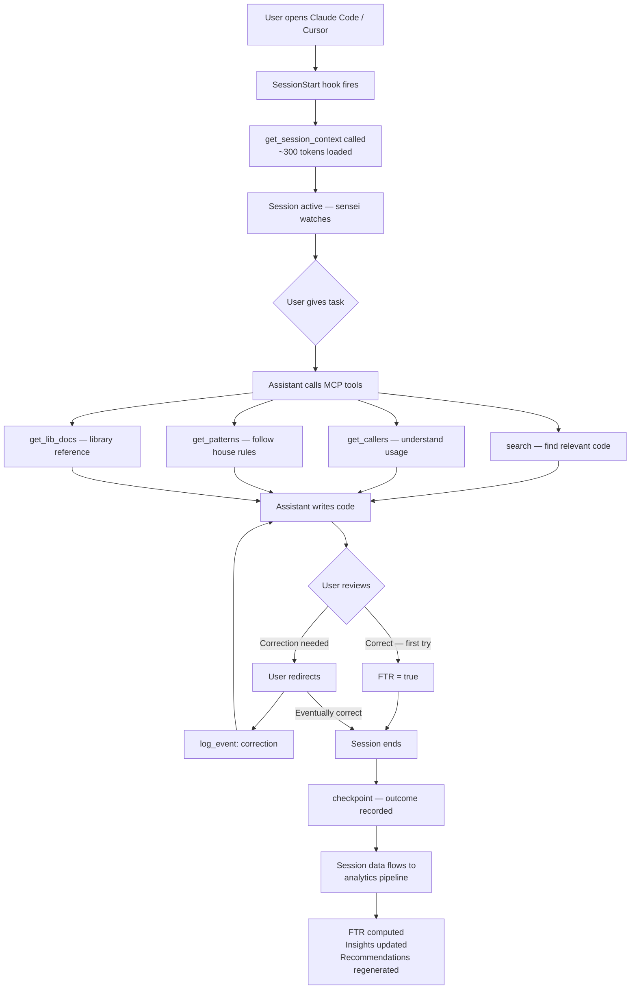
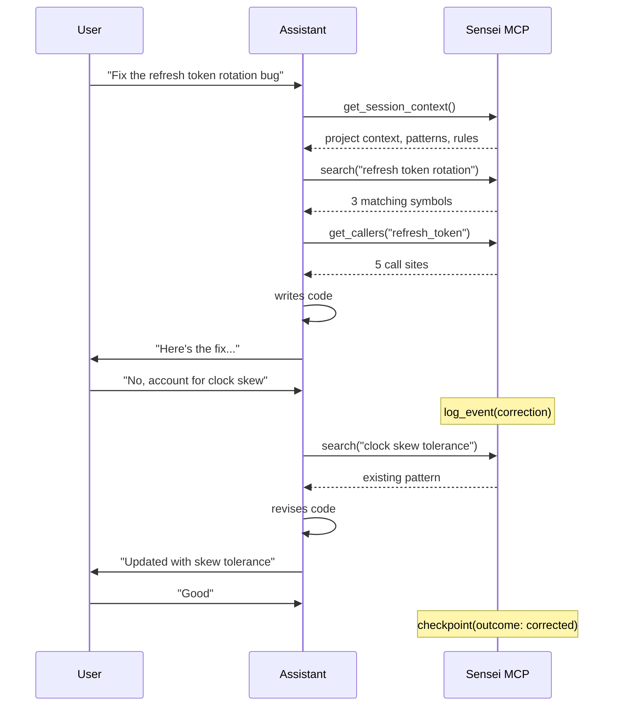
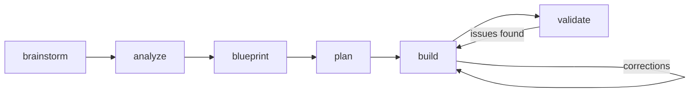

# Journey 4: Work with AI Assistants

> The coding session. Phases, commands, context delivery, personas. The assistant uses sensei's MCP tools to get code right the first time.

## Flow

## Screens

This journey has no sensei desktop screens. It happens entirely inside the AI assistant's interface (Claude Code terminal, Cursor editor, etc.). Sensei is invisible — it works through MCP tools and hooks.

### What the assistant receives (via MCP)

On session start, `get_session_context()` delivers:
- Project and repo identity (e.g., "Lumen Cloud, lumen-auth")
- Current workflow phase (e.g., "build")
- Active task description
- Patterns to follow (e.g., Adapter, Repository)
- Recent decisions from prior sessions (e.g., "clock-skew tolerance, session s-2891")
- Open items and unresolved issues
- Project rules (e.g., "All handlers wrap ApiError")
- Active persona (if configured for the current working directory)

### What sensei captures (invisible to user)

### What gets recorded (per session)

| Event | Captured data |
|-------|-------------|
| Session start | project, folder, ACP, timestamp |
| Tool calls | tool_name, input_params, response, duration, turn_number |
| Corrections | turn where user redirected, what was corrected |
| Phase transitions | brainstorm, analyze, build, validate |
| Outcome | first-try / corrected / abandoned |
| Tokens | input + output token counts |

## Workflow phases

Each phase has a slash command (`/sensei:brainstorm`, `/sensei:build`, etc.) that instructs the assistant on protocol, required MCP calls, and expected outputs.

## Personas and mindsets

Session context is layered:

1. **Global mindsets** apply to every session: analyst, developer, tester — applied in sequence.
2. **Project personas** fire when the working directory matches their triggers (e.g., an "auth-tests" persona activates for `lumen-auth/`).
3. The assistant follows persona rules combined with project patterns.

## How to use

1. **Start a session** in your AI assistant. Sensei hooks fire automatically.
2. **Work normally** — the assistant calls sensei MCP tools as needed.
3. **Correct when needed** — sensei records corrections to learn from.
4. **Session ends** — outcome recorded, analytics updated.
5. **Check impact** in the observatory (Journey 3) — did FTR improve?

## Data sources

| Data | Source |
|------|--------|
| Session context | `get_session_context()` MCP call — aggregates project, patterns, rules, persona |
| Tool calls | Logged by sensei-mcp server on every invocation |
| Corrections | Detected from user redirections in conversation turns |
| Phase transitions | Triggered by `/sensei:*` slash commands |
| Outcomes | `checkpoint()` MCP call at session end |
| FTR computation | Analytics pipeline, post-session |
