# Journey 5: Understand the Codebase

> Explore code structure, browse libraries, replay sessions, try MCP tools.

## Flow

```mermaid
flowchart TD
    A[User clicks project\nin sidebar] --> B[Project dashboard]
    B --> C{Which section?}

    C --> D[Overview]
    D --> D1[Repos list]
    D --> D2[Recommendations]
    D --> D3[Hotspots summary]
    D --> D4[Patterns in use]

    C --> E[Graph]
    E --> E1{Lens mode}
    E1 --> E1a[Call graph — force layout]
    E1 --> E1b[Matrix — heatmap]
    E1 --> E1c[Clusters — community bubbles]
    E --> E2{Overlay}
    E2 --> E2a[Rework heat]
    E2 --> E2b[Duplicate clusters]
    E2 --> E2c[Patterns]
    E2 --> E2d[God-nodes / hotspots]
    E2 --> E2e[Stale / drift]

    C --> F[Patterns]
    F --> F1[Patterns followed — rule / suggested / gap]
    F --> F2[Anti-patterns — with fix cross-links]
    F1 -->|Promote| F3[suggested → rule]
    F2 -->|Fix| F4[Send refactor prompt to ACP]

    C --> G[Sessions]
    G --> G1[Session list — FTR, corrections, duration]
    G1 -->|Click| G2[Session replay]
    G2 --> G2a[Tool call timeline]
    G2 --> G2b[Correction details]
    G2 --> G2c[What assistant asked / received]

    C --> H[Libraries]
    H --> H1[Detected + imported list]
    H1 -->|Click| H2[Library detail]
    H2 --> H2a[Top symbols + usage counts]
    H2 --> H2b[Call sites — file:line:snippet]
    H2 --> H2c[Attached rules]
    H2 --> H2d[MCP tool examples]

    C --> I[MCP Playground]
    I --> I1[Browse tools by category]
    I1 -->|Select tool| I2[Fill inputs + execute]
    I2 --> I3[See request + response]
    I --> I4[Scope switch — sensei / postgres-mcp / stripe-mcp]

    C --> J[Settings]
    J --> J1[Identity — name, icon, client, goal]
    J --> J2[Stack — languages, frameworks, runtimes]
    J --> J3[Links — docs, dashboards, runbooks]
    J --> J4[Guidelines — project rules]
    J --> J5[Skills — per-project toggle]
    J --> J6[Privacy — logging, redaction]
```

## Screens

### Project dashboard (overview)

**What to show:**
- Project identity: name, visibility, goal statement
- FTR sparkline (7-day trend) and session count
- Preferred ACP
- Tabbed navigation: Overview, Graph, Patterns, Sessions, Libraries, MCP Playground, Settings
- Repos list: repo name, local path, language, sync status
- Sensei recommendations: each with title, supporting evidence (e.g. "3 sessions corrected this week"), projected FTR impact, and actions (send to ACP, customize prompt)
- Patterns summary: count of patterns in use, top patterns with occurrence counts, flagged anti-patterns with site counts

**User interaction:**
- Navigate between tabs
- Click a recommendation to open the action drawer
- Click a pattern or anti-pattern to drill into the patterns section

**Why:** Give the user a single-screen health check of their project — what's working, what's not, and what sensei suggests next.

---

### Code graph (3 lens modes x 5 overlays)

**What to show:**
- Interactive graph visualization of code structure
- Lens mode selector: Call graph (force layout), Matrix (heatmap), Clusters (community bubbles)
- Overlay selector: Rework heat, Duplicates, Patterns, God-nodes/hotspots, Stale/drift
- File count and edge count
- Node sizing based on fan-in + fan-out; color coding based on active overlay
- Selected node detail: file name, fan-in/fan-out counts, rework session count, god-node flag
- Actions on selected node: view callers, send refactor prompt

**User interaction:**
- Switch lens mode and overlay
- Click/select a node to see its details
- Pan and zoom the graph
- Launch a refactor prompt from a selected node

**Why:** Let the user visually identify structural problems (god-nodes, hotspots, duplication) and act on them directly.

---

### Session replay

**What to show:**
- Session header: ID, title, time range, duration, correction count, first-try-resolution status
- Vertical timeline of events, each with: timestamp, event kind icon, description
- Event kinds: start, context_loaded, tool_call, edit, test, correction, phase_change, end
- Color coding: corrections in amber, successful tool calls in jade, tests in neutral
- Expanded event detail: tool call input params + full response (JSON), correction details (what was wrong, how it was fixed), edit diffs

**User interaction:**
- Click any event to expand and see full input/response
- Click a correction to see the before/after reasoning
- Navigate the timeline chronologically

**Why:** Let the user understand exactly where a session went wrong and what corrections were needed, so they can create rules or personas to prevent the same failures.

---

### MCP Playground

**What to show:**
- Scope selector: switch between MCP servers (sensei, postgres-mcp, stripe-mcp, etc.)
- Tool categories with counts (project tools, library tools, pattern tools, session tools)
- Selected tool detail: name, description, input parameter form
- Response display area showing full request and response
- Tool usage stats for this project: tool name, call count, flagged tools with zero usage

**User interaction:**
- Switch MCP scope
- Browse tools by category
- Select a tool, fill in inputs, execute it
- View the raw request and response

**Why:** Give the user (and the designer building AI skills) a way to explore and test MCP tools interactively, and to see which tools are underused.

---

### Doc traceability

**What to show:**
- Header stats: docs tracked, current count, drifted count, broken count
- List of doc files: file path, link count, health status (current/drifted/broken), last checked
- Per-doc drill-in: each referenced symbol, expected signature, actual signature, status
- Drift detail: old signature vs. new signature

**User interaction:**
- Filter by status: all, drifted only, broken only
- Click a doc to see its symbol references and their health
- Send a "fix drift" prompt to ACP with the specific drift pre-filled

**Why:** Show doc-to-code links and flag stale/broken references so the user can keep documentation accurate with minimal effort.

---

### Pattern knowledge catalog

**What to show:**
- Catalog browser with category filters: GoF (structural, behavioral, creational), resilience, data access
- Per pattern: name, family, description, example, detection status ("detected in N places" or "not present — recommended")
- Evidence: sessions that used this pattern and their FTR correlation
- Import status: already a project rule, or available to import

**User interaction:**
- Filter by category
- Click a pattern to see full description, example, and codebase matches
- Import a pattern as a project rule (suggested or rule)
- Mark a pattern as a gap (recommended but absent)

**Why:** Let the user browse industry patterns, see which ones are already in the codebase, and import recommended patterns as enforceable rules.

---

### Tool usage analytics

**What to show:**
- Tool frequency chart: usage per week/month as a bar chart
- Unused tools list with analysis of why (skill doesn't mention it, name unclear, etc.)
- Effectiveness correlation: FTR comparison for sessions that used a tool vs. sessions that did not
- Per-tool detail: average response time, percentage of times the result was actually used by the assistant
- Trend: tool adoption over time, especially after skill changes

**User interaction:**
- Browse the frequency chart and click individual tools for detail
- View unused tools and their suggested explanations
- Decide whether to update skill instructions based on tool effectiveness data

**Why:** Help the user understand which MCP tools are valuable and which are being ignored, so they can tune skills to drive better tool adoption and FTR.

---

## How to use

1. **Daily check:** Open project from sidebar. Overview shows recommendations and pattern summary.
2. **Investigate hotspot:** Graph tab, rework overlay, click hot node, see callers, send refactor prompt.
3. **Understand failure:** Sessions tab, click a corrected session, step through tool calls, see where it went wrong.
4. **Explore patterns:** Patterns tab, see what's followed vs. anti-patterns, promote or fix.
5. **Test a tool:** MCP Playground, select tool, fill inputs, run, see response.
6. **Check library usage:** Libraries tab, click library, see top symbols, call sites, rules.
