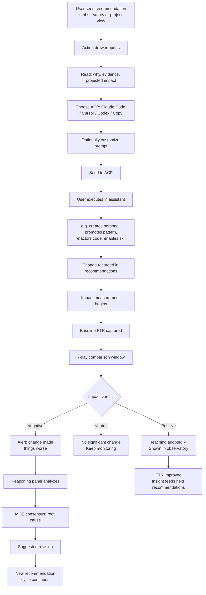
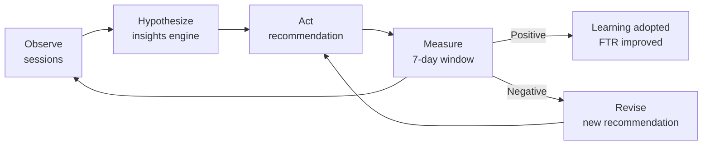

# Journey 6: Measure & Improve

> Close the loop: act on recommendations, measure impact, adjust if it didn't work.

## Flow

## The continuous loop

## Screens

### Action drawer (slide-out panel)

**What to show:**
- Recommendation title and urgency
- "Why" section: plain-language explanation of the problem, referencing specific session data
- Evidence list: session IDs with brief descriptions of what went wrong in each
- Projected impact: estimated FTR improvement
- ACP selector: Claude Code, Cursor, Codex, or Copy to clipboard
- Working directory selector
- Pre-filled prompt: editable text that the user can customize before sending
- Character count for the prompt
- Reasoning panel output (collapsible): what local models concluded and why
- Confidence indicator: "high confidence" vs. "uncertain — two hypotheses"

**User interaction:**
- Read the reasoning and evidence
- Choose which ACP to send the prompt to
- Edit the prompt if needed
- Launch the action in the selected ACP

**Why:** Give the user full transparency into why sensei is recommending something, then make it one click to act on it.

---

### Change impact report

**What to show:**
- Header: change name, date applied, measurement window duration
- Before/after comparison table: FTR, corrections per session, key tool usage metrics, average session duration
- Delta column with directional indicators
- Verdict badge: POSITIVE, NEUTRAL, or NEGATIVE
- Reasoning summary: one paragraph explaining why the change helped or hurt

**User interaction:**
- Review the metrics comparison
- If negative: choose to revise the rule, revert the change, or keep monitoring
- Navigate to the original recommendation or the sessions that were measured

**Why:** Close the feedback loop. The user needs to know whether the change they made actually improved things, and if not, what to do next.

---

### Negative impact alert

**What to show:**
- Alert banner with change name and severity
- FTR delta: before vs. after, with direction
- Corrections delta: before vs. after
- MOE reasoning trace: each model's individual analysis, followed by the consensus conclusion and confidence level
- Root cause explanation

**User interaction:**
- Expand the reasoning trace to read each model's analysis
- Choose action: revise the rule, revert the change, keep monitoring, or dismiss
- "Revise rule" opens the action drawer with a pre-filled revision prompt

**Why:** Surface problems quickly when a change is making things worse, and provide enough analysis for the user to decide whether to fix, revert, or wait.

---

## How to use

1. **See a recommendation** in observatory or project overview.
2. **Click it** — action drawer opens with evidence and prompt.
3. **Send to your ACP** — execute the change (create persona, promote pattern, etc.).
4. **Wait 7 days** — sensei measures the impact automatically.
5. **Check the verdict** — positive (teaching adopted), neutral (keep watching), negative (revise).
6. **If negative** — read the reasoning panel analysis, then revise or revert.
