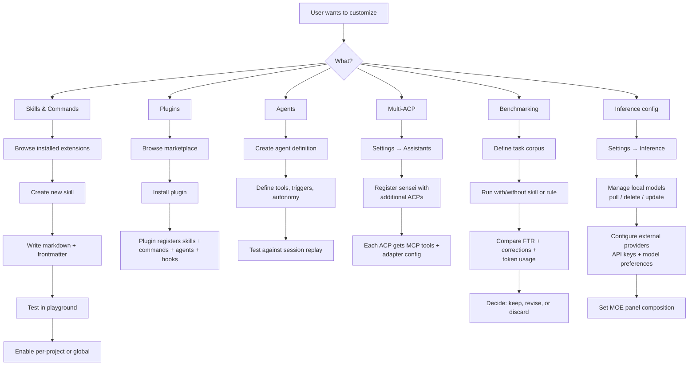

# Journey 7: Extend & Customize

> Custom skills, commands, agents, plugins. Multiple AI assistants. Benchmarking effectiveness.

## Flow

## Screens

### Extensions browser

**What to show:**
- Filter bar: All, Skills, Commands, Agents, Hooks, Plugins
- Scope filter: Global or per-project (dropdown)
- Extension list, each item showing: icon, name, kind badge (skill/command/agent/hook/plugin), source badge (builtin/marketplace/local), scope, enabled/disabled toggle
- Create/import actions: create skill, create agent, import plugin

**User interaction:**
- Filter by kind and scope
- Toggle extensions on/off
- Click an extension to open its editor
- Create a new skill or agent, or import a plugin from marketplace or git URL

**Why:** Central place to see everything installed, enable/disable per project, and launch creation workflows. Accessible from the sidebar (global, not project-scoped).

---

### Skill editor

**What to show:**
- Two sections: structured frontmatter (name, description, trigger conditions) and markdown body (code editor)
- Preview panel: what `get_session_context()` returns when this skill is active
- Toolbar: Save, Export as .md, Import from .md, Test in playground

**User interaction:**
- Edit frontmatter fields and markdown content
- Preview the assembled context
- Test the skill in the playground to verify it fires correctly
- Export to a .md file or import from one (round-trip)

**Why:** Let users author and iterate on skills with immediate feedback on how they affect session context.

---

### Agent editor

**What to show:**
- Structured form: name, description, trigger type (manual, scheduled, event-driven)
- Tool access checklist: which MCP tools this agent can call
- Autonomy level: fully autonomous, requires approval at checkpoints, manual only
- Template selector: pre-built templates for common tasks (code review, test generation, doc update)
- Test panel: pick a session replay, run the agent against it, see what actions it would take

**User interaction:**
- Define agent properties and tool access
- Choose autonomy level
- Start from a template or build from scratch
- Test against historical session replays before enabling

**Why:** Let users define autonomous agents with controlled tool access and test them safely against real session data before deploying.

---

### Persona editor

**What to show:**
- Trigger section: cwd glob patterns, file type filters, module name patterns
- Rules list: what the assistant should know/follow when this persona is active (add, remove, reorder)
- Context: files to always include, patterns to enforce
- Evidence trail: which sessions/corrections inspired this persona (linked from recommendations)
- Preview: simulated `get_session_context()` output with this persona active

**User interaction:**
- Set trigger conditions
- Add/edit/reorder rules
- Link evidence sessions
- Preview the assembled context to verify correctness

**Why:** Let users create project-specific personas grounded in real session failures, with immediate preview of what the assistant will see.

---

### Inference settings

**What to show:**
- Local models section: list of pulled models with name, size, role (reasoning/second opinion), status (active/not pulled), pull/delete actions
- MOE reasoning panel config: three role selectors (proposer, challenger, synthesizer), each choosing from local or external models
- External providers: table of configured providers with API key status and test-connection action
- Routing preference: Auto (local for simple, external for complex), Always local, Always external

**User interaction:**
- Pull or delete local models
- Configure MOE panel composition
- Add/remove external provider API keys and test connections
- Set routing preference

**Why:** Give users control over which models power sensei's reasoning, balancing cost, speed, and capability.

---

### Multi-ACP configuration

**What to show:**
- List of detected ACPs with registration status (registered/unregistered)
- Per-ACP detail: what's registered (MCP server, plugin, skills, hooks, logging)
- Transport configuration: stdio vs. HTTP per ACP
- Connection test result

**User interaction:**
- Click an ACP to see registration detail
- Re-register if adapter config changed
- Test the MCP connection from each ACP
- Configure ACP-specific transport settings

**Why:** Let users manage how sensei integrates with each AI assistant, ensuring MCP tools are reachable and correctly registered.

---

### Benchmark runner

**What to show:**
- Benchmark definition: name, task corpus (list of task descriptions), project scope
- Variants: A (baseline, no change) and B (with the change — skill, rule, or persona)
- Results table: FTR, corrections average, token usage average, duration average, with deltas
- Conclusion text: plain-language summary of whether the change is effective
- Actions: promote change to permanent, run again, discard

**User interaction:**
- Define a task corpus and select variants
- Run the benchmark
- Review the side-by-side results
- Decide whether to keep, iterate, or discard the change

**Why:** Let users measure whether a skill, rule, or persona actually improves outcomes before committing to it permanently.

---

## How to use

1. **Create a skill** — Extensions, create, write markdown, test, enable.
2. **Install a plugin** — Extensions, import from marketplace or git URL.
3. **Configure inference** — Settings, Inference, pull models, add API keys, set MOE panel.
4. **Add an ACP** — Settings, Assistants, register sensei with a new AI tool.
5. **Benchmark a change** — define task corpus, run A/B, compare FTR and corrections.
6. **Export/import skills** — Extensions, export as .md or import from .md.
