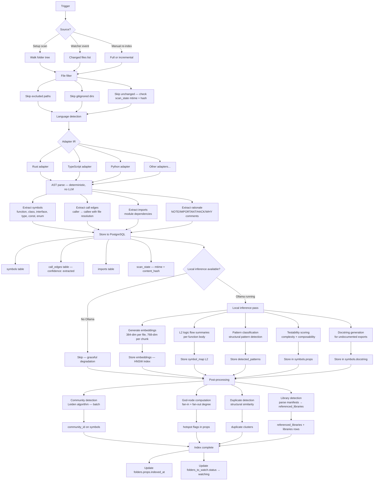

# System: Indexing Pipeline

> What happens when sensei scans a repo — from file discovery to searchable graph.

## Pipeline flow



## Stages in detail

### 1. File discovery & filtering

| Source | Input | Output |
|--------|-------|--------|
| Setup scan | `folders_to_watch.path` | All files under root, respecting depth rules |
| Watcher event | File path from notify | Single changed file |
| Manual re-index | Folder or full repo | All files or changed since last index |

**Filters applied:**
- `folders_to_watch.excluded` patterns
- Hardcoded ignores: `node_modules`, `dist`, `build`, `target`, `.git`, etc.
- `scan_state` mtime + content_hash — skip unchanged files

### 2. Adapter IR (idea 22)

Language-specific parsers produce a common intermediate representation. This separates parsing from processing — new languages only need a new adapter, not changes to the pipeline.

```
Source file → Language adapter → Adapter IR → Pipeline stages
```

| Adapter | Languages | Parser |
|---------|-----------|--------|
| Rust | .rs | tree-sitter-rust |
| TypeScript | .ts, .tsx, .js, .jsx | tree-sitter-typescript |
| Python | .py | tree-sitter-python |
| SQL | .sql, .ddl | tree-sitter-sql |
| Svelte | .svelte | tree-sitter-svelte |
| Swift | .swift | tree-sitter-swift |

### 3. Symbol extraction (deterministic)

No LLM needed. AST parsing extracts:
- **Symbols:** name, kind, signature, docstring, line range, is_exported
- **Call edges:** caller → callee with file resolution, confidence = `extracted`
- **Imports:** module-level dependency tracking
- **Rationale:** comments tagged with NOTE/IMPORTANT/HACK/WHY/TODO/REASON

### 4. Local inference pass (idea 20 — optional)

Runs only if Ollama is available. Graceful degradation if not.

| Task | Model | Output | Stored in |
|------|-------|--------|-----------|
| Embeddings | all-MiniLM-L6-v2 | 384-dim per file | `embeddings` table (HNSW) |
| Chunk embeddings | all-MiniLM-L6-v2 | 768-dim per chunk | `chunks` table (HNSW) |
| L2 summaries | gemma3 | Logic flow description | `symbol_map.l2` |
| Pattern classification | gemma3 | Pattern type + confidence | `detected_patterns` |
| Testability scoring | gemma3 | Complexity + composability score | `symbols.props` |
| Docstring generation | gemma3 | Generated docstring | `symbols.docstring` |

### 5. Post-processing (batch)

Runs after all files are indexed. These are graph-wide operations.

| Operation | Algorithm | Output |
|-----------|-----------|--------|
| Community detection | Leiden (topology-based) | `community_id` on symbols |
| God-node detection | Degree computation (fan-in + fan-out) | Hotspot flags in `folders.props` |
| Duplicate detection | Structural similarity (normalized AST) | Duplicate clusters |
| Library detection | Parse Cargo.toml, package.json, etc. | `libraries` + `referenced_libraries` rows |

### 6. Context delivery preparation (idea 14)

After indexing, content is available at four resolution levels:

| Level | Content | Tokens | Use case |
|-------|---------|--------|----------|
| L0 | Symbol signatures | ~10 per symbol | Orientation, listing |
| L1 | Signatures + descriptions | ~50 per symbol | Context packs |
| L2 | Logic flow summaries | ~200 per function | Deep understanding |
| L3 | Full source | Variable | Complete reference |

MCP tools (`search`, `get_callers`, etc.) serve content at the appropriate level based on token budget.

## Triggered by

| Trigger | Scope | Frequency |
|---------|-------|-----------|
| Setup wizard scan | All roots | Once (first run) |
| File watcher event | Single file | Real-time (debounced 500ms) |
| Manual re-index | Single repo or all | On-demand |
| `sensei index --force` | Single repo | On-demand (CLI) |

## Tables written

`symbols`, `call_edges`, `imports`, `symbol_map`, `scan_state`, `chunks`, `embeddings`, `detected_patterns`, `referenced_libraries`, `libraries`
