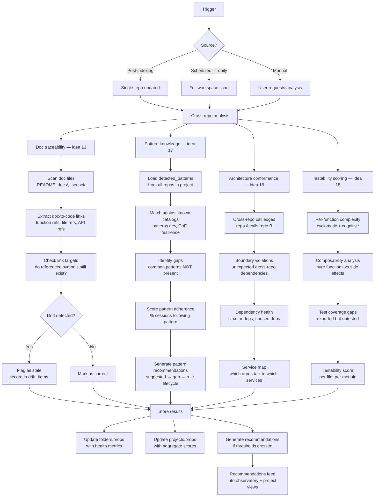
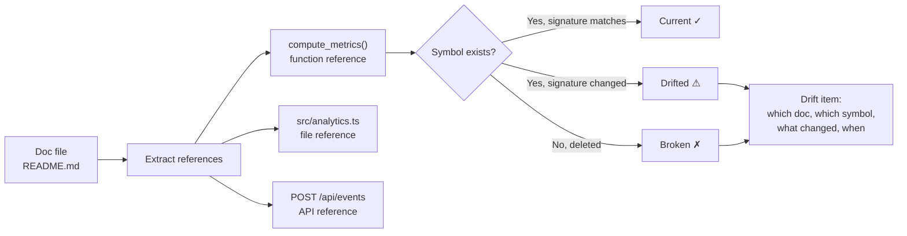
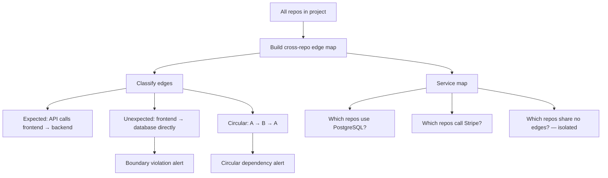

# System: Workspace Intelligence

> Cross-repo analysis: conformance checking, doc traceability, pattern knowledge, architecture health.

## Pipeline flow



## Doc traceability detail (idea 13)



**Drift actions surfaced to user:**
- "README references `compute_metrics(query)` but signature changed to `compute_metrics(query, window)`"
- "API doc references `POST /api/events` which was renamed to `POST /api/v2/events`"
- Action: "Update doc" → sends prompt to ACP

## Pattern knowledge detail (idea 17)

Sources for pattern matching:

| Source | Content | How used |
|--------|---------|----------|
| patterns.dev | Industry standard patterns | Match against detected code structures |
| GoF catalog | Gang of Four design patterns | Classify detected patterns |
| Project rules | User-promoted patterns | Enforce in sessions |
| Session history | Patterns that correlate with high FTR | Recommend adoption |

**Pattern lifecycle integration:**
```
Industry catalog  →  Match against codebase  →  suggested
                                              →  gap (recommended but absent)
User promotes    →  rule (enforced in sessions)
Session data     →  correlate FTR with pattern use → evidence for promotion
```

## Architecture conformance detail (idea 16)



## Testability scoring detail (idea 18)

Per-function scoring:

| Factor | Weight | Measurement |
|--------|--------|-------------|
| Cyclomatic complexity | 0.3 | Branches, loops, conditions |
| Side effects | 0.3 | IO, mutations, global state |
| Dependency count | 0.2 | Number of imports/injected deps |
| Test existence | 0.2 | Matching test file/function found |

Score: 0-100. Files below 40 flagged as "hard to test." Surfaced in project overview and code graph (testability overlay — potential addition to the 5 existing overlays).

## Triggered by

| Trigger | Scope | Frequency |
|---------|-------|-----------|
| Post-indexing | Single repo | After each index run |
| Scheduled | Full workspace | Daily (configurable) |
| Manual | Specific project | On-demand from UI/CLI |

## Tables read/written

**Read:** `symbols`, `call_edges`, `imports`, `detected_patterns`, `folders`, `projects`, `referenced_libraries`

**Write:** `folders.props` (health metrics), `projects.props` (aggregate scores), recommendations (if thresholds crossed)
