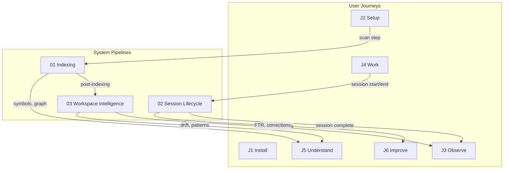

# System Pipelines

What sensei does behind the scenes. These pipelines have no screens — they are triggered by user actions in the user journeys or run on schedules.

## Pipelines

| # | Pipeline | Triggered by | Ideas covered |
|---|----------|-------------|---------------|
| 01 | [Indexing Pipeline](./01-indexing-pipeline.md) | Scan (J2), watcher events (J4), manual re-index | 08, 22, 14, 18, 09, 20 |
| 02 | [Session Lifecycle](./02-session-lifecycle.md) | Session start/end in ACP (J4) | 11, 07, 04, 01 |
| 03 | [Workspace Intelligence](./03-workspace-intelligence.md) | Post-indexing, daily schedule, on-demand | 16, 13, 17, 18 |

## How they connect to user journeys

