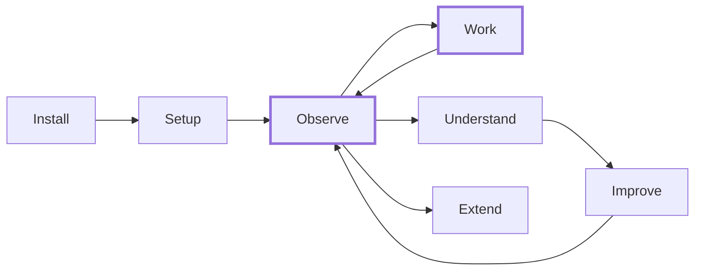

# Journeys

How users experience sensei, and what the system does behind the scenes. Each journey references the [ideas](../ideas/) it covers.

For conceptual depth, see [ideas](../ideas/). For implementation detail, see [design](../design/).

---

## The arc

New users move left to right. Returning users live in the **Observe → Work → Improve** loop.

---

## User journeys

| # | Journey | Screens | Ideas covered |
|---|---------|---------|---------------|
| 1 | [Install & Bootstrap](./01-install-bootstrap.md) | Bootstrap, homebrew-missing | 26, 03 |
| 2 | [Setup & Discovery](./02-setup-discovery.md) | Welcome, assistants, folders, scan, projects, libraries, MCP registry, inference, enter | 24, 16, 09, 12, 20 |
| 3 | [Observe & Orient](./03-observe-orient.md) | Observatory (early + mature modes) | 24, 07, 10 |
| 4 | [Work with Assistants](./04-work-with-assistants.md) | In-ACP (invisible — no sensei screens) | 01, 02, 04, 11, 23, 14 |
| 5 | [Understand the Codebase](./05-understand-codebase.md) | Project overview, code graph, patterns, sessions, replay, libraries, playground, doc traceability, pattern catalog, tool analytics | 08, 15, 17, 09, 13, 25, 10 |
| 6 | [Measure & Improve](./06-measure-improve.md) | Action drawer, change impact report, negative impact alert | 07, 25, 20 |
| 9 | [Memory & Learning](./09-memory-and-learning.md) | Observatory memory panel, project memory view, memory detail, consolidation, context pack tool | 30, 27, 11 |
| 7 | [Extend & Customize](./07-extend-customize.md) | Extensions browser, skill editor, agent editor, persona editor, inference settings, multi-ACP config, benchmark runner | 12, 21, 23, 19, 20, 24b |

## System journeys

Behind-the-scenes pipelines with no user-facing screens. Triggered by user actions or schedules.

| Journey | Triggered by | Ideas covered |
|---------|-------------|---------------|
| 01 | [Indexing Pipeline](./08-system-pipelines/01-indexing-pipeline.md) | Scan, watcher events, manual re-index | 08, 22, 14, 18, 09, 20 |
| 02 | [Session Lifecycle](./08-system-pipelines/02-session-lifecycle.md) | Session start/end in ACP | 11, 07, 04, 01 |
| 03 | [Workspace Intelligence](./08-system-pipelines/03-workspace-intelligence.md) | Post-indexing, scheduled, on-demand | 16, 13, 17, 18 |

---

## Coverage matrix

Every idea is covered by at least one journey.

| Idea | Title | User journey | System journey |
|------|-------|-------------|----------------|
| 01 | Workflow System | J4 | Session Lifecycle |
| 02 | Commands | J4 | — |
| 03 | Configuration | J1, J7 | — |
| 04 | Cross-Cutting Concerns | J4 | Session Lifecycle |
| 05 | Decisions | Reference — no journey needed | — |
| 06 | Docs Disposition | Reference — no journey needed | — |
| 07 | Metrics & Analytics | J3, J6 | Session Lifecycle |
| 08 | Codebase Intelligence | J5 | Indexing Pipeline |
| 09 | Library Intelligence | J2, J5 | Indexing Pipeline |
| 10 | Visualization & Dashboard | J3, J5 | — |
| 11 | Session Continuity | J4, J9 | Session Lifecycle |
| 12 | Multi-Coordinator Support | J2, J7 | — |
| 13 | Doc Traceability | J5 | Workspace Intelligence |
| 14 | Context Delivery | J4 | Indexing Pipeline |
| 15 | Pattern Store | J5 | — |
| 16 | Workspace & System Intelligence | J2 | Workspace Intelligence |
| 17 | Pattern Knowledge | J5 | Workspace Intelligence |
| 18 | Testability & TDD | — | Indexing Pipeline, Workspace Intelligence |
| 19 | Benchmarking & Credibility | J7 | — |
| 20 | Local Inference | J2, J7 | Indexing Pipeline |
| 21 | Custom Agents | J7 | — |
| 22 | Adapter IR | — | Indexing Pipeline |
| 23 | Personas & Mindsets | J4, J7 | — |
| 24 | Desktop Observatory | J2, J3 | — |
| 24a | Observatory Data Audit | Reference — no journey needed | — |
| 24b | Capability Registry | J7 | — |
| 25 | Playground & Insights Engine | J5, J6 | — |
| 26 | Bootstrap & Dependencies | J1 | — |
| 27 | Developer Preferences | J4, J7, J9 | Session Lifecycle |
| 28 | Inference Gateway | J2, J7 | Indexing Pipeline, Session Lifecycle |
| 29 | Collective Intelligence Network | J9 | — |
| 30 | Contextual Memory | J9 | Session Lifecycle |

---

## Mockup coverage

All mockups live in `docs/mockups/lib/`. Design summary in `docs/mockups/summary.md`.

### Screens with mockups

| Screen | Mockup file(s) | Journey | Status |
|--------|---------------|---------|--------|
| Bootstrap (6 gates) | `bootstrap.jsx` | J1 | Complete |
| Setup wizard (10 steps) | `setup-wizard.jsx`, `setup-data.js` | J2 | Complete |
| Inference providers + models | `wiz-inference.jsx` | J2 | Complete |
| Model role assignments | `wiz-assignments.jsx` | J2 | Complete |
| Observatory daily (early + mature) | `observatory.jsx` | J3 | Complete |
| Sessions (digest + timeline + retro) | `sessions.jsx` | J3, J5 | Complete |
| Learnings (original + 3 simplified) | `learnings.jsx`, `learnings-v2.jsx`, `learnings-data.js` | J9 | Complete |
| Project pages (3 layout variants) | `project-pages.jsx`, `project-shared.jsx`, `project-data.js` | J5 | Complete |
| Code graph (3 lenses) | `project-shared.jsx` | J5 | Complete |
| Patterns + anti-patterns | `project-shared.jsx` | J5 | Complete |
| Recommendations + action drawer | `project-shared.jsx` | J5, J6 | Complete |
| Project settings (2 variants) | `project-shared.jsx` | J5 | Complete |
| Libraries (2 variants) | `libraries.jsx` | J5 | Complete |
| Instruments: Playground | `instruments.jsx`, `instruments-simple.jsx`, `instruments-data.js` | J5 | Complete |
| Instruments: Replay | `mcp-replay-insights.jsx`, `mcp-signals-data.js` | J5 | Complete |
| Instruments: Insights | `mcp-replay-insights.jsx`, `mcp-signals-data.js` | J5 | Complete |
| Navigation (3 variants) | `navigation.jsx` | J3 | Complete |
| Design tokens + primitives | `tokens.css`, `primitives.jsx` | All | Complete |

### Screens needing mockups

| Screen | Journey | Priority |
|--------|---------|----------|
| Doc traceability view | J5 | Medium |
| Pattern catalog (industry patterns) | J5 | Low |
| Change impact report | J6 | Medium |
| Negative impact alert | J6 | Medium |
| Extensions browser | J7 | Low |
| Skill / agent / persona editors | J7 | Low |
| Benchmark runner | J7 | Low |

---

## DB ↔ UI gap analysis

Comparison of UI mockup elements vs the PostgreSQL schema (`database/ddl/`).

**Terminology mapping** (mockup → DB):
- Mockup "solutions" = DB `sensei.projects` (grouping entity for 1+ folders)
- Mockup "repos" = DB `sensei.folders` (kind = git | subtree), linked to projects via `folder.project_id`
- Mockup "folder roots" = DB `sensei.folders_to_watch` (user-configured watch roots)

### Well-covered (DB already supports UI)

| UI element | DB table(s) | Schema location | Notes |
|-----------|-------------|-----------------|-------|
| Projects (= mockup "solutions") | `sensei.projects` | `table/sensei/projects.ddl` | name, client, maturity (discovery→archived), goal, icon (kanji), stack, links, guidelines, preferred_acp, tags |
| Folders (= mockup "repos") | `sensei.folders` | `table/sensei/folders.ddl` | kind (parent/folder/git/subtree), project_id FK, props (role, lang, files, stack), remote_urls |
| Folder roots (setup step 4) | `sensei.folders_to_watch` | `table/sensei/folders_to_watch.ddl` | path, name, note, status (scanning→watching→paused), excluded |
| Sessions + FTR | `activity.sessions` | `table/activity/sessions.ddl` | folder_id, project_id, acp_id, outcome, **ftr boolean**, turns, corrections, tokens, duration_ms, module |
| Task sessions | `activity.task_sessions` | `table/activity/task_sessions.ddl` | ftr_score (numeric 0-1), ftr_signals (JSON), status, task_type |
| Code graph | `sensei.nodes`, `sensei.edges` | `table/sensei/nodes.ddl`, `edges.ddl` | Nodes: kind, degree, community_id. Edges: relation (calls, imports, exports, etc.), confidence |
| Communities | `inference.communities` | `table/inference/communities.ddl` | folder_id, community_id, god_node_ids, symbol_count |
| Patterns + anti-patterns | `inference.detected_patterns` | `table/inference/detected_patterns.ddl` | lifecycle (suggested/gap/rule), is_anti_pattern, severity, confidence, instances, evidence, fix_pattern_id (self-ref) |
| Recommendations | `inference.recommendations` | `table/inference/recommendations.ddl` | urgency, title, why, impact, evidence, action_type, prompt, default_acp, baseline_ftr, current_ftr, verdict |
| Memories (learnings) | `sensei.memories` | `table/sensei/memories.ddl` | scope (global/project/stack/task_type/module), type, strength (0-5), status (active/archived), impact |
| Memory evidence + examples | `sensei.memory_evidence`, `memory_examples`, `memory_links` | `table/sensei/memory_*.ddl` | Good/bad examples, evidence sessions, related memories |
| Libraries | `sensei.libraries`, `sensei.referenced_libraries` | `table/sensei/referenced_libraries.ddl` | Per-folder library usage with version_used |
| Library docs | `sensei.library_pages` | `table/sensei/library_pages.ddl` | Library documentation pages |
| MCP / services registry | `sensei.services` | `table/sensei/services.ddl` | kind (data/api/devtool/service/**inference**), protocol (mcp/ollama/anthropic/openai), trigger_stacks, installed, verified, config |
| Extensions (skills/agents) | `sensei.extensions` | `table/sensei/extensions.ddl` | kind (plugin/skill/command/agent/hook), scope, source, props, content |
| Drift detection | `inference.drift_items` | `table/inference/drift_items.ddl` | doc_node → code_node, status (current/drifted/broken), signatures |
| Scan state | `sensei.scan_state` | `table/sensei/scan_state.ddl` | folder_id, file_path, mtime, content_hash |
| Settings | `sensei.config` | `table/sensei/config.ddl` | Key-value configuration |
| API cost tracking | `activity.events` | `table/activity/events.ddl` | event_type = 'api_request', data: {model, tokens, cost_usd} |
| Benchmarks | `sensei.benchmark_runs`, `benchmark_reports` | `table/sensei/benchmark_*.ddl` | Per-folder benchmark runs |
| External links | `sensei.projects.links` | `table/sensei/projects.ddl` | JSONB array: [{id, kind, label, url}] — stored on the project, not a separate table |
| Project guidelines | `sensei.projects.guidelines` | `table/sensei/projects.ddl` | JSONB array: [{id, rule, source}] |

### Resolved gaps (DDL changes applied)

| UI element | Resolution | DDL file(s) |
|-----------|-----------|-------------|
| **Inference role assignments** | Added `inference_role` enum (inference, consolidation, embedding, voice, default_fallback) + `gateway.inference_assignments` table mapping roles to fallback chains. `is_default_fallback` flag marks the catch-all chain per role. | `enum/sensei/inference_role.ddl`, `table/gateway/inference_assignments.ddl` |
| **Memory lifecycle states** | Extended `memory_status` enum: active, reinforced, challenged, battle_tested, archived. | `enum/sensei/memory_status.ddl` |
| **Memory violated/reinforced counts** | Added `violated_count`, `reinforced_count`, `last_relevant_at` columns to `sensei.memories`. | `table/sensei/memories.ddl` |
| **Tool call usage** | `activity.events` already tracks this via `data.used_in_response` in tool_call payloads. Added `tool_usage` enum for typed queries and future column promotion. | `enum/sensei/tool_usage.ddl` |
| **Folder roles** | Added typed `role` column (`folder_role` enum: backend, frontend, library, docs, infra) to `sensei.folders`. Replaces the untyped `props.role` JSON convention. | `table/sensei/folders.ddl`, `enum/sensei/folder_role.ddl` |

### Remaining design considerations

| UI element | Status | Notes |
|-----------|--------|-------|
| **Session retro (cross-project)** | Compute at query time | Sessions UI retrospective ("going well" / "not going well") is derived from sessions + memories. Cache in `inference.recommendations` with `action_type = 'retro'` if query performance becomes an issue. |
| **Observatory maturity state** | Derive at query time | "Early" vs "mature" is `count(sessions) where project_id = X`. No table change needed. |
| **Hyperedges in UI** | DB ready, UI not | `inference.hyperedges` has no mockup yet. Data is ready for code graph UI extension. |

### Mockup naming → DB naming translation

The mockups use a fictional product (Lumen) with different terminology than the DB. When implementing:

| Mockup term | Mockup meaning | DB entity | DB column |
|-------------|---------------|-----------|-----------|
| solution | Multi-repo product group | `sensei.projects` | — (projects IS the grouping) |
| project / repo | Individual git repository | `sensei.folders` | `kind = 'git'` or `kind = 'subtree'` |
| folder root | User-configured watch path | `sensei.folders_to_watch` | `path`, `status` |
| ACP / assistant | AI coding tool | `sensei.assistants` | `family`, `configured`, `configured_version` |
| coaching koan | Actionable recommendation | `inference.recommendations` | `title`, `why`, `impact` |
| teaching adopted | Memory promoted to rule | `sensei.memories` | `status`, `strength` |
| FTR (binary) | Was session first-try-right? | `activity.sessions` | `ftr boolean` |
| FTR (score) | Quality score 0-1 | `activity.task_sessions` | `ftr_score numeric(4,3)` |
| MCP server | External service | `sensei.services` | `protocol = 'mcp'` |
| Inference provider | LLM provider | `sensei.services` | `kind = 'inference'` |
