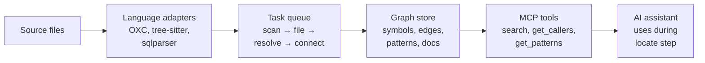
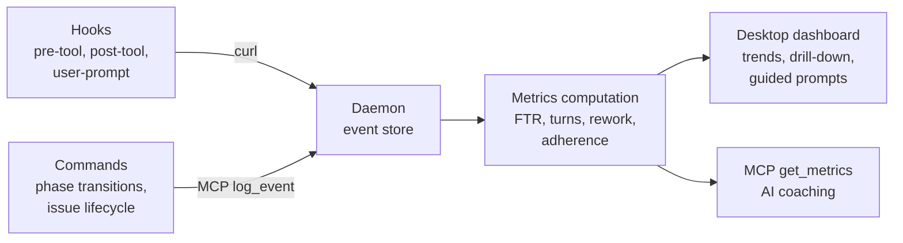
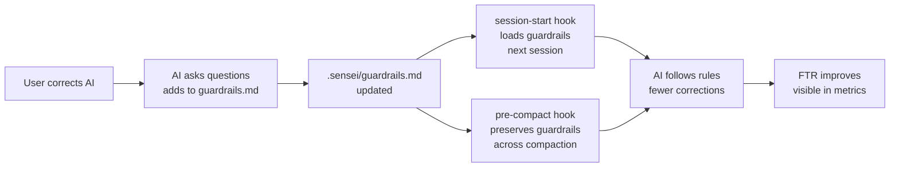
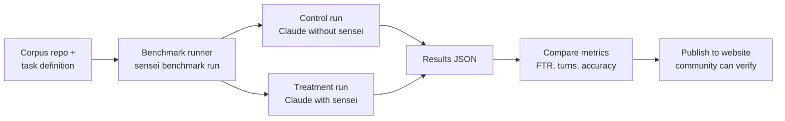

# System Architecture

## Component map

```
┌──────────────────────────────────────────────────────────────────────────────┐
│  USER LAYER                                                                  │
│                                                                              │
│  ┌─────────────┐  ┌──────────────┐  ┌──────────────┐  ┌──────────────────┐  │
│  │  Desktop     │  │  CLI         │  │  Website      │  │  AI Assistant    │  │
│  │  (Tauri +    │  │  (optional)  │  │  (static,     │  │  (Claude Code,   │  │
│  │  SvelteKit)  │  │              │  │  marketing +  │  │  Cursor, etc.)   │  │
│  │              │  │              │  │  benchmarks)  │  │                  │  │
│  └──────┬───────┘  └──────┬───────┘  └──────┬───────┘  └────────┬─────────┘  │
│         │                 │                 │                    │            │
└─────────┼─────────────────┼─────────────────┼────────────────────┼────────────┘
          │ HTTP            │ HTTP            │ static             │ MCP (stdio)
          ▼                 ▼                 │                    ▼
┌──────────────────────────────────────────────┼───────────────────────────────┐
│  SERVICE LAYER                               │                               │
│                                              │                               │
│  ┌──────────────────────────────────────┐    │  ┌──────────────────────────┐  │
│  │  Daemon (senseid)                    │    │  │  MCP (sensei-mcp)        │  │
│  │  Rust binary, background service     │    │  │  Rust binary, stdio      │  │
│  │  Port :7744                          │◀───┼──│  Translates MCP tools    │  │
│  │                                      │    │  │  to daemon HTTP calls    │  │
│  │  ┌────────────────────────────────┐  │    │  └──────────────────────────┘  │
│  │  │  Indexer Engine                │  │    │                               │
│  │  │  ├── Language adapters (OXC,   │  │    │                               │
│  │  │  │   tree-sitter, sqlparser)   │  │    │                               │
│  │  │  ├── Task queue (scan → file   │  │    │                               │
│  │  │  │   → resolve → connect)      │  │    │                               │
│  │  │  ├── Pattern detector          │  │    │                               │
│  │  │  └── Doc indexer (frontmatter) │  │    │                               │
│  │  ├────────────────────────────────┤  │    │                               │
│  │  │  Graph Store (SQLite)          │  │    │                               │
│  │  │  ├── Symbol nodes (enriched)   │  │    │                               │
│  │  │  ├── Doc nodes (frontmatter)   │  │    │                               │
│  │  │  ├── Edges (CALLS, IMPLEMENTS, │  │    │                               │
│  │  │  │   TRACES_TO, DUPLICATES)    │  │    │                               │
│  │  │  └── Pattern nodes             │  │    │                               │
│  │  ├────────────────────────────────┤  │    │                               │
│  │  │  Event Store                   │  │    │                               │
│  │  │  ├── 16 event types            │  │    │                               │
│  │  │  ├── Session lifecycle          │  │    │                               │
│  │  │  └── Metrics computation       │  │    │                               │
│  │  ├────────────────────────────────┤  │    │                               │
│  │  │  Library Index                 │  │    │                               │
│  │  │  ├── External doc fetcher      │  │    │                               │
│  │  │  ├── llms.txt generator        │  │    │                               │
│  │  │  └── Usage pattern extractor   │  │    │                               │
│  │  ├────────────────────────────────┤  │    │                               │
│  │  │  HTTP API                      │  │    │                               │
│  │  │  ├── /api/graph/*   (internal) │  │    │                               │
│  │  │  ├── /api/events/*  (internal) │  │    │                               │
│  │  │  ├── /api/state/*   (internal) │  │    │                               │
│  │  │  ├── /api/metrics/* (internal) │  │    │                               │
│  │  │  ├── /api/libs/*    (internal) │  │    │                               │
│  │  │  └── /health, /stop (mgmt)     │  │    │                               │
│  │  └────────────────────────────────┘  │    │                               │
│  └──────────────────────────────────────┘    │                               │
│                                              │                               │
└──────────────────────────────────────────────┼───────────────────────────────┘
                                               │
┌──────────────────────────────────────────────┼───────────────────────────────┐
│  PLUGIN LAYER (lives in marketplace repo)    │                               │
│                                              │                               │
│  ┌──────────────────────────────────────┐    │  ┌──────────────────────────┐  │
│  │  Marketplace                         │    │  │  ACP Adapters            │  │
│  │  ├── commands/ (22 markdown files)   │    │  │  ├── Claude Code         │  │
│  │  ├── skills/ (kept: 7, new: 0)      │    │  │  │   (hooks, skills,     │  │
│  │  ├── hooks/                          │    │  │  │   commands, MCP)      │  │
│  │  │   ├── session-start              │    │  │  ├── Cursor              │  │
│  │  │   ├── pre-compact (NEW)          │    │  │  │   (.cursorrules,      │  │
│  │  │   ├── user-prompt (NEW)          │    │  │  │   MCP)                │  │
│  │  │   ├── pre-tool                   │    │  │  ├── Copilot             │  │
│  │  │   └── post-tool                  │    │  │  │   (copilot-           │  │
│  │  ├── plugins/                        │    │  │  │   instructions.md)    │  │
│  │  │   ├── sensei-mcp/config.json     │    │  │  └── Others (Kiro,      │  │
│  │  │   ├── playwright-mcp/            │    │  │      opencode, Zed)      │  │
│  │  │   └── firebase-mcp/             │    │  └──────────────────────────┘  │
│  │  └── catalog.json                   │    │                               │
│  └──────────────────────────────────────┘    │                               │
│                                              │                               │
└──────────────────────────────────────────────┼───────────────────────────────┘
                                               │
┌──────────────────────────────────────────────┼───────────────────────────────┐
│  DATA LAYER (project files)                  │                               │
│                                              │                               │
│  ┌──────────────────────────────────────┐    │  ┌──────────────────────────┐  │
│  │  Configuration                       │    │  │  Phase Documents          │  │
│  │  ├── ~/.sensei/config.yaml (global)  │    │  │  ├── docs/ideas/          │  │
│  │  ├── .sensei/config.yaml (project)   │    │  │  ├── docs/analysis/       │  │
│  │  ├── .sensei/guardrails.md           │    │  │  ├── docs/blueprints/     │  │
│  │  ├── .sensei/state.yaml             │    │  │  ├── docs/experiments/     │  │
│  │  └── PATTERNS.md                     │    │  │  ├── docs/plans/          │  │
│  └──────────────────────────────────────┘    │  │  └── docs/templates/      │  │
│                                              │  └──────────────────────────┘  │
│  ┌──────────────────────────────────────┐    │                               │
│  │  Graph Data                          │    │  ┌──────────────────────────┐  │
│  │  ├── ~/.sensei/sensei.db (SQLite)    │    │  │  Corpus + Benchmarks     │  │
│  │  ├── ~/.sensei/graph/ (Kuzu future)  │    │  │  ├── benchmarks/         │  │
│  │  └── ~/.sensei/senseid.log           │    │  │  │   registry.yaml       │  │
│  └──────────────────────────────────────┘    │  │  │   tasks.yaml          │  │
│                                              │  │  │   results/             │  │
│                                              │  └──────────────────────────┘  │
└──────────────────────────────────────────────────────────────────────────────┘
                                               │
┌──────────────────────────────────────────────┼───────────────────────────────┐
│  DISTRIBUTION                                │                               │
│                                              │                               │
│  ┌──────────────────────────────────────┐    │  ┌──────────────────────────┐  │
│  │  CI/CD + Releases                    │    │  │  Website                  │  │
│  │  ├── GitHub Actions                  │    │  │  ├── sensei.dev (static)  │  │
│  │  ├── Cargo build (3 binaries)        │    │  │  ├── Philosophy/vision    │  │
│  │  ├── Homebrew tap                    │    │  │  ├── Downloads             │  │
│  │  ├── Desktop installers (DMG/MSI)    │    │  │  ├── Benchmark results    │  │
│  │  └── scripts/link.sh (dev mode)     │    │  │  └── Docs (from docs/)     │  │
│  └──────────────────────────────────────┘    │  └──────────────────────────┘  │
│                                              │                               │
└──────────────────────────────────────────────────────────────────────────────┘
```

---

## Component inventory

### Binaries (Rust, built from Cargo workspace)

| Binary | Crate | Purpose | Runs as |
|--------|-------|---------|---------|
| `senseid` | `crates/senseid` | Daemon — indexer, graph, events, metrics, HTTP API | Background service (:7744) |
| `sensei-mcp` | `crates/sensei-mcp` | MCP server — translates MCP tool calls to daemon HTTP | Spawned by AI assistant (stdio) |
| `sensei` | `crates/sensei-cli` | CLI — optional, for manual operations | User invocation |

### Desktop (Tauri + SvelteKit)

| Component | Location | Purpose |
|-----------|----------|---------|
| Tauri shell | `apps/desktop/src-tauri/` | Native window, system tray, auto-update |
| SvelteKit webview | `apps/desktop/` | UI — dashboards, configuration, analysis |

### Marketplace (Claude Code plugin)

| Component | Location | Purpose |
|-----------|----------|---------|
| Commands (22) | `marketplace/commands/` | Slash commands — workflow phases, cross-cutting, refocus, utility |
| Skills (7 kept) | `marketplace/skills/` | Auto-triggered behaviors — indexing, test-gen, refactor, etc. |
| Hooks (5) | `marketplace/hooks/` | Event-driven — session-start, pre-compact, user-prompt, pre-tool, post-tool |
| Plugin configs | `marketplace/plugins/` | MCP server registrations (sensei-mcp, playwright, firebase) |
| Catalog | `marketplace/catalog.json` | Registry of all components with metadata |

### Website (static)

| Component | Location | Purpose |
|-----------|----------|---------|
| Static site | `apps/website/` (or separate repo) | Marketing, philosophy, downloads, benchmark results |
| Docs content | Generated from `docs/` | Product vision, user journeys, competitive comparison |
| Benchmark dashboard | Generated from `benchmarks/results/` | Published benchmark results, community submissions |

### Configuration (project files)

| File | Location | Owner | Read by |
|------|----------|-------|---------|
| Global config | `~/.sensei/config.yaml` | User | Commands, daemon |
| Project config | `.sensei/config.yaml` | User | Commands, hooks |
| Guardrails | `.sensei/guardrails.md` | User + AI (grows from feedback) | Commands, hooks, session-start |
| State | `.sensei/state.yaml` | Commands + hooks (auto-managed) | Hooks, refocus, status |
| Patterns | `PATTERNS.md` | User + AI | Commands, hooks |
| Phase docs | `docs/{ideas,analysis,blueprints,...}/` | AI (via commands) | Commands (cross-reference) |

### Corpus + Benchmarks

| Component | Location | Purpose |
|-----------|----------|---------|
| Repo registry | `benchmarks/registry.yaml` | Known repos for benchmarking |
| Task definitions | `benchmarks/tasks.yaml` | Predefined tasks per repo |
| Results | `benchmarks/results/` | JSON benchmark results (with/without sensei) |
| Benchmark runner | CLI subcommand or separate tool | Orchestrates A/B benchmark runs |

### ACP Adapters (coordinator-specific integration)

| Coordinator | Integration method | Files generated | Status |
|-------------|-------------------|-----------------|--------|
| Claude Code | Plugin (hooks, skills, commands, MCP) | Full marketplace | Active |
| Cursor | MCP + .cursorrules | `.cursorrules` from config | Planned |
| GitHub Copilot | MCP + instructions file | `copilot-instructions.md` | Planned |
| Kiro | MCP + spec format | TBD | Planned |
| opencode | MCP | TBD | Planned |
| Zed | MCP | TBD | Planned |

---

## Data flows

### Flow 1: Indexing



### Flow 2: Event capture and metrics



### Flow 3: Guardrails lifecycle



### Flow 4: Benchmark pipeline



---

## Ownership matrix

Who builds and maintains each component.

| Component | Primary language | Build system | Maintainer |
|-----------|-----------------|--------------|------------|
| senseid (daemon) | Rust | Cargo | Core team |
| sensei-mcp | Rust | Cargo | Core team |
| sensei (CLI) | Rust | Cargo | Core team |
| Desktop | TypeScript/Svelte + Rust (Tauri) | Bun + Cargo | Core team |
| Marketplace | Markdown + Bash (hooks) | None (files) | Core team + community |
| Website | SvelteKit (static) | Bun | Core team |
| Benchmarks | YAML + runner (TBD) | TBD | Core team + community |
| ACP adapters | Varies per coordinator | Per-coordinator | Core team |
| Configuration schemas | YAML + Markdown | Documented | Core team |

---

## What's built vs. what's planned

| Component | Status | Notes |
|-----------|--------|-------|
| senseid (daemon) | Built | Indexer, graph, sessions, HTTP API working. Needs: event store, workflow state, metrics, pattern detection, rich nodes. |
| sensei-mcp | Built | MCP tools for code intelligence working. Needs: workflow tools (log_event, update_phase, get_workflow_state, get_metrics). |
| sensei (CLI) | Built | Basic operations. Needs: benchmark subcommand. |
| Desktop | Built | Tauri shell + basic views. Needs: quality dashboard, pattern catalog, event log, phase timeline. |
| Marketplace | Partial | 13 commands + 19 skills + 3 hooks exist. Needs: 9 new commands, 2 new hooks, skill retirement, catalog update. |
| Website | Built | Static site at separate repo. Needs: benchmark results page, philosophy/vision content from docs/. |
| Benchmarks | Not started | Registry, task definitions, runner, results format all need design and implementation. |
| ACP adapters | Claude Code only | Full integration. Others planned but not started. |
| Configuration | Partial | Global/project config exists. Guardrails, state file, phase templates need creation. |
| Graph enrichment | Not started | 12 fixes identified in analysis 02. Quick wins (1-3) are near-zero effort. |
