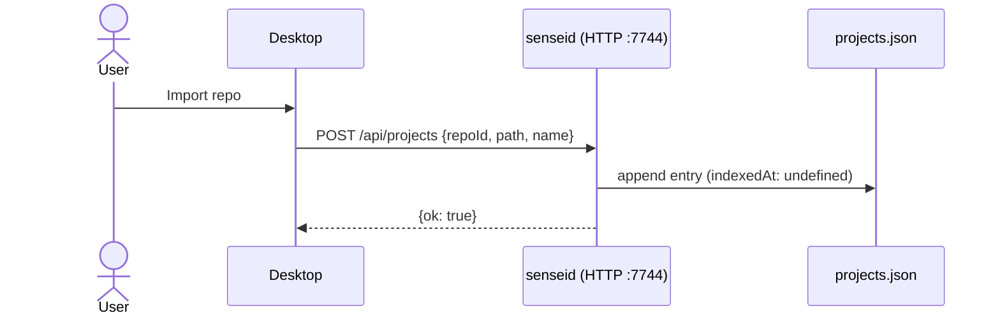
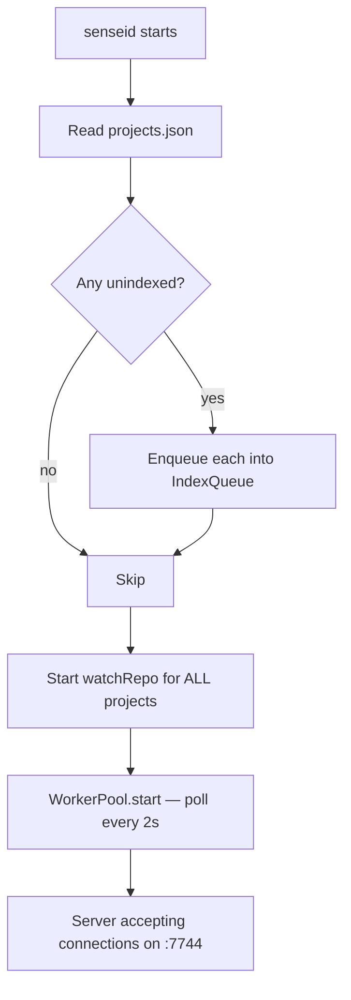
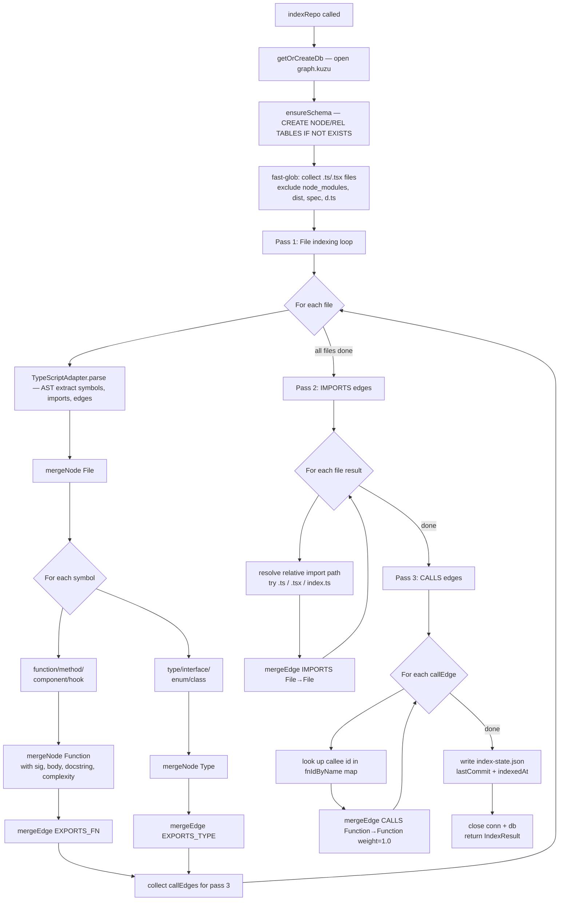
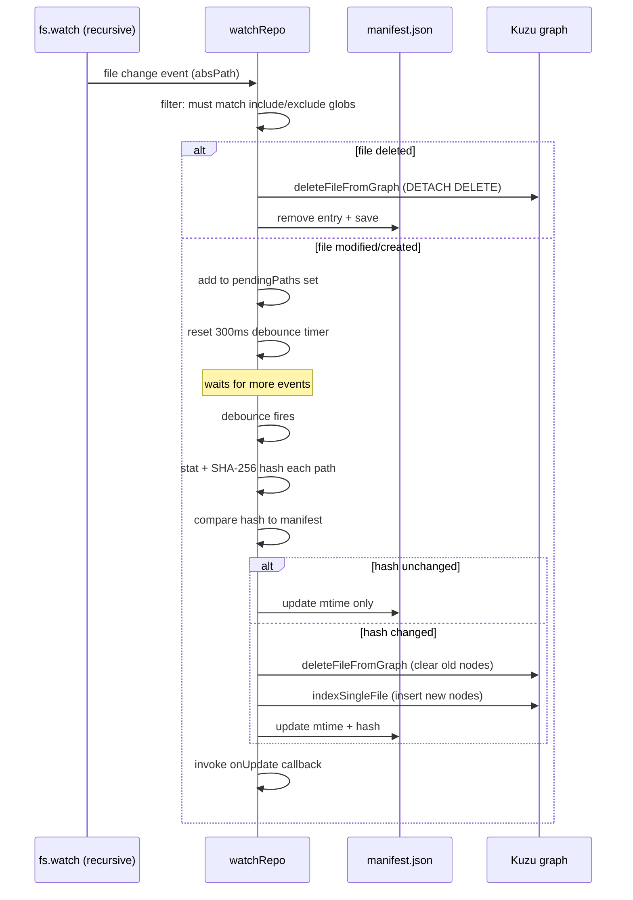
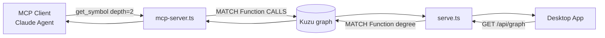
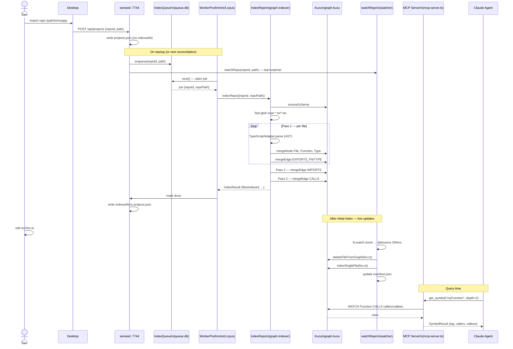

# Indexing Architecture

> Current as of April 2026. Covers the full pipeline from project registration through graph retrieval.
> Implements a Kuzu embedded graph DB, SQLite-backed parallel indexing queue, and an L0–L5 depth
> retrieval model served over MCP.

---

## 1. Overview

Sensei indexes source code into an embedded property graph (Kuzu) stored at
`~/.sensei/projects/<repoId>/graph.kuzu`. The graph captures functions, types, files, comments,
and the relationships between them (calls, imports, exports, annotations). Agents query the graph
via MCP tools using a tiered depth model — fetching only as much detail as their current task needs.

**Key design principles:**

- **Local-first** — everything lives in `~/.sensei/`, no cloud dependency.
- **Parallel across repos, sequential within one** — the Kuzu connection is not re-entrant; a single
  repo is indexed one file at a time. Multiple repos index concurrently via a WorkerPool.
- **Crash-safe** — a SQLite job queue persists state across daemon restarts. Jobs left in `running`
  state at startup are automatically re-queued.
- **Incremental by default** — a SHA-256 + mtime manifest (`manifest.json`) prevents re-indexing
  unchanged files. `fs.watch` delivers live updates with 300 ms debounce.

---

## 2. Storage Layout

```
~/.sensei/
├── projects.json                    # Registry: [{repoId, name, path, indexedAt}]
├── queue.db                         # SQLite — parallel index job queue (WAL mode)
├── serve.pid                        # PID of the running senseid daemon
└── projects/
    └── <repoId>/
        ├── graph.kuzu/              # Kuzu embedded graph DB
        ├── manifest.json            # mtime + SHA-256 per file (watcher state)
        └── index-state.json         # {lastCommit, indexedAt, repoPath}
```

Each repo gets its own isolated Kuzu database. There is no shared graph between repos.

---

## 3. Graph Schema

```
Nodes
─────
Function  id(PK), name, file, line, sig, body, docstring, complexity, project
Type      id(PK), name, file, line, kind, project
File      id(PK), path, module, lang, project
Comment   id(PK), text, tag, line, file, project

Relationships
─────────────
Function  -[CALLS]->          Function    (weight: DOUBLE)
File      -[IMPORTS]->         File
File      -[EXPORTS_FN]->      Function
File      -[EXPORTS_TYPE]->    Type
Function  -[USES_TYPE]->       Type
Comment   -[ANNOTATES_FN]->    Function
Comment   -[ANNOTATES_TYPE]->  Type
```

Node IDs are deterministic:
- `fn:<absPath>:<name>:<lineStart>`
- `type:<absPath>:<name>:<lineStart>`
- `file:<absPath>`

This allows idempotent `MERGE` — re-indexing a file updates nodes in place without creating duplicates.

---

## 4. Full Indexing Flow

### 4.1 Project Registration

A project becomes known to sensei when it is imported via the desktop app or registered via CLI. The
desktop app `POST /api/projects` immediately, which writes an entry to `~/.sensei/projects.json`. At
that point `indexedAt` is `undefined` — marking it as unindexed.



### 4.2 Daemon Startup & Reconciliation

On `sensei serve` / `senseid start`, the daemon performs a **desired-state reconciliation** pass:

1. Reads `projects.json`
2. Enqueues any project without `indexedAt` into the SQLite job queue
3. Launches a `watchRepo` watcher for **every** project (indexed or not)



### 4.3 Parallel Queue & WorkerPool

`IndexQueue` (`packages/server/src/index-queue.ts`) is a SQLite table with WAL mode:

```
index_jobs(id, repo_id UNIQUE, repo_path, status, attempts, created_at, updated_at, error)
```

`WorkerPool` runs up to `min(4, cpuCount)` concurrent workers. Each worker:

1. Calls `queue.next()` — atomically claims the oldest `pending` job and marks it `running`
2. Calls `indexRepo(repoId, repoPath)` — full graph build for that repo
3. On success: `queue.markDone()` + updates `indexedAt` in `projects.json`
4. On failure: `queue.markFailed()` — if `attempts < 3`, status reverts to `pending` for retry;
   otherwise permanently `failed`

Crash recovery: at startup, any job stuck in `running` is reset to `pending`.

```mermaid
flowchart LR
    subgraph SQLite queue.db
        J1[job: repoA pending]
        J2[job: repoB pending]
        J3[job: repoC pending]
    end

    subgraph WorkerPool max=min4,cpus
        W1[Worker 1]
        W2[Worker 2]
        W3[Worker 3]
        W4[Worker 4]
    end

    J1 --> W1
    J2 --> W2
    J3 --> W3

    W1 -->|done| PJ[projects.json\nindexedAt = now]
    W2 -->|failed attempt 1| J2R[re-queue pending]
    W3 -->|done| PJ
```

On-demand re-indexing is also available: `POST /api/index {repoId, repoPath, force}` enqueues
immediately, respecting the deduplication logic (`force=true` resets a completed job).

---

## 5. Per-Repo Indexing (`indexRepo`)

`indexRepo` (`packages/graph-indexer/src/indexer.ts`) performs three sequential passes over a
single repo. Sequential-within-repo is intentional — Kuzu connections are not thread-safe.



**Why three passes?**

- Pass 1 must complete before passes 2 and 3 because IMPORTS and CALLS edges reference nodes that
  may not exist yet (defined in a different file).
- The `fnIdByName` map is built from all pass-1 results before any CALLS edges are written.

---

## 6. Incremental Indexing (Watcher)

`watchRepo` (`packages/graph-indexer/src/watcher.ts`) handles ongoing changes after the initial
full index. It uses a manifest (SHA-256 + mtime per file) to track what has changed.

### 6.1 Initial Rescan

On first `watchRepo` call, a full `doRescan` runs before the `fs.watch` listener starts. This
catches anything that changed while the daemon was offline:

- Files in manifest but not on disk → `deleteFileFromGraph` + remove from manifest
- Files on disk with changed mtime/hash → delete old nodes, re-index file

### 6.2 Live Change Handling



The debounce window (default 300 ms) coalesces rapid bursts (e.g. bulk saves, `git checkout`)
into a single re-index pass.

---

## 7. Graph Retrieval — L0–L5 Depth Model

Agents retrieve symbols via MCP tools that query Kuzu with progressive depth. Requesting deeper
levels costs more tokens but reveals more context.

| Level | Data returned | Typical use |
|-------|---------------|-------------|
| L0 | name, kind, file, line | Symbol existence check, navigation |
| L1 | + sig, docstring | Understanding a symbol's interface |
| L2 | + callers, callees, usedTypes | Impact analysis, tracing call chains |
| L3 | + imports, importedBy (file graph) | Module boundary analysis |
| L4 | (reserved — semantic search) | — |
| L5 | + body, annotated comments | Full implementation detail, WHY tags |

### 7.1 MCP Tools

| Tool | What it does |
|------|--------------|
| `get_symbol` | Fetch one symbol at requested depth (layers.ts) |
| `search_code` | Name-contains search over Function + Type nodes |
| `get_bearings` | Returns symbol count, file count, community map (top-level dir clusters) |
| `get_complexity` | Lists functions sorted by cyclomatic complexity |
| `index_repo` | On-demand trigger: POST /api/index then poll for completion |

### 7.2 Community & God-Node Analysis (REST)

`GET /api/graph?repoId=<id>&repoPath=<path>` returns a summary used by the desktop app:

- **Communities** — functions grouped by top-level directory (2-level max). Each community gets a
  color and a list of its top god-nodes.
- **God nodes** — top 20 functions by combined in+out degree across all CALLS edges.
- **Rationale** — all `Comment` nodes tagged `WHY`, `DECISION`, `HACK`, or `NOTE`.



---

## 8. End-to-End Flow Summary



---

## 9. Non-Functional Properties

| Property | Implementation |
|----------|----------------|
| Parallelism | WorkerPool: up to min(4, cpuCount) repos indexed concurrently |
| Crash recovery | SQLite `running` → `pending` reset on daemon restart |
| Retry | Up to 3 attempts per job before permanently `failed` |
| Idempotency | All writes use Kuzu `MERGE` — safe to re-run |
| Change detection | SHA-256 hash + mtime; hash is authoritative (handles git checkout) |
| Deduplication | `UNIQUE` on `repo_id` in queue; `force=true` to override |
| Token efficiency | L0–L5 depth — agents request only what they need |
| Isolation | Each repo has its own Kuzu DB; no cross-contamination |
