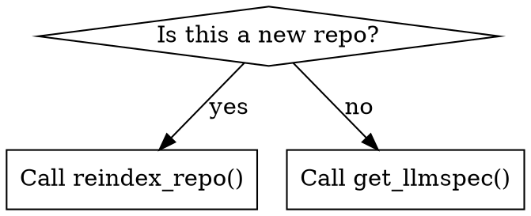

# Skills Design

## Overview

Skills are markdown files that teach agents a protocol, technique, or reference. They are not documentation of what was built — they are guidance for how to work. Skills live in `skills/<name>/SKILL.md` and are symlinked to `~/.claude/skills/<name>/`.

---

## File Format

Every skill is a directory with a required `SKILL.md` and optional supporting files.

```
skills/
  skill-name/
    SKILL.md              Required. Main skill content.
    supporting-file.*     Optional. Only for heavy reference (100+ lines) or reusable tools.
```

### SKILL.md Structure

```markdown
---
name: skill-name-with-hyphens
description: Use when [specific triggering conditions]. No workflow summary.
---

# Skill Name

## Overview
Core principle in 1-2 sentences.

## When to Use
Bullet list of symptoms and conditions. When NOT to use.

## [Core content — technique, pattern, or reference]

## Quick Reference
Table or bullets for scanning.

## Common Mistakes
What goes wrong and how to fix it.
```

### Frontmatter Rules

- Only two fields: `name` and `description`. No other fields.
- Max 1024 characters total for the frontmatter block.
- `name`: letters, numbers, hyphens only. No spaces, parentheses, special chars.
- `description`: starts with "Use when...". Third person. Describes triggering conditions only — never the workflow or process. Under 500 characters.

---

## Skills in This Repo

| Skill | Type | Primary audience |
|---|---|---|
| `codebase-indexer` | Technique | Agents starting work on a new repo |
| `content-compression` | Pattern | Any agent working with code in context |
| `agentic-dev-workflow` | Technique | AI developer agents |
| `doc-drift-detector` | Technique | Agents maintaining documentation |
| `context-manager` | Pattern | Any agent managing context across tasks |
| `benchmark-runner` | Technique | Developers evaluating skill impact |

---

## Claude Search Optimization (CSO)

Skills are discovered by Claude reading descriptions and deciding which to load. The description must answer: "Should I read this skill right now?"

### Description Rules

```yaml
# BAD: summarises workflow
description: Use when indexing repos - scans files, builds symbol map, writes llmspec

# BAD: too vague
description: For working with codebases

# GOOD: triggering conditions only, no workflow
description: Use when starting work on an unfamiliar codebase, when a codebase has changed significantly, or when an agent is doing broad file searches to orient itself.
```

### Keyword Coverage

Include terms Claude would search for:
- Symptoms: "broad file searches", "loading full files", "orientation", "unfamiliar codebase"
- Conditions: "before starting", "when tests fail", "before merging"
- Tools: actual command names, MCP tool names, file names

---

## Token Efficiency

Skills load into every conversation. Every token matters.

| Type | Target word count |
|---|---|
| Orientation skills (loaded every session) | < 150 words |
| Frequently-used skills | < 300 words |
| Technique/reference skills | < 500 words |

### Techniques

- Cross-reference other skills instead of repeating: `**REQUIRED:** Use content-compression skill`
- Put API details in separate files, reference with `--help` or file link
- One excellent code example, not multiple mediocre ones
- Use tables for reference material, not prose

---

## Flowcharts

Use only for non-obvious decision points. Use Graphviz DOT syntax.



Never use flowcharts for: reference material (use tables), linear steps (use numbered lists), code examples (use code blocks).

---

## Testing Requirements

Every skill must be tested before deployment using subagent pressure scenarios.

**Discipline skills** (rules agents must follow): test with pressure scenarios combining time pressure, sunk cost, and authority pressure. Run baseline (agent without skill) → document rationalizations → write skill → verify compliance.

**Technique skills** (how-to guides): test with application scenarios. Can the agent apply the technique correctly to a new problem?

**Reference skills** (API/doc): test with retrieval scenarios. Can the agent find and correctly apply the information?

See `superpowers:writing-skills` for the full TDD-for-skills methodology.

---

## Adding a New Skill

1. Create `skills/<name>/SKILL.md` with valid frontmatter
2. Write content following the structure above
3. Check word count: `wc -w skills/<name>/SKILL.md`
4. Run baseline scenario without skill (document failures)
5. Run test scenario with skill (verify compliance)
6. If skill passes: commit. If not: refine and re-test.
7. Symlink is picked up automatically by install.sh
