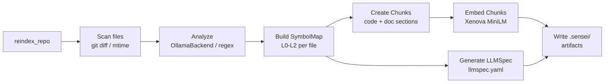
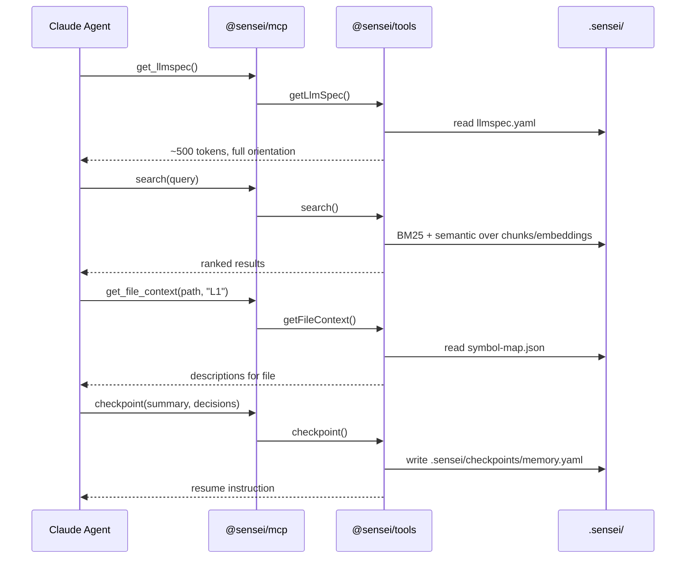
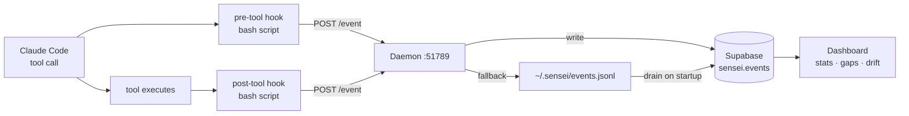
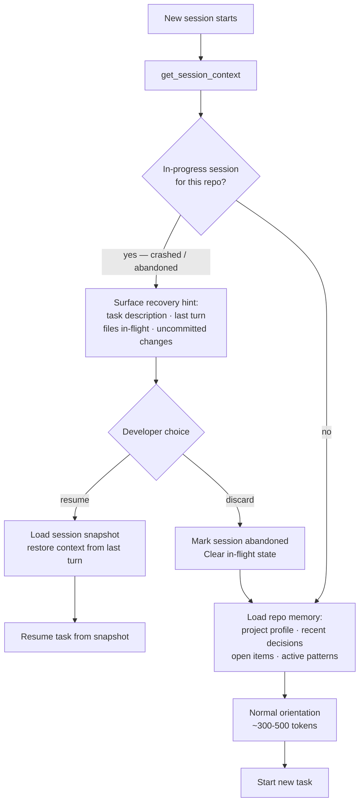
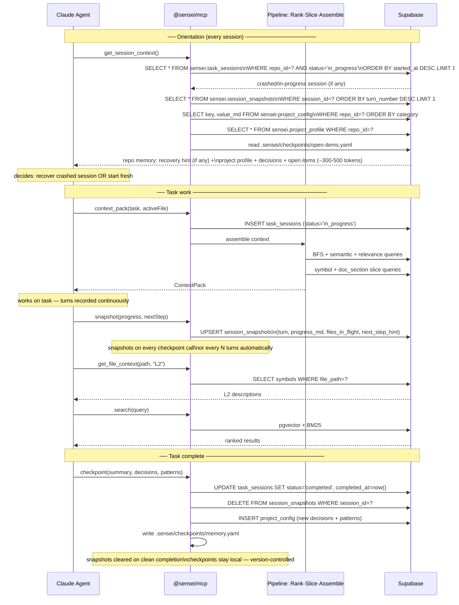
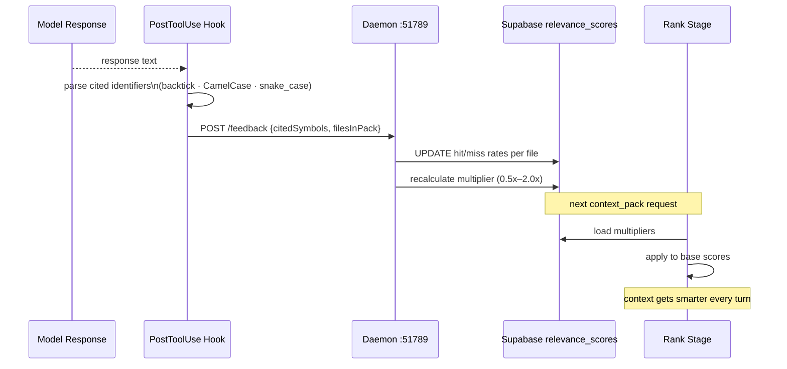
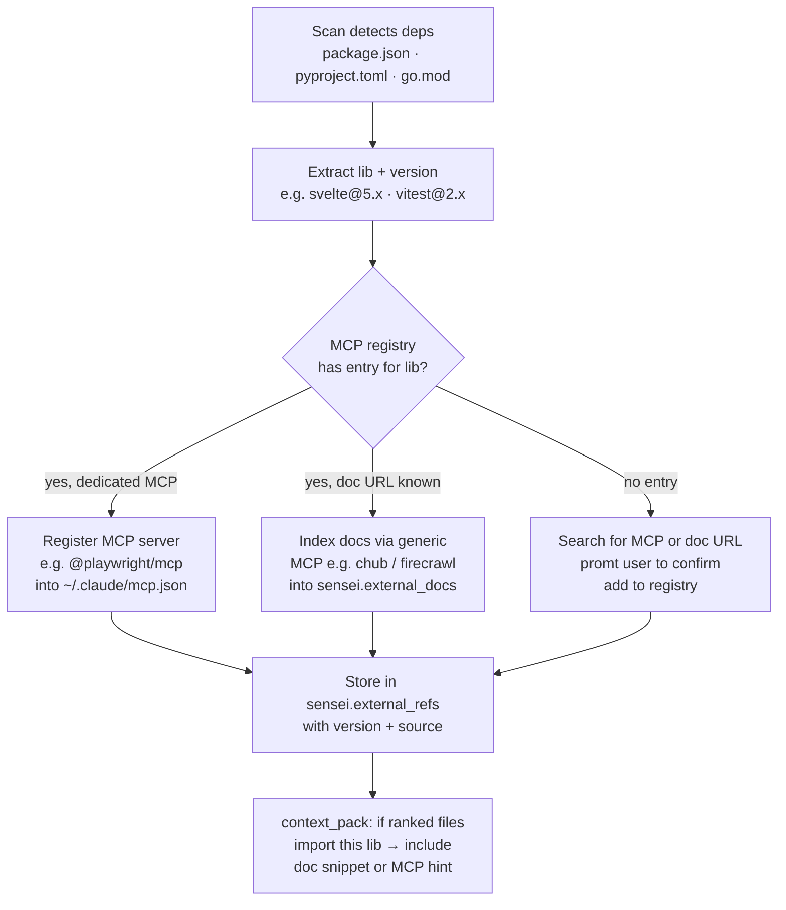
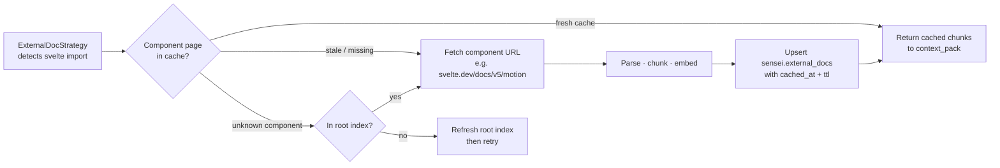
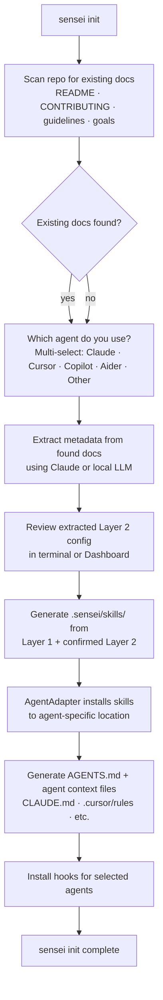
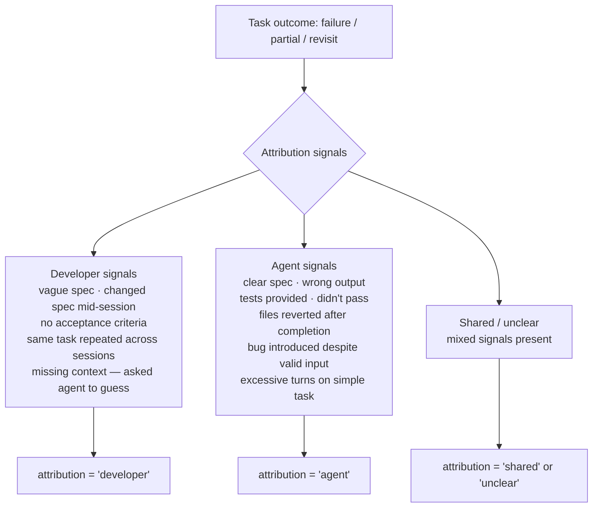

# Sensei Architecture: Current & Future State

> High-level component map, interaction flows, gap analysis, and target architecture incorporating CC-RLM-inspired improvements. See `01-architecture.md` for the original v1 design and `cc-rlm.md` for the CC-RLM reference analysis.

---

## Current Architecture

### Component Map

```mermaid
graph TD
    Dev[Developer / Claude Code]

    subgraph Skills Layer
        SK[Skills<br/>10 markdown guidance files]
    end

    subgraph MCP Layer
        MCP[@sensei/mcp<br/>19 tools over stdio]
    end

    subgraph Tools Layer
        TOOLS[@sensei/tools<br/>reindex · search · query<br/>context · memory · drift]
    end

    subgraph Collector Layer
        HOOKS[Hooks<br/>pre-tool · post-tool]
        DAEMON[Daemon :51789<br/>event pipeline]
    end

    subgraph Server Layer
        SERVER[@sensei/server<br/>OllamaBackend<br/>Telemetry :7744]
    end

    subgraph Persistence Layer
        ARTIFACTS[.sensei/ Artifacts<br/>llmspec · symbol-map<br/>chunks · embeddings<br/>traceability · llms.txt]
        SUPABASE[(Supabase<br/>sensei schema<br/>events · reports)]
    end

    subgraph Dashboard Layer
        DASH[Dashboard<br/>SvelteKit + UnoCSS<br/>stats · benchmarks · repos]
    end

    Dev -->|reads skills| SK
    Dev -->|MCP stdio| MCP
    Dev -->|pre/post tool events| HOOKS
    HOOKS -->|HTTP events| DAEMON
    DAEMON -->|writes| SUPABASE
    MCP -->|delegates to| TOOLS
    TOOLS -->|reads/writes| ARTIFACTS
    TOOLS -->|model inference| SERVER
    SUPABASE -->|analytics| DASH
```

### Current Data Flows

#### Indexing Flow



#### Agent Session Flow



#### Telemetry Flow



---

## Gap Analysis: Sensei vs CC-RLM

| Capability | CC-RLM | Sensei Today | Impact |
|---|---|---|---|
| **Diff-first BFS ranking** | ✅ git diff seeds relevance | ❌ no git-aware ranking | High — largest single token saving |
| **Symbol-level AST slicing** | ✅ extract function bodies by line range | ⚠️ L0–L3 resolution, full sections | High — 20–25% token reduction |
| **Session deduplication** | ✅ skip files Claude already read | ❌ not implemented | High — 32% savings on turn 2+ |
| **Answer-driven relevance learning** | ✅ feedback loop → SQLite multipliers | ❌ no feedback loop | Medium — compounds over sessions |
| **Real-time file watcher** | ✅ pre-warm on save, <20ms | ❌ manual reindex only | Medium — latency improvement |
| **Hard token budget enforcement** | ✅ tiktoken, 8K hard cap | ⚠️ soft, resolution-level based | Medium — prevents context bloat |
| **Real AST parsing** | ⚠️ Python ast + regex for TS | ⚠️ model-based + regex | Medium — accuracy for all languages |
| **Configurable ranking strategies** | ❌ single fixed strategy | ❌ not applicable yet | Low — future flexibility |
| **Dashboard** | ❌ none | ✅ SvelteKit + Supabase | Sensei advantage |
| **Skills / agent guidance** | ❌ none | ✅ 10 skill files | Sensei advantage |
| **MCP integration** | ❌ proxy intercept only | ✅ 19 tools over stdio | Sensei advantage |
| **Project memory** | ❌ none | ✅ checkpoints + decisions | Sensei advantage |
| **Benchmark infrastructure** | ❌ none | ✅ full A/B + telemetry | Sensei advantage |
| **Doc traceability** | ❌ none | ✅ traceability.json | Sensei advantage |
| **Token usage analytics** | ⚠️ per-response only | ⚠️ event counts, no token totals | Gap on both sides |

---

## Future Architecture

Incorporates CC-RLM-inspired improvements via the Pipeline-First adapter pattern (see `20-pipeline-adapter.md`). All existing components are preserved and extended — nothing is replaced.

**Persistence shift**: Supabase becomes the primary persistence layer for all structured data (symbols, graphs, embeddings, traceability). `.sensei/` is reduced to thin local config — only files that must be version-controlled or work without a DB query (`config.yaml`, `llms.txt`, `checkpoints/`).

### Three-Layer Feature Architecture

Sensei's features are organized into three layers. Each layer composes the one below — it never re-implements it. Improvements to a lower layer automatically benefit all layers above it.

```
┌─────────────────────────────────────────────────────────────────┐
│  Layer 3: System Intelligence                                   │
│  Workspace · Cross-repo graph · Service map                     │
│  Architecture conformance · Cross-repo drift                    │
│  System gap analysis · System health score                      │
│  Orchestrates Layer 1 indexers · Extends Layer 2 traceability   │
│  Aggregates Layer 2 quality metrics                             │
└───────────────────────────┬─────────────────────────────────────┘
                            │ builds on
┌───────────────────────────▼─────────────────────────────────────┐
│  Layer 2: Documentation & Traceability                          │
│  Doc-to-code coverage · Drift detection · Doc doctor            │
│  Doc generation · Quality metrics · Gap analysis                │
│  Sprint / cycle planning · Generated doc traceability           │
│  Uses Layer 1 symbols, call graphs, doc_sections                │
└───────────────────────────┬─────────────────────────────────────┘
                            │ builds on
┌───────────────────────────▼─────────────────────────────────────┐
│  Layer 1: Codebase Intelligence                                 │
│  Scan · Parse (language adapters) · Index                       │
│  Symbol extraction · Call graph · Import graph                  │
│  Semantic search · Full-text search · Incremental indexing      │
│  External doc adapters (Confluence, Notion, Wiki)               │
│  Three-layer metadata model · Doc generation from code          │
│  Goal & intent analysis · Per-repo quality & gap analysis       │
└─────────────────────────────────────────────────────────────────┘
```

Cross-cutting concerns that serve all three layers:
- **Smart Context Delivery** (Layer 1 index → ranked, sliced, assembled context pack)
- **Session Continuity** (any layer's sessions can be recovered via snapshots)
- **Multi-Agent Support** (skills and AGENTS.md are generated from all three layers)
- **Analytics** (telemetry, FTR scoring, coaching engine, aggregate benchmarks)
- **Identity, Access & Pricing** (workspace-level auth, team isolation, pricing tiers)

### Component Map (Future State)

```mermaid
graph TD
    Dev[Developer / Claude Code]

    subgraph Skills Layer
        SK[Skills<br/>10+ markdown guidance files<br/>+ pipeline-aware skills]
    end

    subgraph MCP Layer
        MCP[@sensei/mcp<br/>19 existing tools — now query Supabase<br/>+ context_pack tool<br/>+ token_stats tool]
    end

    subgraph Pipeline Layer
        SCAN[Scan Stage<br/>git diff · mtime · fingerprints]
        PARSE[Parse Stage<br/>LanguageAdapterRegistry<br/>tree-sitter WASM · subprocess]
        INDEX[Index Stage<br/>writes to Supabase metamodel<br/>symbols · imports · call graph<br/>embeddings · traceability · doc sections]
        RANK[Rank Stage<br/>reads Supabase · strategy chain<br/>DiffFirstBFS · Traceability<br/>Semantic · BM25 · RelevanceLearning]
        SLICE[Slice Stage<br/>reads symbols + line ranges<br/>from Supabase · ASTSlicer<br/>SectionSlicer]
        ASSEMBLE[Assemble Stage<br/>token budget · session dedup<br/>ContextPack]
    end

    subgraph Collector Layer
        HOOKS[Hooks<br/>pre-tool · post-tool<br/>+ response parser]
        DAEMON[Daemon :51789]
    end

    subgraph Server Layer
        SERVER[@sensei/server<br/>OllamaBackend · Watcher<br/>Telemetry :7744]
        WATCHER[File Watcher<br/>pre-warm on save]
    end

    subgraph Persistence Layer
        CONFIG[.sensei/ Config only<br/>config.yaml · llmspec.yaml<br/>llms.txt · checkpoints/]
        SUPABASE[(Supabase — primary store<br/>repos · files · symbols<br/>imports · call_edges<br/>embeddings pgvector<br/>doc_sections · traceability<br/>relevance_scores · session_reads<br/>events · token_usage)]
    end

    subgraph Dashboard Layer
        DASH[Dashboard<br/>+ token reduction charts<br/>+ ranking strategy explorer<br/>+ symbol graph viewer]
    end

    Dev -->|reads skills| SK
    Dev -->|MCP stdio| MCP
    Dev -->|pre/post tool events| HOOKS
    HOOKS -->|HTTP events| DAEMON
    HOOKS -->|cited symbols feedback| DAEMON
    DAEMON -->|write events + relevance_scores| SUPABASE
    MCP -->|queries| SUPABASE
    MCP -->|reads config| CONFIG
    SCAN --> PARSE --> INDEX
    INDEX -->|upsert| SUPABASE
    SUPABASE -->|import graph · symbols · embeddings| RANK
    RANK --> SLICE --> ASSEMBLE
    ASSEMBLE -->|write session_reads + token_usage| SUPABASE
    WATCHER -->|pre-warm| SCAN
    SERVER --> WATCHER
    SUPABASE --> DASH
```

### Future Indexing Flow (Pipeline)

```mermaid
flowchart TD
    A[Trigger: save · reindex · watcher] --> B

    subgraph Scan
        B[Discover files\ngit diff / mtime]
        B --> C[changedFiles · allFiles\ngitDiff · fingerprints]
    end

    subgraph Parse
        C --> D[LanguageAdapterRegistry\nresolve by extension]
        D --> E[TypeScriptParser\ntree-sitter WASM]
        D --> F[PythonParser\ntree-sitter WASM]
        D --> G[MarkdownParser\nsections + links]
        D --> H[GoParser · RustParser\ntree-sitter WASM]
        D --> I[SubprocessParser\nexternal script fallback]
        D --> J[GenericParser\n60-line fallback]
        E & F & G & H & I & J --> K[ParsedFiles\nImportGraph · SymbolGraph\nDocSections · CallGraph]
    end

    subgraph Index — writes to Supabase
        K --> L{changed since\nlast index?}
        L -->|yes| M[upsert sensei.files\nsensei.symbols\nsensei.imports\nsensei.call_edges]
        L -->|yes| N[upsert sensei.embeddings\npgvector 384-dim]
        L -->|yes| O[upsert sensei.doc_sections\nsensei.traceability]
        L -->|no| P[skip — fingerprint unchanged]
    end

    M & N & O --> Q[(Supabase\nprimary store)]
    Q --> R[Rank · Slice · Assemble\non agent request]
```

### Orientation & Recovery Flow

Every session starts with orientation. The first step is always a recovery check — if a prior session crashed or was left in-progress, the agent surfaces it before loading anything else.



### Future Agent Session Flow



### Repo Memory & Session Recovery

Every repo has persistent memory in Supabase that accumulates across all sessions. `get_session_context()` composes this into the orientation payload every time a new session starts.

**Repo memory layers** (queried together, ~300–500 tokens total):

| Source | Content | Storage |
|---|---|---|
| `sensei.project_profile` | Stack, entry points, shortcuts | Supabase (auto-extracted) |
| `sensei.project_config` | Goals, guidelines, patterns | Supabase (user-authored) |
| `sensei.repo_memory` | Decisions, patterns, open items from past sessions | Supabase (updated by checkpoint) |
| `.sensei/checkpoints/` | Local YAML mirror of repo_memory | Local file (version-controlled) |
| `sensei.task_sessions` | Recovery hint if `status = 'in_progress'` | Supabase (live session state) |
| `sensei.session_snapshots` | Last snapshot for crashed session | Supabase (cleared on clean completion) |

**Crash detection**: the daemon monitors active sessions with a heartbeat. If a session goes idle without a `checkpoint()` call for more than N minutes, it marks the session `crashed` and sets `crashed_at`. On next `get_session_context()`, the recovery hint is surfaced automatically.

**Snapshot cadence**: `snapshot()` is called by the agent at natural checkpoints (after completing a discrete step) and automatically by the daemon every 10 turns. Each snapshot stores `progress_md`, `files_in_flight`, `uncommitted_diff`, and `next_step_hint` — enough to reconstruct intent without re-reading all prior turns.

**Recovery hint format** (returned by `get_session_context()` when a crashed session exists):

```markdown
## ⚠ Unfinished Session Detected

**Task**: Add OAuth2 login flow
**Started**: 2026-03-13 14:22 (47 minutes ago)
**Last turn**: 8 — crashed during file write
**Progress**: Implemented `/auth/login` route and JWT middleware. Was about to write tests.
**Files in-flight**: `src/auth/login.ts`, `src/middleware/jwt.ts` (uncommitted)
**Next step**: Write unit tests for `JWTMiddleware.verify()`

Resume this session? (yes / discard)
```

**`repo_memory` relevance decay**: rows in `sensei.repo_memory` have a `relevance` score that decays over time (halves every 30 days) and is boosted when a row is cited in a session. This prevents stale decisions from dominating orientation as the repo evolves.

### Future Feedback Loop



---

## Deployment Modes

Sensei operates in two fully-supported modes. The same codebase, same MCP tools, and same pipeline run in both — only the infrastructure backing each component changes. Mode is selected in `.sensei/config.yaml` via `mode: local | cloud`.

### Mode 1: Local

All infrastructure runs on the developer's machine. Suitable for offline work, privacy-sensitive repos, or low-latency development without external dependencies.

```mermaid
graph LR
    subgraph Developer Machine
        CC[Claude Code]
        HOOKS[Hooks]
        DAEMON[Daemon :51789]
        MCP[@sensei/mcp]
        PIPELINE[Pipeline\nScan·Parse·Index·Rank·Slice·Assemble]
        SERVER[@sensei/server\nOllama :11434\nqwen2.5-coder]
        WATCHER[File Watcher]
        SB[(Supabase local\nDocker :54321)]
        DASH[Dashboard\nlocalhost:3000]
    end

    CC --> HOOKS --> DAEMON --> SB
    CC --> MCP --> PIPELINE
    PIPELINE -->|Index writes| SB
    PIPELINE -->|Rank·Slice reads| SB
    PIPELINE -->|model inference| SERVER
    SERVER --> WATCHER --> PIPELINE
    SB --> DASH
```

**Local infrastructure**:
- **Supabase**: `supabase start` (Docker Compose) — full Postgres + pgvector + Studio at `:54321`
- **Ollama**: local inference for embedding generation and model-assisted indexing (L1/L2 symbol descriptions)
- **Dashboard**: `bun run dev` at `localhost:3000`
- **Daemon**: `sensei daemon start` — runs as background process

### Mode 2: Cloud

Supabase and Dashboard are hosted. Ollama can be local (developer machine) or offloaded to a GPU server. Suitable for teams sharing a codebase index or when local disk/RAM is constrained.

```mermaid
graph LR
    subgraph Developer Machine
        CC[Claude Code]
        HOOKS[Hooks]
        DAEMON[Daemon :51789]
        MCP[@sensei/mcp]
        PIPELINE[Pipeline\nScan·Parse·Index·Rank·Slice·Assemble]
        SERVER[@sensei/server]
        WATCHER[File Watcher]
        OLLAMA_L[Ollama local\noptional]
    end

    subgraph Cloud
        SB[(Supabase cloud\nsupabase.com)]
        DASH[Dashboard\nhosted]
        OLLAMA_R[Ollama / vLLM\nGPU server\noptional]
    end

    CC --> HOOKS --> DAEMON --> SB
    CC --> MCP --> PIPELINE
    PIPELINE -->|Index writes| SB
    PIPELINE -->|Rank·Slice reads| SB
    PIPELINE -->|model inference| SERVER
    SERVER --> OLLAMA_L
    SERVER -.->|if GPU offload| OLLAMA_R
    SERVER --> WATCHER --> PIPELINE
    SB --> DASH
```

**Cloud infrastructure**:
- **Supabase**: project at `supabase.com` — same schema, same pgvector, same connection string format
- **Dashboard**: deployed to Vercel/Netlify, reads from cloud Supabase
- **Ollama**: developer's local machine (default) or remote GPU server (`OLLAMA_HOST` env var) for heavy indexing tasks

### Component Availability by Mode

| Component | Local mode | Cloud mode |
|---|---|---|
| Supabase | `supabase start` (Docker) | supabase.com project |
| Dashboard | `localhost:3000` | hosted URL |
| Ollama / model inference | local `:11434` | local or GPU server |
| Hooks + Daemon | local (always) | local (always) |
| MCP server | local (always) | local (always) |
| File Watcher | local (always) | local (always) |

The hooks and MCP server **always run locally** — they interface with the developer's filesystem and Claude Code. Only the persistence (Supabase) and dashboard can move to cloud.

### Config

```yaml
# .sensei/config.yaml
mode: local   # or 'cloud'
repo_id: my-repo

# Local mode
supabase_url: http://localhost:54321
supabase_key: local-anon-key         # from supabase start output

# Cloud mode
# supabase_url: https://xyz.supabase.co
# supabase_key: eyJ...               # service role key from dashboard

# Model inference (both modes)
ollama_url: http://localhost:11434   # or http://gpu-server:11434
ollama_model: qwen2.5-coder:7b
```

---

## External Doc References

Sensei auto-derives relevant external documentation from the detected stack and registers the best available source — a dedicated MCP if one exists, a generic doc fetcher otherwise. This prevents common version drift problems (Svelte 4 vs 5, Jest vs Vitest) by pinning doc references to the exact versions in `package.json` / `pyproject.toml` / `go.mod`.

### How It Works



### MCP Registry

Sensei maintains a built-in registry of known library → MCP / doc-URL mappings. Community-contributed, updated via `sensei update-registry`:

| Library | Dedicated MCP | Fallback doc URL | Notes |
|---|---|---|---|
| Playwright | `@playwright/mcp` | playwright.dev | Auto-registers, full browser control |
| Svelte | `svelte-mcp` (if available) | svelte.dev/docs | **Version-pinned** — Svelte 5 vs 4 docs differ significantly |
| Supabase | `@supabase/mcp-server` | supabase.com/docs | Auth, DB, storage tools |
| Next.js | `@vercel/mcp` | nextjs.org/docs | — |
| Prisma | `prisma-mcp` | prisma.io/docs | Schema + migration tools |
| Vitest | — | vitest.dev | Indexed via generic MCP |
| Tailwind | — | tailwindcss.com/docs | Indexed via generic MCP |
| tRPC | — | trpc.io/docs | Indexed via generic MCP |
| FastAPI | — | fastapi.tiangolo.com | Indexed via generic MCP |
| _(generic fallback)_ | chub / firecrawl MCP | any URL | For libs not in registry |

**Generic fallback**: `chub` (already a skill in this project) or a firecrawl-backed MCP fetches, parses, and indexes documentation for any library not in the registry. Indexed into `sensei.external_docs` as chunks + embeddings, making it available to the same Rank/Slice pipeline as local code.

### Version Pinning

The resolved version from `package.json` (or equivalent) is stored with each external ref. When the context_pack Assemble stage includes doc snippets, it uses the pinned version — preventing the agent from reading Svelte 4 docs when the project uses Svelte 5.

```
package.json: "svelte": "^5.0.0"
  → resolved: "5.3.2"
  → external_ref: { lib: "svelte", version: "5.3.2", docs_url: "svelte.dev/docs/v5" }
  → context_pack: includes Svelte 5 doc snippets, not Svelte 4
```

### Two-Tier Doc Retrieval

Library docs are not indexed all-at-once upfront. Most libraries have hundreds of pages — bulk indexing wastes storage and quickly goes stale. Instead, sensei uses a **two-tier lazy model** that mirrors how dedicated MCPs like `@playwright/mcp` work:

```
Tier 1 — Root Index (fetched once, refreshed periodically)
  Parse root URL / llms.txt / sitemap
  → builds component/page map: { name → url, summary }
  → stored in sensei.doc_index_pages
  → lightweight, always current

Tier 2 — Page Cache (fetched on demand, cached with TTL)
  When a specific component/page is needed:
  → check sensei.external_docs for cached version
  → if fresh (within TTL): return cached
  → if stale or missing: fetch URL → parse → chunk → embed → cache
  → serve to context_pack
```



### Root Index

Parsed from the library's root doc URL, `llms.txt`, or sitemap. Extracts a lightweight map of all available components/pages:

```
svelte.dev/llms.txt  →  { 'motion': '/docs/v5/motion', 'store': '/docs/v5/store', ... }
rokkit/llms.txt      →  { 'Button': '/components/button', 'AppShell': '/components/app-shell', ... }
```

Stored in `sensei.doc_index_pages`. Refreshed by the daemon every 24h (configurable) or on `sensei sync`. Lightweight — only names + URLs + one-line summaries, no full content.

### On-Demand Cache

Individual pages are fetched and cached in `sensei.external_docs` when first needed. TTL is configurable per library (default 7 days). On cache miss, the fetch is synchronous — context_pack waits (typically <500ms for a single page). For predicted needs (files in the current context import a lib), the daemon can pre-warm pages in the background.

### Context Augmentation

`ExternalDocStrategy` uses the two-tier system during Rank:

```
task: "add drag-and-drop to the kanban board"
ranked files: KanbanBoard.svelte (imports svelte/motion, svelte/store)
  → detect svelte imports: motion, store
  → check doc_index_pages: motion → /docs/v5/motion, store → /docs/v5/store
  → check external_docs cache: motion (fresh), store (stale → refetch)
  → include svelte 5 motion + store docs in context_pack
```

Agent can also call `get_lib_docs(lib, component?)` MCP tool directly:
- `get_lib_docs("svelte", "motion")` → fetches/returns cached Svelte 5 motion docs
- `get_lib_docs("rokkit", "Button")` → returns Button component API
- `get_lib_docs("vitest")` → returns root index summary for Vitest

### Init Workflow Addition

`sensei init` adds an external docs step after stack detection:

```
Detected: Svelte 5, Vitest, Playwright, Supabase, Tailwind

Registering MCPs (dedicated):
  ✓ @playwright/mcp          → installed in ~/.claude/mcp.json
  ✓ @supabase/mcp-server     → installed in ~/.claude/mcp.json

Building root doc index (no dedicated MCP):
  ✓ svelte@5.3.2             → 94 pages indexed  (svelte.dev/llms.txt)
  ✓ vitest@2.1.0             → 31 pages indexed  (vitest.dev/llms.txt)
  ✓ tailwindcss@4.0.0        → 187 pages indexed (crawled sitemap)

Pages fetched on demand, cached for 7 days.
Run `sensei docs prefetch svelte` to warm the full cache now.
```

`sensei sync` re-runs root index refresh when `package.json` changes or TTL expires.

---

## Custom Library Support

Custom and internal libraries (e.g. `rokkit`, `kavach`, `dbd`) are the inverse of external public docs — source is available but there are no public docs, no MCP, and no registry entry. Sensei handles them by running the full **Parse → Index pipeline on the library source** and auto-generating a dedicated skill from the indexed symbols.

### How Custom Libs Differ from External Docs

| | External public lib | Custom/internal lib |
|---|---|---|
| Source available | ❌ (only docs/APIs) | ✅ full source |
| Public docs | ✅ crawlable | ❌ none |
| MCP exists | sometimes | ❌ rarely |
| How sensei handles | fetch + chunk docs | run Parse/Index on source |
| Skill generated from | doc chunks | indexed symbols + L1 descriptions |
| Version pinned | from package.json | from source path or git ref |

### llms.txt — Highest Priority Source

If a library provides an `llms.txt` file (either bundled in the package or at a well-known URL), sensei uses it as the primary source — it is already optimised for LLM consumption and requires no parsing, crawling, or symbol extraction.

**Detection order** (first found wins):

```
1. Package root llms.txt       → node_modules/rokkit/llms.txt
                                  or ../rokkit/llms.txt (local path)
2. Published URL               → https://rokkit.dev/llms.txt
                                  (sensei checks this well-known path)
3. Full source indexing        → Parse/Index pipeline on source (fallback)
4. Doc crawl                   → chub/firecrawl on doc_url (external libs only)
```

When `llms.txt` is found, sensei chunks it into `sensei.external_docs` (for public libs) or `sensei.symbols` via a `LlmsTxtParser` adapter (for custom libs), and generates the lib skill directly from its content. No model inference needed — the content is already structured.

```yaml
# .sensei/config.yaml — llms_txt_url can be declared explicitly if not auto-detected
custom_libs:
  - name: rokkit
    source: ../rokkit
    llms_txt_url: https://rokkit.dev/llms.txt   # optional override
    skill: true
```

`sensei sync` checks `llms.txt` URLs for updates (HTTP HEAD, ETag / Last-Modified) and re-indexes only when changed.

### Source Resolution

Custom libs may live in three places — all handled:

| Location | Example | Resolution |
|---|---|---|
| Same monorepo (workspace) | `packages/rokkit/` | Already scanned by the pipeline |
| Local path dep | `"rokkit": "file:../rokkit"` | Scan the resolved path |
| Private git / registry | `"kavach": "git+ssh://..."` | Clone to `~/.sensei/lib-cache/`, scan |

Declared in `.sensei/config.yaml` under `custom_libs` for libs not auto-detectable from `package.json`:

```yaml
custom_libs:
  - name: rokkit
    source: ../rokkit            # relative path
    skill: true                  # auto-generate a skill
  - name: kavach
    source: git+ssh://github.com/org/kavach
    ref: main
    skill: true
  - name: dbd
    source: ../dbd
    skill: true
```

### What Gets Generated

For each custom lib, sensei runs the full pipeline and produces:

1. **Indexed symbols** in `sensei.symbols` (scoped with `repo_id = lib_name`) — full L0–L2, import graph, call graph
2. **Embeddings** in `sensei.embeddings` — same pgvector pipeline as local code
3. **A generated lib skill** in `.sensei/skills/lib-{name}.md` — installed to agent alongside project skills

**Generated skill structure** (example: `lib-rokkit.md`):

```markdown
# rokkit — UI Component Library

## Components
- `<Button variant="..." size="...">` — Primary action button. Supports `primary | ghost | danger`.
- `<ThemeSwitcherToggle>` — Toggle between light/dark themes. Requires `use:themable` on root.
- `<AppShell sidebar nav>` — Top-level layout wrapper.

## Patterns
- Always wrap root with `use:themable` for theme propagation
- Use `$props()` runes pattern (Svelte 5) — never `export let`
- Import from `@rokkit/app`, not individual packages

## Key Exports
(auto-generated from sensei.symbols — L0 signatures)
...
```

### Context Augmentation

During Rank, if ranked source files import a custom lib, its symbols and doc sections are included in the context pack — same `ExternalDocStrategy` used for public libs, but sourcing from `sensei.symbols` (scoped by `lib_name`) rather than `sensei.external_docs`.

### Init Workflow Addition

```
Detected workspace packages: packages/rokkit, packages/shared
Detected local path deps: "../kavach", "../dbd"

Indexing custom libraries:
  ✓ rokkit (workspace)       → 234 symbols, skill generated → .sensei/skills/lib-rokkit.md
  ✓ kavach (../kavach)       → 87 symbols, skill generated  → .sensei/skills/lib-kavach.md
  ✓ dbd (../dbd)             → 156 symbols, skill generated → .sensei/skills/lib-dbd.md

Skills installed to .claude/skills/lib-*.md
```

`sensei sync` re-indexes custom libs when their source changes (tracked by mtime / git ref).

---

## Three-Layer Metadata Model

Replaces `llmspec.yaml`. Content is split across three layers that compose into a full orientation view via `get_project_profile()`:

```
Layer 1: Auto-extracted           Layer 2: User-authored            Layer 3: Generated skills
sensei.project_profile            sensei.project_config             .sensei/skills/*.md
─────────────────────             ─────────────────────             ───────────────────
name · version · license          goals · guidelines                guidelines.skill.md
stack · runtime · deps            patterns · conventions            patterns.skill.md
entry_points · shortcuts          team context · decisions          stack.skill.md
                                  open items                        goals.skill.md
Populated by: Scan/Parse          Editable via: Dashboard           Installed to agent by:
from README · package.json        MCP tools · direct edit           sensei sync
pyproject.toml · go.mod etc.      .sensei/skills/ as source         AgentAdapter
```

### Layer 1 — Auto-Extracted (`sensei.project_profile`)

Populated by the Scan → Parse → Index pipeline. Extracted from files already in the repo — no manual input required:

| Source file | Extracts |
|---|---|
| `package.json` / `pyproject.toml` / `go.mod` / `Cargo.toml` | name, version, description, runtime, deps |
| `README.md` | description, purpose, usage, setup |
| `CONTRIBUTING.md` / `CODE_OF_CONDUCT.md` | guidelines (seed for Layer 2) |
| Entry-point files (detected by scanner) | entry_points |
| `Makefile` / `justfile` / `package.json scripts` | shortcuts |

### Layer 2 — User-Authored (`sensei.project_config`)

Editable via the Dashboard or MCP tools. Free-form markdown per category:

```sql
sensei.project_config (
  repo_id    text,
  key        text,           -- e.g. 'goal/primary', 'guideline/testing', 'pattern/error-handling'
  category   text,           -- 'goal' | 'guideline' | 'pattern' | 'context' | 'decision'
  value_md   text,           -- markdown content
  source     text,           -- 'user' | 'extracted' | 'llm-inferred'
  created_at timestamptz,
  updated_at timestamptz,
  PRIMARY KEY (repo_id, key)
)
```

During `sensei init`, Layer 1 auto-extraction seeds Layer 2: if `CONTRIBUTING.md` exists, Claude or local LLM extracts guidelines into `project_config` rows with `source = 'llm-inferred'` for the user to review and confirm.

### Layer 3 — Generated Skills (`.sensei/skills/`)

Rendered on demand from Layer 1 + Layer 2 into agent-readable skill files. Stored in `.sensei/skills/` — version-controlled, agent-agnostic markdown. Agent adapters install them to agent-specific locations via `sensei sync`.

```
.sensei/skills/
  stack.md          # auto-generated from project_profile (runtime, deps, entry points)
  guidelines.md     # rendered from project_config category='guideline'
  patterns.md       # rendered from project_config category='pattern'
  goals.md          # rendered from project_config category='goal'
  orientation.md    # composite orientation: stack + entry points + shortcuts
```

Any agent that supports custom context directories can read directly from `.sensei/skills/`. Agent adapters handle the translation for agents with different formats.

---

## Agent Adapter Pattern

Sensei is agent-agnostic. Claude Code is the reference implementation. Other agents are supported via `AgentAdapter` — the same pattern as `LanguageParser` for code.

```
AgentAdapterRegistry
  ├── ClaudeAdapter      → .claude/skills/ + CLAUDE.md       (reference impl)
  ├── OpenCodeAdapter    → TBD + AGENTS.md                   (Claude derivative)
  ├── ZedAdapter         → .zed/ + AGENTS.md                 (planned)
  ├── KiloAdapter        → .claude/skills/ + CLAUDE.md       (Claude fork)
  ├── KiroAdapter        → TBD (AWS)                         (planned)
  ├── CodexAdapter       → TBD (OpenAI)                      (planned)
  ├── CursorAdapter      → .cursor/rules/ + .cursorrules     (planned)
  ├── CopilotAdapter     → .github/ + copilot-instructions   (planned)
  ├── AiderAdapter       → . + CONVENTIONS.md                (planned)
  └── GenericAdapter     → .sensei/skills/ + AGENTS.md       (fallback)
```

Claude-derived agents (opencode, Kilo) are expected to inherit Claude's hook and context-file conventions with minimal overrides. Independent agents (Kiro, Codex) will require standalone adapter implementations once their extension APIs stabilise.

### Interface

```typescript
interface AgentAdapter {
  readonly name: string              // 'claude' | 'cursor' | 'copilot' | 'aider' | 'generic'
  readonly displayName: string
  readonly skillsPath: string        // where skills are installed for this agent
  readonly contextFile: string       // CLAUDE.md | .cursorrules | AGENTS.md etc.

  installSkill(skill: SkillFile, repoPath: string): Promise<void>
  removeSkill(skillName: string, repoPath: string): Promise<void>
  generateContextFile(profile: ProjectProfile, skills: SkillFile[]): string
  installHooks?(repoPath: string): Promise<void>  // optional — not all agents support hooks
}
```

### AGENTS.md as Universal Source

`AGENTS.md` is the generic, agent-agnostic context file. `CLAUDE.md` references it:

```markdown
<!-- CLAUDE.md -->
# Project Context
See [AGENTS.md](./AGENTS.md) for full project orientation.
<!-- Agent-specific additions below -->
```

This means:
- Agents that support `AGENTS.md` natively use it directly
- Claude Code uses `CLAUDE.md` → `AGENTS.md`
- Other agents have their own adapter-generated files that include the same content
- When `sensei sync` runs, all agent files stay in sync from the single `.sensei/skills/` source

### Init Workflow — Skill Extraction



`sensei sync` re-runs steps G–I whenever `.sensei/skills/` or `sensei.project_config` changes.

---

## Expanded Metadata Model: Cross-Agent Observability

The collector event model is extended to capture task-level outcomes across all supported agents, enabling quality scoring, cross-agent comparison, and developer vs agent attribution.

### Supported Agents (Priority Order)

| Priority | Agent | Adapter | Notes |
|---|---|---|---|
| 1 | Claude Code | `ClaudeAdapter` | Reference implementation — full hooks, MCP |
| 2 | opencode | `OpenCodeAdapter` | Claude Code derivative, hooks likely compatible |
| 3 | Zed | `ZedAdapter` | Built-in AI editor, different hook model |
| 4 | Kilo | `KiloAdapter` | Claude Code fork — minimal adapter delta expected |
| 5 | Kiro | `KiroAdapter` | AWS agent — adapter details TBD |
| 6 | Codex | `CodexAdapter` | OpenAI agent — adapter details TBD |
| 7+ | Cursor, Copilot, Aider | individual adapters | No hooks, skills-only integration |
| — | Generic | `GenericAdapter` | Fallback for unknown agents via `AGENTS.md` |

All adapters extend `ClaudeAdapter` (for Claude-derived agents) or `BaseAgentAdapter` (for others). The expectation is that Claude Code conventions become the de-facto standard, making most adapters thin overrides.

### Turn Identification

A **turn** is one complete user message → agent response cycle. Identified from the event stream:

```
session start
  ├── turn 1: UserPromptSubmit → [tool calls] → agent response
  ├── turn 2: UserPromptSubmit → [tool calls] → agent response
  └── turn N: ...
session end (idle timeout or explicit close)
```

Turns are detected by grouping events: a new `UserPromptSubmit` event starts a new turn. All `PreToolUse` / `PostToolUse` events between two `UserPromptSubmit` events belong to the preceding turn. This is populated into `sensei.task_turns` by the daemon.

Key turn-level signals captured:
- `tokens_in / tokens_out` — cost per turn
- `pack_tokens` — how much context sensei injected
- `files_read / files_written` — what the agent touched
- `had_error / error_type` — did this turn produce a failure signal

### First-Time-Right (FTR) Score

FTR measures whether a task was completed correctly on the first attempt, without revision, revert, or follow-up. Inspired by manufacturing quality metrics.

```
FTR Score (0.0–1.0) = weighted composite of:

  turns_to_complete == 1       → +0.30  (done in one exchange)
  refinements == 0             → +0.20  (task description never changed)
  files_reverted == []         → +0.20  (nothing undone)
  tests_passed == true         → +0.15  (verification succeeded)
  subsequent_revisit == false  → +0.10  (same files not re-touched next session)
  bugs_introduced == 0         → +0.05  (no bugs found later)
```

FTR is computed automatically from observable signals — no user input required. User quality rating (1–5) overrides the inferred score when provided.

### Developer vs Agent Attribution

Not every poor outcome is the agent's fault. Signals are categorised to distinguish developer-side issues from agent-side failures:



`attribution_signals` in `task_outcomes` stores the raw signal set as JSONB for Dashboard inspection. Over time, patterns emerge: a developer whose tasks consistently show `vague_spec` signals needs better requirements skills, not a better agent.

### What This Enables

| Analysis | How |
|---|---|
| FTR score per agent over time | `AVG(ftr_score) GROUP BY agent_name, month` |
| FTR score per model over time | `AVG(ftr_score) GROUP BY model_id, month` |
| Which agent + model combo is best? | `AVG(ftr_score) GROUP BY agent_name, model_id` |
| Which model needs fewest turns? | `AVG(turns_to_complete) GROUP BY model_id` |
| Token cost per FTR point by model | `AVG(tokens_total / ftr_score) GROUP BY model_id` |
| Model switching patterns | turns where `model_id != session.model_id` |
| Developer vs agent fault split | `COUNT(*) GROUP BY attribution, agent_name, model_id` |
| Which task types suit which model | `AVG(ftr_score) GROUP BY task_type, model_id` |
| Repeated tasks = skill or spec gaps | similar `task_description` across sessions |
| Which patterns correlate with high FTR | JOIN task_outcomes → project_config patterns |
| Model comparison on same task corpus | same `task_type` + `repo_id`, different `model_id` |
| Quality improvement over time (sensei impact) | FTR trend before/after `sensei init` date |

Dashboard surfaces these as: per-agent/model FTR charts, agent × model heatmap, developer vs agent attribution pie, turn-cost scatter plots by model, and task-type performance matrix.

---

## Integration Points: Where CC-RLM Features Land in Sensei

| CC-RLM Feature | Sensei Integration Point | New Component |
|---|---|---|
| Diff-first BFS ranking | `@sensei/tools` → Rank stage | `DiffFirstRankingStrategy` |
| Symbol-level AST slicing | `@sensei/tools` → Slice stage | `ASTSlicer`, `SectionSlicer` |
| Language adapters (tree-sitter) | `@sensei/tools` → Parse stage | `LanguageAdapterRegistry` |
| Session deduplication | Assemble stage | feed `sessionReads` from collector |
| Answer-driven relevance learning | Collector → Supabase → Rank | `relevance_scores` table + feedback hook |
| File watcher pre-warming | `@sensei/server` | `FileWatcher` wrapping chokidar |
| Hard token budget | Assemble stage | `tiktoken` / `gpt-tokenizer` integration |
| BM25 as ranked fallback | Rank stage strategy chain | promote existing BM25 to `BM25Strategy` |
| Configurable ranking | `.sensei/config.yaml` → Rank | `ranking.strategy` config key |

---

## Model Configuration

Local model inference is fully configurable — provider, base URL, and model are independently selectable per task type. Configuration follows a two-level hierarchy: **global user defaults** override built-in defaults, and **project-level config** overrides the global for a specific repo.

### Config Hierarchy

```
~/.config/sensei/config.yaml       ← global user defaults (all repos)
        ↓ overridden by
.sensei/config.yaml                ← project-level overrides (this repo only)
        ↓ overridden by
built-in defaults                  ← sensible defaults if nothing configured
```

Resolution is per-field: a project can override only `models.indexing` and inherit everything else from the global config.

### Global Config (`~/.config/sensei/config.yaml`)

```yaml
# ~/.config/sensei/config.yaml — applies to all repos unless overridden

inference:
  provider: ollama                    # 'ollama' | 'vllm' | 'lmstudio' | 'llamacpp' | 'openai-compatible'
  base_url: http://localhost:11434    # provider base URL

  # Per-task model assignment — use different models for different workloads
  models:
    embedding: nomic-embed-text       # fast, small — semantic search vectors
    indexing: qwen2.5-coder:7b        # code-capable — L1/L2 symbol descriptions
    extraction: qwen2.5:14b           # larger reasoning — skill extraction from docs
    classification: qwen2.5:3b        # tiny, fast — FTR attribution, task type
    default: qwen2.5-coder:7b         # fallback for any unspecified task

  # System capacity
  max_concurrent: 2                   # parallel inference requests
  context_window: 8192                # max tokens per inference call
  timeout_ms: 30000                   # per-request timeout

credentials:
  supabase_url: https://xyz.supabase.co
  supabase_key: eyJ...               # service role key
```

### Project Config (`.sensei/config.yaml`)

```yaml
# .sensei/config.yaml — overrides global for this repo only

mode: local       # 'local' | 'cloud'
repo_id: my-repo

# Override only the models that need to differ for this repo
inference:
  models:
    indexing: deepseek-coder:6.7b   # this repo uses deepseek instead of qwen
    # embedding, extraction, classification, default → inherited from global

# Project-specific Supabase (overrides global credentials if needed)
# supabase_url: http://localhost:54321
# supabase_key: local-anon-key
```

### Model Tasks and Pipeline Stages

Each pipeline stage uses a specific model task. The `ModelTaskRegistry` resolves the correct model from the merged config at runtime:

| Pipeline Stage | Model Task | Default Model | Notes |
|---|---|---|---|
| Index → symbol L1/L2 descriptions | `indexing` | `qwen2.5-coder:7b` | Code-capable model for symbol summaries |
| Index → embeddings | `embedding` | `nomic-embed-text` | Or Xenova MiniLM (ONNX, no Ollama needed) |
| Init → skill extraction from docs | `extraction` | `qwen2.5:14b` | Larger model for nuanced doc analysis |
| Collector → FTR attribution | `classification` | `qwen2.5:3b` | Small/fast, runs post-session |
| Collector → task type inference | `classification` | `qwen2.5:3b` | Classifies feature/bug/refactor/etc. |

### ModelBackend Interface

Provider-agnostic — swap Ollama for vLLM, LM Studio, or any OpenAI-compatible server with a config change:

```typescript
interface ModelBackend {
  readonly provider: string                   // 'ollama' | 'vllm' | 'lmstudio' | 'llamacpp' | 'openai-compatible'
  readonly baseUrl: string

  complete(prompt: string, opts: CompletionOptions): Promise<string>
  embed(text: string | string[]): Promise<number[] | number[][]>
  isAvailable(): Promise<boolean>
  listModels(): Promise<string[]>             // show available models to user
}

interface CompletionOptions {
  model: string
  systemPrompt?: string
  maxTokens?: number
  temperature?: number
}
```

### Supported Providers

| Provider | Notes | Local / Remote |
|---|---|---|
| **Ollama** | Default. Easy install, wide model library, Apple Silicon support | Local |
| **vLLM** | GPU-accelerated, OpenAI-compatible, best throughput | Local or remote GPU |
| **LM Studio** | GUI-based, OpenAI-compatible server mode | Local |
| **llama.cpp server** | Minimal, no dependencies beyond the binary | Local |
| **Any OpenAI-compatible** | Any server implementing `/v1/chat/completions` + `/v1/embeddings` | Either |

### Recommended Models by Workload and Hardware

| VRAM / RAM | Indexing | Extraction | Embedding |
|---|---|---|---|
| 8 GB | `qwen2.5-coder:7b` | `qwen2.5:7b` | `nomic-embed-text` |
| 16 GB | `qwen2.5-coder:14b` | `qwen2.5:14b` | `nomic-embed-text` |
| 32 GB+ | `qwen2.5-coder:32b` | `qwen2.5:32b` | `nomic-embed-text` |
| CPU only | `qwen2.5-coder:3b` | `qwen2.5:3b` | Xenova MiniLM (ONNX) |

These are starting recommendations — `qwen2.5-coder` has shown strong results (matching CC-RLM benchmarks), but the config is intentionally open. As models evolve, users update one config line.

---

## Key Design Principles

**Supabase as primary persistence**: All structured data (symbols, import graph, call graph, embeddings, traceability, relevance scores, session state, token usage, project config, task sessions) lives in Supabase. MCP tools query the DB directly. `.sensei/` holds only what must be version-controlled or exist before any DB connection: `config.yaml`, `skills/` (canonical skill source), `llms.txt`, `checkpoints/`. `llmspec.yaml` is superseded by the three-layer metadata model.

**Model tracking at turn granularity**: `model_id` and `model_provider` are recorded on both `task_sessions` (primary model) and `task_turns` (per-turn, captures mid-session switches). Captured from env vars (`ANTHROPIC_MODEL`, `OPENAI_MODEL`), response headers, or agent-reported values via the UserPromptSubmit hook. Enables FTR and cost comparison across models independently of agent.

**Agent-agnostic by design**: `.sensei/skills/` is the single source of truth for repo-specific skills. `AgentAdapter` implementations install them to each agent's required location. Claude Code is the reference implementation; other agents are supported via adapters. `AGENTS.md` is the universal context file; `CLAUDE.md` references it.

**Index stage is the write boundary**: Scan and Parse are ephemeral (in-memory only). Index is the single stage that writes to Supabase — all downstream stages (Rank, Slice, Assemble) and all MCP tools are read-only consumers of the DB.

**Additive, not disruptive**: All existing MCP tools, skills, and checkpoint behaviors remain. The pipeline adds a new capability layer underneath `@sensei/tools`. Existing tools gain Supabase-backed queries progressively.

**Language agnostic**: The `LanguageAdapterRegistry` selects the best available parser per file extension. New languages require only a new adapter — no changes to the pipeline stages.

**Config-driven ranking**: Repos can specify a ranking strategy chain in `.sensei/config.yaml`. Different repos (documentation-heavy, fast-moving feature work, monorepos) can tune their strategy order independently.

**Model inference is configurable, not hardcoded**: Local model provider, base URL, and model are independently configurable per task type (embedding, indexing, extraction, classification). A two-level hierarchy — `~/.config/sensei/config.yaml` for global user defaults, `.sensei/config.yaml` for per-repo overrides — means changing a model is a one-line config edit. `qwen2.5-coder` is the current default but any Ollama-compatible or OpenAI-compatible endpoint works.

**Feedback compounds**: The collector captures tool events. Extending PostToolUse to parse cited symbols from model responses writes to `sensei.relevance_scores` — closing the loop with no new infrastructure beyond a DB table.

**Traceability is a first-class ranking signal**: Doc↔code links in `sensei.traceability` flow into the Rank stage as `TraceabilityBoostStrategy`, making context packs coherent across code and documentation.
