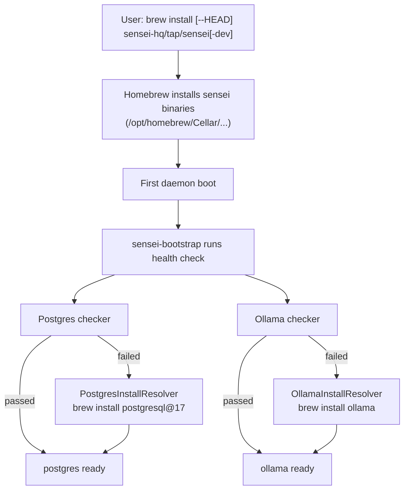

# Homebrew — Distribution

## Overview

Homebrew is the primary distribution channel for sensei on macOS. The tap lives in `homebrew/` as a git subtree synced to `sensei-hq/homebrew-tap`. It contains a formula for the CLI tools and a cask for the desktop app.

---

## Tap structure

```
homebrew/
  Formula/
    sensei.rb         Formula — installs senseid, sensei CLI, sensei-mcp
  Casks/
    senseihq.rb       Cask — installs Sensei.app (depends on the formula)
  README.md           Tap documentation
```

### Formula: `sensei.rb`

Installs three release binaries from GitHub release tarballs:

| Binary | Purpose |
|--------|---------|
| `senseid` | HTTP daemon (API server) |
| `sensei` | CLI |
| `sensei-mcp` | MCP server |

Platform-aware: selects the correct tarball for macOS arm64, macOS x86_64, Linux arm64, or Linux x86_64. SHA256 hashes are placeholder values in the formula and get updated by GitHub Actions after release artifacts are built.

`post_install` creates `~/.sensei/`. A Homebrew `service` block configures `senseid` to run as a background launchd service with `keep_alive: true`.

### Cask: `senseihq.rb`

Installs the universal macOS `.dmg` bundle (`Sensei.app`). Depends on the formula — installing the cask also installs the CLI tools. The `zap` stanza lists all application support directories for clean removal.

### Cold-install onramp

Single command, no file to fetch. Branches by build mode:

```bash
# Stable / production
brew install sensei-hq/tap/sensei

# Dev / contributor (built from develop branch HEAD)
brew install --HEAD sensei-hq/tap/sensei-dev
```

Prerequisites (postgresql@17, ollama) are *not* installed here. They are
installed lazily on first daemon boot by the per-component install
resolvers in `sensei-bootstrap`'s health module — failure in any single
prerequisite no longer cascades to block the others.

### Install flow



The split-resolver design replaces the previous omnibus `brew bundle`
workflow — see [`2026-05-14-brew-resolver-split-design.md`](../superpowers/specs/2026-05-14-brew-resolver-split-design.md).

---

## What Homebrew manages

Homebrew handles **installation** of binaries and the app bundle. It does not handle post-install configuration.

| Concern | Owner |
|---------|-------|
| Binary installation | Homebrew formula |
| App bundle installation | Homebrew cask |
| Background service (launchd) | Homebrew services (`brew services start sensei`) |
| Assistant integration (hooks, MCP registration) | `sensei install --acp <platform>` |
| Database schema deployment | Bootstrap (runs on daemon startup) |
| Repo scanning and indexing | `sensei scan` |

The formula's caveats section instructs the user to run `sensei install --acp claude-code`, `sensei start`, and `sensei scan` after installation.

---

## Versioning

The `VERSION` file at the repo root is the single source of truth. `make bump v=X.Y.Z` propagates the version to:

- `homebrew/Formula/sensei.rb` — `version` string
- `homebrew/Casks/senseihq.rb` — `version` string

SHA256 values in the formula are placeholders. The `make bump` target commits, tags, and pushes. The tag push triggers GitHub Actions which build release artifacts and update the tap with real SHA256 hashes.

---

## Subtree sync

The `homebrew/` directory is a git subtree of `sensei-hq/homebrew-tap`. Edits happen in the monorepo; sync pushes to the tap repo.

```bash
make tap-push
```

This clones the tap repo to a temp directory, copies `Formula/sensei.rb` and `Casks/senseihq.rb`, commits if changed, pushes, and cleans up. It runs automatically at the end of `make bump`.

The approach uses a temporary clone rather than `git subtree push` to avoid history sensitivity to squash merges. Each sync is a clean copy — the tap repo always mirrors what is in `homebrew/`.
