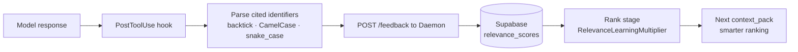

# Pipeline-First Adapter Pattern

> Defines the language-agnostic, stage-based pipeline for code and doc parsing, indexing, ranking, slicing, and context assembly. Extends sensei's current indexing with CC-RLM-inspired structural analysis while keeping all existing MCP tools unchanged.

See also: `cc-rlm.md` (reference analysis), `architecture.md` (component integration).

---

## Overview

The pipeline has six discrete stages. Each stage has a well-defined interface and can be extended independently. **Language adapters plug in only at Parse.** CC-RLM-inspired features (diff-first ranking, AST slicing, session dedup, relevance learning) plug in at Rank, Slice, and Assemble.

```
Scan → Parse → Index → Rank → Slice → Assemble
```

The pipeline serves two trigger modes:
- **Indexing mode** (Scan → Parse → Index): runs on save, on `reindex_repo`, or via file watcher
- **Context-pack mode** (Rank → Slice → Assemble): runs on `context_pack()` MCP tool call, reads from indexed artifacts

---

## Stage 1: Scan

Discovers files, detects changes, and produces fingerprints for incremental runs. No language knowledge required.

```typescript
interface Scanner {
  scan(repoPath: string, options?: ScanOptions): Promise<ScanResult>
}

interface ScanOptions {
  force?: boolean             // full rescan, ignore fingerprints
  include?: string[]          // glob patterns (default: all code + docs)
  exclude?: string[]          // additional ignores
}

interface ScanResult {
  allFiles: string[]          // all discoverable files in repo
  changedFiles: string[]      // files changed since last scan (git diff or mtime)
  gitDiff: string             // raw diff text (capped at 6,000 chars)
  fingerprints: FileFingerprint[]
}

interface FileFingerprint {
  path: string
  mtime: number
  size: number
  contentHash?: string        // optional, for high-precision change detection
}
```

**Implementation notes**:
- Primary change detection: `git diff HEAD --name-only`
- Fallback (no git or no diff): compare `mtime + size` against stored fingerprints in `.sensei/doc-index.json`
- Respects `.gitignore` + hardcoded excludes (`.git/`, `.sensei/`, `node_modules/`)
- Returns `changedFiles` as the seed for diff-first BFS in the Rank stage

---

## Stage 2: Parse

Runs language-specific analysis on each file. Language adapters register themselves in the `LanguageAdapterRegistry` and are resolved by file extension.

### LanguageParser Interface

```typescript
interface LanguageParser {
  readonly name: string
  readonly extensions: string[]
  readonly priority: number          // higher wins when multiple adapters match

  parse(file: RawFile): Promise<ParsedFile>
}

interface RawFile {
  path: string
  content: string
}

interface ParsedFile {
  path: string
  language: string
  imports: Import[]
  symbols: Symbol[]
  callGraph: CallEdge[]
  docSections?: DocSection[]         // markdown only
  docLinks?: DocLink[]               // markdown only
  ast?: unknown                      // tree-sitter Tree, if available
  parseError?: string                // non-fatal, pipeline continues
}

interface Import {
  from: string                       // resolved file path (relative imports) or package name
  names: string[]                    // named imports / '*' for default
  isExternal: boolean                // true if node_modules / external package
}

interface Symbol {
  name: string
  kind: 'function' | 'async' | 'class' | 'method' | 'type' | 'const' | 'export'
  startLine: number
  endLine: number
  signature?: string                 // L0: one-line representation
  description?: string              // L1: plain-English summary
  visibility: 'public' | 'private' | 'internal'
  tags: string[]
}

interface CallEdge {
  caller: string                     // symbol name
  callee: string                     // symbol name (may be external)
  callLine: number
}

interface DocSection {
  heading: string
  level: number                      // H1=1, H2=2, H3=3
  startLine: number
  endLine: number
  text: string                       // section content (stripped markdown)
  codeRefs: string[]                 // identifiers found in code blocks
}

interface DocLink {
  from: string                       // this file
  to: string                         // resolved file path (relative) or URL
  context: string                    // surrounding text
}
```

### LanguageAdapterRegistry

```typescript
class LanguageAdapterRegistry {
  register(parser: LanguageParser): void
  resolve(filePath: string): LanguageParser    // selects by extension + priority
  list(): LanguageParser[]
}
```

Resolution order (highest priority wins):
1. Exact extension match with highest `priority` value
2. `SubprocessParser` if a script is available for the extension
3. `GenericParser` as universal fallback

### Built-in Adapters

| Adapter | Implementation | Extensions | Notes |
|---|---|---|---|
| `TypeScriptParser` | tree-sitter WASM (`tree-sitter-typescript`) | `.ts`, `.tsx`, `.mts` | Real AST, full symbol extraction |
| `JavaScriptParser` | tree-sitter WASM (`tree-sitter-javascript`) | `.js`, `.jsx`, `.mjs` | Real AST |
| `PythonParser` | tree-sitter WASM (`tree-sitter-python`) | `.py` | Real AST, matches CC-RLM accuracy |
| `GoParser` | tree-sitter WASM (`tree-sitter-go`) | `.go` | Exported `func` + `type` |
| `RustParser` | tree-sitter WASM (`tree-sitter-rust`) | `.rs` | `pub fn` + `pub struct` + `pub enum` |
| `MarkdownParser` | Custom section parser | `.md`, `.mdx` | H2/H3 sections, code refs, cross-links |
| `SubprocessParser` | Subprocess wrapper | Configurable | Delegates to external scripts |
| `GenericParser` | First-60-lines fallback | Any | Non-null return guaranteed |

### SubprocessParser

Allows external scripts (Python, Bash, etc.) to participate in the pipeline via JSON contract:

```typescript
interface SubprocessParserConfig {
  extensions: string[]
  command: string                    // path to script
  args?: string[]
  timeout?: number                   // ms, default 500
}
```

Script contract: receives file path via `argv[1]`, outputs `ParsedFile` JSON to stdout. Non-zero exit or invalid JSON → treated as parse error, pipeline continues with `GenericParser`.

### MarkdownParser Details

Markdown flows through the same pipeline as code, enabling traceability-aware ranking:

- **Sections**: splits on H2/H3 headings, extracts text and code block identifiers
- **Links**: resolves relative `[text](./path)` links to repo-relative paths
- **Code refs**: extracts backtick identifiers from code blocks → used by Rank to link docs to code symbols
- **Traceability**: `DocLink` entries feed directly into the `traceability.json` update in the Index stage

---

## Stage 3: Index

Consumes parse output and writes to the Supabase metamodel. **Index is the only stage that writes to the database** — all downstream stages (Rank, Slice, Assemble) and all MCP tools are read-only consumers. Runs incrementally — only files whose fingerprint has changed are re-parsed and re-indexed.

```typescript
interface Indexer {
  update(parsedFiles: ParsedFile[], fingerprints: FileFingerprint[]): Promise<IndexStats>
}

interface IndexStats {
  filesUpserted: number
  symbolsUpserted: number
  importsUpserted: number
  embeddingsUpserted: number
  sectionsUpserted: number
  filesSkipped: number            // fingerprint unchanged
  durationMs: number
}
```

### Supabase Tables Written by Index Stage

```sql
-- File registry — one row per file, updated on each index run
sensei.files (
  repo_id       text,
  path          text,            -- repo-relative path
  language      text,            -- 'typescript' | 'python' | 'markdown' | etc.
  mtime         bigint,
  size          bigint,
  content_hash  text,
  indexed_at    timestamptz,
  PRIMARY KEY (repo_id, path)
)

-- Symbol map — replaces symbol-map.json; L0–L2 per symbol
sensei.symbols (
  repo_id         text,
  file_path       text,
  name            text,
  kind            text,           -- 'function' | 'class' | 'type' | 'const' | etc.
  start_line      integer,
  end_line        integer,
  signature_l0    text,           -- one-line signature (~10 tokens)
  description_l1  text,           -- plain-English description
  flow_l2         text,           -- logic flow (ordered steps)
  visibility      text,           -- 'public' | 'private' | 'internal'
  tags            text[],
  PRIMARY KEY (repo_id, file_path, name)
)

-- Import graph — bidirectional; enables BFS traversal via SQL recursive CTE
sensei.imports (
  repo_id       text,
  from_file     text,
  to_file       text,
  import_names  text[],
  is_external   boolean,
  PRIMARY KEY (repo_id, from_file, to_file)
)

-- Call graph — symbol-level edges
sensei.call_edges (
  repo_id         text,
  caller_file     text,
  caller_symbol   text,
  callee_symbol   text,
  call_line       integer,
  PRIMARY KEY (repo_id, caller_file, caller_symbol, callee_symbol)
)

-- Embeddings — pgvector; replaces embeddings.json
sensei.embeddings (
  repo_id     text,
  file_path   text,
  chunk_id    text,
  chunk_text  text,
  embedding   vector(384),       -- Xenova/all-MiniLM-L6-v2
  PRIMARY KEY (repo_id, chunk_id)
)

-- Doc sections — from MarkdownParser; replaces chunks.json sections
sensei.doc_sections (
  repo_id     text,
  file_path   text,
  heading     text,
  level       integer,
  start_line  integer,
  end_line    integer,
  text        text,
  code_refs   text[],
  PRIMARY KEY (repo_id, file_path, start_line)
)

-- Traceability — replaces traceability.json; bidirectional doc↔code
sensei.traceability (
  repo_id     text,
  doc_path    text,
  source_file text,
  confidence  real,
  source      text,              -- 'parsed' | 'embedding' | 'manual'
  PRIMARY KEY (repo_id, doc_path, source_file)
)
```

### Incremental Strategy

Before upserting, Index compares incoming `FileFingerprint` (mtime + size + content_hash) against `sensei.files`. If unchanged, the file's rows in `symbols`, `imports`, `call_edges`, `embeddings`, `doc_sections`, and `traceability` are skipped entirely. This keeps index runs fast even on large repos — only the diff is written.

### .sensei/ After This Change

`.sensei/` is reduced to files that must exist locally before any DB connection or that should be version-controlled:

| File | Stays local | Reason |
|---|---|---|
| `config.yaml` | ✅ | DB connection config — needed before any Supabase call |
| `llmspec.yaml` | ✅ | Human-authored project narrative — version-controlled |
| `llms.txt` | ✅ | Generated output for external tools (llmstxt.org standard) |
| `checkpoints/` | ✅ | Project memory YAML — portable, offline, version-controlled |
| `symbol-map.json` | ❌ removed | → `sensei.symbols` |
| `chunks.json` | ❌ removed | → `sensei.embeddings` + `sensei.doc_sections` |
| `embeddings.json` | ❌ removed | → `sensei.embeddings` (pgvector) |
| `traceability.json` | ❌ removed | → `sensei.traceability` |
| `doc-index.json` | ❌ removed | → `sensei.files` fingerprints |
| `import-graph.json` | ❌ never created | → `sensei.imports` directly |

---

## Stage 4: Rank

Selects and scores files/sections relevant to the current task. Implements a **configurable strategy chain** — strategies are composed in priority order, each contributing scores that are merged with weights.

### Core Interface

```typescript
interface RankingStrategy {
  readonly name: string
  rank(candidates: Candidate[], context: RankContext): Promise<ScoredCandidate[]>
}

interface Candidate {
  path: string
  type: 'code' | 'doc'
  symbols?: string[]                     // symbol names in this file
  sections?: string[]                    // heading names (docs)
}

interface RankContext {
  task: string                           // agent's current task description
  activeFile?: string                    // file currently open in editor
  changedFiles: string[]                 // from git diff (Scan output)
  sessionReads: string[]                 // loaded from sensei.session_reads
  db: SupabaseClient                     // all strategies query DB directly
  repoId: string
  relevanceScores: Map<string, number>   // pre-loaded from sensei.relevance_scores
}

interface ScoredCandidate extends Candidate {
  score: number
  strategyScores: Record<string, number> // per-strategy breakdown for debugging
}
```

### Strategy Chain

Configured per-repo in `.sensei/config.yaml`:

```yaml
ranking:
  strategy: chain
  chain:
    - diff_first_bfs        # primary: structure-first, seeds from git diff
    - traceability_boost    # amplify doc↔code linked files
    - semantic              # embedding similarity fallback
    - bm25                  # term-frequency fallback
  relevance_learning: true  # apply learned multipliers from Supabase
  min_results: 3            # if strategy returns fewer, next strategy fills gap
```

Alternative presets:
```yaml
ranking:
  strategy: semantic_first  # documentation-heavy repos
  # or
  strategy: bm25_only       # fast, no embedding overhead
  # or
  strategy: diff_first_bfs  # single strategy (no chain)
```

### Built-in Strategies

**`DiffFirstBFSStrategy`** (from CC-RLM):
```
changedFiles  → score 2.0
activeFile    → score 1.5
BFS hop 1     → score × 0.65
BFS hop 2     → score × 0.65²
...
```
BFS traversal runs as a **SQL recursive CTE** over `sensei.imports` — no loading the full graph into memory:
```sql
WITH RECURSIVE bfs AS (
  SELECT to_file AS file, 2.0 * 0.65 AS score, 1 AS depth
  FROM sensei.imports
  WHERE repo_id = $1 AND from_file = ANY($changedFiles)
  UNION ALL
  SELECT i.to_file, bfs.score * 0.65, bfs.depth + 1
  FROM sensei.imports i
  JOIN bfs ON i.from_file = bfs.file
  WHERE bfs.depth < 4 AND NOT i.is_external
)
SELECT file, MAX(score) AS score FROM bfs GROUP BY file
```
Falls through to next strategy if fewer than `min_results` rows returned.

**`TraceabilityBoostStrategy`** (new — sensei advantage):
Reads `TraceabilityGraph` bidirectionally:
- If code file scores high → linked doc files get +0.5 boost
- If doc section scores high → linked source files get +0.5 boost
Keeps context packs coherent across code and documentation.

**`SemanticStrategy`** (existing, promoted):
pgvector cosine similarity query against `sensei.embeddings`:
```sql
SELECT file_path, 1 - (embedding <=> $queryVec) AS score
FROM sensei.embeddings
WHERE repo_id = $1
ORDER BY embedding <=> $queryVec
LIMIT 20
```

**`BM25Strategy`** (existing, promoted):
PostgreSQL full-text search over `sensei.symbols` and `sensei.doc_sections`. No embedding overhead, fast for exact term matches:
```sql
SELECT file_path, ts_rank(search_vec, query) AS score
FROM sensei.symbols
WHERE repo_id = $1 AND search_vec @@ to_tsquery($task)
ORDER BY score DESC LIMIT 20
```

**`ExternalDocStrategy`** (new):
Boosts external doc chunks from `sensei.external_docs` when ranked source files import the corresponding library. Runs after local file ranking, fills remaining token budget with relevant doc snippets:

```typescript
// Detects imports in ranked files → matches against sensei.external_refs
// Queries sensei.external_docs for matching lib + version
// Scores by embedding similarity to task, boosted by import proximity
```

Example: task about drag-and-drop in a Svelte file → svelte@5 animate/motion docs ranked above svelte@4 transition docs because `external_refs` has `svelte@5.3.2`.

**`RelevanceLearningMultiplier`** (from CC-RLM, new):
Not a ranking strategy but a post-processing step. After the chain produces scores, applies per-file learned multipliers loaded from `Supabase.relevance_scores`:

```
finalScore = chainScore × multiplier   // multiplier ∈ [0.5, 2.0]
```

### Adding a New Strategy

Implement `RankingStrategy`, register in config by name. No changes to other stages.

```typescript
class RecencyStrategy implements RankingStrategy {
  readonly name = 'recency'
  async rank(candidates, context) {
    // score by git commit timestamp
  }
}
```

---

## Stage 5: Slice

Extracts the minimum representation of each ranked file needed to understand it in context. Replaces full-file inclusion with line-range extraction (code) or section extraction (docs).

```typescript
interface Slicer {
  slice(candidate: ScoredCandidate, index: RepoIndex, task: string): Promise<CodeSlice | DocSlice>
}

interface CodeSlice {
  file: string
  type: 'code'
  ranges: LineRange[]                    // relevant function/class body ranges
  tokenCount: number
  symbols: string[]                      // symbol names included
}

interface DocSlice {
  file: string
  type: 'doc'
  sections: DocSection[]                 // relevant H2/H3 sections
  tokenCount: number
}

interface LineRange {
  startLine: number
  endLine: number
  symbolName: string                     // which symbol this range covers
  relevanceScore: number
}
```

### ASTSlicer (code files)

Reads symbol line ranges from `sensei.symbols` (no re-parsing needed — already indexed):

```sql
SELECT name, kind, start_line, end_line, signature_l0, description_l1
FROM sensei.symbols
WHERE repo_id = $1 AND file_path = $2
ORDER BY start_line
```

Selects relevant symbols:
1. Score each symbol by task keyword match against `name` + `description_l1`
2. Boost if symbol appears in `sensei.call_edges` called from active file's functions
3. Select symbols scoring ≥1.5, or top-3 if none qualify
4. Merge adjacent `LineRange` entries where gap ≤3 lines (readable output)
5. Return only those line ranges — reads actual source lines from disk for the final slice

Result: 300+ line files → 40–80 line slices. For files indexed via `GenericParser` (no symbol rows): falls back to first 60 lines from disk.

### SectionSlicer (markdown files)

Queries `sensei.doc_sections`:

```sql
SELECT heading, level, start_line, end_line, text, code_refs
FROM sensei.doc_sections
WHERE repo_id = $1 AND file_path = $2
ORDER BY start_line
```

1. Score sections by heading match + `code_refs` overlap with task keywords
2. Select top-N sections fitting within per-file token budget
3. Return section text with heading context

### L0–L3 and Slicing: Coexistence

The existing L0–L3 resolution levels are **preserved unchanged** — they serve agent-initiated queries (`get_file_context`, `list_exports`). The Slicer is used only in **context pack assembly** (the `context_pack` tool). They are complementary:

| Use Case | Mechanism |
|---|---|
| Agent queries a specific file | L0–L3 resolution levels |
| Agent requests a context pack for a task | Slicer (line-range / section extraction) |
| Sensei decides what to include | Rank + Slice pipeline |

---

## Stage 6: Assemble

Combines slices into a final context pack respecting the token budget and session deduplication.

```typescript
interface Assembler {
  assemble(
    slices: Array<CodeSlice | DocSlice>,
    context: AssembleContext
  ): Promise<ContextPack>
}

interface AssembleContext {
  task: string
  activeFile?: string
  gitDiff: string
  sessionReads: string[]               // files to skip (already in Claude's context)
  tokenBudget: number                  // default: 8000
  modelId: string                      // passed to TokenCounter for provider-accurate counts
}

// Token counting is model-aware. Provider is inferred from modelId prefix.
interface TokenCounter {
  count(text: string, modelId: string): number
}
// Implementations:
//   AnthropicTokenCounter  → Anthropic API /v1/messages/count_tokens (or cl100k approx)
//   TiktokenCounter        → exact cl100k / o200k for OpenAI-family models
//   GptTokenizerCounter    → pure-TS BPE approx for Ollama / local models
//   CharEstimateCounter    → text.length / 4 (fallback, no dependency)

interface ContextPack {
  rendered: string                     // formatted markdown for system preamble
  tokenCount: number
  stats: ContextPackStats
}

interface ContextPackStats {
  filesIncluded: number
  filesDeduped: number                 // skipped due to sessionReads
  symbolsIncluded: number
  sectionsIncluded: number
  hasDiff: boolean
  diffTokens: number
  strategyUsed: string                 // which ranking strategy chain ran
  tokenByStage: {
    header: number
    diff: number
    codeSlices: number
    docSections: number
  }
}
```

### Token Budget Allocation

```
Total: configurable, default 8,000 tokens
  Header (task + active file):  ~100 tokens  (fixed)
  Git diff:                      ≤20%         (~1,600 tokens)
  Call graph summary:            ≤10%         (~800 tokens)
  Doc sections:                  ≤20%         (~1,600 tokens)
  Code slices:                   remainder    (highest rank first)
```

### Session Deduplication

Before adding a slice to the pack, check `sessionReads` (files Claude already read this turn via tool calls). If the file is in `sessionReads` and hasn't changed since (mtime check), skip it — Claude already has it. Saves 15–30% tokens on turn 2+.

`sessionReads` is populated by:
1. The collector's PostToolUse hook (tracks `Read`, `Edit`, `Write` tool calls)
2. Previous `context_pack` calls in the same session (files in prior packs)

### Rendered Output Format

```markdown
# Codebase Context

**Task:** {task}
**Active file:** {activeFile}

## Recent Changes
```diff
{gitDiff}
```

## Call Graph
- {symbol} → {callee1}, {callee2}

## Relevant Code

### {file}  lines {start}–{end}
```{language}
{code}
```

## Relevant Docs

### {docFile} — {sectionHeading}
{sectionText}
```

---

## Feedback Loop: Relevance Learning

After the model responds, the PostToolUse hook parses cited identifiers and updates per-file relevance scores in Supabase. These scores feed into the Rank stage as `RelevanceLearningMultiplier` on the next request.



### Supabase Schema Addition

```sql
-- New table in sensei schema
CREATE TABLE sensei.relevance_scores (
  repo_id     text NOT NULL,
  file_path   text NOT NULL,
  hits        integer DEFAULT 0,
  total       integer DEFAULT 0,
  multiplier  real GENERATED ALWAYS AS (
    CASE
      WHEN total < 3 THEN 1.0
      ELSE GREATEST(0.5, LEAST(2.0, hits::real / total * 2.0))
    END
  ) STORED,
  updated_at  timestamptz DEFAULT now(),
  PRIMARY KEY (repo_id, file_path)
);
```

Multiplier formula:
- `total < 3`: not enough data, use 1.0× (neutral)
- Otherwise: `clamp(hits/total × 2.0, 0.5, 2.0)`

---

## File Watcher: Pre-Warming

A file watcher in `@sensei/server` triggers the Scan → Parse → Index stages on file save, keeping the index warm:

```typescript
interface FileWatcher {
  watch(repoPath: string, onChange: (changedFiles: string[]) => void): void
  stop(): void
}
```

Implementation: `chokidar` (already common in Node.js ecosystem, no new dependency class). Debounce: 200ms to batch rapid saves.

Effect: by the time the agent calls `context_pack`, the index is already current → Rank/Slice/Assemble run without waiting for Parse/Index → latency drops to <50ms.

---

## Configuration Reference

### Config File Locations

```
~/.config/sensei/config.yaml    ← global user defaults (all repos)
~/.config/sensei/credentials.yaml  ← secrets (Supabase key, never committed)
.sensei/config.yaml             ← project overrides (committed to repo)
```

Resolution is per-field — project config overrides only the keys it specifies; everything else falls through to global, then built-in defaults.

### `~/.config/sensei/config.yaml` (global)

```yaml
inference:
  provider: ollama                    # 'ollama' | 'vllm' | 'lmstudio' | 'llamacpp' | 'openai-compatible'
  base_url: http://localhost:11434

  models:
    embedding: nomic-embed-text       # fast, small — semantic search
    indexing: qwen2.5-coder:7b        # code-capable — L1/L2 symbol descriptions
    extraction: qwen2.5:14b           # larger — skill extraction from docs at init
    classification: qwen2.5:3b        # tiny, fast — FTR attribution, task type
    default: qwen2.5-coder:7b         # fallback for any unspecified task

  max_concurrent: 2
  context_window: 8192
  timeout_ms: 30000
```

### `~/.config/sensei/credentials.yaml` (secrets — never committed)

```yaml
supabase_url: https://xyz.supabase.co   # or http://localhost:54321 for local
supabase_key: eyJ...                    # service role key
```

### `.sensei/config.yaml` (project overrides)

```yaml
mode: local           # 'local' | 'cloud'
repo_id: my-repo

# Override only what differs for this repo — everything else inherits from global
inference:
  models:
    indexing: deepseek-coder:6.7b   # override for this repo only
    # embedding, extraction, classification, default → from global

# Pipeline config
pipeline:
  token_budget: 8000
  watcher_enabled: true
  watcher_debounce_ms: 200
  walker_timeout_ms: 500        # per-language adapter timeout

ranking:
  strategy: chain               # 'chain' | named preset
  chain:
    - diff_first_bfs
    - traceability_boost
    - external_docs        # boost external doc chunks when imports match
    - semantic
    - bm25
  relevance_learning: true
  min_results: 3                # min results before next strategy fills gap

  # per-repo overrides
  diff_first_bfs:
    changed_file_score: 2.0
    active_file_score: 1.5
    bfs_decay: 0.65
  traceability_boost:
    boost_amount: 0.5
  relevance_learning:
    min_observations: 3         # don't apply until N data points
    multiplier_min: 0.5
    multiplier_max: 2.0
```

---

## Agent Adapter Pattern

Parallel to `LanguageAdapterRegistry`, an `AgentAdapterRegistry` handles skill installation and context file generation per agent. The pipeline's Index stage populates `sensei.project_profile` and `sensei.project_config`; the agent adapter layer reads from there to generate and install skills.

```typescript
interface AgentAdapter {
  readonly name: string                    // 'claude' | 'cursor' | 'copilot' | 'aider' | 'generic'
  readonly displayName: string
  readonly skillsPath: string              // relative to repo root
  readonly contextFile: string            // CLAUDE.md | AGENTS.md | .cursorrules | etc.
  readonly supportsHooks: boolean

  installSkill(skill: SkillFile, repoPath: string): Promise<void>
  removeSkill(skillName: string, repoPath: string): Promise<void>
  generateContextFile(profile: ProjectProfile, skills: SkillFile[]): string
  installHooks?(repoPath: string): Promise<void>
}

interface SkillFile {
  name: string                             // 'guidelines' | 'patterns' | 'stack' | 'goals'
  content: string                          // rendered markdown
  sourcePath: string                       // .sensei/skills/guidelines.md
  trigger?: string                         // when agent should read this skill
}

class AgentAdapterRegistry {
  register(adapter: AgentAdapter): void
  resolve(agentName: string): AgentAdapter  // falls back to GenericAdapter
  list(): AgentAdapter[]
}
```

### Inheritance Model

`ClaudeAdapter` is the reference implementation and base class. All other adapters extend it, overriding only what differs. Most agents are expected to converge on similar hook and context-file patterns over time — subclasses should require minimal code.

```typescript
abstract class BaseAgentAdapter implements AgentAdapter {
  // Shared logic: skill rendering, AGENTS.md generation, sync
  protected renderSkill(skill: SkillFile): string { ... }
  protected generateAgentsMd(profile, skills): string { ... }
}

class ClaudeAdapter extends BaseAgentAdapter {
  // Reference implementation — full hooks, MCP hints, CLAUDE.md → AGENTS.md
}

class OpenCodeAdapter extends ClaudeAdapter {
  // opencode follows Claude Code conventions closely
  // override: skillsPath if different, contextFile if different
}

class ZedAdapter extends BaseAgentAdapter {
  // Zed AI has different context file conventions
}
```

### Built-in Adapters (Priority Order)

Implemented in priority order. Lower-priority adapters are planned — they inherit from the nearest compatible base.

| Priority | Adapter | `skillsPath` | `contextFile` | Hooks | Status |
|---|---|---|---|---|---|
| 1 | `ClaudeAdapter` | `.claude/skills/` | `CLAUDE.md` → `AGENTS.md` | ✅ pre/post tool | ✅ reference impl |
| 2 | `OpenCodeAdapter` | `.opencode/skills/` (TBD) | `AGENTS.md` | ✅ likely compatible | planned |
| 3 | `ZedAdapter` | `.zed/` (TBD) | `AGENTS.md` | ❌ | planned |
| 4 | `KiloAdapter` | TBD — Claude fork | `CLAUDE.md` (inherited) | ✅ likely inherited | planned |
| 5 | `KiroAdapter` | TBD — AWS agent | TBD | TBD | planned |
| 6 | `CodexAdapter` | TBD — OpenAI | TBD | TBD | planned |
| 7 | `CursorAdapter` | `.cursor/rules/` | `.cursorrules` | ❌ | planned |
| 8 | `CopilotAdapter` | `.github/` | `copilot-instructions.md` | ❌ | planned |
| 9 | `AiderAdapter` | `.` | `CONVENTIONS.md` | ❌ | planned |
| — | `GenericAdapter` | `.sensei/skills/` | `AGENTS.md` | ❌ | ✅ fallback |

**Assumption**: Kilo and opencode are Claude Code forks/derivatives and will inherit Claude's hook and context-file conventions with minimal differences. Kiro (AWS) and Codex (OpenAI) are independent implementations — their adapter details will be confirmed once their extension APIs stabilise.

`ClaudeAdapter` generates `CLAUDE.md` as a thin reference to `AGENTS.md` plus Claude-specific additions (MCP config hints, hook instructions). All skill content originates from `.sensei/skills/`.

### Skill Generation Flow

```
sensei.project_profile (Layer 1)  ┐
sensei.project_config  (Layer 2)  ├─► render ─► .sensei/skills/*.md (Layer 3)
                                  ┘             ↓
                                    AgentAdapterRegistry.sync(repoPath)
                                                ↓
                              .claude/skills/   .cursor/rules/   AGENTS.md
                              CLAUDE.md         .cursorrules     etc.
```

`sensei sync` triggers this flow. `sensei init` runs it once after the extraction wizard.

---

## Expanded Supabase Schema

Full schema including project metadata, skills, agent config, and task observability tables. Extends the Index stage tables defined above.

```sql
-- ── Project metadata (Layer 1 — auto-extracted) ─────────────────────────────
CREATE TABLE sensei.project_profile (
  repo_id         text PRIMARY KEY REFERENCES sensei.repos,
  name            text,
  description     text,
  version         text,
  license         text,
  runtime         text,             -- 'bun' | 'node' | 'python' | 'go' | etc.
  stack_json      jsonb,            -- {framework, db, infra, ...}
  entry_points    jsonb,            -- [{path, role}, ...]
  shortcuts       jsonb,            -- [{name, command}, ...]
  deps_json       jsonb,            -- {name: version, ...}
  source_files    text[],           -- which files were parsed to populate this
  extracted_at    timestamptz DEFAULT now()
);

-- ── User-authored config (Layer 2 — editable via Dashboard / MCP) ───────────
CREATE TABLE sensei.project_config (
  repo_id     text REFERENCES sensei.repos,
  key         text,                 -- 'goal/primary', 'guideline/testing', 'pattern/errors'
  category    text,                 -- 'goal' | 'guideline' | 'pattern' | 'context' | 'decision'
  value_md    text,                 -- markdown content
  source      text DEFAULT 'user',  -- 'user' | 'extracted' | 'llm-inferred'
  created_at  timestamptz DEFAULT now(),
  updated_at  timestamptz DEFAULT now(),
  PRIMARY KEY (repo_id, key)
);

-- ── Generated skills (Layer 3 — rendered from Layer 1+2) ────────────────────
CREATE TABLE sensei.skills (
  repo_id           text REFERENCES sensei.repos,
  name              text,           -- 'guidelines' | 'patterns' | 'stack' | 'goals'
  content_md        text,           -- rendered skill content
  source_file       text,           -- .sensei/skills/guidelines.md
  installed_agents  text[],         -- which agents have this installed
  last_synced_at    timestamptz,
  PRIMARY KEY (repo_id, name)
);

-- ── Agent configuration ──────────────────────────────────────────────────────
CREATE TABLE sensei.agents_config (
  repo_id       text REFERENCES sensei.repos,
  agent_name    text,               -- 'claude' | 'cursor' | 'copilot' | 'aider'
  agent_version text,
  skills_path   text,               -- where skills installed for this agent
  context_file  text,               -- CLAUDE.md | AGENTS.md | etc.
  enabled       boolean DEFAULT true,
  installed_at  timestamptz DEFAULT now(),
  PRIMARY KEY (repo_id, agent_name)
);

-- ── Task sessions (cross-agent observability + recovery) ─────────────────────
CREATE TABLE sensei.task_sessions (
  session_id          text PRIMARY KEY,
  repo_id             text REFERENCES sensei.repos,
  agent_name          text,               -- 'claude' | 'opencode' | 'zed' | 'kilo' | etc.
  agent_version       text,
  model_id            text,               -- primary model for the session
  -- e.g. 'claude-sonnet-4-6' | 'claude-opus-4-6' | 'gpt-4o' | 'gemini-2.5-pro'
  -- captured from env (ANTHROPIC_MODEL, OPENAI_MODEL) or agent-specific mechanism
  -- may differ from turn-level model if user switches mid-session
  task_description    text,               -- original task as given
  task_type           text,               -- 'feature' | 'bug' | 'refactor' | 'docs' | 'test' | 'other'
  started_at          timestamptz DEFAULT now(),
  completed_at        timestamptz,
  duration_ms         bigint,
  status              text DEFAULT 'in_progress',
  -- 'in_progress'  ← live, written at session start
  -- 'completed'    ← clean finish via checkpoint()
  -- 'abandoned'    ← user discarded a recovered session
  -- 'crashed'      ← daemon detected idle timeout without completion
  -- 'refined'      ← task description changed significantly mid-session
  crashed_at          timestamptz,        -- set by daemon on idle timeout
  crash_reason        text,               -- 'idle_timeout' | 'process_exit' | 'error'
  last_turn_number    integer DEFAULT 0,  -- updated after every turn for recovery

  -- Turn tracking (a turn = one user message → agent response cycle)
  turns               integer DEFAULT 0,
  turns_to_first_code integer,
  turns_to_complete   integer,

  -- Refinement signals
  refinements         integer DEFAULT 0,
  prompt_edits        integer DEFAULT 0,
  context_reloads     integer DEFAULT 0,

  -- Output signals
  files_modified      text[],
  files_reverted      text[],
  errors_count        integer DEFAULT 0,
  tests_passed        boolean,
  tests_added         integer DEFAULT 0,

  -- Developer input quality signals
  spec_clarity_score  real,
  had_acceptance_criteria boolean DEFAULT false
);

-- ── Session snapshots — periodic state captures for crash recovery ────────────
-- Written by snapshot() MCP tool call, or automatically every N turns.
-- Deleted on clean checkpoint(). Queried by get_session_context() on next start.
CREATE TABLE sensei.session_snapshots (
  session_id        text REFERENCES sensei.task_sessions,
  turn_number       integer,
  snapshot_at       timestamptz DEFAULT now(),

  -- What has been accomplished so far
  progress_md       text,           -- markdown summary: "done X, Y; working on Z"
  completed_steps   text[],         -- discrete steps finished
  next_step_hint    text,           -- what the agent was about to do next

  -- What is in-flight (for recovery)
  files_in_flight   text[],         -- modified but not yet committed
  uncommitted_diff  text,           -- git diff --stat of in-flight changes (capped 2KB)
  open_questions    text[],         -- things the agent was uncertain about

  -- Context for resuming
  last_context_pack text,           -- last rendered context pack (for dedup on resume)
  active_file       text,           -- file being edited at time of snapshot

  PRIMARY KEY (session_id, turn_number)
);

-- ── Repo memory — per-repo persistent context across all sessions ─────────────
-- Complements .sensei/checkpoints/ (local YAML) with queryable Supabase rows.
-- Updated by checkpoint(), add_decision(), add_pattern().
CREATE TABLE sensei.repo_memory (
  repo_id       text REFERENCES sensei.repos,
  kind          text,           -- 'decision' | 'pattern' | 'open_item' | 'context'
  key           text,           -- short identifier
  content_md    text,           -- full markdown content
  session_id    text,           -- session that created this
  relevance     real DEFAULT 1.0,  -- decays over time; boosted when cited
  created_at    timestamptz DEFAULT now(),
  updated_at    timestamptz DEFAULT now(),
  resolved_at   timestamptz,    -- set when open_item is closed
  PRIMARY KEY (repo_id, kind, key)
);

-- ── Task turns — one row per exchange within a session ───────────────────────
CREATE TABLE sensei.task_turns (
  session_id      text REFERENCES sensei.task_sessions,
  turn_number     integer,
  model_id        text,               -- model used for THIS turn
  -- tracks mid-session model switches (e.g. Sonnet → Opus on complex turn)
  -- source: ANTHROPIC_MODEL env, response headers, or agent-reported
  model_provider  text,               -- 'anthropic' | 'openai' | 'google' | 'mistral' | etc.
  user_tokens     integer,            -- tokens in user message
  agent_tokens    integer,            -- tokens in agent response
  pack_tokens     integer,            -- tokens from context_pack this turn
  tool_calls      jsonb,              -- [{tool, file, success}, ...]
  files_read      text[],
  files_written   text[],
  had_error       boolean DEFAULT false,
  error_type      text,               -- 'compile' | 'test' | 'runtime' | 'logic' | 'revert'
  recorded_at     timestamptz DEFAULT now(),
  PRIMARY KEY (session_id, turn_number)
);

-- ── Task outcomes ────────────────────────────────────────────────────────────
CREATE TABLE sensei.task_outcomes (
  session_id          text PRIMARY KEY REFERENCES sensei.task_sessions,
  outcome             text,           -- 'success' | 'partial' | 'failure' | 'reverted'

  -- First-Time-Right scoring
  first_time_right    boolean,        -- completed in 1 turn, no reverts, tests pass
  ftr_score           real,           -- 0.0–1.0 composite (see scoring model below)

  -- Quality signals
  quality_score       integer,        -- 1–5 user-rated (optional, highest trust)
  bugs_introduced     integer DEFAULT 0,
  bugs_caught_same_session integer DEFAULT 0,
  subsequent_revisit  boolean DEFAULT false, -- same files touched in next session?

  -- Attribution — agent vs developer
  attribution         text,           -- 'agent' | 'developer' | 'shared' | 'unclear'
  attribution_signals jsonb,          -- {vague_spec, changed_spec, repeated_task, clear_spec_bad_output, ...}

  notes               text,
  recorded_at         timestamptz DEFAULT now()
);

-- ── External doc references — per-repo, version-pinned ─────────────────────
CREATE TABLE sensei.external_refs (
  repo_id         text REFERENCES sensei.repos,
  lib_name        text,           -- 'svelte' | 'playwright' | 'vitest' | etc.
  lib_version     text,           -- pinned from package.json: '5.3.2'
  source_type     text,           -- 'mcp' | 'llms_txt' | 'indexed' | 'url_only'
  mcp_server      text,           -- '@playwright/mcp' if source_type='mcp'
  llms_txt_url    text,           -- e.g. https://svelte.dev/llms.txt (highest priority)
  llms_txt_etag   text,           -- HTTP ETag for cache validation on sync
  doc_url         text,           -- canonical docs URL (fallback if no llms_txt)
  index_source    text,           -- 'llms_txt' | 'mcp' | 'crawl' — which source won
  indexed         boolean DEFAULT false,
  chunks_count    integer DEFAULT 0,
  last_synced     timestamptz,
  PRIMARY KEY (repo_id, lib_name)
);

-- ── Root doc index — lightweight page map per library (Tier 1) ───────────────
-- Refreshed every 24h by daemon or on sensei sync. No full content stored here.
CREATE TABLE sensei.doc_index_pages (
  lib_name      text,
  lib_version   text,
  page_key      text,             -- component/section name e.g. 'motion' | 'Button'
  url           text,             -- full page URL
  summary       text,             -- one-line description from index/llms.txt
  last_indexed  timestamptz,
  PRIMARY KEY (lib_name, lib_version, page_key)
);

-- ── External doc chunks — on-demand page cache (Tier 2) ──────────────────────
-- Global cache — no repo_id. Docs are indexed once per lib+version and shared
-- across all repos. Which libs a repo uses is tracked in external_refs only.
-- Rank/Assemble stages join external_refs (repo-scoped) → external_docs (global).
CREATE TABLE sensei.external_docs (
  lib_name    text,
  lib_version text,
  chunk_id    text,
  page_key    text,               -- which page this chunk came from
  heading     text,               -- section heading within page
  url         text,               -- source URL for this chunk
  content     text,               -- doc text
  embedding   vector(384),        -- same model as sensei.embeddings
  cached_at   timestamptz DEFAULT now(),
  ttl_hours   integer DEFAULT 168, -- 7 days default; configurable per lib
  PRIMARY KEY (lib_name, lib_version, chunk_id)
);

-- ── Global MCP/doc registry — library → best available source ────────────────
-- Shared across all repos. Updated via sensei update-registry.
CREATE TABLE sensei.lib_registry (
  lib_name      text PRIMARY KEY,
  display_name  text,
  mcp_server    text,             -- npm package name if dedicated MCP exists
  doc_url       text,             -- canonical docs root URL
  version_url_template text,      -- e.g. 'svelte.dev/docs/v{major}'
  notes         text
);

-- ── Custom libraries — private/internal libs indexed from source ──────────────
CREATE TABLE sensei.custom_libs (
  repo_id         text REFERENCES sensei.repos,
  lib_name        text,           -- 'rokkit' | 'kavach' | 'dbd'
  source_type     text,           -- 'workspace' | 'local_path' | 'git'
  source_path     text,           -- resolved absolute path or git URL
  git_ref         text,           -- branch/tag/commit if source_type='git'
  cache_path      text,           -- ~/.sensei/lib-cache/{lib_name} for git sources
  llms_txt_url    text,           -- explicit llms.txt URL (auto-detected or declared)
  llms_txt_etag   text,           -- for HTTP cache validation on sync
  index_source    text,           -- 'llms_txt' | 'source' — which won detection order
  skill_enabled   boolean DEFAULT true,
  skill_path      text,           -- .sensei/skills/lib-{name}.md
  symbols_count   integer DEFAULT 0,
  last_indexed    timestamptz,
  PRIMARY KEY (repo_id, lib_name)
);
-- Note: custom lib symbols/embeddings stored in sensei.symbols / sensei.embeddings
-- scoped by a synthetic repo_id = '{parent_repo_id}::lib::{lib_name}'
-- This keeps them queryable by the same Rank/Slice pipeline as local code

-- ── Token usage per turn ─────────────────────────────────────────────────────
CREATE TABLE sensei.token_usage (
  session_id    text REFERENCES sensei.task_sessions,
  turn          integer,
  tokens_in     integer,
  tokens_out    integer,
  pack_tokens   integer,            -- tokens from context_pack
  agent_name    text,
  recorded_at   timestamptz DEFAULT now(),
  PRIMARY KEY (session_id, turn)
);
```

---

## .sensei/ Directory (Final State)

```
.sensei/
  config.yaml           # DB connection, mode, agent list, pipeline config
  llms.txt              # generated — external tools (llmstxt.org standard)
  skills/               # canonical agent-agnostic skill source (version-controlled)
    stack.md            # auto-generated from project_profile
    guidelines.md       # rendered from project_config category='guideline'
    patterns.md         # rendered from project_config category='pattern'
    goals.md            # rendered from project_config category='goal'
    orientation.md      # composite: stack + entry points + shortcuts
  checkpoints/          # project memory YAML (offline, version-controlled)
    memory.yaml
    patterns.yaml
    open-items.yaml
```

**Not in `.sensei/` anymore**: `symbol-map.json`, `chunks.json`, `embeddings.json`, `traceability.json`, `doc-index.json`, `llmspec.yaml` — all superseded by Supabase tables.

**External docs** are stored in `sensei.external_docs` (Supabase), not in `.sensei/`. The only local trace is `external_refs` rows in Supabase and the MCP registrations in `~/.claude/mcp.json`.

---

## Language Adapter Numbering (design docs)

Per the existing docs/design numbering convention (20–29 = language adapters):

| Document | Adapter |
|---|---|
| `20-pipeline-adapter.md` | This document — pipeline design |
| `21-adapter-js-ts.md` | TypeScript/JavaScript adapter |
| `22-adapter-python.md` | Python adapter |
| `23-adapter-go.md` | Go adapter |
| `24-adapter-rust.md` | Rust adapter |
| `25-adapter-markdown.md` | Markdown + traceability adapter |
| `26-adapter-subprocess.md` | Subprocess adapter protocol |
| `27-adapter-openapi.md` | OpenAPI/REST contract adapter (planned) |
| `28-adapter-protobuf.md` | Protobuf/gRPC contract adapter (planned) |
| `29-adapter-asyncapi.md` | AsyncAPI/event schema adapter (planned) |

---

## System Intelligence Layer (Layer 3)

System Intelligence builds on top of this pipeline — it does not replace it. The workspace index orchestrates per-repo indexers (this pipeline) and adds cross-repo resolution on top. Contract adapters (27–29) extend the Parse stage to handle cross-repo boundary contracts.

### Workspace Schema additions to Supabase

```sql
-- ── Workspaces ────────────────────────────────────────────────────────────────
CREATE TABLE sensei.workspaces (
  workspace_id   text PRIMARY KEY,
  name           text NOT NULL,
  description    text,
  created_at     timestamptz DEFAULT now()
);

CREATE TABLE sensei.workspace_repos (
  workspace_id   text REFERENCES sensei.workspaces,
  repo_id        text REFERENCES sensei.repos,
  roles          text[],   -- ['microservice','backend'] | ['ui','frontend'] | ['schema-registry'] etc.
  PRIMARY KEY (workspace_id, repo_id)
);

-- ── Cross-repo contract edges ─────────────────────────────────────────────────
-- Built on top of per-repo sensei.imports and sensei.symbols from Layer 1.
CREATE TABLE sensei.workspace_edges (
  workspace_id     text REFERENCES sensei.workspaces,
  source_repo_id   text REFERENCES sensei.repos,
  target_repo_id   text REFERENCES sensei.repos,
  contract_type    text,   -- 'rest' | 'graphql' | 'grpc' | 'event' | 'shared-type' | 'db-schema'
  contract_ref     text,   -- endpoint path, proto message, topic name, type name, table name
  source_file      text,   -- file in source repo where contract is produced/defined
  consumer_file    text,   -- file in target repo where contract is consumed
  schema_version   text,
  direction        text,   -- 'sync' | 'async'
  PRIMARY KEY (workspace_id, source_repo_id, target_repo_id, contract_type, contract_ref)
);

-- ── Service map (generated artifact, updated each workspace index) ─────────────
CREATE TABLE sensei.service_map (
  workspace_id   text REFERENCES sensei.workspaces,
  snapshot_at    timestamptz DEFAULT now(),
  nodes          jsonb,    -- [{id, name, repo_id, roles}]
  edges          jsonb,    -- [{source, target, contract_type, label, direction}]
  PRIMARY KEY (workspace_id, snapshot_at)
);

-- ── System docs (Layer 1 external doc adapters, workspace-scoped) ─────────────
CREATE TABLE sensei.system_docs (
  workspace_id   text REFERENCES sensei.workspaces,
  doc_id         text,
  source_type    text,   -- 'confluence' | 'local' | 'adr' | 'github-wiki'
  source_ref     text,
  title          text,
  content        text,
  embedding      vector(384),
  doc_type       text,   -- 'architecture' | 'adr' | 'runbook' | 'design'
  adr_status     text,   -- 'proposed' | 'accepted' | 'deprecated' | 'superseded'
  indexed_at     timestamptz DEFAULT now(),
  PRIMARY KEY (workspace_id, doc_id)
);

-- ── Architecture conformance ──────────────────────────────────────────────────
CREATE TABLE sensei.conformance_rules (
  workspace_id   text REFERENCES sensei.workspaces,
  rule_id        text,
  description    text,
  scope          text,   -- 'all-services' | 'role:microservice' | 'role:backend'
  source_doc_id  text,   -- links back to sensei.system_docs
  severity       text,   -- 'critical' | 'high' | 'medium' | 'low'
  PRIMARY KEY (workspace_id, rule_id)
);

CREATE TABLE sensei.conformance_results (
  workspace_id   text REFERENCES sensei.workspaces,
  repo_id        text REFERENCES sensei.repos,
  rule_id        text,
  status         text,   -- 'pass' | 'fail' | 'skip'
  violations     jsonb,  -- [{file, line, description}]
  checked_at     timestamptz DEFAULT now(),
  PRIMARY KEY (workspace_id, repo_id, rule_id)
);
```

### Layer Composition Principle

```
Layer 3 System Intelligence reads:
  sensei.symbols          (from Layer 1 per-repo indexing)
  sensei.call_edges       (from Layer 1 per-repo indexing)
  sensei.imports          (from Layer 1 per-repo indexing)
  sensei.doc_sections     (from Layer 1 external doc adapters)
  sensei.traceability     (from Layer 2 doc-to-code coverage)
  sensei.quality_reports  (from Layer 2 quality metrics)

Layer 3 writes:
  sensei.workspace_edges  (cross-repo graph, not per-repo)
  sensei.service_map      (generated from workspace_edges)
  sensei.system_docs      (via Layer 1 external doc adapters, workspace-scoped)
  sensei.conformance_rules / conformance_results
  sensei.quality_reports  (type: 'workspace-health', aggregating Layer 2 scores)
```

---

## Open Questions

| Question | Status |
|---|---|
| Which tree-sitter WASM packages? `node-tree-sitter` vs `web-tree-sitter` | Resolved — `web-tree-sitter` (WASM); avoids native recompile in Bun, acceptable perf for file-level parsing |
| Token counting: `tiktoken` port vs `gpt-tokenizer` npm? | Resolved — `TokenCounter` interface with provider-aware backends: tiktoken (OpenAI/Codex/Cursor), Anthropic API count_tokens or cl100k approx (Claude), gpt-tokenizer (Ollama/local), char estimate fallback. WASM overhead moot since tree-sitter WASM already loaded. |
| Should `context_pack` replace or extend existing `load_context`? | Resolved — new tool alongside `load_context`; `load_context` = explicit agent-chosen scope, `context_pack` = task-driven auto-assembly |
| Subprocess adapter security: sandboxing external parser scripts? | Resolved — `--experimental-permission` in Bun + explicit subprocess allowlist in `.sensei/config.yaml` |
| pgvector on local Supabase? | Resolved — ships by default with `supabase start` |
| Supabase hard requirement? | Resolved — yes, both cloud and local Docker supported |
| Migration: existing `.sensei/` JSON → Supabase tables | Resolved — no migration tool needed (pre-release); `sensei init` starts fresh, re-runs indexing into Supabase |
| Full-text search: `tsvector` column approach? | Resolved — generated `tsvector` on `symbols(name, description_l1)` for keyword search; pgvector for semantic; BM25 ranking as sparse-graph fallback |
| `llmspec.yaml` migration path | Resolved — no migration; `llmspec.yaml` dropped entirely; `sensei init` populates `project_profile` + `project_config` from source directly |
| Crash detection: idle timeout vs process exit signal? | Resolved — `process.on('exit')` hook writes final snapshot + marks session `crashed` immediately (covers IDE close, restart, Claude token/session limit). Heartbeat (30s ping, 10min timeout) is safety net for hard kills (SIGKILL, power loss). Session snapshots record active worktree refs (branch + path) rather than files list — worktrees may have uncommitted changes not visible from the main workspace. |
| Snapshot cadence: every N turns vs agent-triggered only? | Resolved — both: agent calls `snapshot()` at step boundaries (especially before parallel subagent spawn) + automatic every 10 turns as backstop for stuck threads |
| `repo_memory` relevance decay: time-based vs citation-based? | Resolved — `repo_memory` is a ranking concern (learned relevance multipliers from cited symbols); separate from session recovery; decay strategy deferred |
| How many recovery hints to surface in orientation? | Resolved — `get_session_context()` embeds last snapshot (progress_md + files_in_flight) directly into orientation if an interrupted session exists for this repo; agent verifies completion or continues |
| Should `session_snapshots` store full diff or just stat? | Resolved — `git diff --stat` only (capped 2KB); full diff retrievable via `git stash` ref if agent needs it |
| Skill rendering: template engine or simple string interpolation? | Resolved — skills are generated by local model from project metadata (not templated); model produces skill markdown from project_profile + project_config context |
| How to detect `task_type` automatically? | Resolved — keyword heuristics (fix/add/refactor/test → bugfix/feature/refactor/test) with optional local LLM classification; feeds FTR scoring and benchmarking |
| `quality_score` in `task_outcomes`: user-rated or inferred? | Resolved — rating surface moved to web dashboard: turns grouped by summarized goal, user rates FTR per goal; integrates with Claude's existing feedback mechanism; heuristic fallback (tests pass, no revert) when no user rating |
| `AGENTS.md` format: free-form or structured sections? | Resolved — structured H2 sections (Goals, Stack, Guidelines, Patterns) for predictable parsing by all agents |
| How to handle agents without a skills/rules concept? | Resolved — `AGENTS.md` includes references (file paths / URLs) to skills in `.sensei/skills/`; agents load the skills they support; GenericAdapter includes full skill content inline as fallback |
| External doc indexing: full crawl or targeted sections only? | Resolved — targeted by default (API reference + changelog sections); full crawl opt-in per library in `.sensei/config.yaml` |
| `lib_registry` maintenance: who updates it? | Resolved — bundled with sensei releases; `sensei update-registry` fetches from hosted JSON; community PRs accepted |
| Version URL templates: how to handle libs without versioned docs? | Resolved — fall back to `latest` tag in doc URL; flag in `external_refs.notes` that version pinning is best-effort |
| Token budget for external doc chunks in context_pack? | Resolved — cap at 10–15% of total budget; configurable per repo in `.sensei/config.yaml` |
| Should indexed external docs be shared across repos on same Supabase? | Resolved — `external_docs` is a global cache (no repo_id); `external_refs` is the per-repo registry of which libs are used; Rank/Assemble joins external_refs → external_docs to include relevant chunks |
| Custom lib skill regeneration: full rebuild or incremental on source change? | Resolved — incremental (mtime-based, only re-index changed files); full rebuild on `--force` or major version change |
| Custom lib scoping in symbols table: synthetic repo_id or separate table? | Resolved — synthetic `repo_id = '{parent}::lib::{name}'`; keeps existing Rank/Slice queries unchanged |
| Root index refresh: daemon-based (24h) or webhook/event-driven? | Resolved — daemon polling (24h default); webhook support for self-hosted libs (e.g. rokkit pushes on release) |
| On-demand fetch: synchronous (block context_pack) or async (return cached partial)? | Resolved — synchronous for <500ms single-page fetches; async background prefetch when lib imports detected in ranked files before context_pack call |
| `get_lib_docs` MCP tool: new tool or extend existing `search`? | Resolved — `search` = repo code (symbols, file contents); `get_lib_docs` = external library docs (lib + component targeting); separate tools, separate indexes |
| Stale cache in context_pack: serve stale while revalidating in background? | Resolved — stale-while-revalidate pattern; chunk marked `stale: true` in context pack stats so dashboard shows freshness |
