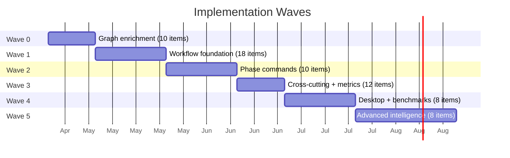

# Implementation Roadmap

## Principles

- One issue at a time, verified before moving to next
- TDD: tests written and approved before implementation
- Each item becomes a GitHub issue with acceptance criteria
- Items within a wave can be parallelized where dependencies allow
- Commands tested via skill-creator eval framework (test prompts → grade → iterate)
- Rust code tested via cargo test with fixtures

---

## Wave 0: Foundation fixes (graph enrichment)

**Goal:** Enrich graph nodes so the intelligence layer has data to work with.

**Design doc:** [50-daemon-enhancements.md](50-daemon-enhancements.md) section 1

| # | Item | Type | Effort | Test |
|---|------|------|--------|------|
| 0.1 | Store docstrings (fix graph_writer.rs:71) | Rust fix | Tiny | `assert!(sym.docstring.is_some())` |
| 0.2 | Store line_end | Rust fix | Tiny | `assert!(sym.line_end > sym.line)` |
| 0.3 | Store is_exported | Rust fix | Tiny | `assert!(sym.is_exported == true)` for pub functions |
| 0.4 | Extract + store params (name, type) | Rust + adapters | Medium | `assert_eq!(sym.params.len(), 2)` |
| 0.5 | Extract + store return_type | Rust + adapters | Medium | `assert_eq!(sym.return_type, Some("Vec<Symbol>"))` |
| 0.6 | Store doc frontmatter | Rust (doc indexer) | Medium | `assert_eq!(doc.status, Some("complete"))` |
| 0.7 | Extract + store implements/extends | Rust + adapters | Medium | `assert!(graph.has_edge("IMPLEMENTS", class, trait))` |
| 0.8 | Add IMPLEMENTS edge type | Rust (graph) | Medium | Integration test with fixture |
| 0.9 | Add EXTENDS edge type | Rust (graph) | Medium | Integration test with fixture |
| 0.10 | Add TRACES_TO edge type (doc → doc) | Rust (doc indexer) | Medium | `assert!(graph.has_edge("TRACES_TO", blueprint, idea))` |

**Gate:** All existing tests pass + new tests for each fix.

---

## Wave 1: Workflow foundation

**Goal:** The essential infrastructure that all commands depend on.

**Design docs:** [50-daemon-enhancements.md](50-daemon-enhancements.md) sections 2-3, [51-mcp-workflow-tools.md](51-mcp-workflow-tools.md), [52-marketplace-commands.md](52-marketplace-commands.md), [54-configuration-templates.md](54-configuration-templates.md)

| # | Item | Type | Layer | Test |
|---|------|------|-------|------|
| 1.1 | Event store (schema + POST/GET endpoints) | Rust | Daemon | `POST /api/events` → 201, `GET /api/events/:proj` returns events |
| 1.2 | Workflow state (schema + GET/PUT endpoints) | Rust | Daemon | `PUT /api/state/:proj` → 200, `GET` returns updated state |
| 1.3 | State file sync (PUT also writes .sensei/state.yaml) | Rust | Daemon | After PUT, `cat .sensei/state.yaml` matches |
| 1.4 | MCP: `log_event` tool | Rust | MCP | Call tool → event appears in daemon store |
| 1.5 | MCP: `get_workflow_state` tool | Rust | MCP | Returns current phase, task, issue |
| 1.6 | MCP: `update_phase` tool | Rust | MCP | Updates daemon + state.yaml |
| 1.7 | Phase doc templates (5 templates) | Markdown | Templates | Each template parseable, frontmatter valid |
| 1.8 | Guardrails template | Markdown | Config | Template creates valid guardrails.md |
| 1.9 | `/sensei:guardrails` command | Markdown | Marketplace | Eval: reads guardrails, outputs summary |
| 1.10 | `/sensei:refocus` command | Markdown | Marketplace | Eval: reads state, outputs orientation |
| 1.11 | `/sensei:status` command | Markdown | Marketplace | Eval: displays phase, task, issue, docs, tools |
| 1.12 | Pre-compact hook | Bash | Marketplace | Run script, JSON output contains guardrails + state |
| 1.13 | User-prompt hook (turn counting + correction detection) | Bash | Marketplace | Run script with correction prompt, verify revision_requested event |
| 1.14 | Wire pre-tool/post-tool hooks in hooks.json | JSON | Marketplace | Hooks fire on tool use |
| 1.15 | Update session-start hook (guardrails + commands + tools) | Bash | Marketplace | Run script, verify new context sections in output |
| 1.16 | GitHub issue templates + labels | GitHub config | Repo | `gh label list` shows concept/depth/wave/priority/type labels |
| 1.17 | Pattern detection Phase A (naming heuristics) | Rust | Daemon | `get_patterns("adapter")` returns detected patterns |
| 1.18 | MCP: `get_patterns` tool | Rust | MCP | Returns pattern list from daemon |

**Gate:** All tests pass. `/sensei:status` shows correct state. Pre-compact preserves context.

---

## Wave 2: Phase commands

**Goal:** The full workflow command set. One command at a time.

**Design doc:** [52-marketplace-commands.md](52-marketplace-commands.md)

| # | Item | Type | Test method |
|---|------|------|------------|
| 2.1 | `/sensei:brainstorm` command | Markdown | Skill-creator eval: content routed to correct folder |
| 2.2 | `/sensei:idea` command | Markdown | Eval: produces idea doc with correct template + frontmatter |
| 2.3 | `/sensei:analyze` command | Markdown | Eval: reads idea doc, produces analysis with options |
| 2.4 | `/sensei:blueprint` command | Markdown | Eval: reads analysis, produces architecture doc |
| 2.5 | `/sensei:experiment` command | Markdown | Eval: creates branch, produces findings doc |
| 2.6 | `/sensei:plan` command | Markdown | Eval: reads blueprint, creates GitHub issues |
| 2.7 | `/sensei:build` command | Markdown | Eval: locate step calls MCP, decomposes, tests first, pattern check |
| 2.8 | `/sensei:validate` command | Markdown | Eval: checks acceptance criteria, drift, tests pass |
| 2.9 | MCP: `match_pattern` tool | Rust | Unit + integration: returns relevant patterns for description |
| 2.10 | MCP: `get_pattern_for` tool | Rust | Returns pattern membership for a symbol |

**Gate:** Each command passes its eval suite. State updates correctly through phase transitions.

---

## Wave 3: Cross-cutting, metrics, and polish

**Goal:** Quality enforcement, measurement, and cleanup.

**Design docs:** [50-daemon-enhancements.md](50-daemon-enhancements.md) section 4, [52-marketplace-commands.md](52-marketplace-commands.md), [53-desktop-views.md](53-desktop-views.md)

| # | Item | Type | Layer |
|---|------|------|-------|
| 3.1 | `/sensei:review` command | Markdown | Marketplace |
| 3.2 | `/sensei:tools` command | Markdown | Marketplace |
| 3.3 | `/sensei:patterns` command | Markdown | Marketplace |
| 3.4 | MCP: `get_metrics` tool | Rust | MCP |
| 3.5 | MCP: `get_duplicates` tool | Rust | MCP |
| 3.6 | MCP: `get_project_conventions` tool | Rust | MCP |
| 3.7 | Daemon: metrics computation endpoints | Rust | Daemon |
| 3.8 | Update `/sensei:help` | Markdown | Marketplace |
| 3.9 | Update catalog.json | JSON | Marketplace |
| 3.10 | Retire 11 absorbed skills | Cleanup | Marketplace |
| 3.11 | Archive docs/superpowers/ | Cleanup | Docs |
| 3.12 | Push roadmap as GitHub issues | Backlog | Repo |

**Gate:** Metrics endpoint returns computed values. Review command detects pattern violations.

---

## Wave 4: Desktop + benchmarks

**Goal:** Visualization and credibility.

**Design docs:** [53-desktop-views.md](53-desktop-views.md), [ideas/19-benchmarking-credibility.md](../ideas/19-benchmarking-credibility.md)

| # | Item | Type | Layer |
|---|------|------|-------|
| 4.1 | Quality dashboard (FTR, turns, rework trends) | SvelteKit | Desktop |
| 4.2 | Phase timeline view | SvelteKit | Desktop |
| 4.3 | Event log view | SvelteKit | Desktop |
| 4.4 | Pattern catalog view | SvelteKit | Desktop |
| 4.5 | Guided coaching view | SvelteKit | Desktop |
| 4.6 | Benchmark corpus registry + task definitions | YAML | Benchmarks |
| 4.7 | Benchmark runner CLI | Rust or Bash | CLI |
| 4.8 | Benchmark results page on website | SvelteKit | Website |

**Gate:** Dashboard renders real data. Benchmark produces reproducible results.

---

## Wave 5: Advanced intelligence + multi-coordinator

**Goal:** Deeper pattern detection, library patterns, and support for other AI tools.

**Design docs:** [ideas/17-pattern-knowledge.md](../ideas/17-pattern-knowledge.md), [ideas/12-multi-coordinator.md](../ideas/12-multi-coordinator.md)

| # | Item | Type | Layer |
|---|------|------|-------|
| 5.1 | Pattern detection Phase B (structural heuristics) | Rust | Daemon |
| 5.2 | Library usage pattern extraction | Rust | Daemon |
| 5.3 | Industry pattern registry (patterns.dev import) | Rust + config | Daemon |
| 5.4 | Architectural pattern options | Markdown + config | Marketplace |
| 5.5 | Derived patterns from project usage | Rust | Daemon |
| 5.6 | Cursor ACP adapter (.cursorrules generation) | Template | ACP |
| 5.7 | Copilot ACP adapter | Template | ACP |
| 5.8 | Duplicate detection (semgrep or qlty integration) | Rust + external | Daemon |

---

## Summary

**Total: 66 items across 6 waves (including Wave 0).**

Each item becomes a GitHub issue. Waves can overlap where dependencies allow. Wave 0 items 0.1-0.3 (quick wins) can start immediately.
