# Architecture Diagram

> End-to-end component map and interaction flows for the sensei system.

---

## System Diagram

```mermaid
graph TD
    %% ── CLI Setup ──────────────────────────────────────────────────────────────
    subgraph CLI_SETUP ["CLI Setup"]
        CLI_INIT["sensei init\n(one-time repo setup)"]
        CLI_SETUP_MCP["sensei setup --mcp\n(writes ~/.claude/mcp.json)"]
        CLI_SETUP_HOOKS["sensei setup --hooks\n(installs daemon + launchd plist)"]
        CLI_SETUP_AGENT["sensei setup --agent\n(generates repo skills)"]
        CLI_START["sensei start / restart\n(launchctl start/stop\ncom.sensei.collector)"]
        CLI_STATUS["sensei status / doctor\n(health, index age, event count)"]
    end

    %% ── User Machine ───────────────────────────────────────────────────────────
    subgraph USER_MACHINE ["User Machine"]
        CC["Claude Code\n(AI agent)"]

        subgraph HOOKS_GROUP ["Agent Hooks (per Claude Code session)"]
            HOOK_START["SessionStart hook\n(.claude/hooks/)"]
            HOOK_PRE["PreToolUse hook"]
            HOOK_POST["PostToolUse hook"]
        end

        subgraph MCP_SERVER ["Sensei MCP Server\n(per-session, stdio transport)"]
            MCP["MCP Tools\nget_session_context · search\ncontext_pack · take_snapshot\ncheckpoint · load_context"]
        end

        subgraph DAEMON ["Collector Daemon\n(persistent, launchd-managed)"]
            DAEMON_HTTP["HTTP :51789\n/event · /otlp/register"]
            DAEMON_OTLP["OTLP Endpoint\n:51789/v1/logs\n(API cost events)"]
            DAEMON_JSONL["JSONL Fallback\n.sensei/events.jsonl"]
            DAEMON_FTR["FTR Calculator\n(post-session scoring)"]
        end

        MCP_JSON["~/.claude/mcp.json\n(MCP server config)"]
        SENSEI_CONFIG[".sensei/config.yaml\n(repo config, Supabase URL)"]
        CREDENTIALS["~/.config/sensei/credentials.yaml\n(Supabase key, auth token)"]
        LAUNCHD["launchd\ncom.sensei.collector.plist"]
    end

    %% ── Supabase ───────────────────────────────────────────────────────────────
    subgraph SUPABASE ["Supabase (sensei schema)"]
        DB_SYMBOLS[("symbols\ncall_edges\nembeddings\ndoc_sections")]
        DB_SESSIONS[("task_sessions\ntask_turns\nevents")]
        DB_API[("api_requests\n(OTLP cost events)")]
        DB_REPOS[("repos\nworkspaces")]
    end

    %% ── Dashboard ──────────────────────────────────────────────────────────────
    subgraph DASHBOARD ["Dashboard (SvelteKit web app)"]
        DASH_ANALYTICS["Analytics\n(FTR scores, token cost)"]
        DASH_SESSIONS["Sessions\n(turn history, skill usage)"]
        DASH_REPOS["Repos & Index\n(symbol browser, traceability)"]
        DASH_QUALITY["Quality\n(complexity, benchmarks)"]
    end

    %% ── Plugin (future) ────────────────────────────────────────────────────────
    PLUGIN["Plugin (Planned)\nDistributable Claude Code plugin\nstatic skills + SessionStart hook\n+ slash commands"]

    %% ── Flow 1: sensei init ────────────────────────────────────────────────────
    CLI_INIT -->|"creates Supabase schema\n(runs migrations)"| DB_REPOS
    CLI_INIT -->|"writes"| SENSEI_CONFIG
    CLI_INIT -->|"generates CLAUDE.md + AGENTS.md"| CC
    CLI_SETUP_HOOKS -->|"installs plist → autostart"| LAUNCHD
    CLI_SETUP_MCP -->|"writes mcp.json +\nOTEL_EXPORTER_OTLP_ENDPOINT\n=localhost:51789"| MCP_JSON

    %% ── Flow 2: sensei setup --mcp ─────────────────────────────────────────────
    MCP_JSON -->|"Claude Code reads\non session start"| CC

    %% ── Flow 3: Session start ──────────────────────────────────────────────────
    CC -->|"spawns MCP server\nvia mcp.json (stdio)"| MCP
    MCP -->|"POST /otlp/register\n(session registration)"| DAEMON_HTTP

    %% ── Flow 4: SessionStart hook ──────────────────────────────────────────────
    CC -->|"fires on session start"| HOOK_START
    HOOK_START -->|"injects instruction:\n'call get_session_context'"| CC
    CC -->|"calls"| MCP
    MCP -->|"reads"| DB_SESSIONS
    MCP -->|"reads"| DB_SYMBOLS

    %% ── Flow 5: Agent works — MCP tools ────────────────────────────────────────
    CC -->|"get_session_context\nsearch · context_pack\ntake_snapshot · checkpoint"| MCP
    MCP -->|"reads/writes"| DB_SYMBOLS
    MCP -->|"reads/writes"| DB_SESSIONS

    %% ── Flow 6: Hook events ────────────────────────────────────────────────────
    CC -->|"fires before each tool call"| HOOK_PRE
    CC -->|"fires after each tool call"| HOOK_POST
    HOOK_PRE -->|"POST /event"| DAEMON_HTTP
    HOOK_POST -->|"POST /event"| DAEMON_HTTP
    DAEMON_HTTP -->|"writes events"| DB_SESSIONS
    DAEMON_HTTP -.->|"fallback when\nSupabase unreachable"| DAEMON_JSONL
    DAEMON_JSONL -.->|"drains on\nreconnect"| DB_SESSIONS
    DAEMON_FTR -->|"writes FTR scores\npost-session"| DB_SESSIONS

    %% ── Flow 7: OTLP cost events ───────────────────────────────────────────────
    CC -->|"API cost events\n(OTLP logs)"| DAEMON_OTLP
    DAEMON_OTLP -->|"writes"| DB_API

    %% ── Flow 8: Dashboard reads Supabase ───────────────────────────────────────
    DASH_ANALYTICS -->|"reads directly\n(Supabase RLS)"| DB_SESSIONS
    DASH_ANALYTICS -->|"reads"| DB_API
    DASH_SESSIONS -->|"reads"| DB_SESSIONS
    DASH_REPOS -->|"reads"| DB_SYMBOLS
    DASH_REPOS -->|"reads"| DB_REPOS
    DASH_QUALITY -->|"reads"| DB_SESSIONS

    %% ── Daemon lifecycle ───────────────────────────────────────────────────────
    LAUNCHD -->|"starts at login\nautorestarts"| DAEMON_HTTP

    %% ── CLI control ────────────────────────────────────────────────────────────
    CLI_START -->|"launchctl start/stop"| LAUNCHD
    CLI_STATUS -.->|"health check"| DAEMON_HTTP
```



---

## Component Descriptions

| Component | Type | Transport | Lifecycle |
|---|---|---|---|
| Claude Code | AI agent | — | User-controlled |
| Sensei MCP Server | MCP server | stdio | Per Claude Code session |
| Collector Daemon | HTTP server | HTTP :51789 | Persistent, launchd-managed |
| SessionStart hook | Shell hook | — | Per session |
| PreToolUse / PostToolUse hooks | Shell hooks | HTTP POST | Per tool call |
| Supabase | PostgreSQL + pgvector | TCP | Always-on (cloud or local Docker) |
| Dashboard | SvelteKit web app | Supabase client | On-demand |
| CLI | Binary | — | On-demand |
| Plugin (planned) | Claude Code plugin | — | Future |

---

## Key Flows

### Flow 1 — `sensei init` (one-time repo setup)

```
sensei init
  → runs Supabase migrations (creates sensei schema)
  → writes .sensei/config.yaml (Supabase URL + repo ID)
  → generates CLAUDE.md + AGENTS.md at repo root
  → runs initial indexing pipeline → symbols, embeddings written to Supabase

sensei setup --hooks
  → installs PreToolUse / PostToolUse / SessionStart hook scripts
  → writes com.sensei.collector.plist → launchd loads it → daemon starts at login

sensei setup --mcp
  → writes ~/.claude/mcp.json (MCP server entry for this repo)
  → sets OTEL_EXPORTER_OTLP_ENDPOINT=localhost:51789 in mcp.json env block
```

### Flow 2 — Session start

```
Claude Code reads mcp.json on startup
  → spawns sensei MCP server process via stdio
  → MCP server calls POST /otlp/register on collector daemon (registers session)
  → SessionStart hook fires
    → injects instruction: "call get_session_context"
    → Claude calls get_session_context tool
    → MCP server returns: repo orientation, last interrupted session, stack summary
```

### Flow 3 — Agent works

```
Claude calls MCP tools during the session:
  get_session_context  → orientation + interrupted session recovery
  search(query)        → semantic + BM25 search across indexed symbols
  context_pack(task)   → ranked, token-budgeted code + doc slices
  take_snapshot(...)   → writes session snapshot to Supabase
  checkpoint(...)      → closes session, triggers FTR calculation

Each tool call fires PreToolUse → POST /event → daemon → Supabase
Each tool response fires PostToolUse → POST /event → daemon → Supabase
```

### Flow 4 — OTLP cost telemetry

```
Claude Code sends OTLP log records to localhost:51789/v1/logs
  → collector daemon parses API cost records
  → writes to api_requests table in Supabase
  → Dashboard reads api_requests for cost breakdown and benchmark comparison
```

### Flow 5 — Dashboard

```
Dashboard (SvelteKit) reads Supabase directly via shared client
  → Supabase Row Level Security enforces team isolation
  → No intermediate API layer; Supabase Realtime enables live updates
```
