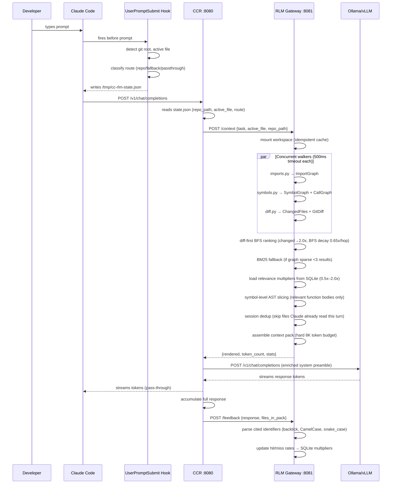

# CC-RLM: Architecture Analysis

> Reference analysis of the [CC-RLM](https://github.com/CC-RLM) codebase. Informs the sensei pipeline adapter design and CC-RLM feature integration.

## What Is CC-RLM?

CC-RLM (Claude Code — Repo Language Model) is a self-improving context engine that sits between Claude Code and a local LLM (Ollama/vLLM). Instead of dumping an entire repo into the context window, it maintains a live structural model of the codebase and delivers only the relevant slice needed for each task.

**Claimed results**: 70–80% token reduction, 90% recall on code-relevant tasks, <200ms latency with pre-warming dropping to ~20ms.

---

## Architecture Overview

```
┌─────────────────────┐
│   Claude Code       │  Developer interface
└──────────┬──────────┘
           │ ANTHROPIC_BASE_URL redirected to :8080
           ▼
┌──────────────────────────────────────────┐
│   CCR — Claude Code Router  :8080        │
│   Proxy · routing · auth · fallback      │
│   Reads /tmp/cc-rlm-state.json           │
│   Injects enriched system preamble       │
│   Streams response, triggers feedback    │
└──────────┬───────────────────────────────┘
           │ POST /context {task, active_file, repo_path}
           ▼
┌──────────────────────────────────────────┐
│   RLM Gateway  :8081                     │
│   Mount workspace (idempotent)           │
│   Dispatch walkers concurrently          │
│   Diff-first BFS ranking                 │
│   Symbol-level AST slicing               │
│   Session dedup + tool-call awareness    │
│   Assemble <8K token pack                │
└──────────┬───────────────────────────────┘
           │ Enriched system preamble
           ▼
┌──────────────────────────────────────────┐
│   Ollama / vLLM  :11434 / :8000          │
│   qwen2.5-coder:7b (default)             │
│   OpenAI-compatible /v1/chat/completions │
└──────────┬───────────────────────────────┘
           │ Accumulated response
           ▼
┌──────────────────────────────────────────┐
│   Answer-Driven Feedback Loop            │
│   Parse cited symbols from response      │
│   Update relevance scores in SQLite      │
│   Next request uses learned multipliers  │
└──────────────────────────────────────────┘
```

---

## Integration Strategy: Proxy vs MCP

CC-RLM's approach is **transport-layer interception**: it replaces `ANTHROPIC_BASE_URL` so Claude thinks it's talking to Anthropic, but CCR injects context into every request invisibly.

Sensei uses **MCP tool invocation**: context is loaded explicitly by the agent via named tools. This is architecturally cleaner — context loading is auditable, agent-controlled, and composable.

| Dimension | CC-RLM | Sensei |
|---|---|---|
| Integration point | ANTHROPIC_BASE_URL proxy | MCP stdio tools |
| Agent awareness | None (invisible injection) | Full (agent calls tools explicitly) |
| Composability | Low (monolithic inject) | High (tools compose) |
| Debuggability | Low (requires log inspection) | High (tool calls visible in Claude UI) |
| Model agnosticism | Routes to Ollama/vLLM/Anthropic | Any model via Claude Code |

---

## Full Request/Response Flow



---

## Token Reduction Mechanisms

CC-RLM achieves 70–80% reduction through layered strategies:

### A. Diff-First BFS Ranking (20–30% savings)

Seeds BFS traversal from `git diff HEAD` changed files. Changed files score 2.0×, active file 1.5×, graph neighbors decay 0.65× per hop. Focuses context on the files most likely to matter for the current task.

```
changedFiles  → score 2.0
activeFile    → score 1.5
BFS hop 1     → score × 0.65
BFS hop 2     → score × 0.65²
...
```

### B. Symbol-Level AST Slicing (20–25% savings)

Instead of including full files, extracts only the relevant function/class bodies:

1. Parse file AST for all top-level symbols
2. Score each symbol by task keyword match + call-graph relevance
3. Select symbols scoring ≥1.5 or top-3 if none qualify
4. Merge adjacent line ranges (gap ≤3 lines) for readable output
5. Extract only those line ranges — not the whole file

Result: 300+ line files become 40–80 line slices.

### C. Session Deduplication (32% savings on turn 2+)

Tracks files Claude has already read this session. PostToolUse hook appends file paths to `/tmp/cc-rlm-tool-reads.json`. Next context pack skips those files — Claude already has them.

### D. BM25 Semantic Fallback (closes 12% recall gap)

When the import graph returns <3 results (new file, sparse edges), BM25 scores all files against the task using an inverted index of symbol names + file stems. Ranked below graph results so structure still dominates.

### E. Answer-Driven Relevance Learning (5–10% improvement per turn)

After each response, parses cited identifiers from model output. Updates per-file hit/miss rates in SQLite. Applies 0.5×–2.0× multipliers to future ranking. Gets smarter every turn.

### F. Walker Result Caching (10–15% latency savings)

Mtime-invalidated in-memory cache per walker × file. ~90% hit rate on typical multi-turn sessions, reducing walker latency from ~150ms to ~20ms.

### G. Hard 8K Token Budget

Enforced in `context_pack.assemble()`. Budget allocation:
- Header (task + active file): ~100 tokens
- Git diff: ≤20% (~1,600 tokens)
- Symbol graph: variable, compact
- File slices: remainder (highest rank first)

---

## Walker Architecture

Walkers run as **isolated subprocesses** — one buggy walker cannot crash the gateway. Each walker has a 500ms timeout and returns structured JSON.

### Python AST Walker (`walkers/imports.py`)
- Uses Python's built-in `ast` module
- Extracts `import` / `from...import` statements
- Resolves module names to actual file paths
- Returns `{imports: [...], imported_by: [...]}`

### Symbol/Call Graph Walker (`walkers/symbols.py`)
- Top-level functions and classes from AST
- One-level call depth (what each function calls)
- Returns line numbers, type (`function`, `async`, `class`, `methods`)

### TypeScript/JS Walker (`walkers/ts_imports.py`)
- Pure Python regex (no Node.js required)
- Handles `import`, `export`, `require()`, dynamic `import()`
- Resolves relative paths, skips node_modules
- Supports `.ts`, `.tsx`, `.js`, `.jsx`, `.mts`, `.mjs`

### Git Diff Walker (`walkers/diff.py`)
- Runs `git diff HEAD` (falls back to last commit)
- Returns changed files + diff text (capped at 6,000 chars)
- Seeds diff-first BFS ranking

### Language Support Matrix

| Language | Walker | AST Library | Gap |
|---|---|---|---|
| Python | `imports.py` + `symbols.py` | `ast` (built-in) | None — full support |
| TypeScript / JavaScript | `ts_imports.py` | Python regex | No symbol extraction, no call graph |
| Go, Rust, Java, Ruby | None | — | Falls back to first 60 lines |
| Config files | Skipped | — | `.json`, `.yaml`, `.toml` filtered |

---

## Hooks Integration

CC-RLM uses 3 Claude Code hooks configured in `.claude/settings.json`:

### UserPromptSubmit (`inject_repo_context.py`)
Fires before every prompt:
- Detects git root (`git rev-parse --show-toplevel`)
- Finds active file (priority: unstaged → staged → last commit)
- Classifies route: `repo_task` | `fallback` (Anthropic) | `passthrough` (Ollama direct)
- Writes `/tmp/cc-rlm-state.json`
- Clears previous turn's tool-reads list

### PreToolUse (`pre_tool_use.py`)
Fires before Write/Edit operations:
- Blocks writes outside project root
- Warns on edits to walker files or token budget constants

### PostToolUse (`track_tool_reads.py`)
Fires after Read/Edit/Write:
- Appends file paths to `/tmp/cc-rlm-tool-reads.json`
- Session dedup uses this to skip already-read files

---

## Persistence Layer

Single SQLite database (`~/.cc-rlm/store.db`):

| Table | Content |
|---|---|
| `import_graph` | File → imports, imported_by (persists across restarts) |
| `symbol_graph` | File → symbols, types, line numbers |
| `relevance_scores` | File → hit count, total count, multiplier |

Import graph survives server restarts — no cold-start rebuild on next launch. Relevance scores compound over sessions.

---

## What CC-RLM Does Not Have

| Capability | Status |
|---|---|
| Dashboard / analytics UI | ❌ None |
| Skills / agent guidance layer | ❌ None |
| MCP integration | ❌ Proxy interception only |
| Project memory / checkpoints | ❌ None |
| Benchmark infrastructure | ❌ No formal A/B testing |
| Doc traceability | ❌ No doc↔code awareness |
| Token usage analytics | ⚠️ `token_count` in response only, no historical tracking |
| Multi-language AST (tree-sitter) | ❌ Python AST + regex only |
| Configurable ranking strategies | ❌ Single fixed strategy |

---

## Key Architectural Insights for Sensei

1. **Diff-first ranking is high-leverage**: seeding BFS from `git diff` is simple to implement but delivers the largest single token reduction. Sensei's search has no git-diff awareness today.

2. **Symbol slicing beats resolution levels for context packs**: L0–L3 is great for agent-driven queries, but for assembling a context pack, line-range slicing of relevant function bodies is more token-efficient than even L0.

3. **The feedback loop is the compounding advantage**: answer-driven relevance learning gets cheaper over time. Sensei already has the collector + Supabase — the missing piece is a `relevance_scores` table and a PostToolUse hook that parses model responses.

4. **Session dedup is low-effort, high-reward**: the collector already tracks tool reads. Feeding `sessionReads` into the Assemble stage would immediately recover 15–30% tokens on turn 2+.

5. **Subprocess walker isolation is worth copying**: one bad parser shouldn't crash the pipeline. tree-sitter WASM gives us real AST for multiple languages without subprocess overhead, but the isolation principle still applies — each language adapter should fail safely.

6. **Sensei has capabilities CC-RLM lacks**: dashboard, skills, MCP, benchmarking, project memory, doc traceability. The integration is additive — we borrow CC-RLM's ranking and slicing mechanics while keeping sensei's richer agent interface.
