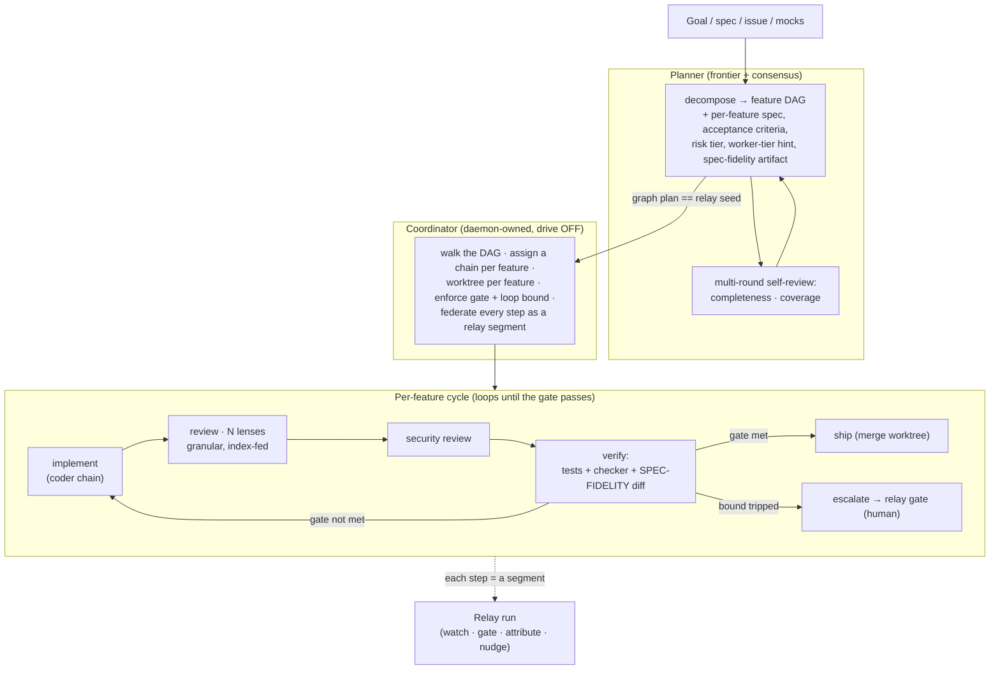

# Agentic Execution Team

> **Status: design only.** Jerry's directive (2026-07-25): "I don't want to build all this now. I want a robust system in place before we build something like this. Design and write the docs now — we work on it later." This doc is written to be picked up cold.

## 1. Motivation — the control problem

Today's coding controllers (Claude Code, Codex, OpenCode, …) own their **own loop and system prompt**. You cannot gate a step, route a sub-task to a cheaper model, or force the agent to honour the reviewed mocks. Two consequences:

- **Lock-in.** The subagent surface is single-vendor (Claude-only for Claude Code); local and alternative frontier models sit idle during a run.
- **"It doesn't do what we say."** Concrete failure — **torii+seiki**: mocks were reviewed and approved, yet during the build the agent **ignored the mocks entirely**, and the test pass never caught the divergence. "A good subagent would have caught it" — but there was no such gate we controlled.

**The thesis:** stop steering the controller. **Demote every model to a *worker* inside an orchestrator sensei owns** — a planner + a coordinator + a team of role-specialised subagents, each backed by a *manageable model chain*. Then the plan, the model-per-task, and the **quality gates are ours**. Model-agnostic, cost-disciplined ("not every task needs a paid model"), and — crucially — **in control of execution and the gates**, so we can *actually do what we say*.

**The unlock we already own:** the execution runs **as a relay run**. Every implement / review / verify step is a monitored, gateable, attributable relay segment. We are not bolting observability onto an opaque loop — **the loop *is* the relay.** That is the escape from Claude-only *and* the control surface, in one.

## 2. Principles

1. **Sensei owns the orchestration; models are interchangeable labour.**
2. **Execution == a relay run.** Reuse the run engine: phases→features→segments, watchdog, gates, attribution, drive-OFF safety.
3. **Quality gates live in the spec.** Acceptance criteria are authored into each feature by the skills (§5), not improvised at review time.
4. **Depth is proportional to the worker tier *and* the risk.** A local model needs a tighter, more complete spec than a frontier model; a high-risk feature earns consensus review. The planner sets both.
5. **Reuse existing organs; abstract only where there is a need — steered by the planner.** Not every run is a full product; a small change is "a single-feature-development conversation," not a cathedral.
6. **Cost discipline.** Local/cheap for implementation, costlier for granular review, frontier only for planning + high-risk consensus. Routing *learns* from an inference-usage ledger.
7. **Spec-fidelity is a hard gate, not a hope.** A feature cannot ship while its built output diverges from its own acceptance artifact (the mock / the spec).

## 3. Architecture

Four parts: **Planner** → **Coordinator** → **per-feature cycle** → the **team of roles, each a model chain** — all expressed as a relay run.

## 4. The Planner

**Input:** a goal / spec / issue, the reviewed **mocks** (when present), and **context extracted from sensei's index** (the code+activity graph — existing patterns, conventions, call graph, libraries, memories/rules for the repo).

**Output:** a **feature DAG** — the *graph plan* that **is** the relay seed (phases → features → acceptance criteria → gates). Each feature node carries:

| Field | Meaning |
|---|---|
| `spec` | The detailed brief. **Depth proportional to the assigned worker tier** — a local coder needs interfaces, signatures, examples, and the exact files; a frontier coder needs intent + constraints. |
| `acceptance_criteria` | Observable, testable. **Authored by the skills** (§5), not the coder. This IS the quality gate. |
| `spec_fidelity_artifact` | The mock (or spec contract) the verify step diffs against (§8). |
| `risk_tier` | ordinary · risky · guarded — drives review depth + consensus. |
| `worker_tier_hint` | complexity → which chain (local / coding / frontier). |
| `deps` | edges in the DAG — features that must complete first. |
| `independent` | derived: the parallelizable frontier (features with no unmet deps + no shared surface). |

**Independence up front (answer 2 → worktree per feature):** the planner identifies which features can be worked in parallel. Each independent feature runs in its **own git worktree**, so parallel work can't collide; the coordinator merges on ship. The planner **defaults to sequential when unsure** — false independence (silent shared-state breakage) is worse than lost parallelism.

**The planner reviews its own plan (answer 6):** planning is itself gated — **multiple rounds of review for completeness and coverage** of the features being planned (does every feature have observable criteria? are the deps right? is anything unspecified for the chosen worker tier?). This reuses the `sensei-plan-depth-reviewer` bar, run with a frontier chain + optional consensus. **A bad plan is the most expensive failure**, so it is caught before execution starts. But keep it proportional — "not everything is a full-blown product; it should just be a single-feature-development conversation." The planner sizes its own rigour to the work.

**Where it runs:** a gateway-routed **frontier** chain (the planner's judgement is the whole run's leverage), with consensus for high-stakes plans.

## 5. Quality gates live in the spec (answer 3)

The acceptance criteria and the pass/fail gate are **defined as part of the feature spec, authored by the skills** — the same mindset/skill definitions that already encode "what good looks like" per dimension. A feature's gate is the conjunction of:

- its `acceptance_criteria` demonstrably met,
- **tests pass**,
- **checker green** (D-CHECKER — eslint/ruff/clippy/qlty/test by `checker_ref`),
- **spec-fidelity diff clean** (§8),
- each required **review lens approves** (§7).

The cycle **loops until the gate is met** or a **loop bound** trips → **escalate to a human via a relay gate**. The gate is data (in the spec), not a hard-coded step — so different features carry different bars, and the skills own the definition.

## 6. The Coordinator

Daemon-owned (extends the relay run engine + `RunDriver` seam), **drive OFF by default**. Responsibilities:

- Walk the feature DAG; dispatch each *ready* feature (deps met).
- **Worktree per feature**; assign the role chains; run the per-feature cycle.
- Enforce the quality gate + the loop bound; on bound-trip, raise a **relay gate** (human approve/deny/steer).
- **Federate every step as a relay segment** — the run is watchable, nudgeable, and attributable exactly like any relay run.
- Merge a feature's worktree on ship; re-plan or hold dependents if a merge conflicts.

## 7. The per-feature cycle & the team (roles → chains)

The cycle: **implement → review (N lenses) → security → verify → ship**, looping until the gate. The team maps 1:1 onto sensei's existing **mindset subagents**; each role is a **gateway fallback chain**, tier-routed by task complexity:

| Role | Does | Existing sensei piece | Typical chain tier |
|---|---|---|---|
| **Coder** | Implements the feature to spec | `RunDriver` (ACP local / claude / gateway single-shot) | local → coding-model, escalate to frontier on failure |
| **Reviewer** (quality · modularity · scalability · security · testability · maintainability) | Granular review — **one function / one short module at a time**, fed the *relevant slice from sensei's index* (answer 5) | `sensei-security-reviewer`, `-performance-engineer`, `-developer`, `-ux-designer`, `code-simplifier`, `type-design-analyzer` | costlier / frontier (review quality matters more than cost) |
| **Tools** | Runs the mechanical checkers | **D-CHECKER** (qlty/eslint/ruff/clippy/test) | deterministic, no model |
| **Tester** | Persona-based — **ensures design/code matches the intent + the mocks** | `sensei-persona-reviewer`, `sensei-acceptance-tester` | frontier (this is the torii+seiki gate) |

**Granular review (answer 5):** review small pieces with the **relevant context extracted from sensei's index** — the function's callers/callees, the patterns it should follow, the rules in force. This keeps each review call cheap *and* sharp (a small piece + exactly the context it needs beats a whole-file dump to a big model).

**Cost model (the whole point):** the *implementation* can go to a **local model**; the *review* to a **costlier model**, granularly; **judge-consensus** (a panel → agreement threshold, the gateway already models this) is reserved for **high-risk features**. Not every task needs a paid model.

## 8. The spec-fidelity gate (the crux — answer 1)

The torii+seiki failure makes this the design's north star: **a feature cannot reach "ship" while its built output diverges from its acceptance artifact.**

- **Mock available:**
  - **React mock → React target: reuse, don't rewrite.** The coder consumes the mock's components directly rather than re-implementing them; fidelity is near-guaranteed and the gate verifies the mock components are actually used (import/DOM presence), not paraphrased.
  - **Otherwise (non-React target, or non-component mock): a rendered-DOM check.** Render the built UI and diff its DOM/structure (and/or a vision-model comparison) against the rendered mock. Divergence fails the gate.
- **No mock (backend/logic feature):** the acceptance artifact is the spec contract — verify via the acceptance criteria + tests + the persona/acceptance reviewer checking behaviour against stated intent.

This is a **required** verify-step gate, owned by the **Tester** role. It is the mechanism that turns "a good subagent would have caught it" into "the gate *does* catch it."

## 9. Model chains + the inference-usage ledger (answer 4 — build the ledger)

Routing must **learn**, so build the prerequisite first: an **inference-usage ledger** — one row per model call with `model`, `task_type`, `role`, `latency`, `tokens`, `cost`, `success`, and the downstream `verdict` (did the feature's gate pass?). Today only `insight_copy` persists `resp.model`; `gateway/` is config-only. With the ledger, the router can pick the **cheapest chain that has historically *passed the gate*** for a given task type + complexity, and escalate on failure.

Chains are defined in the existing gateway (`fallback_chains` + `models_in_router` + `/api/gateway/consensus`). Complexity classification (itself a cheap model call, ledger-informed) → worker tier. Illustrative tiers (model-agnostic; names are examples): **frontier** (planning, high-risk consensus) — Fable / Opus-class; **coding** (implementation) — Opus / Kimi / Qwen-class; **local** (narrow edits, classification, embeddings) — embedded Gemma / local Ollama.

## 10. Safety envelope (answer 7)

- Runs **as a relay run**, `SENSEI_RUN_DRIVE` **OFF by default** — activation is a human gate.
- **Coordinator is daemon-owned**; every escalation is a **relay gate** (human approve/deny/steer mid-run).
- **Worktree isolation** per feature; nothing merges without passing its gate.
- **Attribution** on every step (the relay stack already carries this).
- Zero-knowledge posture preserved — only filtered status crosses to a watcher.

## 11. What this reuses vs what is net-new

**Reused (≈70%):** gateway chains/consensus · relay run engine + `RunDriver` seam + watchdog + gates · plan-as-run seed · mindset subagents (the reviewer/tester roles) · `sensei-plan-depth-reviewer` (the planner's bar) · **D-CHECKER** (the tools role) · ACP adapter (local coder seam) · sensei index (review context).

**Net-new:** the **Planner** (goal → feature DAG) · the **per-feature cycle state machine** · the **spec-fidelity gate** · the **inference-usage ledger** · the **complexity→tier router** that learns from it.

## 12. Phased build (for later)

- **v0 — ledger.** Build the inference-usage ledger + start recording every gateway call with task-type + verdict. (Prereq; unlocks routing + also feeds DORA/insights.)
- **v1 — skinny vertical slice.** Planner → feature DAG (matching the relay seed) + the per-feature cycle over the *existing* relay engine, **single chain, sequential, drive OFF**, gate = tests + checker + **spec-fidelity diff**. Prove the loop + the fidelity gate on **one real feature** (e.g. a small screen with a React mock → verify reuse).
- **v2 — the team + routing.** Add the role chains, complexity→tier routing (ledger-driven), granular index-fed review, and the persona/acceptance tester gate. Still sequential.
- **v3 — parallelism + consensus.** Worktree-parallel independent features; judge-consensus panels for high-risk; brownfield planning (reconstruct the DAG from an existing codebase).

Exit criteria per phase: the run of the *next* phase's canonical example passes end-to-end, watchable as a relay run, with the gate demonstrably failing a deliberately-divergent build (the torii+seiki regression test).

## 13. The torii+seiki acceptance test

The whole design is validated by one scenario: **feed it a feature with a reviewed mock, have the coder chain produce a divergent build, and confirm the run cannot ship it** — the spec-fidelity gate + the persona tester fail the feature and loop (or escalate). If that run goes green on a divergent build, the design has failed.

## 14. Open items / risks (to resolve when we build)

- **Spec-fidelity for non-visual features** — the DOM/render check covers UI; behavioural features need a crisp "matches intent" check (persona reviewer + property/acceptance tests). Define the contract shape.
- **DAG false-independence** — the cost of a wrong "independent" call (silent shared-state breakage). Conservatism heuristics + post-merge conflict detection.
- **Loop-bound tuning + cost ceilings** — when to stop looping and escalate; a per-run token/cost budget (the ledger enables this).
- **Planner hallucination** — mitigated by the multi-round completeness/coverage review, but the planner's own quality is the run's ceiling.
- **Worktree merge strategy** — order, conflict handling, and re-planning dependents.
- **The `ponytail` tool-reference adoption** — see §15 (pending the investigation).

## 15. ponytail — what it actually is, and what to adopt

**Correction to the premise:** `DietrichGebert/ponytail` (MIT) is **not** a tool install/reference catalog. It is a **"lazy senior developer" coding-discipline skill** — a behavioural ladder (YAGNI · reuse-first · stdlib over deps · one line over fifty) shipped as a multi-platform skill family, and it is **already installed in this environment** (`ponytail:ponytail`, `-audit`, `-debt`, `-gain`, `-review`, `-help`). So it does **not** fill the **Tools** role's per-tool install/config/verify gap — that must be built fresh; the closer internal fit is sensei's own `get_commands` MCP tool + the manifest-adapter direction ("how do I invoke this tool in this repo").

**Three patterns worth adopting** (all MIT, adaptable):

1. **Write-once / render-many rule portability + a drift-checker.** ponytail keeps one ruleset and mechanically renders it into every agent's native rule location, with a script that fails if the copies drift. **Directly relevant to D-INJECT:** sensei has one resolved rules source and several rendered surfaces (SessionStart/PreCompact push, per-tier, per-agent) — adopt a drift-checker so they can't silently diverge.
2. **Skill/playbook-effectiveness benchmark harness** (promptfoo + an LLM judge + committed dated `results/*.md`). sensei has no reproducible way to prove a playbook/skill *improves* outcomes — the **capability-contract ≥80% gate** could gain an empirical, reproducible measurement instead of a static score, and the **playbook learning loop** could grade rule candidates this way. (Distinct from the cut sensei-vs-no-sensei benchmark — that was product proof; this is *skill*-effectiveness, which feeds the gate. Same harness shape.)
3. **Skill-family + intensity-level format** (one core skill + satellites, `lite|full|ultra`). A clean model for sensei's cross-cutting discipline skills — and specifically for packaging the **reviewer roles** (§7) as a skill family with dialable rigour. The "lazy ladder" itself is a ready-made review lens that maps onto sensei's `/review` + `sensei-developer` "does this justify its existence / reuse-first" ethos.

**Not adopted:** the per-tool install catalog (doesn't exist in ponytail). The Tools role still needs its own reference layer — track separately.

## 16. Relationship to existing docs & decisions

Extends and unifies: `design/local-agent-coordinator.md` (**D-COORD** — the coordinator v1) · `design/remote.md` §"Phase-6 Planner→Builder→Judge orchestrator" · the heterogeneous-execution-router note (`plan/2026-07-19-heterogeneous-execution-router.md`) · **D-PLANNER** (the planner) · **D-CHECKER** (the tools role). Decisions resolved here (2026-07-25): spec-fidelity = rendered-DOM check + React-reuse; worktree per feature; quality gate authored into the spec by the skills; build the inference-usage ledger first; planner self-reviews for completeness/coverage; runs as a drive-OFF relay run. See `docs/decisions.md` → **D-EXEC-TEAM**.
