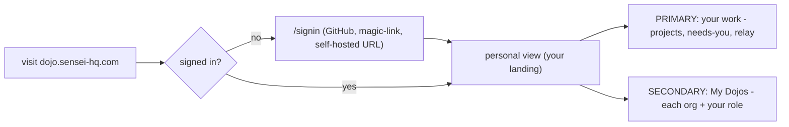
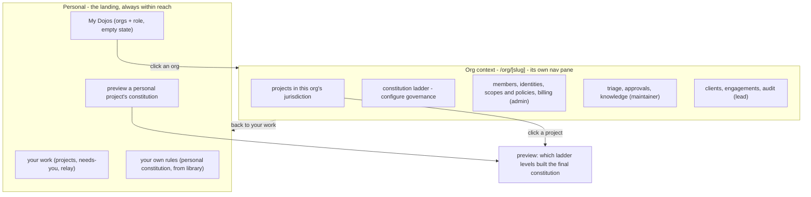
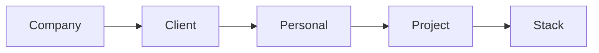
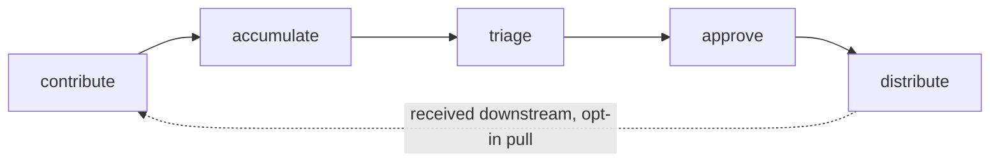

# Dōjō web app — sitemap & user flow

> The user-first structure of the Dōjō web app (`dojo/`, `dojo.sensei-hq.com`).
> Captured from the [Dōjō journey map](../../mockups/Sensei/Sensei%20D%C5%8Dj%C5%8D%20Journey%20Map.html)
> + [`journeys/dojo.md`](../../journeys/dojo.md) + `mockups/Sensei/lib/dojo/*.jsx`, then refined
> in discussion (2026-07-23). **Discussion draft** — marks shipped vs. gap.
>
> Status legend: **✅ built** · **◐ partial** · **○ target** (not built).
> (Kanji are kept in prose; Mermaid labels are ASCII-only so they render.)

## 0. The model in one line

**One wired app, every role.** You sign in and land in your **personal view — what you're
working on is the highest-activity surface.** Dōjō membership, org management and configuration
are all **secondary**; personal stays within reach at all times. A **"My Dōjōs"** section lists
each org you belong to **with your role**; clicking one opens that org's context at
**`/org/[slug]`** — its own nav for the **constitution ladder** plus the **projects in its
jurisdiction**. Any project drills through to a **preview of exactly which ladder levels built
its final constitution**.

## 1. Entry & landing — your work first

- **Public**: `/` → `/signin`. GitHub primary (derives orgs + roles); magic-link for non-GitHub
  orgs; self-hosted-URL entry. **✅**
- **After sign-in → the personal view.** **Primary surface = your work** (the projects you're
  working on, the "needs-you" band, live Relay). **Secondary = "My Dōjōs"** — a section listing
  every org you belong to, each showing **your role**; **empty state** ("no Dōjōs yet — create or
  join, optional") when you have none. A Dōjō is **optional, never a gate** (DJ1).
- **Status:** ✅ solo home renders for membership-less users; ✅ "My teams" data (orgs + role)
  exists (developer console). ◐ **Gap:** a *member* still lands on the old management Overview,
  and work-first + the My-Dōjōs entry-to-org-context aren't wired yet.

## 2. Sitemap — personal (landing) → org context → project

Target route structure (today everything is a flat `(console)` shell — the reframe splits it):

| Surface | Screen | Route — target | Route — today | Status |
|---|---|---|---|---|
| Personal | your work (landing) | `/` (post-auth) | `/console` | ◐ |
| Personal | Relay | `/relay` | `/console/relay` | ✅ |
| Personal | My Dōjōs (orgs + role) | on the landing + `/me` | `/console/teams` | ✅ data |
| Personal | your own rules (library) | `/library` | `/console/library` | ✅ |
| Personal | preview (personal project) | `/preview` | `/console/preview` | ✅ |
| **Org** | org home / projects | **`/org/[slug]`** | — | ○ |
| **Org** | constitution ladder (governance) | `/org/[slug]/governance` | — | ○ |
| **Org** | a project's effective constitution | `/org/[slug]/projects/[id]` | (`/console/preview` demo) | ◐ |
| Org (admin) | members / identities / policies / billing | `/org/[slug]/…` | `/console/{members,identities,policies}` | ◐ |
| Org (maintainer) | triage / approvals / knowledge | `/org/[slug]/…` | `/console/triage` | ◐ |
| Org (lead) | clients / engagements / audit | `/org/[slug]/…` | `/console/{engagements,incidents,audit}` | ◐ |
| — | create a Dōjō (+ starter constitution) | `/org/new` | — | ○ |

## 3. Personal is primary; an org is a place you open

Personal is **not** a mode you leave — your work, your own rules, your cross-Dōjō Relay are
**always reachable**. The **"My Dōjōs"** section on the landing is the entry to org context: each
row is an org + your role there. **Clicking an org opens `/org/[slug]`**, a distinct context with
**its own nav pane** showing:

- **Projects in its jurisdiction** — the repos bound to this Dōjō; click one to **preview the
  effective constitution** (which ladder levels contributed, conflicts settled, what's locked).
- **Constitution ladder** — configure the org's governance (the ladder levels this org owns).
- **Role-scoped surfaces** — what you can actually *do* here depends on your role:

| Role | In the org context they can… |
|---|---|
| **Developer** (default) | read-mostly: see projects, preview a project's constitution, view members |
| **Maintainer** | **manage governance at org level** — author rules/stance on the ladder, triage, approve, knowledge |
| **Lead** | client engagements · confidentiality · audit trail |
| **Admin** | **change member roles + access policies** — members, identities/SSO, scopes & precedence, billing |

- Grants are **additive**, not a single admin/not switch: a maintainer (governance) needn't be an
  admin (roles/policies), and vice-versa. A role reveals *its* surfaces; the union is what you see.
- **Org-switcher popover** (top bar): pinned **"Relay · you — all Dōjōs"** (→ personal) + one row
  per membership + **Your Dōjōs** + **＋ Create or join**. **✅ built** (a fast path to the same
  place as the My-Dōjōs section).
- **○ Gap:** org surfaces aren't role-gated yet, and the `/org/[slug]` context (own nav, projects,
  ladder config) isn't built — org screens currently live flat under `/console/*`.
- ⚠️ **To reconcile:** the mockup files *governance authoring* under the **admin** nav, but the
  intended split is **maintainers own governance** and **admins own roles + access policies**.

## 4. Governance — recommended rules, guides & the ladder

Two independent axes: **scope** (how specific) and **enforcement** (`advisory < recommended <
required < mandatory`). Enforcement is the override brake: a `mandatory` rule can't be relaxed by
a narrower scope.

- **Employer's own product** → `Company, Personal, Project, Stack` (Client rung **off**).
- **Another org's repo (client engagement)** → **Client rung switches on**, anonymization pinned
  as a pre-step, **Client + Company both apply** (governance composes across orgs). The **owning
  org (here Client) is the more-specific org scope, so it wins ordinary conflicts** — the project's
  own org governs its code.
- **No Dōjō (solo)** → the **free personal ladder alone**: `Personal, Project, Stack`.

**Conflicts settle in order:** ① confidentiality first → ② a **non-negotiable (★ / mandatory)
locks** so no narrower scope can relax it → ③ otherwise the **more specific scope refines** the
broader.

Three surfaces make it usable:

| Surface | Verb | Who | What it does | Status |
|---|---|---|---|---|
| **Library** (`dojo-library.jsx`) | *adopt* | maintainer (org) / anyone (personal) | pull proven rule **packs** by area (principles · architecture · security · compliance · language/stack · design); per-rule **level** + **★ non-negotiable**; compliance families pinned; stack packs wire **free OSS checkers** (qlty/eslint/prettier/ruff/clippy). *Prevention over cure.* | ✅ presentational |
| **Authoring** (`dojo-governance.jsx`) | *define* | **maintainer** | per-scope **stance** (autonomy · sharing · review · anonymization) + rules/skills/agents/commands + a project's memory; **cascades down** the ladder; a *"what a new developer inherits"* preview. | ○ target |
| **Preview** (`dojo-preview.jsx`) | *see* | anyone | the **resolved ladder for one project** — which levels contributed, conflicts settled, locks shown — **before the first commit**. | ✅ presentational |

**Delivery:** constitution = DB-owned data (`dojo.shared_rules`, enforcement enum), federated
**down** (pull, never push) into `sensei.memories`, resolved by `resolve_global_rules`, served via
the **`get_rules`** MCP tool each session. `~/.sensei/rules.md` is a generated read-only view.
**◐ Gap:** Library/Preview are presentational off local `-data.ts`; live wiring + authoring + the
personal-constitution seed aren't built.

## 5. The lifecycle — what flows through the Dōjō

## 6. Shipped vs. target — the gap to close

| Area | Shipped ✅ | Target ○ / gap ◐ |
|---|---|---|
| Personal landing | solo home (membership-less) | ◐ **work-first** landing for everyone; My-Dōjōs section w/ role |
| Personal screens | Relay, Me, Library, Preview (presentational) | ○ live data wiring |
| Org context | flat `/console/*` screens exist | ○ **`/org/[slug]`** with own nav (projects + ladder config + role surfaces) |
| Governance | Library + Preview (presentational) | ○ Authoring (maintainer); ○ live `dojo.shared_rules` + `get_rules` |
| Roles | none | ○ **role-scoped** surfaces (developer/maintainer/lead/admin, additive) |
| Onboarding | `/orgs` picker | ○ create-a-Dōjō + starter constitution |

## 7. Open questions

**Resolved (2026-07-23):**
- **Q1 Member entry** — ✅ member lands in the **personal view**; **work is the highest-activity
  surface**; membership/management/config are secondary. A **"My Dōjōs"** section lists orgs + role
  (empty state when none).
- **Q2 Org-context presentation** — ✅ a **distinct org context with its own nav pane** (not inline).
- **Q3 Routes** — ✅ **`/org/[slug]`** for org context; personal at the post-auth root.
- **Q (governance drill-in)** — ✅ each org shows **projects in its jurisdiction**; a project drills
  to a **preview of which ladder levels built its constitution**.

**Still open:**
- **Q4 Role → capability** — confirm the target (developer read-mostly · maintainer governance ·
  lead clients · admin roles/policies) and that grants are **additive**; then re-group the mockup
  nav (it files governance under admin).
- **Q5 Personal governance placement** — for a solo user, "your own rules" (personal constitution)
  lives in the personal Library, no org needed — confirm this stays distinct from org authoring.
- **Q6 Mobile IA** — journey-map mobile shell is a bottom tab bar (Projects · Inbox · Chat · More);
  confirm, and where the org switch / My-Dōjōs lives on phone.
- **Q7 Cross-org ownership resolution** — confidentiality first, then the **owning org wins**
  ordinary conflicts. Open: does the **employer's `mandatory`** rule still impose a floor the owner
  can *tighten but not relax*, or does the owning org fully win (employer non-negotiables travel
  only as personal/conduct guards)?
