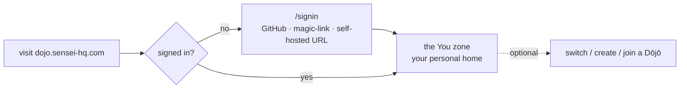
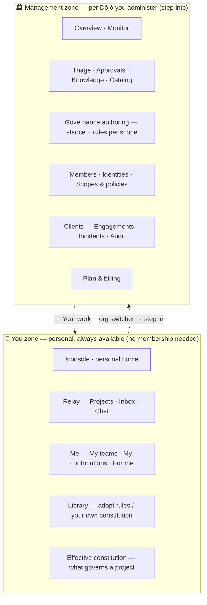
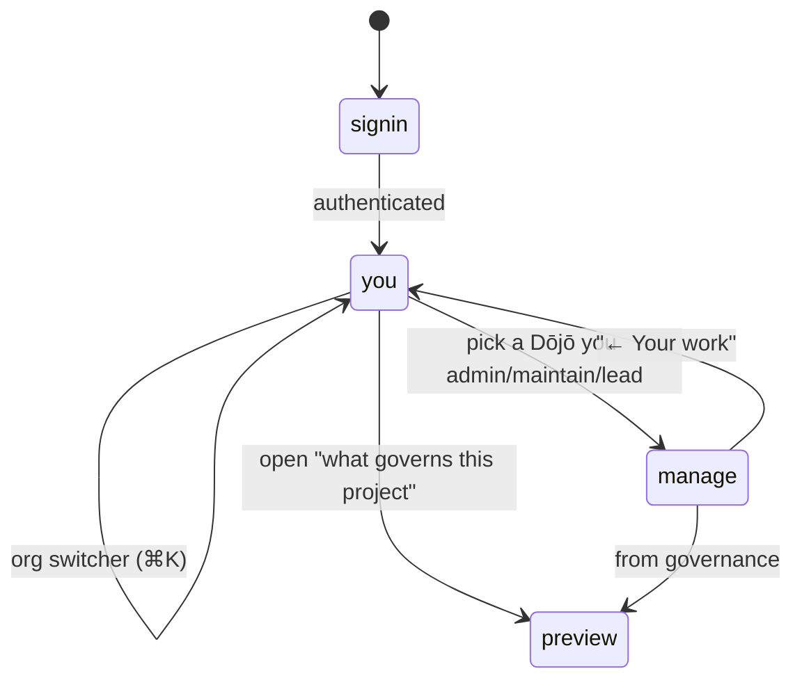
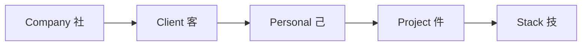
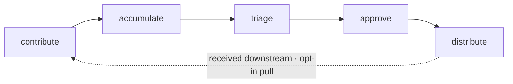

# Dōjō web app — sitemap & user flow

> The user-first structure of the Dōjō web app (`dojo/`, `dojo.sensei-hq.com`).
> Captured from the [Dōjō journey map](../../mockups/Sensei/Sensei%20D%C5%8Dj%C5%8D%20Journey%20Map.html)
> + [`journeys/dojo.md`](../../journeys/dojo.md) + `mockups/Sensei/lib/dojo/*.jsx`.
> **This is a discussion draft** — it documents the journey-map *intent* and marks what's
> shipped vs. the gap, so we can tweak the flow before building the rest.
>
> Status legend: **✅ built** (on `develop`/`main`) · **◐ partial** · **○ target** (not built).

## 0. The model in one line

**One wired app, every role.** You sign in and land in your **personal "You" zone**
(works fully solo — a Dōjō is optional, never a gate). When you belong to a Dōjō you
administer, you **step into** its management context. Governance resolves **down a
ladder**; before the first commit you can **preview exactly what governs a project**.

## 1. Entry point & landing — what the user sees first

- **Public**: `/` → `/signin`. GitHub is primary (derives orgs + roles); magic-link for
  non-GitHub orgs; a self-hosted-URL entry for in-house Dōjōs. **✅**
- **After sign-in → the You zone** (personal home). A Dōjō membership is **optional, never
  a gate** (objective DJ1). The landing shows: **needs-you** (gates/decisions from your
  running work), **your projects** (local — watched by the desktop app, surfaced via Relay),
  **your own rules · optional** (seed a personal constitution from the library), and a
  clearly-secondary **create or join a Dōjō · optional**.
- **Status:** ✅ this personal home renders for **membership-less** users today. ◐ **Gap:**
  a *member* still lands on the old management Overview — the journey-map intent is that
  **everyone lands in the You zone first**, then steps into a Dōjō.

## 2. Sitemap — two zones, one shell

Route map (current implementation is a single `(console)` shell; zones are conceptual):

| Zone | Screen | Route (today) | Status |
|---|---|---|---|
| You | Personal home | `/console` (when membership-less) | ✅ |
| You | Relay (runs/gates) | `/console/relay` `/console/relay/[run]` | ✅ (tenant-scoped) |
| You | My teams / contributions / for me | `/console/{teams,contributions,downstream}` | ✅ presentational |
| You | Constitution library | `/console/library` | ✅ presentational |
| You | Effective constitution (preview) | `/console/preview` | ✅ presentational |
| Manage | Overview / Monitor | `/console` (member) / — | ◐ Overview built; Monitor ○ |
| Manage | Triage (+ candidate) | `/console/triage` `/…/[signature]` | ✅ |
| Manage | Governance authoring | — | ○ target |
| Manage | Members / Identities / Policies | `/console/{members,identities,policies}` | ✅ |
| Manage | Scopes & policies (precedence sim) | — (policies grid only) | ◐ |
| Manage | Engagements / Incidents / Audit | `/console/{engagements,incidents,audit}` | ✅ |
| Manage | Plan & billing | — | ○ target |
| — | Org picker | `/orgs` | ✅ |
| — | Create a Dōjō (+ starter constitution) | — | ○ target |

## 3. Switching context — You ⇄ org

- **Org-switcher popover** (top bar): pinned **"Relay · you — all Dōjōs"** + one row per
  membership + **Your Dōjōs** + **＋ Create or join**. **✅ built.**
- **Stepping into a Dōjō** you administer opens a **management context** with distinct
  chrome and a **"← Your work"** exit. Read-only / owner memberships have **no** management
  console (they stay in the You zone). **○ Gap:** today it's one shared console for members;
  the distinct step-in shell (`DojoManageBar`) is not built.
- **Membership contexts** — one person, many orgs: *Employer 社 · Client 客 · Community 群 ·
  Personal 己*. Memberships aggregate across linked emails but **never cross** orgs.

## 4. Governance — recommended rules, guides & the ladder

Two independent axes: **scope** (how specific — *where it applies*) and **enforcement**
(how much authority — `advisory < recommended < required < mandatory`). Enforcement is the
override brake: a `mandatory` rule can't be relaxed by a narrower scope.

**The ladder resolves broad → specific:**

- **Employer's own product** → `Company · Personal · Project · Stack` (Client rung **off**).
- **Another org's repo (client engagement)** → **Client rung switches on**, anonymization
  pinned as a pre-step, **Client + Company both apply**.
- **No Dōjō (solo)** → the **free personal ladder alone**: `Personal · Project · Stack`.

**Conflicts settle in order:** ① confidentiality first → ② a **non-negotiable (★ / mandatory)
locks** so no narrower scope can relax it → ③ otherwise the **more specific scope refines**
the broader.

Three surfaces make the system usable:

| Surface | Verb | What it does | Status |
|---|---|---|---|
| **Library** (`dojo-library.jsx`) | *adopt* | pull proven rule **packs** by area (core principles · architecture · security · compliance · language/stack · design); each rule set to a **level** (Org/Team/Project/Stack) and markable **★ non-negotiable**; compliance families (HIPAA·PCI·SOC2·GDPR) pinned; stack packs wire **free OSS checkers** (qlty/eslint/prettier/ruff/clippy) so smells are caught mechanically. *Prevention over cure.* | ✅ presentational |
| **Authoring** (`dojo-governance.jsx`) | *define* | per-scope **stance** (autonomy · sharing · review · anonymization) + rules/skills/agents/commands + a project's memory; everything **cascades down** the ladder; a *"what a new developer inherits"* preview. | ○ target |
| **Preview** (`dojo-preview.jsx`) | *see* | the **resolved ladder for one project** with conflicts already settled and locks shown — **before the first commit**, including *why* the project is classified company vs client vs personal. | ✅ presentational |

**Distribution / delivery:** the constitution is DB-owned data (`dojo.shared_rules`,
enforcement enum), federated **down** (pull, never push) into `sensei.memories`, resolved by
`resolve_global_rules` and served to the assistant via the **`get_rules`** MCP tool every
session. `~/.sensei/rules.md` is a generated read-only view, never hand-edited. **◐ Gap:**
Library/Preview are presentational off local `-data.ts`; live wiring to `dojo.shared_rules`
+ authoring + the personal-constitution seed is not built.

## 5. The lifecycle — what flows through the Dōjō

## 6. Shipped vs. target — the gap to close

| Area | Shipped ✅ | Target ○ / gap ◐ |
|---|---|---|
| Personal landing (DJ1) | solo home for membership-less users | ◐ *members* also land here first (You-zone-first) |
| You-zone screens | Relay, Me, Library, Preview (presentational) | ○ live data wiring |
| Org switch | switcher popover | ◐ step-into **management shell** (distinct chrome, exit) |
| Governance | Library + Preview (presentational) | ○ Authoring; ○ live `dojo.shared_rules` + `get_rules` |
| Nav | personal-first groups + version stamp | ○ true **role-aware** filtering |
| Onboarding | `/orgs` picker | ○ create-a-Dōjō + starter constitution |

## 7. Open questions — to discuss & tweak

1. **Member entry** — should a *member* land in the You zone first (journey-map intent) and
   step into a Dōjō, or go straight to their primary Dōjō? (affects routing + the switcher.)
2. **Zone metaphor** — is "**step into** a management shell" (distinct chrome) the right model,
   or one **adaptive console** that reveals management sections when a Dōjō is selected?
3. **Routes** — keep everything under `/console/*`, or reframe to reflect the zones
   (`/you/*` personal + `/dojo/<org>/*` management)? Impacts links, deep-linking, and the guard.
4. **Personal governance placement** — for a solo user, where do "your own rules" live vs. an
   org's authored governance? (today: Library seeds a personal constitution; no org needed.)
5. **Mobile IA** — the journey map's mobile shell is a bottom tab bar (Projects · Inbox · Chat ·
   More); the desktop is the left nav. Confirm the mobile model and where "step into a Dōjō" goes.
6. **Read-only/owner memberships** — confirm they have **no** management console (stay in You zone).
