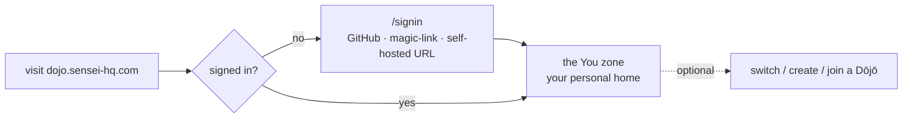
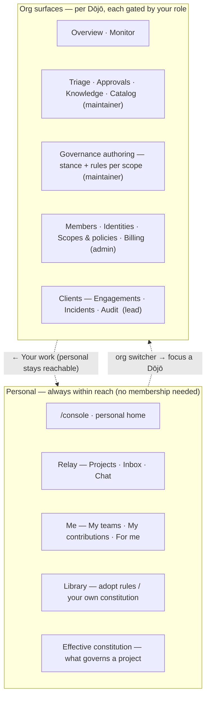
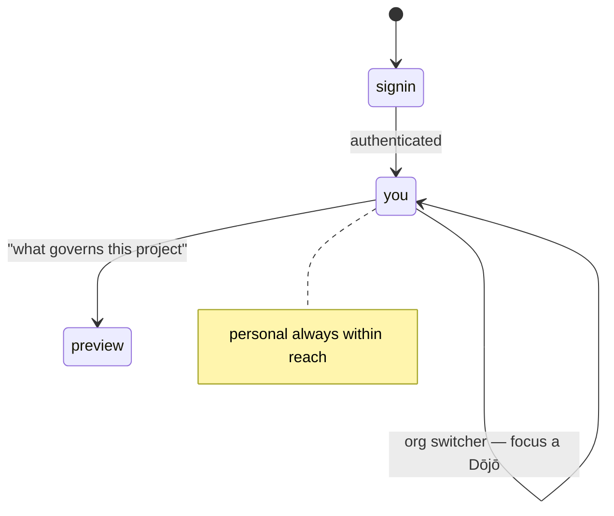
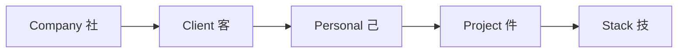
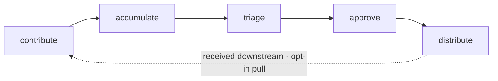

# Dōjō web app — sitemap & user flow

> The user-first structure of the Dōjō web app (`dojo/`, `dojo.sensei-hq.com`).
> Captured from the [Dōjō journey map](../../mockups/Sensei/Sensei%20D%C5%8Dj%C5%8D%20Journey%20Map.html)
> + [`journeys/dojo.md`](../../journeys/dojo.md) + `mockups/Sensei/lib/dojo/*.jsx`.
> **This is a discussion draft** — it documents the journey-map *intent* and marks what's
> shipped vs. the gap, so we can tweak the flow before building the rest.
>
> Status legend: **✅ built** (on `develop`/`main`) · **◐ partial** · **○ target** (not built).

## 0. The model in one line

**One wired app, every role.** You sign in and land in your **personal "You" zone** (works
fully solo — a Dōjō is optional, never a gate). Your **personal scope stays within reach at
all times** — it is not a mode you leave. You also belong to Dōjōs; selecting one focuses that
org's surfaces, and **what you can do there is scoped to your role** (a developer's read-mostly
view, a maintainer's governance tools, an admin's roles & policies — see §3). Governance
resolves **down a ladder**; before the first commit you can **preview exactly what governs a
project**.

## 1. Entry point & landing — what the user sees first

- **Public**: `/` → `/signin`. GitHub is primary (derives orgs + roles); magic-link for
  non-GitHub orgs; a self-hosted-URL entry for in-house Dōjōs. **✅**
- **After sign-in → the You zone** (personal home). A Dōjō membership is **optional, never a
  gate** (objective DJ1). The landing shows: **needs-you** (gates/decisions from your running
  work), **your projects** (local — watched by the desktop app, surfaced via Relay), **your own
  rules · optional** (seed a personal constitution from the library), and a clearly-secondary
  **create or join a Dōjō · optional**.
- **Status:** ✅ this personal home renders for **membership-less** users today. ◐ **Gap:** a
  *member* still lands on the old management Overview — the journey-map intent is that
  **everyone lands in the You zone first**, with personal always reachable thereafter.

## 2. Sitemap — personal + org surfaces in one shell

Route map (current implementation is a single `(console)` shell; the grouping is conceptual):

| Surface | Screen | Route (today) | Status |
|---|---|---|---|
| Personal | Personal home | `/console` (when membership-less) | ✅ |
| Personal | Relay (runs/gates) | `/console/relay` `/console/relay/[run]` | ✅ (tenant-scoped) |
| Personal | My teams / contributions / for me | `/console/{teams,contributions,downstream}` | ✅ presentational |
| Personal | Constitution library | `/console/library` | ✅ presentational |
| Personal | Effective constitution (preview) | `/console/preview` | ✅ presentational |
| Org | Overview / Monitor | `/console` (member) / — | ◐ Overview built; Monitor ○ |
| Org (maintainer) | Triage (+ candidate) | `/console/triage` `/…/[signature]` | ✅ |
| Org (maintainer) | Governance authoring | — | ○ target |
| Org (admin) | Members / Identities / Policies | `/console/{members,identities,policies}` | ✅ (not role-gated yet) |
| Org (admin) | Scopes & policies (precedence sim) | — (policies grid only) | ◐ |
| Org (admin) | Plan & billing | — | ○ target |
| Org (lead) | Engagements / Incidents / Audit | `/console/{engagements,incidents,audit}` | ✅ |
| — | Org picker | `/orgs` | ✅ |
| — | Create a Dōjō (+ starter constitution) | — | ○ target |

## 3. Personal is always within reach; org surfaces are role-scoped

Personal is **not** a mode you leave. Your personal scope — your own rules, your own projects,
your cross-Dōjō Relay/Me — is **always reachable**, whatever org you're looking at. Selecting a
Dōjō focuses its org-specific surfaces, and **what you can do there depends on your role**.
There is no single "management" gate.

**Role → what the org surfaces expose** (personal is available to everyone, always):

| Role | In the org context they can… |
|---|---|
| **Developer** (default) | read-mostly: my teams · my contributions · for-me · preview a project's constitution |
| **Maintainer** | **manage governance policies at org level** — author rules/stance, triage, approve, knowledge |
| **Lead** | client engagements · confidentiality · audit trail |
| **Admin** | **change member roles + access policies** — members, identities/SSO, scopes & precedence, billing |

- Grants are **additive, not a single admin/not switch**: a person can be a maintainer
  (governance) without being an admin (roles/policies), and vice-versa. A role reveals *its*
  surfaces; the union is what that person sees for that Dōjō.
- Every member — including a plain developer — always has the **personal** surfaces + a
  read-mostly view of the Dōjōs they belong to. No one is locked out to "no console."
- **Org-switcher popover** (top bar): pinned **"Relay · you — all Dōjōs"** + one row per
  membership + **Your Dōjōs** + **＋ Create or join**. **✅ built.**
- **Membership contexts** — one person, many orgs: *Employer 社 · Client 客 · Community 群 ·
  Personal 己*. Memberships aggregate across your linked emails. Two different senses of "cross":
  **visibility never crosses** (an org can't see that you belong to another) — but **governance
  *does* compose across orgs**. A developer employed by a services company (Company Dōjō) working
  on a client's project (Client Dōjō) is governed by **both** at once — that's the client-engagement
  case in §4, not a visibility leak.
- **○ Gap:** org surfaces are **not role-gated yet** (every member sees one console). Role-scoping
  the visible capabilities is core to this restructure.
- ⚠️ **To reconcile:** the current mockup files *governance authoring* under the **admin** nav,
  but the intended split is **maintainers own governance policies** and **admins own member
  roles + access policies**. The table above is the target; the mockup nav grouping needs a
  matching update.

## 4. Governance — recommended rules, guides & the ladder

Two independent axes: **scope** (how specific — *where it applies*) and **enforcement** (how
much authority — `advisory < recommended < required < mandatory`). Enforcement is the override
brake: a `mandatory` rule can't be relaxed by a narrower scope.

**The ladder resolves broad → specific:**

- **Employer's own product** → `Company · Personal · Project · Stack` (Client rung **off**).
- **Another org's repo (client engagement)** → **Client rung switches on**, anonymization pinned
  as a pre-step, **Client + Company both apply** (governance composes across orgs). The **owning
  org (here Client) is the more-specific org scope**, so it **wins ordinary conflicts** — the
  project's own org governs its code.
- **No Dōjō (solo)** → the **free personal ladder alone**: `Personal · Project · Stack`.

**Conflicts settle in order:** ① confidentiality first → ② a **non-negotiable (★ / mandatory)
locks** so no narrower scope can relax it → ③ otherwise the **more specific scope refines** the
broader.

Three surfaces make the system usable:

| Surface | Verb | Who | What it does | Status |
|---|---|---|---|---|
| **Library** (`dojo-library.jsx`) | *adopt* | maintainer (org) / anyone (personal) | pull proven rule **packs** by area (core principles · architecture · security · compliance · language/stack · design); each rule set to a **level** and markable **★ non-negotiable**; compliance families (HIPAA·PCI·SOC2·GDPR) pinned; stack packs wire **free OSS checkers** (qlty/eslint/prettier/ruff/clippy). *Prevention over cure.* | ✅ presentational |
| **Authoring** (`dojo-governance.jsx`) | *define* | **maintainer** | per-scope **stance** (autonomy · sharing · review · anonymization) + rules/skills/agents/commands + a project's memory; everything **cascades down** the ladder; a *"what a new developer inherits"* preview. | ○ target |
| **Preview** (`dojo-preview.jsx`) | *see* | anyone | the **resolved ladder for one project** with conflicts already settled and locks shown — **before the first commit**, including *why* it's classified company vs client vs personal. | ✅ presentational |

**Distribution / delivery:** the constitution is DB-owned data (`dojo.shared_rules`, enforcement
enum), federated **down** (pull, never push) into `sensei.memories`, resolved by
`resolve_global_rules` and served to the assistant via the **`get_rules`** MCP tool every
session. `~/.sensei/rules.md` is a generated read-only view, never hand-edited. **◐ Gap:**
Library/Preview are presentational off local `-data.ts`; live wiring to `dojo.shared_rules` +
authoring + the personal-constitution seed is not built.

## 5. The lifecycle — what flows through the Dōjō

## 6. Shipped vs. target — the gap to close

| Area | Shipped ✅ | Target ○ / gap ◐ |
|---|---|---|
| Personal landing (DJ1) | solo home for membership-less users | ◐ *members* also land here first (personal-first) |
| Personal screens | Relay, Me, Library, Preview (presentational) | ○ live data wiring |
| Org focus | switcher popover | ◐ **role-scoped** org surfaces (developer/maintainer/lead/admin) |
| Governance | Library + Preview (presentational) | ○ Authoring (maintainer); ○ live `dojo.shared_rules` + `get_rules` |
| Nav | personal-first groups + version stamp | ○ true **role-aware** filtering |
| Onboarding | `/orgs` picker | ○ create-a-Dōjō + starter constitution |

## 7. Open questions — to discuss & tweak

1. **Member entry** — should a *member* land in the personal zone first (journey-map intent),
   then focus a Dōjō, or go straight to their primary Dōjō?
2. **Org-context presentation** — when a Dōjō is focused, show a distinct focused context (its own
   chrome) or reveal the role-scoped sections inline in the same shell? (Not "management vs not" —
   capabilities are role-scoped, and personal stays reachable throughout.)
3. **Routes** — keep everything under `/console/*`, or reframe to reflect the split
   (`/you/*` personal + `/dojo/<org>/*` org)? Impacts links, deep-linking, and the guard.
4. **Role → capability mapping** — confirm the target (developer = read-mostly · maintainer =
   governance · lead = clients · admin = roles/access policies) and that grants are **additive**;
   then re-group the mockup nav to match (it currently files governance under admin).
5. **Personal governance placement** — for a solo user, where do "your own rules" live vs. an org's
   authored governance? (today: Library seeds a personal constitution; no org needed.)
6. **Mobile IA** — the journey map's mobile shell is a bottom tab bar (Projects · Inbox · Chat ·
   More); the desktop is the left nav. Confirm the mobile model and where the org switch lives.
7. **Cross-org ownership resolution** — on a project owned by one org while you're employed by
   another (services company on a client engagement): confidentiality resolves first, then the
   **owning org wins** ordinary conflicts (more-specific org scope). *Open:* does the **employer's
   `mandatory`** rule still impose a floor the owner can *tighten but not relax*, or does the
   owning org fully win — with the employer's non-negotiables travelling only as **personal/conduct
   guards** (not code-governance overrides)?
