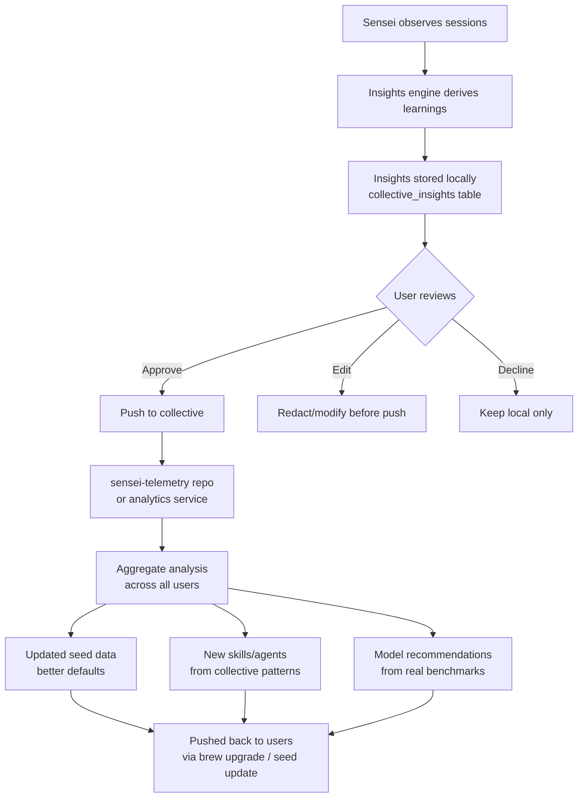

# Collective Intelligence Network

## Problem

Each sensei user learns independently: "adapter pattern improves FTR by 18% in Rust/axum projects", "gemma3:27b outperforms qwen3:14b for classification tasks", "auth modules need dedicated personas". These insights are valuable to every sensei user, but today they stay locked in individual machines.

If we collate insights across all users, we can:
- Discover which patterns work best for which stacks
- Know which models perform best for which tasks
- Surface anti-patterns that cause rework across many projects
- Generate better default skills, agents, and tools based on real evidence
- Share back as updated seed data, recommended rules, or new skill content

## What gets shared (insights, not code)

The key distinction: **we share the derived insight, never the source material.**

| Shared (insight) | NOT shared (source) |
|-------------------|---------------------|
| "Adapter pattern detected, confidence 0.92, FTR correlation +18%" | The actual code that uses the adapter pattern |
| "gemma3:27b: classify avg 1.2s, accuracy 94%" | What was classified, the prompt, the response |
| "Auth modules have 42% lower FTR than average" | File paths, function names, repo names |
| "Cache invalidation is the #1 correction topic" | The actual corrections or prompts |
| "This anti-pattern occurs in 34% of Rust/axum projects" | Which projects, which files |
| "Persona for auth modules improves FTR by 14%" | The persona content (unless user opts to share) |

### Insight categories

| Category | Examples | Value to network |
|----------|---------|-----------------|
| **Pattern effectiveness** | Which patterns correlate with high FTR, by stack | Better default pattern recommendations |
| **Anti-pattern prevalence** | Which anti-patterns are most common, by stack | Prioritize anti-pattern detection |
| **Model performance** | Inference speed, quality, memory usage by task type | Better default fallback chains |
| **Skill effectiveness** | Which skills improve FTR, which don't | Better default skill set |
| **Stack insights** | Common library combinations, framework patterns | Better setup recommendations |
| **Correction topics** | What categories of corrections repeat most | Better persona suggestions |
| **Tool usage** | Which MCP tools are most/least useful | Better tool design, skill instructions |
| **FTR benchmarks** | Anonymous FTR distribution by stack, project size | Community benchmarks |

## How it works



### The feedback loop

1. **Observe** — sensei watches sessions, detects patterns, measures FTR
2. **Derive** — insights engine + MOE panel produce structured insights
3. **Share** — user reviews and pushes derived insights (never code)
4. **Aggregate** — all users' insights combined reveal collective patterns
5. **Improve** — better defaults, skills, agents, fallback chains pushed back
6. **Benefit** — next user gets better recommendations from day one

## Data model

### `collective_insights` table

```
collective_insights
├── id                     uuid PK
├── category               text           -- pattern, model, skill, tool, correction, stack, ftr, anti_pattern
├── event                  text           -- e.g. "pattern_detected", "model_benchmark", "skill_effectiveness"
├── payload                jsonb          -- structured insight data (always visible to user)
├── batch_id               uuid           -- null until sent; groups events sent together
├── sent_at                timestamptz    -- null until sent; timestamp when shared
├── target                 text           -- where it was sent: "git", "posthog", null
├── created_at             timestamptz
```

### `collective_insight_batches` table

```
collective_insight_batches
├── id                     uuid PK
├── event_count            integer        -- how many events in this batch
├── target                 text           -- "git", "posthog"
├── reference              text           -- git commit SHA, PostHog batch ID, etc.
├── sent_at                timestamptz
```

Every sent event links to its batch via `batch_id`. The batch carries the external reference (git commit SHA or analytics batch ID) so the user can trace exactly what went where.

User can browse: Settings → Shared history → click batch → see all events in that batch with full payloads.

### Example payloads

**Pattern effectiveness:**
```json
{
  "pattern": "adapter",
  "family": "GoF · structural",
  "stack": ["rust", "axum"],
  "ftr_with": 0.92,
  "ftr_without": 0.74,
  "delta": 0.18,
  "sessions_observed": 41,
  "confidence": 0.86
}
```

**Model performance:**
```json
{
  "model": "gemma3:27b",
  "task": "classify",
  "avg_duration_ms": 1200,
  "avg_tokens_in": 450,
  "accuracy_estimate": 0.94,
  "hardware": {"ram_gb": 32, "gpu": "apple_metal"},
  "samples": 150
}
```

**Anti-pattern prevalence:**
```json
{
  "anti_pattern": "duplicated_auth_guard",
  "stack": ["typescript", "express"],
  "occurrences": 4,
  "severity": "high",
  "fix_pattern": "middleware_adapter",
  "fix_ftr_improvement": 0.12
}
```

**Correction topic:**
```json
{
  "topic": "cache_invalidation",
  "stack": ["rust", "redis"],
  "frequency_rank": 1,
  "sessions_with_correction": 12,
  "sessions_total": 28,
  "recommended_action": "create_persona"
}
```

**Skill effectiveness:**
```json
{
  "skill": "zero-errors-policy",
  "ftr_before": 0.71,
  "ftr_after": 0.89,
  "delta": 0.18,
  "sessions_before": 20,
  "sessions_after": 35
}
```

## User experience

### Settings → Insights sharing

```
┌──────────────────────────────────────────────────────┐
│  Collective Insights                                  │
│                                                       │
│  Share anonymous insights to help improve sensei      │
│  for everyone. Only derived learnings are shared —    │
│  never code, prompts, or personal data.               │
│                                                       │
│  Sharing: [Auto ▾]  Auto · Review first · Off         │
│                                                       │
│  ─────────────────────────────────────────────────    │
│                                                       │
│  Last shared: 2026-04-16 · 42 insights                │
│  Next share: 2026-04-23 (weekly)                      │
│                                                       │
│  [View shared history]                                │
│                                                       │
│  What you've contributed                              │
│  147 insights shared · helping 2,340 sensei users     │
│                                                       │
│  Your top contributions:                              │
│  • Adapter pattern + Rust/axum FTR data (used by 89   │
│    projects to improve recommendations)               │
│  • gemma3:27b classify benchmarks (updated default    │
│    fallback chain for 1,200 users)                    │
│                                                       │
└──────────────────────────────────────────────────────┘
```

### View what was shared (drill-in)

```
┌──────────────────────────────────────────────────────┐
│  Shared insights · 2026-04-16                         │
│                                                       │
│  pattern    adapter effectiveness                     │
│    FTR +18% in rust/axum with adapter pattern         │
│    41 sessions observed · confidence 0.86             │
│                                                       │
│  model     gemma3:27b classify benchmark              │
│    avg 1.2s · 94% accuracy · 150 samples              │
│                                                       │
│  correction cache_invalidation frequency              │
│    #1 correction topic in rust/redis projects         │
│    12/28 sessions · recommended: create persona       │
│                                                       │
│  ... 39 more                                          │
│                                                       │
│  All insights are anonymous. No code, prompts, or     │
│  project names are included.                          │
└──────────────────────────────────────────────────────┘
```

## Sending targets

### Option A: Git repo (recommended for phase 1)

Push JSONL files to `sensei-telemetry` repo. Analysis via DuckDB.

```
sensei-telemetry/
├── insights/
│   ├── 2026-04/
│   │   ├── 23-a1b2c3.jsonl
│   │   └── 23-d4e5f6.jsonl
│   └── ...
└── analysis/                  ← aggregate analysis scripts
    ├── pattern-effectiveness.sql
    ├── model-benchmarks.sql
    └── generate-seed-updates.sql
```

### Option B: PostHog (free analytics dashboard)

PostHog free tier: 1M events/month. Gives dashboards, funnels, trends out of the box. Good for quick visualization but less flexible than raw JSONL + DuckDB.

### Option C: Both

Git as source of truth + PostHog for dashboards.

## What comes back to users

The aggregate insights feed back into sensei as updated defaults:

| Insight type | Feeds back as |
|-------------|--------------|
| Pattern effectiveness by stack | Updated `detected_patterns` seed data with confidence scores |
| Model performance benchmarks | Updated `fallback_chains` seed data (better default ordering) |
| Common anti-patterns | New detection rules in workspace intelligence pipeline |
| Correction topic frequency | Recommended personas in setup wizard |
| Skill effectiveness | Updated skill content, priority, or deprecation |
| Tool usage patterns | Updated skill instructions (mention underused tools) |

Delivered via `brew upgrade sensei` → new seed data → `import_*` procedures upsert.

## Privacy guarantees

1. **No code content** — ever. Not file contents, not function bodies, not prompts.
2. **No identifiable project info** — no repo names, file paths, URLs, hostnames.
3. **Anonymous device hash** — SHA-256 of random install ID. Not MAC, not hostname, not username.
4. **Always visible** — every shared insight stays in the local database with its batch reference. User can browse shared history anytime, see exact payloads, and trace to the external target (git commit SHA, etc.).
5. **Three modes** — auto (default, weekly), review first (user approves each batch before send), off (opt-out).
6. **Rotatable identity** — user can regenerate install ID to break linkability.

## Open questions

| # | Question |
|---|----------|
| 1 | Should users be able to opt-in to sharing skill/persona content (not just metadata)? Some may want to contribute their auth persona to help others. |
| 2 | How do we prevent gaming? If insights are used to update defaults, could bad data poison the well? |
| 3 | Should there be a "community insights" view in the observatory showing aggregate trends? |
| 4 | How do we attribute back? "Your adapter pattern data helped 89 projects" — is this motivating or creepy? |
| 5 | Git repo size: at 1000 users × 50 insights/week = 50K events/week. JSONL is compact but grows. Rotate annually? |
