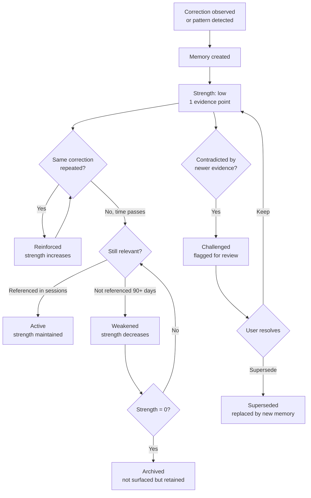
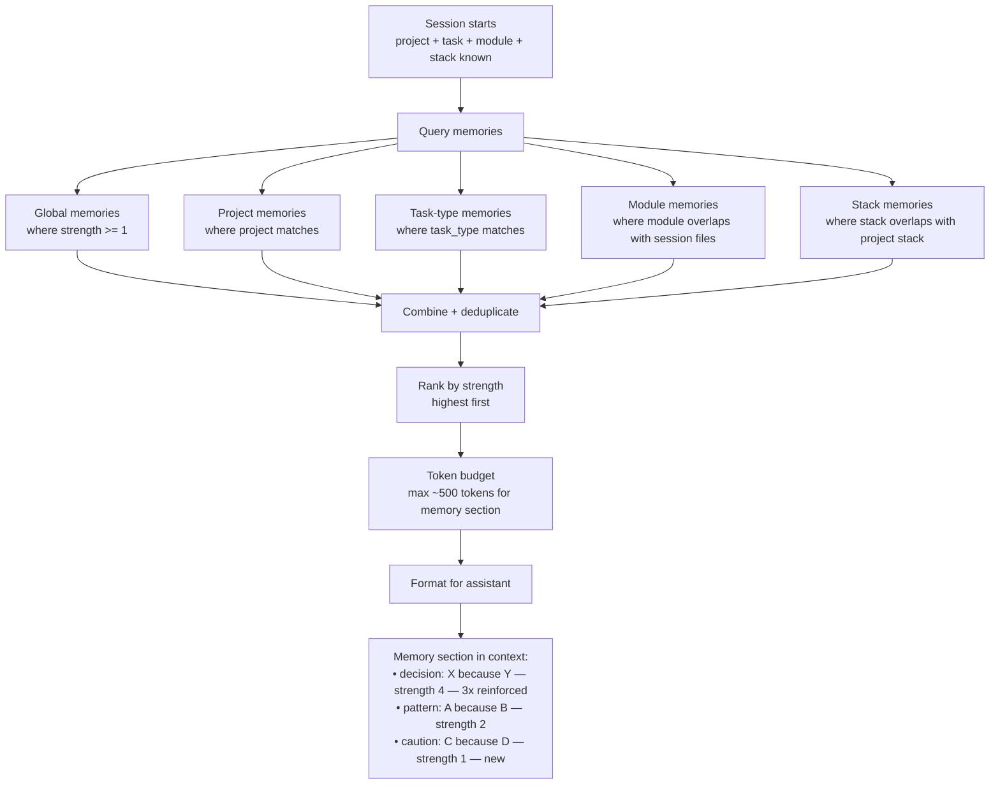

# Contextual Memory

## Problem

AI assistants have no memory between sessions. Every new session starts from zero. The user corrects the same mistake in session 5 that they corrected in session 1. Sensei captures these corrections (via FTR tracking), but the knowledge dies when the session ends.

Current `memory_items` is a flat list of text notes (decisions, patterns, questions) per project. It has no reasoning ("don't do X" without "because Y"), no strength signal (is this a one-time note or a battle-tested rule?), no scope awareness (does this apply to all tasks or only auth-related work?), and no evolution (can't strengthen, weaken, or be superseded).

What we need is a knowledge system where:
- Every memory explains **why** — the consequence of ignoring it
- Memories have **scope** — global, project, task-type, module, stack
- Memories have **strength** — reinforced by repeated evidence, weakened by time
- Memories **surface contextually** — only relevant ones appear per session
- Memories **evolve** — learned, reinforced, challenged, superseded, archived
- Memories support **session restart** — "what were we doing, where did we stop, what's next"

## What memory is (and isn't)

**Memory IS:**
- Knowledge about consequences: "Don't do X because Y happens"
- Learned from experience: corrections, outcomes, patterns observed
- Scoped: relevant to specific contexts (project, task type, module, stack)
- Evolving: strengthens with evidence, weakens without reinforcement
- Composable: multiple memories combine into session context

**Memory is NOT:**
- A rule engine (rules are in extensions/skills — memory is the reasoning behind rules)
- A to-do list (tasks are in workflow_state)
- A changelog (that's history.past_extensions)
- Session state (that's activity.snapshots)
- Preferences (that's inference.preferences — though preferences are a type of memory)

## Memory anatomy

Every memory has:

```
What:     "Don't mock the database in integration tests"
Because:  "Q1 2026: mocked tests passed but prod migration failed.
           Three days of debugging. The mock diverged from actual
           PostgreSQL behavior on nullable foreign keys."
Scope:    project: lumen-cloud
          task_types: [test, fix]
          modules: [database, migration]
Strength: high
          learned: session s-2891 (2026-04-15)
          reinforced: [s-2895, s-2901] (2x since learning)
          violated: 0 times since learning
          last_relevant: 2026-04-22
Source:   correction (user said "no, don't mock the database")
```

The "because" is what makes memory useful. "Don't do X" can be rationalized away by an AI. "Don't do X because last time it caused Y, here's the evidence" is much harder to ignore.

## Memory references (grounding in code)

Abstract memories are weak. Grounded memories are strong. Every memory can reference concrete nodes in the codebase — implementations to follow, violations to avoid, patterns to match.

```
Memory: "Use adapter pattern for auth integrations"
Because: "3 sessions corrected inline auth in handlers. Duplication
          diverges — sync.ts forgot audit logging."

References:
  ✓ good_example:  nodes/auth_adapter.rs:14
    "Canonical adapter implementation — all new integrations follow this"

  ✗ bad_example:   nodes/handlers/auth.ts:42
    "Inline auth without adapter — diverged from sync.ts, missing audit log"

  📐 pattern:       detected_patterns/adapter (confidence 0.92)
    "Adapter pattern detected in 7 places, FTR +18%"

  📝 evidence:      sessions/s-2891, sessions/s-2895
    "Corrections that triggered this memory"
```

### Reference types

| Type | Points to | Purpose |
|------|----------|---------|
| `good_example` | node (function, class, file) | "Follow this implementation" |
| `bad_example` | node (function, class, file) | "Don't do it like this — here's what breaks" |
| `pattern` | detected_pattern | "This is the formal pattern definition" |
| `evidence` | session or event | "These sessions/corrections prove why this matters" |
| `related` | another memory | "This memory is connected to that one" |
| `doc` | node (section, file) | "Documentation that explains this further" |

### Why references matter

When the assistant encounters `handlers/billing.ts` and is about to write inline auth:

```
get_session_context() →

  ⚠ Memory (strength 4): Use adapter pattern for auth integrations
     Because: inline auth diverges — sync.ts forgot audit logging
     → See: src/middleware/auth_adapter.rs:14 (canonical implementation)
     → Avoid: src/handlers/auth.ts:42 (inline, missing audit log)
     → Pattern: adapter (7 places, FTR +18%)
```

The assistant can **read the referenced node** to understand exactly what "adapter pattern" means in this codebase — not the abstract GoF definition, but the concrete implementation with this project's conventions.

### References are edges

In the data model, memory references are edges in the graph:

```
memory node ──good_example──→ code node (auth_adapter.rs)
memory node ──bad_example───→ code node (handlers/auth.ts)
memory node ──pattern──────→ detected_pattern (adapter)
memory node ──evidence─────→ session (s-2891)
```

This means memories are **part of the graph**, not a separate silo. The same edge/relationship system that connects code nodes connects memories to code, patterns, and sessions.

This has powerful implications:
- "Show me all memories that reference this file" → one edge query
- "Which code is most referenced by high-strength memories?" → the critical paths
- "What memories apply to this pattern?" → pattern → memory edges
- "Why does TDD matter for this project?" → memory with good/bad examples of test-first vs test-after outcomes

## The questions memory must answer

Memory isn't a table — it's the system that answers the questions a developer would ask before starting work. The questions change depending on context:

### First session ever (new user)

```
┌─────────────────────────────────────────────────────┐
│ Who am I working with?                               │
│ → Global preferences: style, communication, workflow │
│                                                       │
│ What do I know about this tech stack?                │
│ → Stack-level knowledge: Rust conventions, SQL        │
│   formatting, framework patterns                     │
│                                                       │
│ What has the community learned?                      │
│ → Collective insights for this stack combination      │
└─────────────────────────────────────────────────────┘
```

### First session for this project

```
┌─────────────────────────────────────────────────────┐
│ Everything above, plus:                              │
│                                                       │
│ What is this project?                                │
│ → Project goal, stack, repos, key architecture       │
│                                                       │
│ Are there existing rules or conventions?             │
│ → Guidelines, patterns, architectural decisions      │
│                                                       │
│ What do similar projects do?                         │
│ → Imported knowledge from related projects/stack     │
└─────────────────────────────────────────────────────┘
```

### Continuing session in a known project

```
┌─────────────────────────────────────────────────────┐
│ Everything above, plus:                              │
│                                                       │
│ What did we learn in previous sessions?              │
│ → Corrections that became memories                   │
│ → Patterns that work here, anti-patterns to avoid    │
│                                                       │
│ What keeps going wrong?                              │
│ → Recurring corrections, low-FTR modules             │
│ → "Auth module: 3 corrections this week"             │
│                                                       │
│ What improved recently?                              │
│ → Adopted teachings, positive recommendation outcomes│
└─────────────────────────────────────────────────────┘
```

### Resuming interrupted work

```
┌─────────────────────────────────────────────────────┐
│ Everything above, plus:                              │
│                                                       │
│ What was I doing?                                    │
│ → Last session task, phase, progress                 │
│                                                       │
│ Where did I stop?                                    │
│ → Last checkpoint, completed steps                   │
│                                                       │
│ What's pending?                                      │
│ → Remaining steps, in-flight files, uncommitted work │
│                                                       │
│ What should be the focus?                            │
│ → Next step hint, open blockers, test results        │
└─────────────────────────────────────────────────────┘
```

The memory system assembles answers to these questions from different sources depending on the situation. This is a **decision tree for context assembly**, not a single table query.

### Data sources per question

| Question | Source | Table/Location |
|----------|--------|---------------|
| Who am I? (preferences) | Learned memories, scope=global | memory system |
| Stack knowledge | Learned memories, scope=stack | memory system |
| Community knowledge | Collective insights | inference.insights |
| Project info | Project metadata | sensei.projects |
| Rules/conventions | Project guidelines + learned memories | projects.guidelines + memory |
| Previous learnings | Correction-derived memories | memory system |
| Recurring problems | Session analytics + memories | activity.sessions + memory |
| Recent improvements | Recommendation outcomes | inference.recommendations |
| What was I doing? | Session continuity | activity.snapshots + continuity memories |
| What's pending? | Workflow state + snapshots | sensei.workflow_state + activity.snapshots |

Memory is the **glue** that makes all these sources coherent for a single `get_session_context()` call.

## Memory levels

```
┌─────────────────────────────────────────────────────┐
│ Global                                               │
│ Applies to all projects, all sessions                │
│ "Always verify rendered content, not just API"       │
│ "Don't add docstrings to code you didn't change"     │
│ "Test before claiming it works"                      │
├─────────────────────────────────────────────────────┤
│ Project                                              │
│ Applies to all sessions in this project              │
│ "Use adapter pattern for auth integrations"          │
│ "API handlers return Result<Json<T>, ApiError>"      │
│ "Don't mock the database in integration tests"       │
├─────────────────────────────────────────────────────┤
│ Task-type                                            │
│ Applies when task matches (fix, feat, test, etc.)    │
│ "When fixing auth bugs, check clock-skew tolerance"  │
│ "When writing tests, use real database connection"   │
├─────────────────────────────────────────────────────┤
│ Module                                               │
│ Applies when working in specific code modules        │
│ "In auth/refresh.ts: always use inFlightMutex"       │
│ "In sync/crdt.ts: ops must be commutative"           │
├─────────────────────────────────────────────────────┤
│ Stack                                                │
│ Applies when project uses specific technologies      │
│ "Rust + axum: mount sub-routers per domain"          │
│ "Svelte 5: use $state not let for reactivity"        │
└─────────────────────────────────────────────────────┘
```

Multiple levels stack. A session in `lumen-cloud` working on a `fix` in `auth/refresh.ts` gets: global memories + lumen-cloud project memories + fix task-type memories + auth module memories + rust+axum stack memories.

## Memory lifecycle



### Strength scoring

| Signal | Effect |
|--------|--------|
| Initial creation (from correction) | Strength = 1 |
| Each reinforcement (same correction repeated) | +1 |
| Each session where memory was surfaced and no contradiction | +0.1 (passive reinforcement) |
| 30 days without relevance | -0.5 |
| 90 days without relevance | -1.0 |
| Explicit user confirmation ("yes, this is important") | Set to max (5) |
| Contradiction (user does opposite of memory) | Flag for review |

Memories with strength < 1 are not surfaced (archived). Memories with strength >= 3 are "battle-tested."

## Session context assembly

When `get_session_context()` is called, memories are assembled:



### Token budget

Memory competes with other context sections (project info, patterns, recent decisions, open items). Budget allocation:

| Section | Target tokens |
|---------|-------------|
| Project orientation | ~100 |
| Active task/phase | ~50 |
| **Memories** | ~300 (variable, high-strength memories get priority) |
| Patterns to follow | ~100 |
| Open items | ~50 |
| **Total** | ~600 |

High-strength memories are included first. If budget is tight, low-strength memories are dropped.

## Session continuity as memory

"What were we doing, where did we stop, what's next" — this is a special type of memory:

### Session restart memory

When a session ends (or crashes), sensei creates a continuity memory:

```
What:     "Working on refresh token rotation fix"
Because:  "Session s-2891 ended at step 3 of 5. Tests passing for
           skewTolerance but inFlightMutex not yet implemented.
           File auth/refresh.ts has uncommitted changes."
Scope:    project: lumen-cloud
          modules: [auth/refresh.ts]
Strength: max (auto-set, decays after 7 days)
Source:   session_end / crash_recovery
Type:     continuity
```

This surfaces at the top of the next session in this project:

```
get_session_context() →
  
  Continue from last session:
  - Working on refresh token rotation fix
  - Completed: skewTolerance added, tests passing
  - Remaining: inFlightMutex implementation
  - Uncommitted changes in auth/refresh.ts
  
  Relevant memories:
  - "Check clock-skew tolerance in refresh flows" (strength 4, 3x reinforced)
  - "Use adapter pattern for auth" (strength 3)
```

Continuity memories auto-decay: strength drops to 0 after 7 days (the context is stale by then).

## How memories are created

### 1. From corrections (automatic)

When the user corrects the assistant, sensei captures the correction event. If the same correction occurs 2+ times, a memory is proposed:

```
Correction: "account for 30s clock skew"
  occurred in: s-2891, s-2895
  module: auth/refresh.ts
  →
  Proposed memory:
    What: "Account for 30s clock-skew tolerance in refresh token flows"
    Because: "SDK 4.2 requires skew tolerance. Without it, TokenExpiredError
             at offset +3s. Corrected in 2 sessions."
    Scope: project: lumen-cloud, modules: [auth/refresh.ts]
```

The MOE reasoning panel can enhance the "because" with deeper analysis.

### 2. From recommendations acted on (automatic)

When a recommendation is accepted and produces a positive outcome:

```
Recommendation accepted: "Create auth persona"
  FTR impact: +14%
  →
  Memory:
    What: "Auth module needs a dedicated persona"
    Because: "Without persona, 3 of 5 auth sessions needed corrections.
             Adding auth-tests persona improved FTR from 64% to 78%."
    Scope: project: lumen-cloud, modules: [auth/*]
```

### 3. From explicit user input (manual)

Via MCP tool `add_memory(what, because, scope)` or desktop UI.

### 4. From session continuity (automatic)

Every session end creates a continuity memory for the project. Previous continuity memories are superseded.

### 5. From collective intelligence (imported)

When the collective network identifies a high-confidence pattern:
```
Collective insight: "Adapter pattern improves FTR by 18% in Rust/axum projects"
  confidence: 0.86, observed across 89 projects
  →
  Memory (proposed to user):
    What: "Consider adapter pattern for new integrations"
    Because: "Community data shows +18% FTR in Rust/axum projects using
             adapter pattern (89 projects, confidence 0.86)."
    Scope: stack: [rust, axum]
    Strength: medium (collective, not personal experience)
```

## Relationship to other concepts

| Concept | How it relates to memory |
|---------|------------------------|
| **Preferences** (inference.preferences) | Preferences are a *type* of memory about personal style. Could be merged or kept separate (preferences are simpler — no "because", no strength). |
| **Guidelines** (projects.guidelines) | Guidelines are *formalized* memories that have been promoted to rules. A guideline is a memory with strength = max, permanently surfaced. |
| **Extensions** (skills/personas) | Extensions encode memory into executable form. A persona IS the accumulated memory about a module, packaged as instructions. |
| **Patterns** (inference.detected_patterns) | Patterns are *structural* memory — "this code shape appears here." Memory adds the consequence: "and when it's followed, FTR is +18%." |
| **Recommendations** | Recommendations are *proposed* memories — "based on what I've observed, you should remember this." When acted on, they become memories. |
| **Snapshots** (activity.snapshots) | Snapshots are *session state*. Continuity memories are the human-readable summary derived from snapshots. |

## Open questions

| # | Question |
|---|----------|
| 1 | ~~Should preferences merge into memory?~~ **Yes — preferences are learned memories.** "DDL types at column 27" is a memory with scope=global, category=code_style, source=correction. The separate `inference.preferences` table can be eliminated. |
| 2 | How do we handle conflicting memories? "Use mocks for speed" vs "Don't mock the database." Scope should resolve most conflicts (different projects), but what about same-project conflicts? |
| 3 | Should the assistant be able to create memories automatically (without user correction), e.g., "I noticed you always import lodash before react"? |
| 4 | How do we prevent memory bloat? At what point does the memory system have too many items to be useful? Archival + strength decay helps, but we need a cap. |
| 5 | Should memories be shareable between projects? "This Rust/axum pattern works well" learned in project A could help project B. Stack-scoped memories handle this, but what about project-specific knowledge that generalizes? |
| 6 | How does memory interact with the MOE panel? Should the panel have access to all memories when reasoning about recommendations? |
| 7 | Should the memory "because" be auto-generated by the MOE panel, or always come from the user's correction text? |
| 8 | Token budget: ~300 tokens for memory in context. With 50+ memories per project, how do we select the most relevant? Embedding similarity between task description and memory content? |
| 9 | Should continuity memories include git diff state? "These files were modified: auth/refresh.ts (+42, -3)" |
| 10 | Data model: memories as nodes (kind='memory') with edges for references + scope makes them part of the graph. But memories have different lifecycle (strength, reinforcement, archival) than code nodes. Hybrid: memory table with node-like properties + edges referencing code nodes? Or add memory-specific columns to nodes? |
